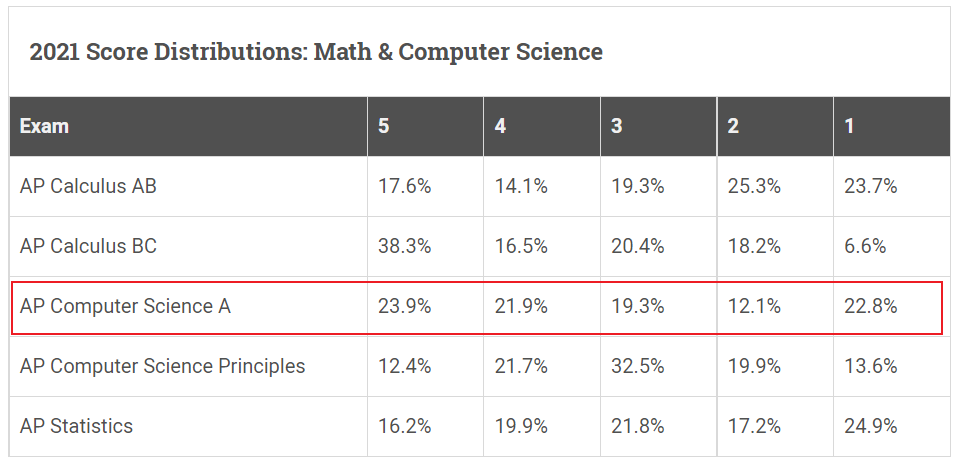

# APCSA介绍

[toc]

## 1. 关于APCSA

维基百科^[1]^介绍：

> **Advanced Placement** (**AP**) **Computer Science A** (also known as **AP CompSci**, **AP CompSci A**, **APCS**, **APCSA**, or **AP Java**) is an [AP Computer Science](https://en.wikipedia.org/wiki/AP_Computer_Science) course and examination offered by the [College Board](https://en.wikipedia.org/wiki/College_Board) to [high school](https://en.wikipedia.org/wiki/High_school) students as an opportunity to earn college credit for a [college](https://en.wikipedia.org/wiki/College)-level [computer science](https://en.wikipedia.org/wiki/Computer_science) course. AP Computer Science A[[1\]](https://en.wikipedia.org/wiki/AP_Computer_Science_A#cite_note-1) is meant to be the equivalent of a first-semester course in computer science. The AP exam currently tests students on their knowledge of [Java](https://en.wikipedia.org/wiki/Java_(programming_language)).

APCSA（由College Board提供）是一门大学先修 课程和考试，面向高中生，用以获得大学水平的计算机科学课程的学分。APCSA 相当于计算机科学第一学期的课程。AP 考试目前测试学生的 Java 知识。

## 2. 关于考试

> The Computer Science A Exam will test your understanding of the programming concepts covered in the course units, as well as your ability to read and write code for computer programs.

APCSA考试主要测试学生对编程概念的理解，以及读写代码的能力。

考试于每年5月份举办，考试分为两个部分：

|          |                            选择题                            |                            简答题                            |
| :------: | :----------------------------------------------------------: | :----------------------------------------------------------: |
| 考试时长 |                             1.5h                             |                             1.5h                             |
|   题量   |                          40个选择题                          |                          4个简答题                           |
| 分数占比 |                             50%                              |                             50%                              |
| 考试内容 | 1. 根据代码片段得出结果 2. 分析程序代码的正确性 3. 描述代码行为 | 1. 问题一：方法和控制结构 2. 类和对象 3. Array(数组)/ArrayList 4. 2D Array(二维数组) |

考试分数采用5分制：

2021年考试结果：

拿到4分和5分的人数占比为45.%，考试还是不难的。

## 3. 关于课程

CSAPA官网上提供了一份课程目录^[1,4]^，如下（加上我的课时安排，2h/课时）

| Unit |                 Topic                 | Exam Weighting | 课时安排 |
| :--: | :-----------------------------------: | :------------: | :------: |
|      |    Introduction To APCSA And Java     |                |    1     |
|  1   |            Primitive Types            |     2.5–5%     |    2     |
|  2   |             Using Objects             |     5–7.5%     |    2     |
|  3   | Boolean Expressions and if Statements |    15–17.5%    |    1     |
|  4   |               Iteration               |   17.5–22.5%   |    1     |
|  5   |            Writing Classes            |     5–7.5%     |    2     |
|  6   |                 Array                 |     10–15%     |    1     |
|  7   |               ArrayList               |    2.5–7.5%    |    2     |
|  8   |               2D Array                |    7.5–10%     |    1     |
|  9   |     Inheritance and Polymorphism      |     5–10%      |    3     |
|  10  |               Recursion               |     5–7.5%     |    1     |
|      |                                       |                |    17    |

课件地址：https://lee-0o0.github.io/doc-site/#/

课程代码：https://github.com/Lee-0o0/APCSA

## 参考资料

[1] 维基百科：https://en.wikipedia.org/wiki/AP_Computer_Science_A

[2] APCSA考试：https://apstudents.collegeboard.org/courses/ap-computer-science-a/assessment

[3] APCSA考试分数：https://apstudents.collegeboard.org/about-ap-scores/ap-score-scale-table

[4] APCSA课程：https://apstudents.collegeboard.org/courses/ap-computer-science-a