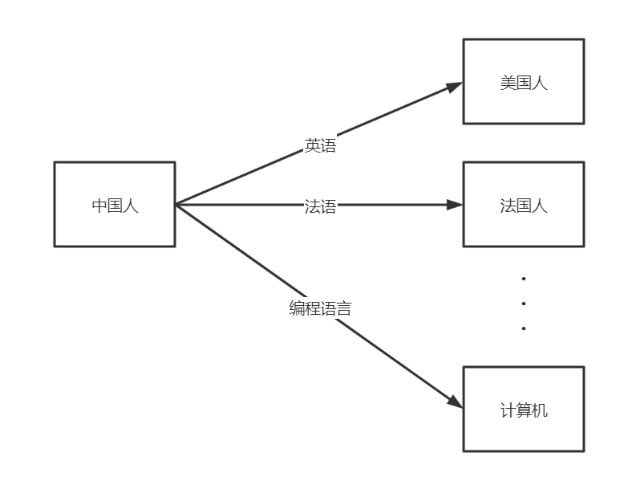
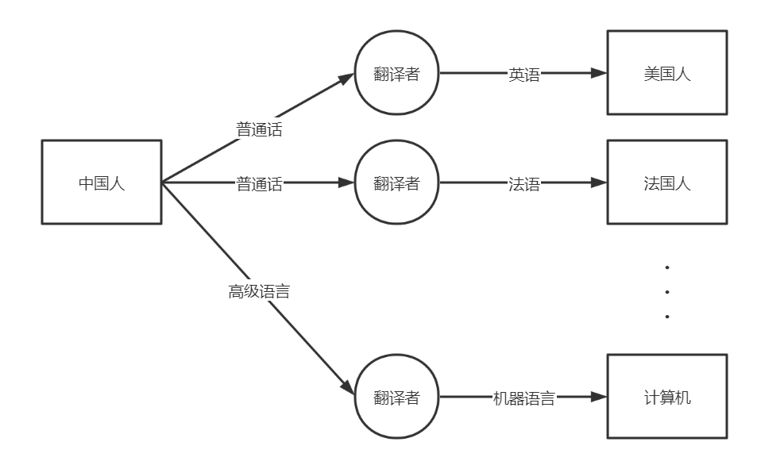
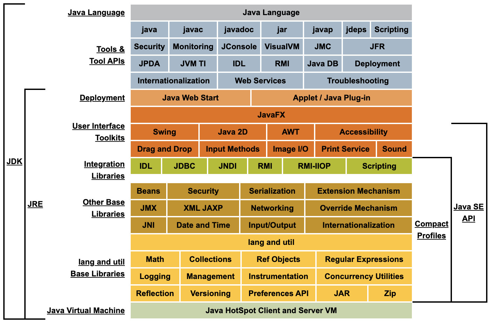
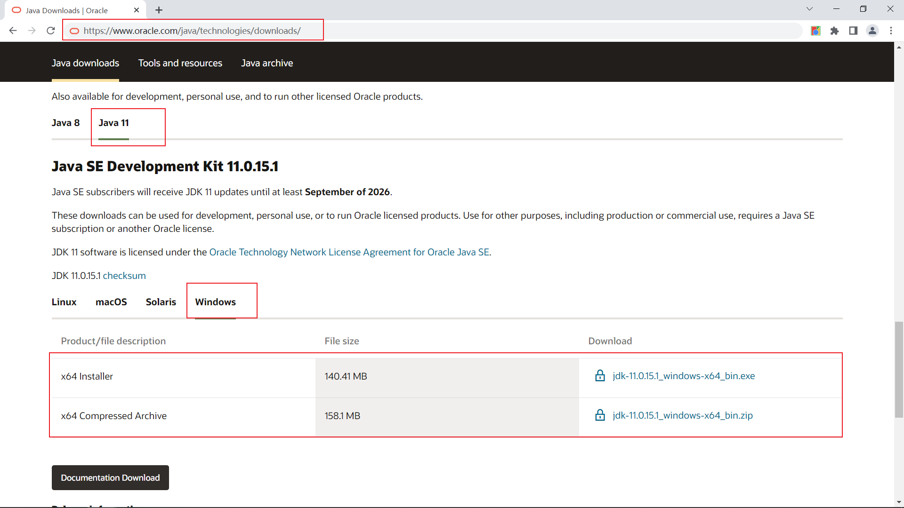
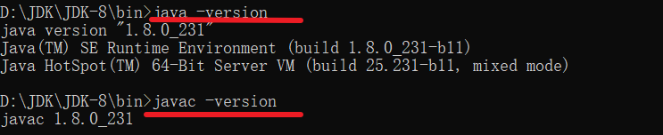
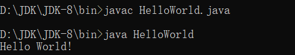
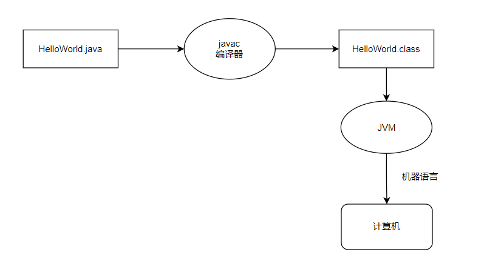
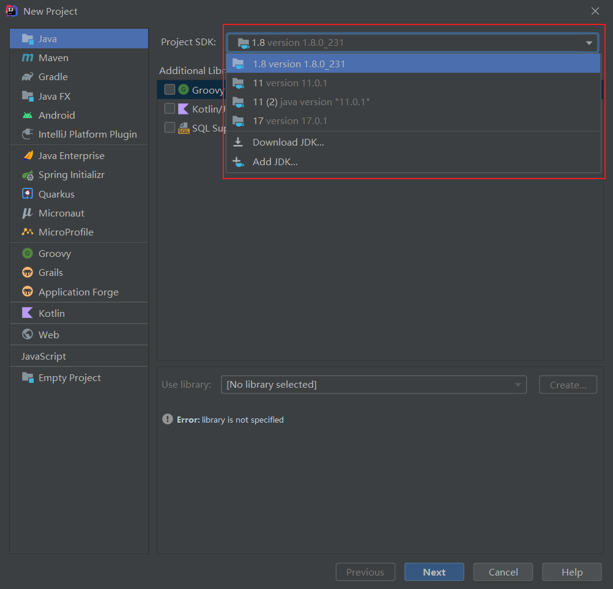

# 编程语言与Java介绍

[toc]

## 1. 编程语言介绍

当我们开始学习编程时，首先学习的就是编程语言，那么自然而然，什么是编程语言？

如果我们要与美国人交流，那就要说英语；如果我们要与法国人交流，那就要说法语...

如果我们要与计算机交流，那就要说编程语言。



简单理解，编程语言就是我们和计算机交流的工具，就像英语、法语其它语言一样。

编程语言按照发展阶段可以分为以下几类：

- 机器语言：**只有用机器语言编写的程序才能被计算机直接理解和执行**（举个例子，美国人只能看懂英语写的书），机器语言就是一串的0、1，例如：00101010 10101 01111000，计算机能看懂这串01代表什么意思。那么问题来了，我们能看懂吗？可以看懂，但不直观，学习成本高。
- 汇编语言：由于机器语言难读、难编、难记和易出错的缺点，所以出现了汇编语言，汇编语言的特点是用符号代替了机器指令代码，就是用符号来代替了01串。例如，以上面的01串为例，用汇编语言写，可能会是这样的：**42**(00101010) **ADD**(10101) **120**(01111000)，所以上面的01串说的是42+120。但是汇编语言也存在着通用性差的原因，即不同型号的计算机，需要使用不同的汇编语言，所以出现了高级语言。
- 高级语言：高级语言是面向用户的语言，即高级语言与人类语言类似，自然直观、通熟易懂、简单易学。目前常见的高级语言有C、C++、Java、C#、Python等。

我们能轻松掌握的是高级语言，但是计算机能理解执行的是机器语言，所以在高级语言和机器语言之间存在着一个转换过程，如下图：



就像我们只会说普通话，如果需要与美国人交流，那么就需要翻译者将普通话翻译为英语，这样我们才能和美国人交流。同样的，我们用高级语言编写的程序，需要经过翻译者，翻译为机器语言对应的程序，这样计算机才能理解执行。

这种翻译存在两种方式：编译和解释。

编译方式：用户用高级语言编写的源程序，经过编译程序“翻译”后，输出目标程序，称为可执行文件，计算机可以运行目标程序。C语言采用编译方式。

解释方式：解释程序一条一条地解释用高级语言编写的源程序，并不会产生目标程序。Python采用解释方式。

以上简单介绍了编程语言的分类以及编译和解释，相信大家对于编程也不会感到是一件非常艰难的事了。


## 2. Java介绍

Java 是由 Sun Microsystems 在 1995 年首先发布的编程语言^[1]^，2009年10月，Oracle公司（甲骨文）收购了Sun Microsystems，成为了Java的所有者。 Java 编程语言的创始人和首席设计师是James Gosling^[2]^。


<center>图：Java之父——James Gosling</center>

Java根据运行环境，分为以下三种：

- [Java Platform, Micro Edition](https://en.wikipedia.org/wiki/Java_Platform,_Micro_Edition) (Java ME) – 用于资源很少的环境，比如传感器、电视盒、打印机、手机等。
- [Java Platform, Standard Edition](https://en.wikipedia.org/wiki/Java_Platform,_Standard_Edition) (Java SE) – 用于工作站环境，比如个人计算机、服务器。
- [Java Platform, Enterprise Edition](https://en.wikipedia.org/wiki/Java_Platform,_Enterprise_Edition) (Java EE) – 用于大型分布式企业或互联网环境。

我们主要学习Java SE。

Java SE版本及发布时间如下^[3]^：

|                        Version                         |                             Date                             |
| :----------------------------------------------------: | :----------------------------------------------------------: |
| JDK [Beta](https://en.wikipedia.org/wiki/Beta_version) |                             1995                             |
|                        JDK 1.0                         | January 23, 1996[[40\]](https://en.wikipedia.org/wiki/Java_(programming_language)#cite_note-40) |
|                        JDK 1.1                         |                      February 19, 1997                       |
|                        J2SE 1.2                        |                       December 8, 1998                       |
|                        J2SE 1.3                        |                         May 8, 2000                          |
|                        J2SE 1.4                        |                       February 6, 2002                       |
|                        J2SE 5.0                        |                      September 30, 2004                      |
|                       Java SE 6                        |                      December 11, 2006                       |
|                       Java SE 7                        |                        July 28, 2011                         |
|                    Java SE 8 (LTS)                     |                        March 18, 2014                        |
|                       Java SE 9                        |                      September 21, 2017                      |
|                       Java SE 10                       |                        March 20, 2018                        |
|                    Java SE 11 (LTS)                    | September 25, 2018[[41\]](https://en.wikipedia.org/wiki/Java_(programming_language)#cite_note-41) |
|                       Java SE 12                       |                        March 19, 2019                        |
|                       Java SE 13                       |                      September 17, 2019                      |
|                       Java SE 14                       |                        March 17, 2020                        |
|                       Java SE 15                       | September 15, 2020[[42\]](https://en.wikipedia.org/wiki/Java_(programming_language)#cite_note-42) |
|                       Java SE 16                       |                        March 16, 2021                        |
|                    Java SE 17 (LTS)                    |                      September 14, 2021                      |
|                       Java SE 18                       |                        March 22, 2022                        |

- LTS：Long-term Support，长期支持


## 3. JDK介绍、下载

JDK（Java Development Kit，Java开发工具包），是我们进行Java开发的基础。

JDK包含了JRE（Java Runtime Environment），JRE是Java程序的运行环境。

JRE包括JVM（Java Virtual Machine），JVM是操作系统的抽象。



首先下载JDK：https://www.oracle.com/java/technologies/downloads/



下载JDK后，确认自己是否下载成功：




## 4. 第一个Java程序

创建一个文本文件，命名为HelloWorld.txt，输入以下内容：

```java
public class HelloWorld{
	public static void main(String[] args){
		System.out.println("Hello World!");
	}
}
```

文件改名为HelloWorld.java。如果文件名不是HelloWorld.java呢？

第一步：输入如下命令，将Java源文件**编译**为class文件：

```shell
javac HelloWorld.java
```

第二步：输入如下命令，运行Java程序：

```shell
java HelloWorld
```



可以看到在控制台中输出了”Hello World!“。

修改一下程序，输出”你好，世界！“。

Java编程语言属于编译型语言还是解释型语言呢？



一次编写，到处运行。


## 5. 下载IDEA

IDEA是Java IDE（Integrated Development Environment，集成开发环境），让我们专注于写代码，而不用反复进行繁琐的编译、运行命令。

下载安装后，启动软件创建一个项目：




## 6. 详解第一个程序

完整程序：

```java
public class HelloWorld{
	public static void main(String[] args){
		System.out.println("Hello World!");
	}
}
```

第一层：类

```java
public class HelloWorld{
	
}
```

第二层：方法，main() 特殊方法，程序的入口

```java
public static void main(String[] args){
    
}
```

第三层：方法体，在标准输出（standard output）-控制台中输出内容并换行

```java
System.out.println("Hello World!");
```

用双引号包住的内容称为字符串。

如何给程序添加注释？


## 7. 学习编程的建议

- 学好英语，掌握计算机术语；
- 善于搜索，善于使用搜索引擎（Google）
- 勤于实践，不怕折腾（提前备份重要数据）
- 勤奋练习，多写代码


## 8. 作业

- 使用IDEA创建一个Java文件，输出以下内容：

    ```txt
       *
      * *
     * * *
    * * * *
    ```

平台：洛谷

- https://www.luogu.com.cn/problem/B2002

- https://www.luogu.com.cn/problem/B2025


## 参考资料

[1] Java：https://www.java.com/zh-CN/download/help/whatis_java.html

[2] James Gosling：https://en.wikipedia.org/wiki/James_Gosling

[3] Java维基百科：https://en.wikipedia.org/wiki/Java_(programming_language)

[4] IDEA下载：https://www.jetbrains.com/zh-cn/idea/