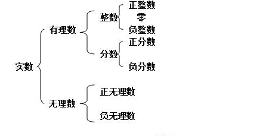

# 数据类型、变量与算术表达式


[toc]

## 1. 数据类型

数据类型，重点是类型。何谓类型，就是一组元素，具有某些相同的性质，我们可以把这些性质高度归纳概括为一个词语，那么这个词语就代表了一个类型。例如，狗就是一种动物类型。

在数学中，数的分类如下：



例如，数字 1 的最小类型就是正整数，最大类型就是实数。

在Java中，数据类型分为基本数据类型和引用类型。

基本数据类型有以下四种：

- 整型：代表了**整数**这一类数据
- 浮点型：代表了**小数**这一类数据
- 字符型：代表了**单字符**这一类数据
- 布尔型：只包括真或假（**true或false**）这两个值

四种数据类型包括八个，如下表：

| 基本数据类型 |  包装类   | 位数 |       范围        |
| :----------: | :-------: | :--: | :---------------: |
|     byte     |   Byte    |  8   |  [-2^7^, 2^7^-1]  |
|    short     |   Short   |  16  | [-2^15^, 2^15^-1] |
|     int      |  Integer  |  32  | [-2^31^, 2^31^-1] |
|     long     |   Long    |  64  | [-2^63^, 2^63^-1] |
|    float     |   Float   |  32  |                   |
|    double    |  Double   |  64  |                   |
|   boolean    |  Boolean  | 8/32 |    true、false    |
|     char     | Character |  16  |   [0, 2^16^-1]    |

我们知道，数的范围是$[-\infty, +\infty]$，正如我们不可能在一张纸上写下所有的数字，计算机也不可能表示所有的数字。所以计算机表示的数字是有一定范围的，这个范围由二进制位的数量和如何解释二进制来确定的。

对于整型数据类型，只要在其范围内，可以精确表示；对于浮点型数据类型，只是对于数的粗略表示。


## 2. 变量与赋值运算符

变量就是内存中的一块空间，用于存储数据。在变量使用前，必须先声明。我们可以使用如下的语法进行声明：

```java
数据类型 变量名 [= 初始值];
```

例如：

```java
int a;         // 声明一个int型的变量a
float b;       // 声明一个float型的变量b
```

在声明完一个变量后，我们可以给变量赋值，赋值运算符为一个`=`号，它表示的意思是将`=`右边的值赋给`=`左边的变量：

```java
a = 10;       // 将10赋值给变量a
a = 20;       // 将20赋值给变量a
```

我们可以在变量声明的时候初始化，就是在变量声明的时候给它赋值：

```java
int a = 10;   // 声明并初始化
```

我们有变量，当然也有常量。所谓常量，就是当给常量赋值后，就不能改变常量的值了。我们可以使用如下语法声明一个常量：

```java
final 数据类型 常量名 [= 初始值];
```

例如：

```java
final double PI = 3.14;    // 声明并初始化一个double类型的常量PI
PI = 3.1415;               // 报错：不能修改常量

final int MONTH_OF_YEAR ;  // 声明一个int类型的常量
MONTH_OF_YEAR = 12;        // 给常量赋值
```

标识符（变量名、常量名...）的命名规范：

- **变量命名只能使用：字母 数字 $ _ （下划线）**
- **中文也可以用来命名变量，但最好不这样写**
- **变量第一个字符只能使用：字母 $ _ （下划线）**
- 变量第一个字符不能使用：数字
- 不能只使用关键字，但是可以包含关键字^[1]^
- 大小写敏感：a和A是不一样的

一些建议：

- 所有变量、方法、类名：见名知意
- 尽量使用完整的单词命名而不是缩写
- 类名：首字母大写和驼峰原则：Man，GoodMan
- 方法名：首字母小写和驼峰原则: run(), runRun()
- 常量：全部大写加下划线：MAX_VALUE
- 类成员变量：首字母小写和驼峰原则 : monthSalary
- 局部变量：首字母小写和驼峰原则
- 包的命名：全部小写，由域名定义

**字面量：**1，1.121这种在程序中的固定值称为字面量，整型字面量默认为int，浮点型字面量默认为double。


## 3. 运算符之算术运算符

假设整数变量A的值为10，变量B的值为20：

| 操作符 | 类型       | 描述                                            | 例子                    |
| :----- | ---------- | :---------------------------------------------- | :---------------------- |
| +      | 双目运算符 | 加法 - 相加运算符两侧的值                       | A + B 等于 30           |
| -      | 双目运算符 | 双目运算符双目运算符减法 - 左操作数减去右操作数 | A – B 等于 -10          |
| *      | 双目运算符 | 乘法 - 相乘操作符两侧的值                       | A * B等于200            |
| /      | 双目运算符 | 除法 - 左操作数除以右操作数                     | B / A等于2              |
| ％     | 双目运算符 | 取余 - 左操作数除以右操作数的余数               | B%A等于0                |
| ++     | 单目运算符 | 自增: 操作数的值增加1                           | B++ 或 ++B 后，B等于 21 |
| --     | 单目运算符 | 自减: 操作数的值减少1                           | B-- 或 --B 后，B等于 19 |

单目运算符：只需要一个操作数

双目运算符：需要两个操作数


### 3.1 除法运算符

除法运算符 / 是一个双目运算符，如果两个操作数都是整数，那么结果也为整数。结果是将小数部分舍弃得来的整数。

```java
int a = 5;
int b = 2;
System.out.println( a / b );  // 结果为2
```

如果至少有一个操作数是浮点数，那么结果为浮点数：

```java
int a = 5;
double b = 2;
System.out.println( a / b );  // 结果为2.5
```


### 3.2 求余运算符

求余运算符%是一个双目运算符，它的操作数通常是正整数也可以是负数甚至是浮点数，如果负数参与此运算，则结果的正负取决于前面一个数是正数还是负数。
对于整数，java的取余运算规则如下 ：

```txt
a % b = a - (a / b) * b 
```

例如：

```txt
5%3 = 5-(5/3)*3 = 2 
5%-3 = 5-(5/-3)*-3 = 2 
-5%3 = -5-(-5/3)*3 = -2 
-5%-3 = -5-(-5/-3)*-3 = -2 
```

如果操作数中有浮点数，则求余采用的规则为 ：

```txt
a % b = a - (b * q)   q = int(a / b) 
```

例如：

```txt
5.2 % 3.1 = 5.2-1*3.1 = 2.1 
5.2 % -3.1 = 5.2-(-1)*(-3.1) = 2.1 
-5.2 % 3.1 = -5.1-(-1)*3.1 = -2.1 
-5.2 % -3.1 = -5.1-(-1)*(-3.1) = -2.1 
```


### 3.3 自增自减运算符

自增自减运算符是单目运算符，作用是将变量的值加一或减一，由于运算符和操作数的位置不同，存在前缀自增（自减）和后缀自增（自减）的区别：

- 前缀自增/自减：++a，--a；
- 后缀自增/自减：a++，a--；

我们以自增为例 ，来说明前缀和后缀的区别。首先看以下代码：

```java
int a = 1;
int b = 1;
int c = a++;
int d = ++b;

System.out.println(a);
System.out.println(c);
System.out.println(b);
System.out.println(d);
```

请问输出结果是什么？

区别：

- 前缀自增运算符的运算顺序：d=++b；先将b的值加一；再将b的值赋值给d；
- 后缀自增运算符的运算顺序：c=a++；先将a的值赋值给c；再将a的值加一；

练习：

```java
int a = 1;
int b = --a;
int c = b--;
```

a、b、c的值各为多少？


## 4. 复合赋值运算符

所谓复合赋值运算符，就是将算术运算符与赋值运算符结合起来，形成以下五种复合赋值运算符：

|  符号  |                含义                |
| :----: | :--------------------------------: |
| a += b | a =(T)((a) + (b)), T 为a的数据类型 |
| a -= b |           a = (a) - (b)            |
| a *= b |           a = (a) * (b)            |
| a /= b |           a = (a) / (b)            |
| a %= b |           a = (a) % (b)            |

例如：

```java
int a = 10;
int b = 10;
int c = 10;
int d = 10;
int e = 10;
int f = 10;
b += a;  //  b = 20
c -= a;  //  c = 0
d *= a;  //  d = 100
e /= a;  //  e = 1
f %= a;  //  f = 0
```

```java
int a = 5;
int c = 1;
a *= c + 1;  // a = 6
```


## 5. 类型转换

Java是强类型编程语言，Python是弱类型编程语言。

强类型语言包含以下两方面的含义：

- 所有的变量必须先声明、后使用。
- 指定类型的变量只能接受类型与之匹配的值。

```java
int a = 1.2;      // 错误，将浮点数赋值给整型
```

我们可以通过数据类型转换的方式将一种数据类型的值赋值给另一种数据类型的变量。分为自动转换和强制转换。

**隐式数据类型转换（自动转换）**

自动转换的规则是从低级类型数据转换成高级类型数据。转换规则如下：

- 数值型数据的转换：byte→short→int→long→float→double。
- 字符型转换为整型：char→int→long→float→double。

在以下情况下，有可能造成精度损失：

- int→float
- long→float
- long→double
- float→double


**显式数据类型转换（强制转换）**

除了隐式数据类型转换，我们也可以手动进行数据类型转换，称为显式数据类型转换（强制转换），语法如下：

```java
(type)value;
```

意思就是我们手动将value（不是type类型的值）转换为type数据类型。例如：

```java
int a = (int)1.2;   // 将double类型的值1.2强制转换为int类型
```

强制类型转换会造成数据丢失，例如：

```java
float fmin = Float.NEGATIVE_INFINITY;
float fmax = Float.POSITIVE_INFINITY;
System.out.println("long: " + (long)fmin + ".." + (long)fmax);
System.out.println("int: " + (int)fmin + ".." + (int)fmax);
System.out.println("short: " + (short)fmin + ".." + (short)fmax);
System.out.println("char: " + (int)(char)fmin + ".." + (int)(char)fmax);
System.out.println("byte: " + (byte)fmin + ".." + (byte)fmax);
```

```java
// A narrowing of int to short loses high bits:
System.out.println("(short)0x12345678==0x" + Integer.toHexString((short)0x12345678));
// An int value too big for byte changes sign and magnitude:
System.out.println("(byte)255==" + (byte)255);
// A float value too big to fit gives largest int value:
System.out.println("(int)1e20f==" + (int)1e20f);
// A NaN converted to int yields zero:
System.out.println("(int)NaN==" + (int)Float.NaN);
// A double value too large for float yields infinity:
System.out.println("(float)-1e100==" + (float)-1e100);
// A double value too small for float underflows to zero:
System.out.println("(float)1e-50==" + (float)1e-50);
```

```txt
00000000 00000000 00000000 11111111  // 255的补码形式
11111111 // byte 补码形式
11111110 // 反码
10000001 // 原码 -1
```


## 6. 练习

请计算以下表达式的值，并说出结果的数据类型：

```java
byte b1 = 1;
byte b2 = 2;
byte b3;
b3 =(byte)(b1 + b2);     // b3 的值是多少 
```

```java
byte b1 = 1;
short s1 = 2;
char c1 = 3;
b1 + s1 + c1;    // 结果为多少？结果的数据类型是什么? 6 int
```

```java
1 + 2 + 3        // 结果为多少？结果的数据类型是什么? 6 int
1.0 + 2 + 3      // 结果为多少？结果的数据类型是什么? 6.0 double
```

```java
byte b1=1;
final byte b2=2, b3=3;

byte b4, b5, b6, b7;

b4 = b2 + b3;    

b5 = b1 + b2;   // b1转换为int

b6 = b3 + 1;  

b7 = 1 + 7;
// b4,b5,b6,b7结果为多少？
```

Java表达式转型规则 **由低到高转换**：

1、在表达式中，所有的byte,short,char型的值将被自动转换为int类型；

2、如果有一个操作数是long型，计算结果是long型；

3、如果有一个操作数是float型，计算结果是float型；

4、如果有一个操作数是double型，计算结果是double型；

5、被fianl修饰的变量不会自动改变类型，如果所有的操作数都是常量（被final修饰、字面量），那么右边表达式的结果会根据左边变量的类型而转化。否则，可能需要进行强制类型转换。

另一个练习：

```
int x = 10;
byte a = 1;
a += x;
a = a+x;
```

x += y ==> x = (T)((x) + (y))，其中T为x的数据类型。

练习：

```java
int i1 = 2, i2 = 3;
long l1 = 100;
double d1 = 100.0;

int i3 = i1++;      // i3 = 2
i1++ / i2 + l1 / d1;     // 结果为多少？结果数据类型是什么？   1.0 double 

i1 = 2;
++i1 / i2 + l1 / d1;     // 结果为多少？结果数据类型是什么？   2.0 double

++i1 / (i2 + l1) / d1;   // 结果为多少？结果数据类型是什么？  0.0
// 1. i2+l1 = 103L
// 2. ++i1 3
// 3. 3L/103L = 0L
// 0 / 100.0 = 0.0 double
```

运算符优先级，优先级从上往下从高到低：

| 优先级 | 运算符  |
| ------ | ------- |
| 1      | ()      |
| 2      | ++、--  |
| 3      | *、/、% |
| 4      | +、-    |

练习：

```java
double d1 = 1.0;
System.out.println(d1 / 0);

int i1 = 1;
System.out.println(i1 / 0);
```

```txt
Exception in thread "main" java.lang.ArithmeticException: / by zero
```


## 参考资料

[1] Java关键字：https://docs.oracle.com/javase/tutorial/java/nutsandbolts/_keywords.html

[2] ASC II 码表：https://tool.oschina.net/commons?type=4

[3] 数据类型转换：https://docs.oracle.com/javase/specs/jls/se8/html/jls-5.html#jls-5.1

[4] Unicode编码表：https://unicode-table.com/cn/
