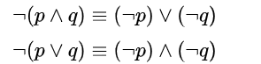
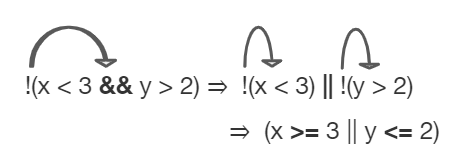
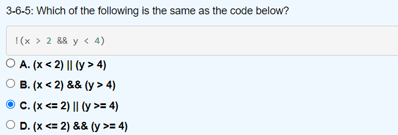
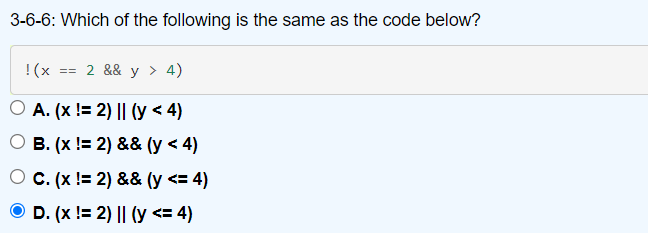
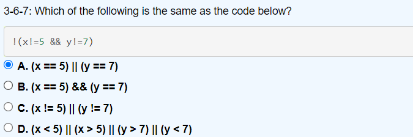
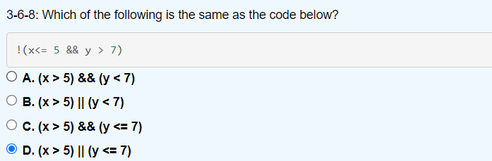
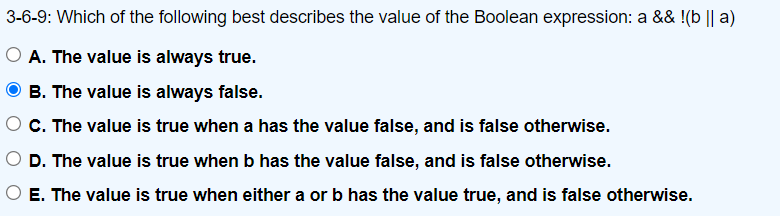

# 布尔表达式与选择语句
所谓布尔表达式，就是表达式的结果是一个布尔值（true 或 false）。在学习了布尔表达式后，我们就可以使用选择语句执行不同的逻辑。
[toc]


## 1. 关系运算符
关系运算符用来判断大小或相等关系，有以下关系运算符。
假设整型变量A为10，B为20，C为10。

| 运算符 | 含义             | 说明                                                         | 实例                                            | 结果                 |
| ------ | ---------------- | ------------------------------------------------------------ | ----------------------------------------------- | -------------------- |
| >      | 大于运算符       | 只支持左右两边操作数是数值类型。如果前面变量的值大于后面变量的值， 则返回 true。 | 2>3                                             | false                |
| >=     | 大于或等于运算符 | 只支持左右两边操作数是数值类型。如果前面变量的值大于等于后面变量的值， 则返回 true。 | 4>=2                                            | true                 |
| <      | 小于运算符       | 只支持左右两边操作数是数值类型。如果前面变量的值小于后面变量的值，则返回 true。 | 2<3                                             | true                 |
| <=     | 小于或等于运算符 | 只支持左右两边操作数是数值类型。如果前面变量的值小于等于后面变量的值， 则返回 true。 | 4<=2                                            | false                |
| ==     | 相等运算符       | 如果进行比较的两个操作数都是数值类型，无论它们的数据类型是否相同，只要它们的值相等，也都将返回 true。 <br />如果两个操作数都是引用类型，只有当两个引用变量的类型具有父子关系时才可以比较，只要两个引用指向的不是同一个对象就会返回 true。<br /> Java也支持两个 boolean 类型的值进行比较。 | 4\==4 <br />97\=='a' <br />5.0\==5 true\==false | true true true false |
| !=     | 不相等运算符     | 如果进行比较的两个操作数都是数值类型，无论它们的数据类型是否相同，只要它们的值不相等，也都将返回 true。 <br />如果两个操作数都是引用类型，只有当两个引用变量的类型具有父子关系时才可以比较，只要两个引用指向的不是同一个对象就会返回 true。 | 4!=2                                            | true                 |

- 基本类型的变量、值不能和引用类型的变量、值使用 == 进行比较；boolean 类型的变量、值不能与其他任意类型的变量、值使用 == 进行比较；如果两个引用类型之间没有父子继承关系，那么它们的变量也不能使用 == 进行比较。

- == 和 != 可以应用于基本数据类型和引用类型。当用于引用类型比较时，比较的是两个引用是否指向同一个对象，但当时实际开发过程多数情况下，只是比较对象的内容是否相当，不需要比较是否为同一个对象。
- 运算符 >=、==、！=、<= 是两个字符构成的一个运算符，用空格从中分开写就会产生语法错误。例如 `x> =y;` 是错误的，但是可以写成`x >= y;` 在运算符的两侧增加空格会提高可读性。同样将运算符写反，例如 =>、=<、=! 等形式会产生语法错误。
- 由于计算机内存放的实数与实际的实数存在着一定的误差，如果对浮点数进行 ==（相等）或 !=（不相等）的比较，容易产生错误结果，应该尽量避免。
- 不要将“==”写成“=”。


## 2. 逻辑运算符
逻辑运算符是对布尔型变量进行运算，其结果也是布尔型，具体如表所示:

| 运算符 | 用法   | 含义   | 说明                                                | 实例       | 结果  |
| :----- | :----- | :----- | :-------------------------------------------------- | :--------- | :---- |
| &&     | a&&b   | 短路与 | a、b 全为 true 时，计算结果为 true，否则为 false。  | 2>1&&3<4   | true  |
| \|\|   | a\|\|b | 短路或 | a、b 全为 false 时，计算结果为 false，否则为 true。 | 2<1\|\|3>4 | false |
| !      | !a     | 逻辑非 | a 为 true 时，值为 false，a 为 false 时，值为 true  | !(2>4)     | true  |
| \|     | a\|b   | 逻辑或 | a、b 全为 false 时，计算结果为 false，否则为 true   | 1>2\|3>5   | false |
| &      | a&b    | 逻辑与 | a、b 全为 true 时，计算结果为 true，否则为 false    | 1<2&3<5    | true  |


### 2.1 真值表

真值表填空（与、或、非）：

|   a   |   b   | a && b | a \|\| b | ! a  |
| :---: | :---: | :----: | :------: | :--: |
| true  | true  |        |          |      |
| true  | false |        |          |      |
| false | true  |        |          |      |
| false | true  |        |          |      |

德摩根定律（De Morgan’s Laws）：



在Java中，同样存在该定律：

1. `!(a && b)` = `!a || !b`
2. `!(a || b)` = `!a && !b`

|   a   |   b   | ! (a && b) | !a \|\| !b | !(a \|\| b) | !a && !b |
| :---: | :---: | :--------: | :--------: | :---------: | :------: |
| true  | true  |            |            |             |          |
| true  | false |            |            |             |          |
| false | true  |            |            |             |          |
| false | false |            |            |             |          |


### 2.2 短路原则

对于短路与&&：在`a && b`中，如果a为false，那么整个表达式为false，不需要判断b的值；

对于短路或||：在`a || b`中，如果a为true，那么整个表达式为true，不需要判断b的值；

```java
int x = 3;
int y = 9;
int i = 3;
int j = 9;

System.out.println(false && (x=x/y) > 0);
System.out.println(false & (i=i/j) > 0);

System.out.println(x);
System.out.println(i);
```

短路与（&&）和短路或（||）能够采用最优化的计算方式，从而提高效率。在实际编程时，应该优先考虑使用短路与和短路或。


### 2.3 逻辑非运算符与关系运算符

当逻辑非运算符与关系运算符在一起时，我们可以进行转换，使得表达式更清楚。简单的转换方式为：将逻辑非一道括号内，将关系运算符反转（==与!=是相反关系，>与<=是相反关系，<和>=是相反关系）。

例如（c和d是数值）：

- !(c == d) 等于 (c != d)

- !(c != d) 等于 (c == d)

- !(c < d) 等于 (c >= d)

- !(c > d) 等于 (c <= d)

- !(c <= d) 等于 (c > d)

- !(c >= d) 等于 (c < d)

  

例如：



```java
int x = 2;
int y = 3;
System.out.println(!(x < 3 && y > 2));
```


一些练习题：












## 3. 选择语句
选择语句可以根据条件（布尔表达式）执行不同的逻辑，存在以下语句：

### 3.1 if语句
if语句是最简单的选择语句，我们可以根据条件选择执行或不执行某段逻辑，如果条件的结果为true，则执行该段逻辑，为false则不执行。语法形式如下：
```java
if(条件-布尔表达式){
    程序逻辑...
}
```
例如：
```java
int a = 10;
int b = 20;
if(a <= b){
    System.out.println("a <= b");
}
```


### 3.2 if-else语句

在if语句中，我们只能在条件为true或false时进行执行，当条件为false或true时，无法进行逻辑处理，所以if-else语句解决了该问题，覆盖了两种情况。语法如下：

```java
if(条件-布尔表达式){
    程序逻辑...
}else{
    程序逻辑...
}
```

例如：

```java
int a = 10;
int b = 20;
if(a <= b){
    System.out.println("a <= b");
}else{
    System.out.println("a > b");
}
```

练习：

```java
int aNumber = 3;
if (aNumber >= 0)
    if (aNumber == 0)
        System.out.println("first string");
else System.out.println("second string");
System.out.println("third string");
```

1. 输出内容是什么？将这段代码复制进IDE中，看看输出内容是什么？
2. 格式化代码，使变得更容易理解。


### 3.3 if-else if-else 语句

if-else语句只能覆盖两种情况，但是，我们也存在多种情况的时候（多分支）。

例如，当你的考试成绩为[90,100]时，等级为A；成绩为[80,90)时，等级为B；成绩为[70,80)时，等级为C；成绩为[60,70)时，等级为D；成绩小于60的，等级为E。

if-else if-else语句语法为：

```java
if(条件-布尔表达式){
    程序逻辑...
}else if(条件){
    程序逻辑...
}else if(条件){
    程序逻辑...
}
//省略其他的else if
else{
    程序逻辑...
}
```

请编写程序实现上面的例子。


### 3.4 switch-case 语句

switch-case 语句与if-else if-else语句类似，用于多分支的情况。

```java
switch(expression){
    case value :
       //语句
       break; //可选
    case value :
       //语句
       break; //可选
    //你可以有任意数量的case语句
    default : //可选
       //语句
}
```

switch case 语句有如下规则：

- switch 语句中的变量类型可以是： byte、short、int 或者 char。从 Java SE 7 开始，switch 支持字符串 String 类型了，同时 case 标签必须为字符串常量或字面量。
- switch 语句可以拥有多个 case 语句。每个 case 后面跟一个要比较的值和冒号。
- case 语句中的值的数据类型必须与变量的数据类型相同，而且只能是常量或者字面常量。
- 当变量的值与 case 语句的值相等时，那么 case 语句之后的语句开始执行，直到 break 语句出现才会跳出 switch 语句。
- 当遇到 break 语句时，switch 语句终止。程序跳转到 switch 语句后面的语句执行。case 语句不必须要包含 break 语句。如果没有 break 语句出现，程序会继续执行下一条 case 语句，直到出现 break 语句。
- switch 语句可以包含一个 default 分支，该分支一般是 switch 语句的最后一个分支（可以在任何位置，但建议在最后一个）。default 在没有 case 语句的值和变量值相等的时候执行。default 分支不需要 break 语句。

switch-case 语句例子：

```java
char grade = 'C';

switch(grade)
{
    case 'A' :
        System.out.println("优秀"); 
        break;
    case 'B' :
    case 'C' :
        System.out.println("良好");
        break;
    case 'D' :
        System.out.println("及格");
        break;
    case 'F' :
        System.out.println("你需要再努力努力");
        break;
    default :
        System.out.println("未知等级");
}
System.out.println("你的等级是 " + grade);
}
```

请使用switch-case语句改写成绩等级例子。


## 4. 三目运算符-? :

下面一段程序在做什么？

```java
int x = 10;
int y;
if(x % 2 == 0){
    y = 1;
}else{
    y = 0;
}
```

我们可以使用三目运算符`?:`来简化上面一段程序：

```java
int x = 10;
int y = x % 2 == 0 ? 1 : 0;
```

三目运算符的语法如下：

```java
条件 ? 值1：值2;
```

如果条件为true，则表达式的结果为值1；如果条件为false，则表达式的结果为值2。


## 作业

1. 自学如何获取用户输入，参考资料：https://www.runoob.com/java/java-scanner-class.html
2. 自学字符串转化为数字，参考资料：https://www.runoob.com/w3cnote/java-string-and-int-convert.html
3. 洛谷：

https://www.luogu.com.cn/problem/B2001

https://www.luogu.com.cn/problem/B2042

https://www.luogu.com.cn/problem/B2044

https://www.luogu.com.cn/problem/B2049


## 参考资料

[1] 德摩根定律：https://zh.wikipedia.org/wiki/%E5%BE%B7%E6%91%A9%E6%A0%B9%E5%AE%9A%E5%BE%8B
