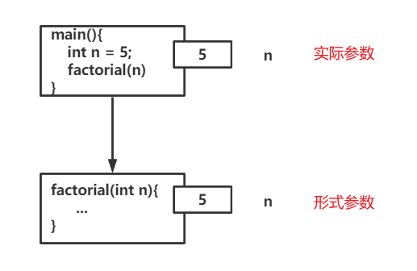
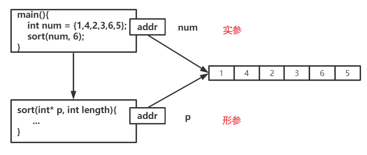

# C语言— —函数

 本文主要介绍C语言中的函数相关概念及用法。


## 1. 什么是函数？

在C语言中，如果我们要计算10的阶乘（`10!`），那么可以使用下面的算法：

```c
int res = 1;
for(int i = 1; i <= 10; i++){
    res *= i;
}
```

最后，`res`的值就是10的阶乘。现在，如果我们要求20的阶乘，那要写出下面的算法吗：

```c
int res = 1;
for(int i = 1; i <= 20; i++){
    res *= i;
}
```

那么，我们如果要求出30，40，100...的阶乘值，又要重复上面的代码吗？这显然是一项繁琐的工作，所以函数就是为了解决重复工作的。

什么是函数？函数是一组算法的封装。


## 2. 函数的声明与使用

了解到为什么需要函数及其含义后，接下来我们学习函数的声明，语法如下：

```c
函数返回值类型 函数名(形参列表);         // 1.函数声明

函数返回值类型 函数名(形参列表){         // 2.函数声明 + 定义
	函数体
}
```

- 函数声明只指定函数的返回值类型、函数名和形参列表；
- 函数定义是指定函数体；

- 形参列表可以为空，表示该函数不需要参数。

例如，声明并定义求阶乘的函数`factorial()`：

```c
int factorial(int n){
    int res = 1;
    for(int i = 1; i <= n; i++){
        res *= i;
    }
    return res;
}
```

在上述的例子中，`int`表示函数返回值类型，`factorial`是函数名，`int n`是形式参数，`return res`表示将`res`返回给函数调用方。

在函数体中，通过`return `返回结果，并且在函数体中，执行到`return`语句就立即结束函数执行。

`return`语句后的值类型要与函数声明的返回值类型相同，或能隐式转换为函数声明的返回值类型。

声明了函数后，我们该如何调用函数呢？调用语法如下：

```c
[函数返回值类型 变量 = ]函数名(实参列表);
```

注意，只有声明了函数后，才能进行，就是声明函数要在调用函数前面，然后函数定义可以在调用函数后面。

例如：

```c
int res = factorial(10);
```

在上面的例子中，就调用了我们声明的函数`factorial()`，实际参数为10，并用变量`res`承接函数的返回值，即10的阶乘。

完整代码如下：

```c
# include <stdio.h>

// 函数声明 
int factorial(int n);

// main也是函数，是程序的入口 
int main(){
	int res = factorial(10); // 调用函数 ，求10的阶乘
	printf("res = %d",res);
	return 0;	
} 

// 函数定义 
int factorial(int n){
    int res = 1;
    for(int i = 1; i <= n; i++){
        res *= i;
    }
    return res;
}
```

这样，以后我们相求某个数的阶乘，只需要调用函数`factorial()`，并传给它我们相求的数就行了。


## 3. 形式参数与实际参数

所谓形式参数，就是在函数声明时的参数，该参数在进入函数时创建，在退出函数时销毁，只能在函数中使用；

所谓实际参数，就是在函数调用时传递给函数的参数；

例如：

```c
int factorial(int n);   // n 为形式参数

factorial(10);          // 10 为实际参数
```

我们来看下面这个例子：

```c
# include <stdio.h>

// 函数声明 
int factorial(int n);

int main(){
	int n;
	printf("请输入一个正整数: ");
	scanf("%d",&n);
	int res = factorial(n);
	printf("res = %d\n",res);
	
	printf("n = %d",n);     // 问题：请问n的值为多少? 
	return 0;
} 

// 函数定义 
int factorial(int n){
    int res = 1;
    for(int i = 1; i <= n; i++){
        res *= i;
    }
    n = 100;               // 此处改变n的值为100 
    return res;
}
```

如果我们输入5，那么上述的问题，调用函数后，n的值为多少？

答案是：5，程序结果如下：

```txt
请输入一个正整数: 5
res = 120
n = 5
```

这有点奇怪，我们明明在函数中改变了n的值，为什么n还是5呢？

首先，我们要区分向函数传递参数的方式：当向函数传递参数时，形式参数会复制一份实际参数，然后在函数体中，修改的是形式参数，实际参数并没有被修改，即使形参和实参同名也不影响。



当然，还有一种特殊的参数类型：指针。例如，下面的函数就是将数组进行排序：

```c
# include <stdio.h>

// 排序函数 
void sort(int *p, int length){
	for(int i = 0; i < length; i++){
		for(int j = i + 1; j < length; j++){
			if(*(p+i) < *(p+j)){
				int tmp = *(p+i);
				*(p+i) = *(p+j);
				*(p+j) = tmp;
			}
		}
	}
}

int main(){
	int num[] = {1,4,2,3,6,5};
	// 调用排序函数 
	sort(num, 6);
	// 输出数组值 
	for(int i = 0; i < 6; i++){
		printf("%d\t",num[i]);
	}
	return 0;
}
```

结果：

```txt
6       5       4       3       2       1
```

这就奇怪了！为什么我们在函数中对形参的操作，能改变实参呢？

其实，这并不违背复制实参给形参的规则，如图：



可以看到形参仍然是复制了一份实参，只不过该参数类型为指针，形参指向的地址与实参指向的地址相同，所以通过形参操作数组，通过实参读取数组，也会看到数组的变化。


## 4. 函数递归

所谓函数递归，就是在函数体中调用自己。

例如，我们仍以求阶乘的函数为例，我们也可以使用递归的写法：

```c
int factorial(int n){
    if(n <= 1)
        return 1;
    return factorial(n - 1) * n;
}
```

 注意，函数递归一定要有结束点，否则就会陷入无限循环中，导致程序崩溃。

函数递归经典题：

- 斐波那契数列：斐波那契数列的排列是：0，1，1，2，3，5，8，13，21，34，55，89，144……依次类推下去，你会发现，它后一个数等于前面两个数的和。在这个数列中的数字，就被称为斐波那契数。求第n个斐波那契数为多少？

- 汉诺塔问题：

    > 法国数学家爱德华·卢卡斯曾编写过一个印度的古老传说：在世界中心贝拿勒斯（在印度北部）的圣庙里，一块黄铜板上插着三根宝石针。印度教的主神梵天在创造世界的时候，在其中一根针上从下到上地穿好了由大到小的64片金片，这就是所谓的汉诺塔。不论白天黑夜，总有一个僧侣在按照下面的法则移动这些金片：一次只移动一片，不管在哪根针上，小片必须在大片上面。僧侣们预言，当所有的金片都从梵天穿好的那根针上移到另外一根针上时，世界就将在一声霹雳中消灭，而梵塔、庙宇和众生也都将同归于尽。

数学描述就是：

有三根杆子X，Y，Z。X杆上有N个(N>1)穿孔圆盘，盘的尺寸由下到上依次变小。要求按下列规则将所有圆盘移至Y杆：

1. 每次只能移动一个圆盘；
2. 大盘不能叠在小盘上面。

输出N个圆盘的移动顺序。
