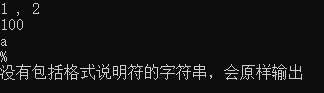
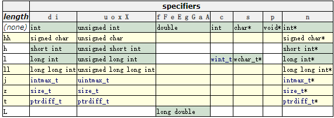

# C语言— —格式化输入输出

本文主要讲解如何使用C语言中的函数进行格式化输入与输出。

## 1. 前言

首先我们回顾一下入门程序"Hello World"：

```c
# include <stdio.h>

int main()
{
	printf("hello world");
	return 0;
}
```

下面两个关键词是我们本文要讲解的

-   第一行注意关键词stdio：stdio是standard input and output的缩写，表示标准输入与输出。输入与输出是相对于计算机内存而言的，输入是指从外部设备输入数据到内存，输出是从内存输出数据到外部设备。这里标准输入的外部设备一般指键盘，标准输出的外部设备一般指显示器（屏幕）。
-   第五行注意关键词printf，这是一个函数（关于函数的概念，后续会介绍），他的作用是将参数（函数中的概念，为括号中的内容）输出到控制台，也称为打印到屏幕上。


## 2. 格式化输出

格式化输出，就是我们之前使用的`printf`函数，函数说明如下：

```c
int printf (const char * format, ... );
```

它的作用是将由`format`指定的字符串输出到标准输出中。如果`format`中含有格式说明符（以%开头的子字符串），那么跟随着`format`的额外参数将格式化，并插入到结果字符串中，替换各自的格式说明符。

### 2.1 参数

完整的格式说明符如下：

```txt
%[flags][width][.precision][length]specifier
```

中括号里的内容是可选的，specifier为必填项，接下来就一 一介绍各个组成部分。

**常用的说明符specifier如下：**

| 说明符specifier |                 解释                 |
| :-------------: | :----------------------------------: |
|     %d或%i      |     输出有符号十进制数，用于int      |
|       %u        | 输出无符号十进制数，用于unsigned int |
|       %o        |          输出无符号八进制数          |
|     %x或%X      |   输出无符号十六进制数，小写或大写   |
|     %f或%F      |           输出十进制浮点数           |
|     %e或%E      |         以科学计数法形式输出         |
|       %c        |          输出字符，用于char          |
|       %s        |              输出字符串              |
|       %p        |             输出内存地址             |
|       %%        |              输出一个%               |

接下来就以例子说明最基本的格式说明符的使用：

```c
# include <stdio.h>
int main()
{
    printf("%d , %i\n", 1, 2);
    printf("%u\n", 100u);
    printf("%c\n",'a');
    printf("%%\n");
    printf("没有包括格式说明符的字符串，会原样输出\n");
    return 0;
}
```




**可选项length是用来确定以何种数据类型解释参数。**例如：

```c
# include <stdio.h>
# include <limits.h>
int main()
{
	printf("%d\n",SHRT_MAX + 1);   // SHRT_MAX值为32767 
	printf("%hd\n",SHRT_MAX + 1);
	return 0;
 } 
```

结果：

```txt
32768
-32768
```

原因是SHRT_MAX + 1的值为32768，`%d`以int数据类型解释32768，那么最终值就是32768；`%hd`以short int数据类型解释32768，那么最终值为-32768。

完整的length表如下：



<p align=center><font color=grey>图源：参考资料[1]</font></p>

注意：

-   对于`%c`，它以int数据类型解释参数，然后进行正确转换，将其转换为字符；
-   黄色行是C99标准引入的；

**可选项`.precision`说明如下：**

-   对于整型修饰符（%d，%i，%o，%u，%x，%X），`.precision`指定了输出数字的最小位数，即最小宽度。如果待输出的数字的位数小于最小宽度，那么结果由前导零填充；如果待输出的数字比最小宽度大，结果也不会被截取，仍然会全部输出。

    ```c
    # include <stdio.h>
    int main()
    {
    	printf("%.5d\n",111);
    	printf("%.0d\n",5001);
    	
    	return 0;
    }
    ```

    结果：

    ```txt
    00111
    5001
    ```

    对于111，指定其最小宽度为5，由于111的宽度为3，小于5，所以由前导零填充直到最小宽度；对于5001，执行其最小宽度为0，由于5001的宽度为4，大于0，所以原样输出5001。

-   对于浮点型修饰符（%a，%A，%e，%E，%f，%F）,`.precision`指定了小数点后的位数，默认为6。

    ```c
    # include <stdio.h>
    int main()
    {
    	printf("%f\n",111.11);
    	printf("%.5f\n",111.11);
    	
    	printf("%.2f\n",1.234);
    	printf("%.2f\n",1.235);
    	
    	return 0;
    }
    ```

    结果：

    ```txt
    111.110000
    111.11000
    1.23
    1.24
    ```

    从输出结果我们可以得出以下结论：如果待输出数字小数点后的位数小于指定的精度（.precision），那么由后置零填充至指定的精度；反之则截取至指定精度，截取规则为四舍五入。

-   对于字符串（%s），`.precision`制定了最小宽度，默认输出字符串全部内容。

    ```c
    # include <stdio.h>
    int main()
    {
    	printf("%s\n","hello world");
    	printf("%.7s\n","hello world");
    	
    	return 0;
    }
    ```

    结果：

    ```txt
    hello world
    hello w
    ```


**可选项width说明如下：**

待输出的最小字符数。如果待输出值的宽度小于width，那么结果由空格填充；如果待输出值的宽度大于width，结果不会被截断。

案例一：使用width更改字符串的输出格式：

```c
# include <stdio.h>
int main()
{
	printf("%s\n","hello world");
	printf("%7s\n","hello world");
	printf("%20s\n","hello world");
	
	return 0;
}
```

结果：

```txt
hello world
hello world
         hello world
```

案例二：使用width更改浮点数的输出格式

```c
# include <stdio.h>
int main()
{
	printf("%5.2f\n",11.2345678);
	printf("%2.3f\n",111.2345678);
	printf("%10.2f\n",1.2345678);
	
	return 0;
}
```

结果：

```txt
11.23
111.235
      1.23
```

说明：width指定的是输出字符的宽度，这里也包括小数点。例如以`%5.2f`格式输出11.2345678，总的最小宽度`width`为5，小数点后的精度`.precision`为2，加上一位小数点，那么还剩下两个位置给整数位，即11，最终结果为`11.23`。在输出111.2345678时，输出格式为`%2.3f`，小数点后的精度为3，加上一位小数点，总共的位数至少为4，大于了总的最小宽度`width`（2），但是不会截断，所以整数位全部输出。


**可选项flags说明如下：**

| flags |                             解释                             |
| :---: | :----------------------------------------------------------: |
|   -   |           将内容在指定宽度中左对齐。默认是右对齐。           |
|   +   |   在数字前强制显示正负号（+/-），默认是只有负数会显示负号    |
|   #   | 与%o、%x或%X使用，则在输出值前面分别加上0，0x或0X（八进制和十六进制的标识） |
|   0   |            当指定宽度width时，左边填充0而不是空格            |

例子：

```c
# include <stdio.h>
int main()
{
	printf("%10d\n",99);
	printf("%-10d\n",99);
	printf("%+10d\n",99);
	printf("%010d\n",99);
	printf("%#10o\n",99);
	printf("%#10x\n",99);
	printf("%#10X\n",99);
	return 0;
}
```

```txt
        99
99
       +99
0000000099
      0143
      0x63
      0X63
```


### 2.2 转义字符

在之前的例子中，我们经常看见在printf函数中的字符串中包含`\n`，但是在结果中并没有看见`\n`输出，这是为什么呢？其实`\n`就是我们接下来要讲解的转义字符，它代表换行。常见的转义字符如下：

| 转义字符 | 意义                                | ASCII码值（十进制） |
| -------- | ----------------------------------- | ------------------- |
| \a       | 响铃(BEL)                           | 007                 |
| \b       | 退格(BS) ，将当前位置移到前一列     | 008                 |
| \f       | 换页(FF)，将当前位置移到下页开头    | 012                 |
| \n       | 换行(LF) ，将当前位置移到下一行开头 | 010                 |
| \r       | 回车(CR) ，将当前位置移到本行开头   | 013                 |
| \t       | 水平制表(HT)                        | 009                 |
| \v       | 垂直制表(VT)                        | 011                 |
| \\'      | 单引号                              | 039                 |
| \\"      | 双引号                              | 034                 |
| \\\      | 反斜杠                              | 092                 |

常用的是`\n`，`\t`。


## 3. 格式化输入


## 4. 参考资料

[1] printf：https://www.cplusplus.com/reference/cstdio/printf/

[2] scanf：https://www.cplusplus.com/reference/cstdio/scanf/
