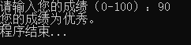
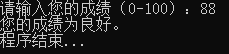
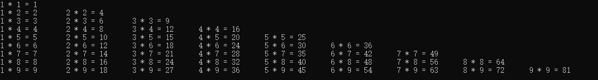

# C语言— —流程控制

本文主要介绍程序的执行顺序。


## 1. 顺序结构

所谓顺序结构，就是程序从上到下一句一句地执行。之前我们所写的程序都是顺序结构的，不再多说。


## 2. 选择结构

所谓选择结构，就是当程序执行到某一行程序时，有多种路径可以选择，不管选择哪种路径，程序最终都会结束。就像我们走到一个人生的十字路口，不论我们选择那条路，都会走向人生的终点。

选择结构分为两种：if选择和switch选择。

### 2.1 if选择结构

最简单的if选择结构语法如下：

```c
if(表达式){
    语句1;
    语句2;
    ...;
}
```

-   括号中的表达式应为布尔值，如果表达式为true，则执行大括号中的语句；否则执行if结构后面的语句。
-   如果if结构大括号中只有一条语句，则可以省略大括号。如果有多条语句，则不可省略。

例子：

```c
# include <stdio.h>
int main()
{
    int num = 10;
    if(num > 5){
        printf("num > 5.\n");
    }
    printf("if 结构后的语句.\n");
    return 0;
}
```

结果：

```txt
num > 5.
if 结构后的语句.
```

大家可以改变num的值来进一步体会if结构。

我们可以给if语句加上else语句，形成if-else结构：

```c
if(表达式){
    语句组1...
}else{
    语句组2...
}
```

if-else语句的作用是：如果括号中的表达式为true，则执行语句组1；如果表达式为false，则执行语句组2。

例子：

```c
# include <stdio.h>
int main()
{
    int num = 5;
    if(num > 5){
        printf("num > 5.\n");
    }else{
        printf("num <= 5.\n")
    }
    printf("if 结构后的语句.\n");
    return 0;
}
```

结果：

```txt
num <= 5.
if 结构后的语句.
```

if-else语句给程序提供了两条路径，我们可以使用if-else if[-else if\]\[-else]为程序提供多条路径（中括号内的结构是可选的）。语法如下：

```c
if(表达式1){
    语句组1...
}else if(表达式2){
    语句组2...
}else if(表达式3){
    语句组3...
}else{
    语句组n...
}
```

-   每个else if都有表达式；
-   可以有多个else if语句，但只能且必须有一个if语句，else语句是可选的，可以有且只能有一个或没有；
-   整个选择结构从上到下依次判断表达式，如果该表达式为true，则执行该路径的语句，然后退出整个选择结构；否则接着往下判断，如果表达式都为false，则执行else语句组（如果有的话）。因此，各个表达式是要有关联的。

例子：

```c
# include <stdio.h>
int main()
{
	printf("请输入您的成绩（0-100）：");
	int score;
	scanf("%d",&score);
	if(score >= 90){
		printf("您的成绩为优秀。\n"); 
	}else if(score >= 70){
		printf("您的成绩为良好。\n"); 
	}else if(score >= 60){
		printf("您的成绩为及格。\n");
	}else{
		printf("您的成绩为不及格。\n");
	}
	printf("程序结束...\n");
	return 0;
}
```

结果：




### 2.2 switch选择结构

switch可以用于多条路径选择结构，可以简化if结构。switch选择结构的语法如下：

```c
switch(表达式){
    case 值1:
        语句组1...
        break;
    case 值2:
        语句组2...
        break;
    case 值3:
        语句组3...
        break;
    ...
    case 值n:
        语句组n...
        break;
    default:
        语句组 default...
        break;
}
```

说明：

-   当被测试的表达式等于 case 中的值（值需要是常量或字面量）时，case 后跟的语句将被执行，直到遇到 break 语句为止。

-   当遇到 break 语句时，switch 终止，控制流将跳转到 switch 语句后的下一行。

-   不是每一个 case 都需要包含 break。如果 case 语句不包含 break，控制流将会继续执行后续的 case，直到遇到 break 为止。

-   一个 switch 语句可以有一个可选的 default case，出现在 switch 的结尾。default case 可用于在上面所有 case 都不为真时执行。default case 中的 break 语句不是必需的。

-   switch 括号中的表达式结果可以为int，char，枚举，布尔值。

例子，与if-else if-else例子相同的功能：

```c
# include <stdio.h>
int main()
{
	printf("请输入您的成绩（0-100）：");
	int score;
	scanf("%d",&score);
	switch(score/10){
		case 10:
		case 9:
			printf("您的成绩为优秀。\n"); 
			break;
		case 8:
		case 7:
			printf("您的成绩为良好。\n"); 
			break;	
		case 6:
			printf("您的成绩为及格。\n");
			break;
		default:
			printf("您的成绩为不及格。\n");
			break;
	}
	printf("程序结束...\n");
	return 0;		
}
```

结果：




## 3. 循环结构

所谓循环结构，就是重复执行某段程序，直至执行的条件不再满足。

### 3.1 while循环

while循环的语法如下：

```c
while(表达式)
{
    循环体；
}
```

while循环语句的执行顺序是：

1.  首先判断表达式是否成立（表达式是否为true）；
2.  如果表达式为true，则执行循环体，然后回到第1步；如果表达式为false，则结束循环；

注意，如果要让循环结束，即避免死循环，那么应该在循环体中改变表达式的值。

例子：输出1到100的值。

```c
# include <stdio.h>
int main()
{
    int i = 1;
    while(i <= 100){
        printf("%d ",i);
        i++;
    }
    return 0;
}
```

在我们的循环体中，每次输出变量`i`的值，然后变量`i`自增，这样就改变了表达式`i <= 100`的值，当`i`变为101时，表达式为false，循环结束。


### 3.2 do...while循环

do...while循环的语法如下：

```c
do{
    循环体；
}while(表达式);
```

do...while循环的执行顺序为：

1.  首先执行循环体；
2.  然后判断表达式是否为true；
3.  如果表达式为true，则回到第1步；如果表达式为false，则结束循环；

do...while循环和while循环的不同就是执行循环体和判断表达式的顺序不同。

下面仍以打印1-100为例子，演示do...while循环：

```c
# include <stdio.h>
int main()
{
    int i = 1;
    do{
        printf("%d ",i);
        i++;
    }while(i <= 100);
    return 0;
}
```


### 3.3 for循环

for循环的语法结构如下：

```txt
for(循环变量定义; 表达式; 改变循环变量)
{
	循环体;
}
```

for循环的执行顺序如下：

1.  首先进行循环变量定义；
2.  然后判断表达式是否为true；
3.  如果表达式为true，则执行循环体，然后改变循环变量，回到第2步；如果表达式为false，则结束循环；

仍以打印1-100为例演示for循环：

```c
# include <stdio.h>
int main()
{
    for(int i = 1; i <= 100; i++){
        printf("%d ",i);
    }
    return 0;
}
```

循环变量定义、表达式和改变循环变量这三个部分并不一定要写在相应的地方，我们可以进行如下改变：

```c
# include <stdio.h>
int main()
{
    int i = 1;
    for(; i <= 100; ){
        printf("%d ",i);
        i++;
    }
    return 0;
}
```

这样循环变量定义和改变循环变量的位置都发生了改变，但整个程序的功能没有发生变化，并且注意for后面的括号中的分号不要省略！其实这样的for循环就非常类似while循环了。一般不建议将循环变量定义放在for循环外面，因为这样就导致循环变量`i`的作用域扩充到了整个程序。


## 4. break和continue语句

break和continue语句可以用来改变执行流程。

### 4.1 break语句

break语句可以用在switch语句或循环语句中，用于退出两者流程结构。关于break语句在switch中的作用，此处不再赘述。现在来讲解break语句在循环语句中的作用：退出循环。

```c
# include <stdio.h>
int main()
{
    for(int i = 1; i > 0; i++){
        printf("%d ",i);
    }
    return 0;
}
```

上述程序的for循环，其中的表达式结果永远为true，这样循环就不会结束，这就是死循环，将会导致程序崩溃。我们可以使用break语句，在循环体中退出循环：

```c
# include <stdio.h>
int main()
{
    for(int i = 1; i > 0; i++){
        printf("%d ",i);
        if(i >= 100)
            break;
    }
    return 0;
}
```

这样，当`i`大于等于100时，循环就会退出。


### 4.2 continue语句

continue语句用于循环结构中，用于结束本次循环，立即开始下次循环。

例如，现要求打印1-100中的偶数，我们可以这样写：

```c
# include <stdio.h>
int main()
{
    for(int i = 1; i > 0; i++){
        if(i%2 != 0)
            continue;
        printf("%d ",i);
    }
    return 0;
}
```

当`i`模2的值不为0时（表示`i`为奇数），执行continue语句，该语句会跳过接下来的循环体语句，直接执行改变循环体`i++`，开始下一次循环。


## 5. 嵌套

所谓嵌套，是指选择结构和循环结构可以相互嵌套，比如选择结构的语句组可以为另外的选择结构或循环结构，循环结构的循环体可以为另一个循环结构或选择结构，下面以一个例子来说明：

输出99乘法表：

```c
# include <stdio.h>
int main()
{
	for(int i = 1; i <= 9; i++){
		for(int j = 1; j <= i; j++){
			printf("%d * %d = %d\t",j,i,i*j);
		}
		printf("\n");
	}
	return 0;
} 
```



上述程序就是循环的嵌套。
