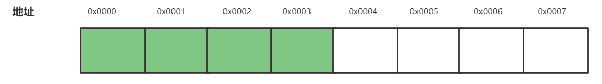
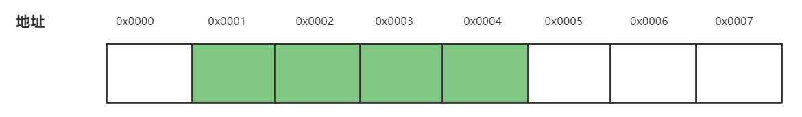
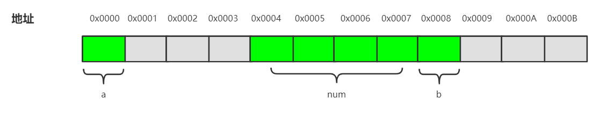

# C语言— —结构体、联合体与枚举
本文介绍C语言中较复杂的几种数据类型。


## 1. 结构体
### 1.1 什么是结构体
我们已经学习过数组了，数组是相同类型的数据的集合，比如`1,2,3,4,5,6,7`可以存放在一个长度为7的整型数组中。

如果我们想把不同类型的数据存放在一起，又该怎么做呢？这就是结构体完成的事。

结构体可以存储不同类型的数据，比如你可以在结构体中同时存储`20`，`张三`，`A`，`70.0`，分别为整型、字符串、字符和浮点型数据。


### 1.2 结构体的声明与初始化
我们可以使用如下语法声明结构体：
```c
struct [tagName]{
    成员列表;
} [变量名];
```
注意：`tagName`和变量名是可选的，但不可以同时为空。
例如：

```c
struct Person{
    int age;
    char name[100];
    char grade;
    double weight;
} XiaoMing;
```
在上面的例子中，我们声明了一个标记为`Person`的结构体，其中的成员包括整型变量`age`，字符串变量`name`，字符型变量`grade`，浮点型变量`weight`，并同时声明了一个`Person`结构体变量`XiaoMing`。
当然，我们也可以在之后声明结构体变量：
```c
struct tagName 变量名;
```
例如：
```c
struct Person XiaoHong;
struct Person students[40];
struct Person *p;
```
如果我们在声明结构体的时候，省略`tagName`，即声明了一个匿名结构体。那么之后就不可以声明结构体变量了，只能在声明结构体的时候同时声明结构体变量。如：
```c
struct {
    int age;
    char name[100];
} XiaoZhang;
```

我们可以使用关键字`typedef`来为结构体重命名：

```c
typedef struct [tagName]{
    成员列表;
} newName;
```

例如：

```c
typedef struct Person{
    ...;
} Person;
```

现在`Person`是类型而不是结构标签名了。之后，我们就可以使用如下语法声明结构体变量了（省略了`struct`关键字 ）：

```c
Person p1;
```

在结构体中还可以包含结构体，例如：

```c
typedef struct Simple{
    int num;
    char str[10];
}Simple;

typedef struct Complex{
    int length;
    Simple simple;
}Complex;
```

可以看到在结构体`Complex`中，包含了另一个结构体`Simple`。

除此之外，我们还可以在自身的成员列表中包含指向自己类型的结构体指针：

```c
typedef struct Node{
    int value;
    struct Node *p;
}Node;
```

注意，成员列表中的`struct`不能省略，因此此时`Node`还不是类型，只是结构标签。这种结构体的声明方式就是链表的基础。

说完结构体的声明，我们再来说说结构体的初始化，结构体的初始化就像数组的初始化一样。一个位于一对大括号内部，由逗号分隔的初始值列表可用于结构体各个成员的初始化。这些值根据结构成员列表的顺序写出。如果初始列表的值不够，剩余的结构体成员将使用默认值进行初始化。结构体中如果包含数组或结构体成员，那么初始化方式类似于多维数组的初始化。案例如下：

```c
// 初始化上面声明的Complex结构体
COmplex c = {10,{3,"hello"}};
// 10 对应着Complex中的length，{3,"hello"}对应着Complex中的simple
// 3 对应着Simple中的num，"hello"对应着Simple中的str字符串
```


### 1.3 结构体成员的访问

对结构成员的访问，我们有两种方式：直接访问和间接访问。

直接访问是对于结构体变量而言的，通过点操作符`.`来进行结构体成员的访问。语法如下：

```c
结构体变量.成员名
```

例如，仍以`Complex`结构体为例，访问方式如下：

```c
c.length;      // 10
c.simple.num;  // 3
c.simple.str;  // "hello"
```

间接访问是针对结构体指针而言的，使用箭头操作符`->`来访问成员，语法如下：

```c
结构体指针->成员名
```

例如：

```c
Complex *p = &c;

p->length;       // 10
(p->simple).num; // 3
(p->simple).str; // "hello"
```

当然，我们也可以通过解引用的方法，通过结构体指针来访问成员，不过不推荐：

```c
Complex *p = &c;

(*p).length;   // 解引用
```


### 1.4 结构的存储分配

我们先来看下面一段程序：

```c
# include <stdio.h>

typedef struct Node1{
	char a;
	int num;
	char b;
}Node1;

typedef struct Node2{
	int num;
	char a;
	char b;
}Node2;

int main(){
	printf("%d\n",sizeof(Node1));
	printf("%d\n",sizeof(Node2));
	return 0;
}
```

你认为输出结果是多少，是`6`和`6`吗？实际输出结果是：

```txt
12
8
```

这是什么鬼？？？为什么两个结构体包含同样的成员，只是由于顺序不同，就导致结构占据的大小不同。并且，为什么是12和8，不是6呢（`int`占据4个字节，`char`占据一个字节）？这是因为结构体的存储存在着内存对齐规则。

内存对齐主要是为了提高内存的访问效率，比如intel 32位cpu，每个总线周期都是从偶地址开始读取32位的内存数据，如果数据存放地址不是从偶数开始，则可能出现需要两个总线周期才能读取到想要的数据，因此需要在内存中存放数据时进行对齐。

比如，现有一个整型变量`a`，占据4个字节，如果它在内存中的存储位置如下（绿色区域）：



由于**总线周期总是从偶地址（实际就是4的整数倍地址）开始读取数据**，那么只需要一个总线周期就能把变量a的值读出来。

如果变量`a`在内存中的存储位置如下：



那么就需要两个总线周期才能读出`a`的值，显然这是更耗费时间的。

基于上述的背景知识，那么我们也就不难理解在结构体中的内存对齐了。结构体的内存对齐有如下四个原则：

- 编译器按照成员列表的顺序一个接一个地给每个成员分配内存；

- 结构体变量的**起始地址**能够被其最宽的成员大小整除；
- 结构体每个成员的起始位置相对于**结构起始地址的偏移**能够被其**自身大小整除**，如果不能则在**前一个成员后面**补充字节；
- 结构体总体大小能够**被最宽的成员的大小**整除，如不能则在**后面**补充字节；

现在我们再根据这三条原则来分析上面的案例`Node1`：

`Node1`中的最宽的成员大小为4字节（成员`num`）。现在假设`Node1`的起始地址能够被4整除，假设为`0x0000`。首先第一个成员`char a`占据一个字节，地址为`0x0000`；然后是第二个成员`int num`，根据原则三，每个成员相对于结构起始地址`0x0000`的偏移能被自身大小`4`整除，那么`num`的起始地址为`0x0004`，这就意味着`0x0001`、`0x0002`、`0x0003`三个字节是空的；然后是第三个成员`char b`，根据原则三，成员`b`可以占据地址为`0x0008`的地址，又根据原则四，需要在最后补充字节，使得结构总体大小能被最宽的成员大小整除，所以填充字节到`0x000B`。如图（灰色为填充的字节，绿色为实际存储数据的字节）：



现在你能分析`Node2`在内存中的存储分配吗？

  

## 2. 联合体

联合体与结构体的声明方式相同，但特性完全不同。**联合体的所有成员占据的是内存中的相同位置**。联合体的声明用关键字`union`进行声明：

```c
union [unionName]{
    成员列表;
}[变量名];
```

例如：

```c
union T{
    int a;
    float b;
} t;
```

我们使用如下语句计算变量`t`所占据的内存大小：

```c
printf("%d",sizeof(t));
```

结果为：4

为什么不是8（`int`占据4个字节，`float`占据4个字节）呢？我们始终牢记联合体的所有成员占据的是内存中的相同位置，这里的`int`和`float`共享四个字节的内存空间。

```c
union T{
    int a;
    float b;
    char ch[5];
} t1;
```

那么此时`t1`占据多大的内存空间呢？答案是8。因为 `a`占据4个字节内存空间 = `b`占据的4个字节内存空间 < `ch`占据的5个字节内存空间，所以t至少占用5个字节，又由于内存对齐的存在，所以填充使得`t1`占据8个字节的内存空间。

```c
union T{
    int a;
    float b;
} t;

t.b = 3.1415926;
printf("t.a = %d",t.a);  // 输出 1078530010
```

因为a和b在内存中占据相同的位置，所以给b赋值，然后读取a的值，仍然可以读取到值，该值的大小是将`3.1415926`在内存中的二进制形式解释为整型。**union某一成员的改变会覆盖处于内存起始位置的成员值（相互覆盖）**。

```c
union T{
    int a;
    float b;
    char ch[5];
} t;

t.b = 3.1415926;

printf("t.a = %d\n",t.a);
printf("t.b = %f\n",t.b);
printf("%c%c%c%c\n",t.ch[0],t.ch[1],t.ch[2],t.ch[3]);

printf("%p\n",&(t.a));
printf("%p\n",&(t.b));
char * p = &(t.ch[0]);
for(int i = 0; i < 5; i++){
    printf("%p-%c\n",p+i,*(p+i));
}
```

输出结果：

```txt
t.a = 1078530010
t.b = 3.141593
?I@
0000000000407030
0000000000407030
0000000000407030-?
0000000000407031-
0000000000407032-I
0000000000407033-@
0000000000407034-
```

联合体可以初始化，但这个初始值必须是联合体第一个成员的类型，而且它必须位于一对花括号里面，例如：

```c
union T{
    int a;
    floaf b;
} t={5};    // 把t.a初始化为5
```


## 3. 枚举

> 枚举：一个一个列举。

在C语言中，枚举就是把一组同类型的值一个一个列举出来，放在一起，便于使用。这样的值有很多，比如一周有七天（周一到周日）、一年有十二个月（一月到十二月）、一年有四季（春夏秋冬）等等。

我们可以把春夏秋冬一一列举出来：

```txt
Spring  Summer  Autumn  Winter
```

在C语言中，我们可以把这一组值放在枚举类型中：

```c
enum Season{
    Spring,
    Summer,
    Autumn,
    Winter
};
```

这样，当我们在程序中需要使用季节时，就可以使用`Season`中的枚举值。

枚举的声明语法如下：

```c
enum 枚举名{
    枚举值
};
```

然后我们就可以使用枚举值了：

```c
[enum] Season s;      // enum是可选的
s = Spring;
```

C语言中，把枚举成员当作`int`或`unsigned int`型变量来处理，即`Spring`枚举值实际上是一个整型。

第一个枚举成员的默认值为整型的 0，后续枚举成员的值在前一个成员上加 1。我们也可以在声明枚举时修改枚举成员的值。

```c
Season s = Spring;
printf("%d",s);     // 输出：0

// 在声明时修改枚举值
enum Season{
    Spring,
    Summer,
    Autumn = 99,
    Winter
};

Season s1 = Spring;  // 值为0 
Season s2 = Autumn;  // 值为99
Season s3 = Winter;  // 值为100
```

由于枚举成员是整型，那么我们将整型转换为枚举：

```c
Season s = (Season)99;
```

不过这样似乎没什么意义，因为当你转换一个不存在的枚举值时，也不会报错。

```c
Season s = (Season)999;    // 不会报错
```


## 参考资料

[1] 《C和指针》第10章：结构和联合

[2] 结构体内存对齐（知乎作者：KDF5000）：https://www.zhihu.com/question/27862634

[3] 枚举：https://www.runoob.com/cprogramming/c-enum.html

