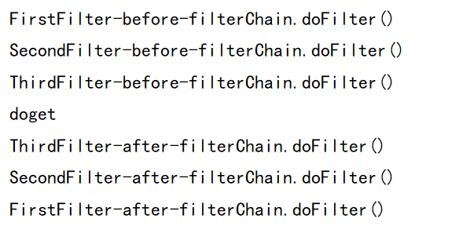

# Java WEB— —Filter过滤器

本文主要介绍过滤器Filter知识。

[toc]

## 一、过滤器概述

Servlet 过滤器可以动态地拦截请求和响应，以变换或使用包含在请求或响应中的信息。

可以将一个或多个 Servlet 过滤器附加到一个 Servlet 或一组 Servlet。Servlet 过滤器也可以附加到 JavaServer Pages (JSP) 文件和 HTML 页面。

Servlet 过滤器是可用于 Servlet 编程的 Java 类，可以实现以下目的：

- 在客户端的请求访问后端资源之前，拦截这些请求。
- 在服务器的响应发送回客户端之前，处理这些响应。

过滤器通过 Web 部署描述符（web.xml）中的 XML 标签来声明，然后映射到应用程序的部署描述符中的 Servlet 名称或 URL 模式。

当 Web 容器启动 Web 应用程序时，配置文件（web.xml）中声明的每一个过滤器会创建一个实例。

**Filter的执行顺序与在web.xml配置文件中的配置顺序一致，一般把Filter配置在所有的Servlet之前。**

当配置有多个过滤器时，组成过滤器链：


## 二、Filter接口

过滤器是一个实现了 javax.servlet.Filter 接口的 Java 类。javax.servlet.Filter 接口定义了三个方法：

| 方法 & 描述                                                  |
| :----------------------------------------------------------- |
| **public void doFilter (ServletRequest, ServletResponse, FilterChain)** 该方法完成实际的过滤操作，当客户端请求方法与过滤器设置匹配的URL时，Servlet容器将先调用过滤器的doFilter()方法。**通过FilterChain访问后续过滤器，即调用filterChain.doFilter()来继续调用后续方法。** |
| **public void init(FilterConfig filterConfig)** web 应用程序启动时，web 服务器将创建Filter 的实例对象，并调用其init方法，读取web.xml配置，完成对象的初始化功能，从而为后续的用户请求作好拦截的准备工作（filter对象只会创建一次，init方法也只会执行一次）。开发人员通过init方法的参数，可获得代表当前filter配置信息的FilterConfig对象。 |
| **public void destroy()** Servlet容器在销毁过滤器实例前调用该方法，在该方法中释放Servlet过滤器占用的资源。 |

如果要实现自己的过滤器，只需要实现该接口，然后重写`doFilter()`方法，最后添加配置即可。


## 三、过滤器的配置

过滤器配置如下：

```xml
<filter>
    <filter-name>MyFilter</filter-name>
    <filter-class>cn.lee.filter.MyFilter</filter-class>
    <init-param>
        <param-name>name</param-name>
        <param-value>小明</param-value>
    </init-param>
</filter>
<filter-mapping>
    <filter-name>MyFilter</filter-name>
    <url-pattern>/*</url-pattern>
    <servlet-name>MyServlet</servlet-name>
    <dispatcher>REQUEST</dispatcher>
</filter-mapping>
```

### 3.1 初始参数

我们可以使用`<init-param>`配置初始参数，然后可以在初始方法`init(FilterConfig )`中进行获取：

```java
filterConfig.getInitParameter("name");
filterConfig.getInitParameterNames();
```


### 3.2 dispather

`<dispatcher>`共有四种取值：

- **REQUEST**：当用户直接访问页面时，Web容器将会调用过滤器。如果目标资源是通过RequestDispatcher的include()或forward()方法访问时，那么该过滤器就不会被调用。
- **INCLUDE**：如果目标资源是通过RequestDispatcher的include()方法访问时，那么该过滤器将被调用。除此之外，该过滤器不会被调用。
- **FORWARD**：如果目标资源是通过RequestDispatcher的forward()方法访问时，那么该过滤器将被调用，除此之外，该过滤器不会被调用。
- **ERROR**：如果目标资源是通过声明式异常处理机制调用时，那么该过滤器将被调用。除此之外，过滤器不会被调用。


## 四、其他问题

### 4.1 过滤器执行顺序

现有一个过滤器链：FirstFilter-->SecondFilter-->ThirdFilter-->MyServlet，四个匹配的路径都为/test，方法如下：

```java
public class FirstFilter implements Filter {
    public void doFilter(ServletRequest request, ServletResponse response, FilterChain filterChain) throws IOException, ServletException {
        System.out.println("FirstFilter-before-filterChain.doFilter()");
        filterChain.doFilter(servletRequest,servletResponse);
        System.out.println("FirstFilter-after-filterChain.doFilter()");
    }
}

public class SecondFilter implements Filter {
    public void doFilter(ServletRequest request, ServletResponse response, FilterChain filterChain) throws IOException, ServletException {
        System.out.println("SecondFilter-before-filterChain.doFilter()");
        filterChain.doFilter(servletRequest,servletResponse);
        System.out.println("SecondFilter-after-filterChain.doFilter()");
    }
}

public class ThirdFilter implements Filter {
    public void doFilter(ServletRequest request, ServletResponse response, FilterChain filterChain) throws IOException, ServletException {
        System.out.println("ThirdFilter-before-filterChain.doFilter()");
        filterChain.doFilter(servletRequest,servletResponse);
        System.out.println("ThirdFilter-after-filterChain.doFilter()");
    }
}

public class MyServlet extends javax.servlet.http.HttpServlet {
    protected void doGet(HttpServletRequest request, HttpServletResponse response) throws ServletException, IOException {
        System.out.println("doget");
    }
}
```

**情况一：**

如果按照正常配置，所有过滤器都放行，则访问路径结果为：



**情况二：**

如果过滤器二不放行，即将过滤器二的`filterChain.doFilter()`及其之后的代码注释后，执行结果如下：


## 五、参考资料

[1]https://blog.csdn.net/u013087513/article/details/56835894

[2]https://www.runoob.com/servlet/servlet-writing-filters.html

[3]http://www.51gjie.com/javaweb/867.html