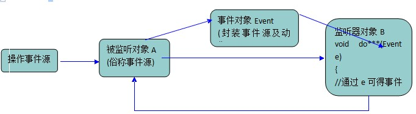
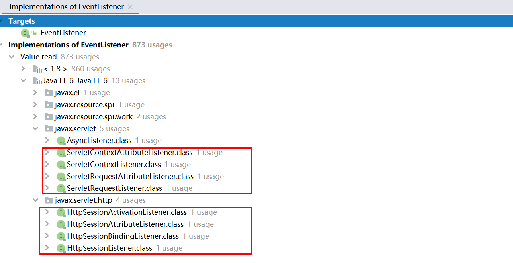

# Java WEB— —Listener监听器

本文主要介绍监听器Listener的相关知识。

[toc]

## 一、什么是监听器

Listener是Servlet的监听器，它可以监听客户端的请求、服务端的操作等。通过监听器，可以自动激发一些操作，比如监听在线的用户的数量。

Listener监听器就是一个实现特定接口的Java类，这个程序专门用于监听一个java对象的方法调用或属性改变，当被监听对象发生上述事件后，监听器某个方法将立即被执行。




## 二、监听器接口

我们只需要实现特定的接口，就能对特定的事件源进行监听。这些接口都继承自父接口`EventListener`接口：

```java
/**
 * A tagging interface that all event listener interfaces must extend.
 * @since JDK1.1
 */
public interface EventListener {
}
```

这是一个标记接口，所有监听器接口都需要继承这个接口。

根据继承图，监听器接口如下：



介绍如下：

- `ServletContextListener`：对Servlet上下文对象进行监听

```java
public interface ServletContextListener extends EventListener {
    void contextInitialized(ServletContextEvent var1);

    void contextDestroyed(ServletContextEvent var1);
}
```

- `ServletContextAttributeListener`：对Servlet上下文属性进行监听

```java
public interface ServletContextAttributeListener extends EventListener {
    void attributeAdded(ServletContextAttributeEvent var1);

    void attributeRemoved(ServletContextAttributeEvent var1);

    void attributeReplaced(ServletContextAttributeEvent var1);
}
```

- `ServletRequestListener`：对request进行监听

```java
public interface ServletRequestListener extends EventListener {
    void requestDestroyed(ServletRequestEvent var1);

    void requestInitialized(ServletRequestEvent var1);
}
```

- `ServletRequestAttributeListener`：对request属性进行监听

```java
public interface ServletRequestAttributeListener extends EventListener {
    void attributeAdded(ServletRequestAttributeEvent var1);

    void attributeRemoved(ServletRequestAttributeEvent var1);

    void attributeReplaced(ServletRequestAttributeEvent var1);
}
```

- `HttpSessionListener`：对session进行监听

```java
public interface HttpSessionListener extends EventListener {
    void sessionCreated(HttpSessionEvent var1);

    void sessionDestroyed(HttpSessionEvent var1);
}
```

- `HttpSessionAttributeListener`：对session属性进行监听

```java
public interface HttpSessionAttributeListener extends EventListener {
    void attributeAdded(HttpSessionBindingEvent var1);

    void attributeRemoved(HttpSessionBindingEvent var1);

    void attributeReplaced(HttpSessionBindingEvent var1);
}
```

- `HttpSessionBindingListener`：在使用JavaBean对象时经常会判断该对象是否绑定到Session域中，为此，Servlet API中专门提供了`HttpSessionBindingListener`接口，该接口用于监听JavaBean对象绑定到HttpSession对象和从HttpSession对象解绑的事件。HttpSessionBindingListener接口中共定义了两个事件处理方法，分别是`valueBound()`方法和`valueUnbound()`方法。

```java
public interface HttpSessionBindingListener extends EventListener {
    // 当对象被绑定到HttpSession对象中，
    //Web容器将调用对象的valueBound()方法并传递一个HttpSessionBindingEvent类型的事件对象，
    //程序可以通过这个事件对象来获得将要绑定到的HttpSession对象。
    void valueBound(HttpSessionBindingEvent var1);

    //当对象从HttpSession对象中解除绑定时，
    //Web容器同样将调用对象的valueUnbound()方法
    //并传递一个HttpSessionBindingEvent类型的事件对象。
    void valueUnbound(HttpSessionBindingEvent var1);
}
```

- `HttpSessionActivationListener`：当一个会话开始时，Servlet容器会为会话创建一个HttpSession对象。Servlet容器在某些特殊情况下会把这些HttpSession对象从内存中转移至硬盘，这个过程称为持久化（钝化）。在持久化会话时，Servlet容器不仅会持久化HttpSession对象，还会对它所有可以序列化的属性进行持久化，从而确保存放在会话范围内的共享数据不会丢失。所谓可以序列化的属性就是指该属性所在的类实现了Serializable接口。当会话从持久化的状态变为运行状态的过程被称为活化（或称为加载），一般情况下当服务器重新启动或者单个Web应用启动时，处于会话中的客户端向Web应用发出Http请求时，相应的会话会被激活。

  为了监听HttpSession中对象活化和钝化的过程，Servlet API专门提供了HttpSessionActivationListener接口，该接口定义了两个事件处理方法，分别是sessionWillPassivate()方法和sessionDidActivate()方法，

```java
public interface HttpSessionActivationListener extends EventListener {
    // 当绑定到HttpSession对象中的对象将要随HttpSession对象被钝化之前，Web容器将调用这个方法并传递一个HttpSessionEvent类型的事件对象，程序通过这个事件对象可以获得当前被钝化的HttpSession对象。
    void sessionWillPassivate(HttpSessionEvent var1);

    //当绑定到HttpSession对象中的对象将要随HttpSession对象被活化之后，Web容器将调用这个方法并传递一个HttpSessionEvent类型的事件对象。
    void sessionDidActivate(HttpSessionEvent var1);
}
```


