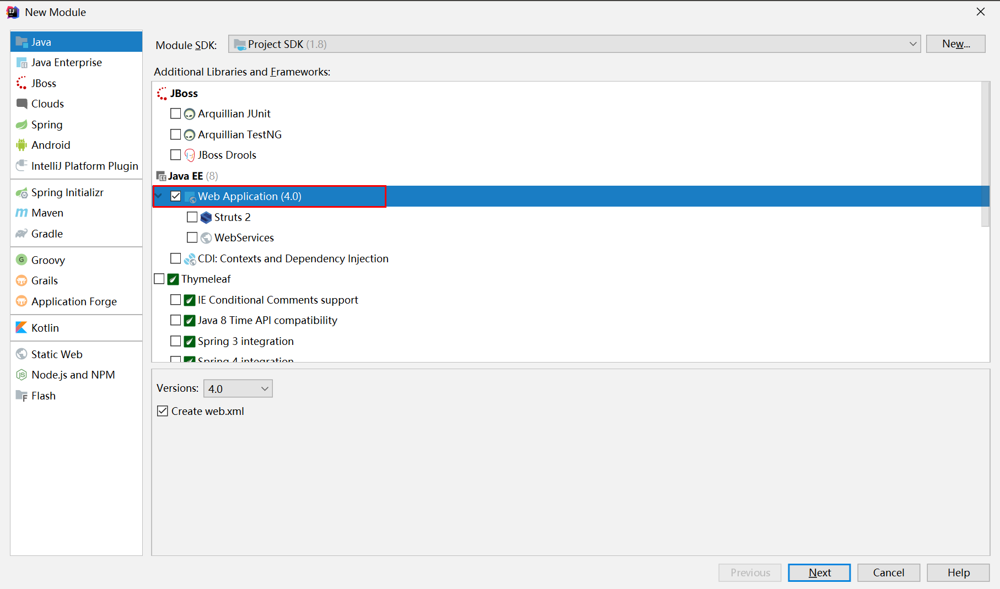
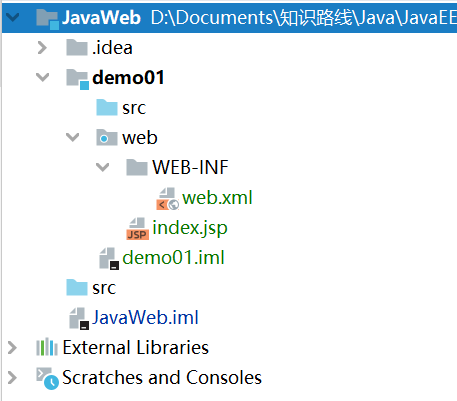
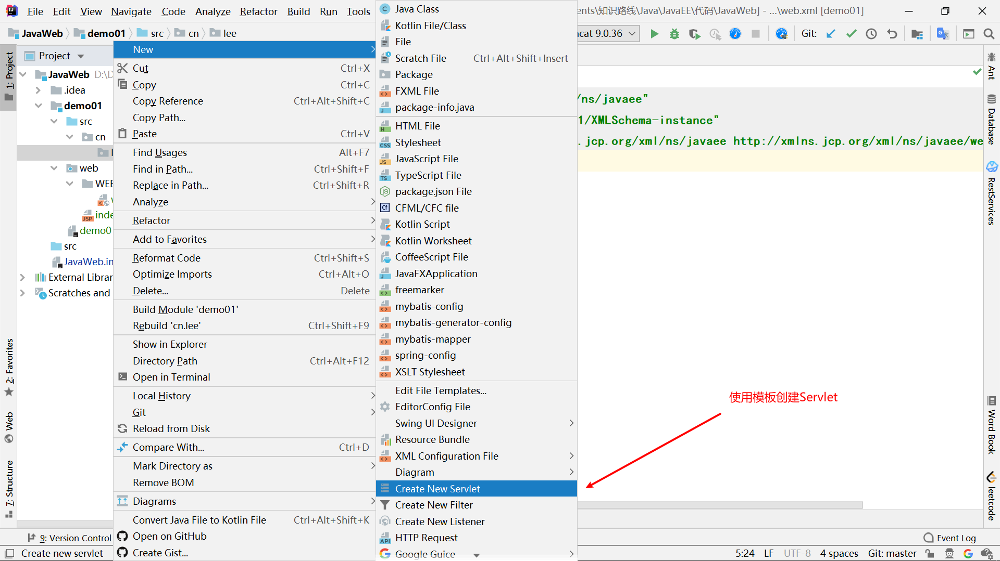
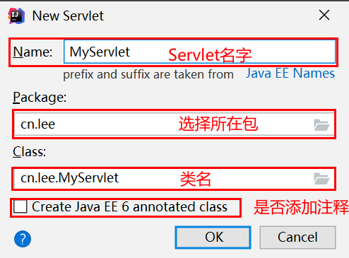
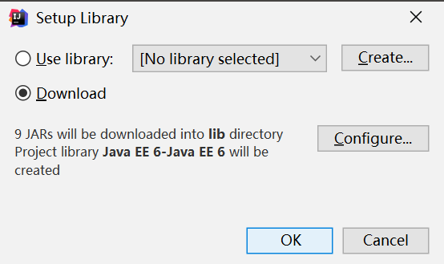
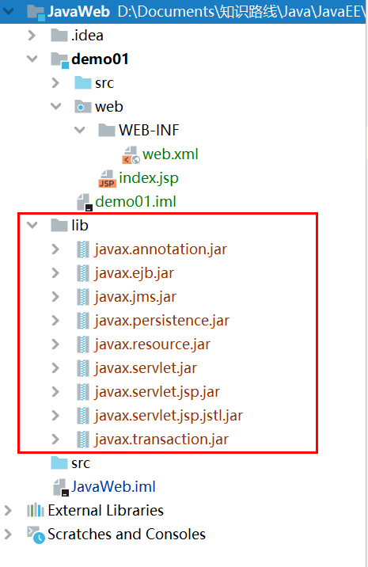
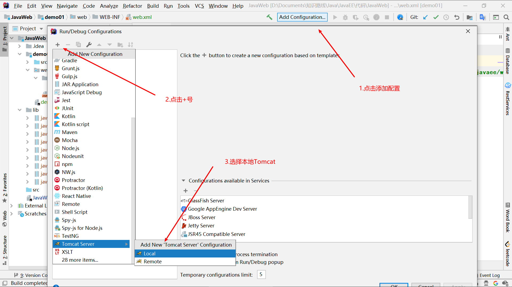
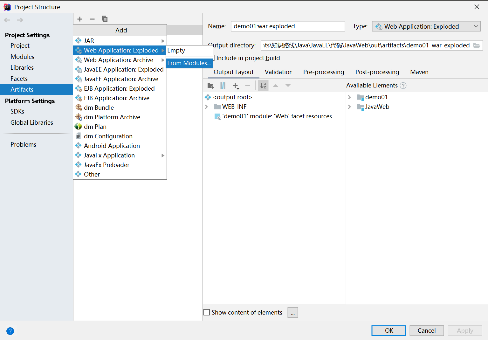

# Java WEB— —Servlet入门

本文主要介绍Servlet的知识及案例。

[toc]

## 一、什么是Servlet

`Servlet`就是一个接口，只有五个方法的接口：

```java
package javax.servlet;

import java.io.IOException;

public interface Servlet {
    void init(ServletConfig var1) throws ServletException;

    ServletConfig getServletConfig();

    void service(ServletRequest var1, ServletResponse var2) throws ServletException, IOException;

    String getServletInfo();

    void destroy();
}

```

`Servlet`接口定义的是一套处理网络请求的规范，所有实现`Servlet`的类，都需要实现它那五个方法，其中最主要的是两个生命周期方法 `init()`和`destroy()`，还有一个处理请求的`service()`，也就是说，所有实现`Servlet`接口的类，或者说，所有想要处理网络请求的类，都需要回答这三个问题：

- 你初始化时要做什么
- 你销毁时要做什么
- 你接受到请求时要做什么

但是，并不是实现了`Servlet`接口的类就能接收处理网络请求了，`Servet`是放在`Servlet`容器中的（比如Tomcat）。**Tomcat才是与客户端直接打交道的家伙**，他监听了端口，请求过来后，根据url等信息，确定要将请求交给哪个`Servlet`去处理，然后调用那个`Servlet`的`service()`方法，`service()`方法返回一个`response`对象，Tomcat再把这个`response`返回给客户端。


## 二、HttpServlet

如果我们需要编写自己的`Servlet`类，那么只需要继承`HttpServlet`类，并实现相关方法即可。

在IDEA中，`Servlet`模板如下：

```java
package cn.lee;

import javax.servlet.ServletException;
import javax.servlet.annotation.WebServlet;
import javax.servlet.http.HttpServlet;
import javax.servlet.http.HttpServletRequest;
import javax.servlet.http.HttpServletResponse;
import java.io.IOException;

@WebServlet(name = "MyServlet")
public class MyServlet extends HttpServlet {
    protected void doPost(HttpServletRequest request, HttpServletResponse response) throws ServletException, IOException {
    }

    protected void doGet(HttpServletRequest request, HttpServletResponse response) throws ServletException, IOException {
    }
}

```

我们只需要实现`doPost()`和`doGet()`方法，可是这与我们之前的认知有误啊！我们知道需要实现当处理请求时，需要调用`service()`方法，为什么这里没有实现`service()`方法呢？因为`HttpServlet`中已经帮我们实现了，我们只需要实现对应请求方式的方法即可，也就是说，我们不仅可以实现`doGet()`和`doPost()`方法，也可以实现`doDelete()`、`doPut()`等方法。

`HttpServlet`中实现的`service()`方法：

```java
protected void service(HttpServletRequest req, HttpServletResponse resp) throws ServletException, IOException {
    String method = req.getMethod();
    long lastModified;
    if (method.equals("GET")) {
        lastModified = this.getLastModified(req);
        if (lastModified == -1L) {
            this.doGet(req, resp);
        } else {
            long ifModifiedSince = req.getDateHeader("If-Modified-Since");
            if (ifModifiedSince < lastModified) {
                this.maybeSetLastModified(resp, lastModified);
                this.doGet(req, resp);
            } else {
                resp.setStatus(304);
            }
        }
    } else if (method.equals("HEAD")) {
        lastModified = this.getLastModified(req);
        this.maybeSetLastModified(resp, lastModified);
        this.doHead(req, resp);
    } else if (method.equals("POST")) {
        this.doPost(req, resp);
    } else if (method.equals("PUT")) {
        this.doPut(req, resp);
    } else if (method.equals("DELETE")) {
        this.doDelete(req, resp);
    } else if (method.equals("OPTIONS")) {
        this.doOptions(req, resp);
    } else if (method.equals("TRACE")) {
        this.doTrace(req, resp);
    } else {
        String errMsg = lStrings.getString("http.method_not_implemented");
        Object[] errArgs = new Object[]{method};
        errMsg = MessageFormat.format(errMsg, errArgs);
        resp.sendError(501, errMsg);
    }

}
```


## 三、案例

### 3.1 新建项目

本节主要通过案例介绍如何使用`Servlet`。

首先，在IDEA中新建一个普通的项目，然后，再在该项目下新建WEB模块，命令为demo1。



最后项目结构为：




### 3.2 新建Servlet

在子模块demo1下的src目录中，新建包`cn.lee`，然后创建自定义的`Servlet`，使用IDEA的模板：





如上图所示，点击OK确定创建。

此时web.xml中添加了新的内容`<servlet>...</servlet>`：

```xml
<?xml version="1.0" encoding="UTF-8"?>
<web-app xmlns="http://xmlns.jcp.org/xml/ns/javaee"
         xmlns:xsi="http://www.w3.org/2001/XMLSchema-instance"
         xsi:schemaLocation="http://xmlns.jcp.org/xml/ns/javaee http://xmlns.jcp.org/xml/ns/javaee/web-app_4_0.xsd"
         version="4.0">
    <servlet>
        <servlet-name>MyServlet</servlet-name>
        <servlet-class>cn.lee.MyServlet</servlet-class>
    </servlet>
</web-app>
```


### 3.3 导入依赖

此时选择类`MyServlet`，发现找不到`servlet`，如下图所示，点击`Add Java EE...`


跳出如下页面，选择`Download`下载依赖，点击OK：



下载完成后，父项目下多了目录lib，里面包括下载好的依赖：



### 3.4 编写Servlet方法

编写`MyServlet`下的方法`doGet()`和`doPost()`:

```java
package cn.lee;

import java.io.IOException;

public class MyServlet extends javax.servlet.http.HttpServlet {
    protected void doPost(javax.servlet.http.HttpServletRequest request, javax.servlet.http.HttpServletResponse response) throws javax.servlet.ServletException, IOException {
        System.out.println("dopost");
    }

    protected void doGet(javax.servlet.http.HttpServletRequest request, javax.servlet.http.HttpServletResponse response) throws javax.servlet.ServletException, IOException {
        System.out.println("doget");
    }
}
```


### 3.5 添加配置

由于Servlet用于处理请求，那么我们需要指明哪个Servlet处理哪个路径请求，所以修改`web.xml`文件，添加请求路径映射：

```xml
<servlet>
    <servlet-name>MyServlet</servlet-name>
    <servlet-class>cn.lee.MyServlet</servlet-class>
</servlet>
<servlet-mapping>
    <servlet-name>MyServlet</servlet-name>
    <url-pattern>/test</url-pattern>
</servlet-mapping>
```

说明`Myservlet`处理`/test`请求。


### 3.6 添加Tomcat

由于`Servlet`需要放在`Servlet`容器中才能发挥作用，所以需要配置Tomcat，程序才能运行。



然后进行配置：

首先在Server页面进行配置：


然后在Deployment页面下进行配置：


然后点击Apply-OK。


### 3.7 启动

启动项目，然后在浏览器中输入`http://localhost:8080/demo01/test`，查看IDEA控制台结果：


说明方法`doGet()`已经处理了请求。


## 四、遇到的问题

### 4.1 依赖问题

在导入依赖过程中，如果下载过程过慢，也可以将Tomcat的lib目录下的`servlet-api.jar`作为依赖导入项目。


### 4.2 Tomcat环境配置问题

如果在Deployment页面配置中，找不到Artifact：


解决方法：Project Structure-->Project Settings --> Artifacts --> +号 --> Web Application:Exploded --> From Modules，选择相对应的模块即可。然后再回到Tomcat配置页面进行配置。




## 五、参考资料

[1] https://www.zhihu.com/question/21416727/answer/339012081
