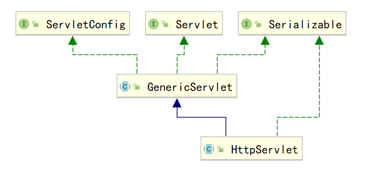

# Java WEB— —Servlet生命周期

本文主要介绍Servlet生命周期及其相关知识。

[toc]

## 一、概述

Servlet 生命周期可被定义为从创建直到毁灭的整个过程。以下是 Servlet 遵循的过程：

- Servlet 通过调用 **init ()** 方法进行初始化。
- Servlet 调用 **service()** 方法来处理客户端的请求。
- Servlet 通过调用 **destroy()** 方法终止（结束）。
- 最后，Servlet 是由 JVM 的垃圾回收器进行垃圾回收的。


## 二、init()

由于`Servlet`需要放在`Servlet`容器中，所以当`Servlet`容器加载`Servlet`时就会调用初始化方法`init()`。

现在有一个问题，`Servlet`容器什么时候加载`Servlet`呢？我们可以通过参数`<load-on-startup>`进行设置。

```xml
<servlet>
    <servlet-name>xxx</servlet-name>
    <servlet-class>xxx</servlet-class>
    <load-on-startup>1</load-on-startup>
</servlet>
```

其值必须是一个整数，表示`Servlet`应该被载入的顺序：

1. 当值为0或者大于0时，表示容器在应用启动时就加载并初始化这个`Servlet`；

2. 当值小于0或者没有指定时，则表示容器在该`Servlet`被使用时才会加载（也就是调用该`Servlet`的`service()`方法时才会加载）；

3. 正数的值越小，该`Servlet`的优先级越高，应用启动时就越先加载；

4. 当值相同时，容器就会自己选择顺序来加载；

在`GenericServlet`中，`init()`方法声明如下：

```java
public void init(ServletConfig config) throws ServletException {
    this.config = config;
    this.init();
}

public void init() throws ServletException {
}
```

`ServletConfig`代表的是配置信息，我们可以在配置文件`web.xml`中进行配置：

```xml
<servlet>
    <servlet-name>xxx</servlet-name>
    <servlet-class>xxx</servlet-class>
    <!-- servletConfig以键值对进行配置 -->
    <init-param>
        <param-name>username</param-name>
        <param-value>admin</param-value>
    </init-param>
    <init-param>
        <param-name>password</param-name>
        <param-value>123456</param-value>
    </init-param>
    <load-on-startup>1</load-on-startup>
</servlet>
<servlet-mapping>
    <servlet-name>xxx</servlet-name>
    <url-pattern>/xxx</url-pattern>
</servlet-mapping>
```

注意，`<init-param>`需要在`<load-on-startup>`之前配置。

我们可以在`init()`中获取参数值：

```java
this.getInitParameter(param-name);
```

也可以通过`ServletConfig`获取初始参数：

```java
this.getServletConfig().getInitParameter(param-name);
```


## 三、service()

service()方法是Servlet的核心，是在servlet生命周期中的服务期，默认在HttpServlet类中实现，根据HTTP请求方法（GET、POST等），将请求分发到doGet、doPost等方法实现。

Servlet接口中定义了一个service()方法，而我们一般是使用HttpServlet，HttpServlet中对它进行了实现，将ServletRequest和ServletResponse转变成为`HttpServletRequest`和`HttpServletResponse`在service中实现。



一般来说service()方法是不需要重写的，因为在HttpServlet中已经有了很好的实现，它会根据请求的方法名（GET，POST），调用doGet()，doPost()以及其他的doXXX()方法，也就是说service()是用来转向的，所以我们一般写一个Servlet，只需要重写doGet()或者doPost()就可以了。

Servlet是线程不安全的，处理多个请求时，多个线程可以同时运行`service()`方法。


## 四、destroy()

destroy() 方法只会被调用一次，在 Servlet 生命周期结束时被调用。destroy() 方法可以让您的 Servlet 关闭数据库连接、停止后台线程、把 Cookie 列表或点击计数器写入到磁盘，并执行其他类似的清理活动。

在调用 destroy() 方法之后，servlet 对象被标记为垃圾回收。destroy 方法定义如下所示：

```java
public void destroy() {
}
```


