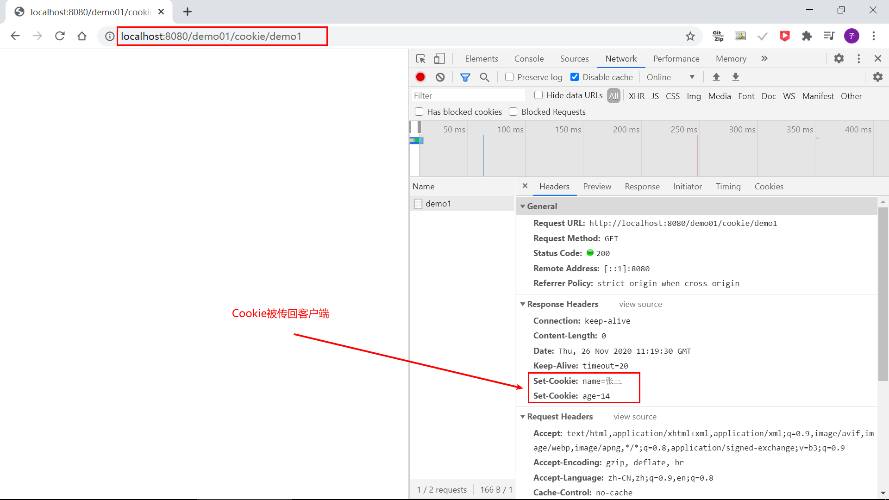
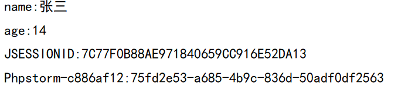
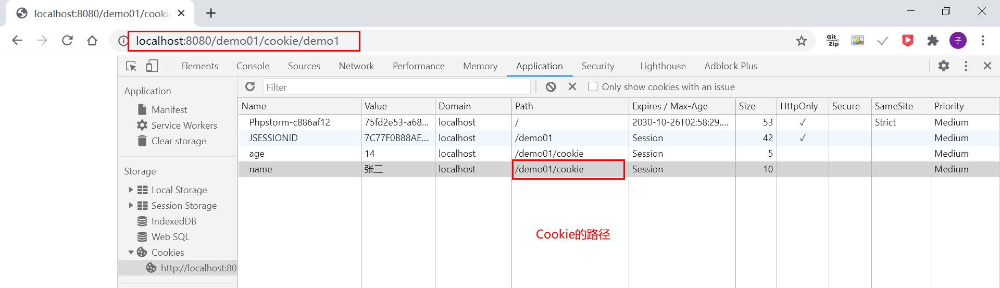
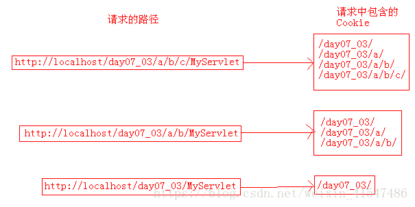
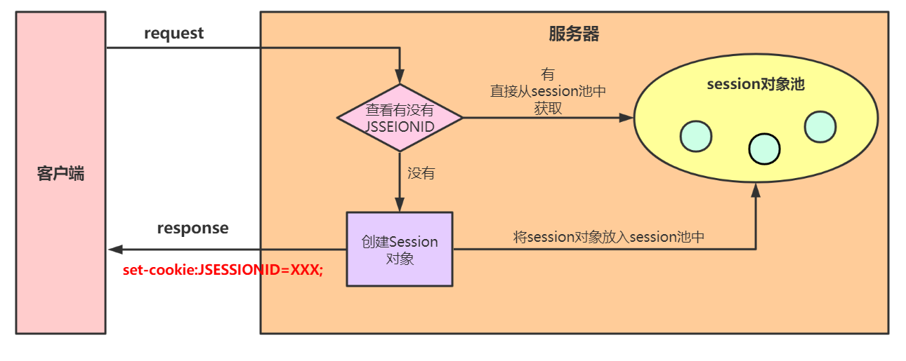
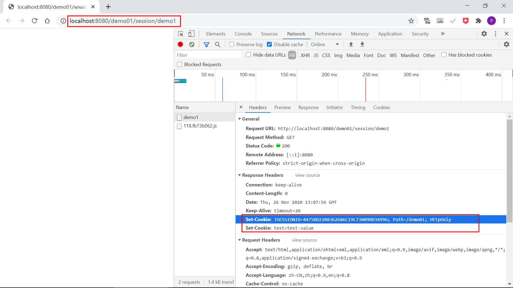
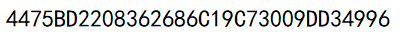
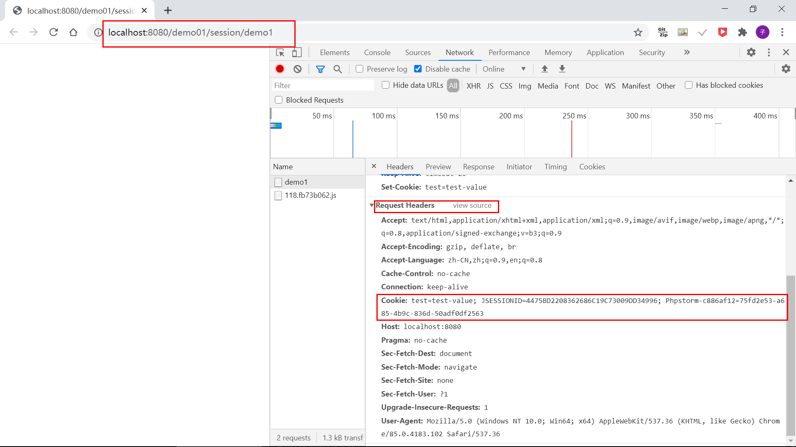
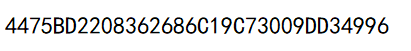

# Java WEB— —会话技术

本文主要介绍会话技术、Cookie和Session。

[toc]

## 一、什么是会话技术

会话：一次会话中包含多次请求和响应，客户端第一次给服务器发送请求，会话建立；当有一方断开时，会话结束。

功能：在一次会话范围内的多次请求间共享数据；

方式:：客户端会话技术Cookie和服务端会话技术Session。


## 二、Cookie

### 2.1 什么是Cookie

Cookie是一种会话技术，它用于将会话过程中的数据**保存在用户的浏览器**中，从而使浏览器和服务器更好的交互。

服务器向客户端发送Cookie时，即使用方法`response.addCookie(Cookie cookie)`，会**在HTTP响应头字段增加Set-Cookie字段**，该字段设置的Cookie遵循一定规则，比如以键值对形式保存，Cookie属性值可以有多个，但是这些属性之间必须以分号和空格分隔。Cookie示例：

```txt
Set-Cookie:"lastTime="2016-05-21 12:03:10"; Version=1"
```

当客户端在同一次会话中再次发起请求时，会携带保存的Cookie。


### 2.2 演示案例

示例如下：

`CookieServlet`用于增加Cookie：

```java
public class CookieServlet extends HttpServlet {
    @Override
    protected void doGet(HttpServletRequest req, HttpServletResponse resp) throws ServletException, IOException {
        // 新建Cookie
        Cookie cookie1 = new Cookie("name","张三");
        Cookie cookie2 = new Cookie("age","14");
        // 返回给客户端
        resp.addCookie(cookie1);
        resp.addCookie(cookie2);
    }
}
```

`CookieServlet2`用户获取Cookie：

```java
public class CookieServlet2 extends HttpServlet {
    @Override
    protected void doGet(HttpServletRequest req, HttpServletResponse resp) throws ServletException, IOException {
        // 获取Cookie
        Cookie[] cookies = req.getCookies();
        for (Cookie cookie : cookies) {
            System.out.println(cookie.getName()+":"+cookie.getValue());
        }
    }
}
```


配置文件：

```xml
<servlet>
    <servlet-name>CookieServlet</servlet-name>
    <servlet-class>cn.lee.servlet.CookieServlet</servlet-class>
</servlet>
<servlet-mapping>
    <servlet-name>CookieServlet</servlet-name>
    <url-pattern>/cookie/demo1</url-pattern>
</servlet-mapping>

<servlet>
    <servlet-name>CookieServlet2</servlet-name>
    <servlet-class>cn.lee.servlet.CookieServlet2</servlet-class>
</servlet>
<servlet-mapping>
    <servlet-name>CookieServlet2</servlet-name>
    <url-pattern>/cookie/demo2</url-pattern>
</servlet-mapping>
```

启动项目后访问相应的/demo1，然后在浏览器中打开调试面板：



然后访问demo2，获取Cookie，IDEA的控制台打印信息如下：



说明在同一次会话中，客户端确实会携带之前的Cookie。


### 2.3 Cookie的细节及方法

#### 创建Cookie

我们使用构造函数`Cookie(String name,String value)`创建Cookie，当Cookie对象创建完成后，不能修改键`name`，只能修改值`value`，通过方法`setValue()`进行修改。


#### Cookie的生命周期

Cookie数据默认是存储在客户端内存中的，即关闭浏览器后则Cookie消失。如果需要持久化保存可以通过方法`setMaxAge(int seconds)`方法设置。

- 如果seconds小于0，则为默认值，即关闭浏览器就销毁Cookie；
- 如果seconds等于0，则表示删除Cookie；
- 如果seconds大于0，则表示将Cookie持久化保存seconds秒；


#### Cookie存储中文问题

在Tomcat8.0之前，Cookie是不能直接存储中文数据的，所以需要对中文进行编码；

在tomcat8之后，Cookie支持中文数据，但是特殊字符还是不支持，所以建议都使用URL编码存储；


#### Cookie路径方法

我们可以通过方法`setPath(String uri)`设置路径，默认为请求路径的上一级路径。

比如，我请求的URL为`/cookie/demo1`，则在该路径下添加的Cookie，其路径为`/cookie`。




那么设置路径有什么用呢？**用于在同一个服务器的不同项目或不同`Servlet`之间传递消息。**

==**如果当前访问的路径包含了Cookie的路径，那么Cookie就会加载到Request对象之中。**==

例如：现在有两个Cookie：

- c1：name=id; value=itcast;     path=/day07_03/

- c2：name=name; value=qdmmy6;     path=/day07_03/servlet/

当访问`http://localhost/day07_03/*`时，请求头中会包含c1，而不会包含c2；

当访问`http://localhost/day07_03/servlet/*`时，请求头中会包含c1和c2；

**也就是说，在访问子路径时，会包含其父路径的Cookie，而在访问父路径时，不包含子路径的Cookie。**




#### Cookie域名方法

我们可以通过方法`setDomain(String domain)`设置域名，如果不设置，则默认为请求服务器的域名。

Cookie设置域名有什么用呢？==**用于在多个服务器之间传递消息！**==

**domain参数可以设置父域名以及自身，但不能设置其它域名，包括子域名，否则Cookie不起作用；**

**当客户端访问某服务器时，会将domain为该服务器域名及子域名的Cookie带上。**

借用https://juejin.cn/post/6844903567803826190中的例子加以说明：

下面举例说明，比如有三级域名support.kefu.mi.com，其中，mi.com是一级域名，kefu.mi.com是二级域名。

在3类域名下进行cookie设置，分别设置不同的domain，看看访问各级域名时cookie的有效性。当domain设置为空时，domain默认为当前域名。

**在一级域名mi.com下设置cookie**

| domain参数      | 访问一级 | 访问二级 | 访问三级 |
| --------------- | -------- | -------- | -------- |
| 空              | √        | √        | √        |
| mi.com          | √        | √        | √        |
| kefu.mi.com     | ×        | ×        | ×        |
| mcc.kefu.mi.com | ×        | ×        | ×        |

当domain为一级域名时，一级域名、包括其下的子域名都可以接收到cookie。但是domain参数设置其子域名时，所有域名就接收不到了，包括那个子域名。

**在二级域名kefu.mi.com下设置cookie**

| domain参数      | 访问一级 | 访问二级 | 访问三级 |
| --------------- | -------- | -------- | -------- |
| 空              | ×        | √        | √        |
| mi.com          | √        | √        | √        |
| kefu.mi.com     | ×        | √        | √        |
| mcc.kefu.mi.com | ×        | ×        | ×        |

当domain为自身域名时，其父域名无法接收到cookie，其本身与其子域名可以接收到cookie。而设置其子域名或其他域名时，所有域名都接收不到cookie。

**在三级域名mcc.kefu.mi.com下设置cookie**

| domain参数      | 访问一级 | 访问二级 | 访问三级 |
| --------------- | -------- | -------- | -------- |
| 空              | ×        | ×        | √        |
| mi.com          | √        | √        | √        |
| kefu.mi.com     | ×        | √        | √        |
| mcc.kefu.mi.com | ×        | ×        | √        |

关于不设置Cookie的域名，默认域名的理解请参看这篇文章：https://www.cnblogs.com/wenjia-hao/p/7365569.html

> 在服务端设置domain的时候，设置domain为  **b.e.f.com.cn**  或  **.b.e.f.com.cn**  没有区别（注意前面的点），即只要是为cookie显式的声明domain，前面带不带点没有区别。在浏览器中存储都是带点的。
>
> 如果有一个域名是**e.f.com.cn**，非显式声明domain（即不调用setDomain(String domain)方法）的cookie，在chrome浏览器中存储是**不带点的**。在e.f.com.cn服务主机中非显式生成的cookie，只有e.f.com.cn 的服务器能拿到，此时子域名是拿不到这个cookie的。


#### Cookie大小及数量限制

浏览器单个Cookie的大小有限制(4kb)，对同一个域名下的总Cookie数量也有限制(20个)


## 三、Session

### 3.1 什么是Session

服务端会话技术，将数据保存在服务端。Session的实现依赖于Cookie。

实现原理：Session有两个主要的东西，一个是JSESSIONID，一个是存放在服务端对象池中的Session对象。客户端访问服务端的时候，会先判断这个客户端的请求数据中是否包含有JSESSIONID，如果没有的话，就会认为这个客户端是第一次进行访问。因为是第一次访问，所以服务端会给客户端在对象池中创建一个Session对象（假设这个会话是需要维持的），并生成出这个对象的SessionID，接着会通过cookie将SessionID响应给客户端(即为JSESSIONID)，同时会把Session对象放回对象池里。客户端接收响应数据后会将JSESSIONID存放在本地，下一次再访问服务端的时候就会把JSESSIONID给带上，服务端就能够通过JSESSIONID获得相应的Session对象，Session就是以这样的一个机制维持会话状态的。

示意图：



代码示例：

`SessionServlet`用户获取`Session`：

```java
@WebServlet(name = "SessionServlet",urlPatterns = {"/session/demo1"})
public class SessionServlet extends HttpServlet {
    protected void doGet(HttpServletRequest request, HttpServletResponse response) throws ServletException, IOException {
        HttpSession session = request.getSession(true);
        System.out.println(session.getId());
        response.addCookie(new Cookie("test","test-value"));
    }
}
```

浏览器第一次访问结果：



在控制台打印结果如下：



浏览器第二次访问：



IDEA控制台打印结果：




### 3.2 Session有关方法

- 获取HttpSession

　　`HttpServletRequest.getSession()`

通过request中的getSession方法来获得Session对象，这个方法可以传递一个布尔类型的参数，如果不传递的话默认为true。

参数值为true时，会先问客户端有没有传递 JSESSIONID过来，如果没有就会重新创建一个session对象；如果有JSESSIONID，就去池里抓取session对象，对象池里反馈没有session对象的话，也会重新创建session对象。

参数值为false时，如果客户端有JSESSIONID就直接从池里抓session对象，没有抓到就返回null，没有JSESSIONID也同样返回null。

- 使用HttpSession

　　存储数据 `void setAttribute(String name, Object value)`

　　通过键获取值 `Object getAttribute(String name)`

　　通过键移除值 `void removeAttribute(String name)`


### 3.3 一些细节

1. 当客户端关闭，服务器不关闭。分两次获取Session，默认情况下不是同一个Session；如果需要两次获取相同的Session，可以在第一次写回浏览器时，自己创建Cookie("JSESSIONID", session.getId())，然后设置最大存活时间，让Cookie持久化保存JSESSIONID；

2. 当客户端不关闭，服务器关闭后。分两次获取的Session不是同一个，为了确保数据不丢失，tomcat自动完成以下工作：

   - Session钝化：在服务器正常关闭之前，将Session对象序列化到硬盘上；

   - Session活化：在服务器启动后，将Session文件转化为内存中的Session对象；

3. Session什么时候被销毁？

   - 服务器关闭
   - Session.invalidate()
   - Session默认失效时间是30分钟，可以在tomcat/conf/web.xml中配置`<session-config>`

4. Session存储数据在服务端，Session可以存储任意类型、任意大小的数据；


## 四、参考资料

[1]https://www.hellojava.com/a/92315.html

[2]https://blog.csdn.net/weixin_41547486/article/details/81294238

[3]https://juejin.cn/post/6844903567803826190#heading-5

[4]https://www.cnblogs.com/wenjia-hao/p/7365569.html

[5]https://www.jianshu.com/p/e0729b18ad46