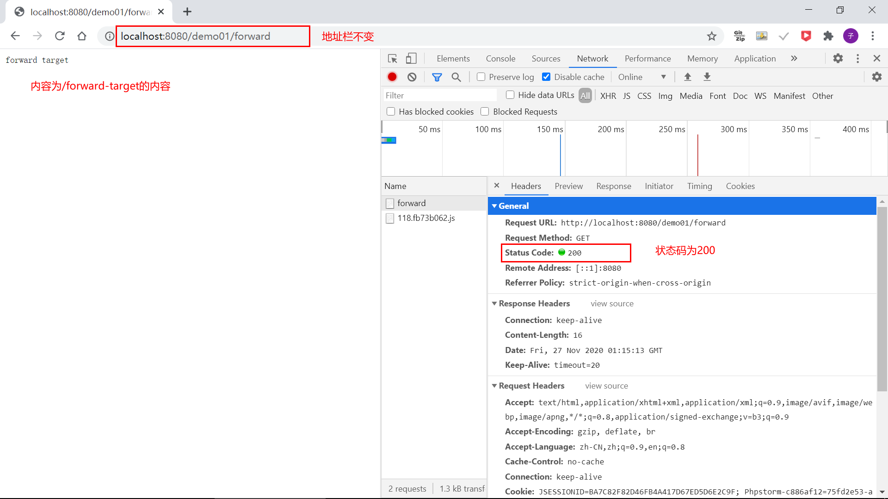
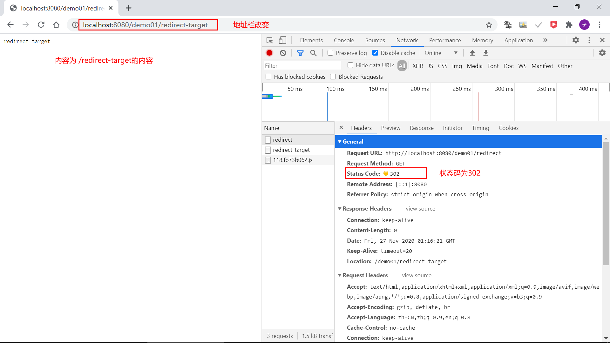

# Java WEB— —转发与重定向

本文主要介绍转发与重定向。

[toc]

## 一、转发

转发（forward）是服务器请求资源,服务器直接访问目标地址的URL,把那个URL的响应内容读取过来,然后把这些内容再发给浏览器。

因为这个跳转过程是在服务器实现的，并不是在客户端实现的，所以浏览器根本不知道服务器发送的内容从哪里来的，**浏览器的地址栏还是原来的地址。**

案例：

`Servlet`代码：

```java
@WebServlet(name = "ForwardServlet",urlPatterns = {"/forward"})
public class ForwardServlet extends HttpServlet {
    protected void doGet(HttpServletRequest request, HttpServletResponse response)
            throws ServletException, IOException {
        request.getRequestDispatcher("/forward-target").forward(request, response);
    }
}

@WebServlet(name = "ForwardTargetServlet",urlPatterns = {"/forward-target"})
public class ForwardTargetServlet extends HttpServlet {
    protected void doGet(HttpServletRequest request, HttpServletResponse response) throws ServletException, IOException {
        PrintWriter writer = response.getWriter();
        writer.println("forward target");
    }
}
```

在浏览器地址栏中输入`http://localhost:8080/demo01/forward`，结果如下：




## 二、重定向

重定向（redirect）是服务端根据逻辑，发送一个状态码，告诉浏览器重新去请求新的地址，所以**浏览器的地址栏显示的是新的URL。**

案例：

`Servlet`代码如下：

```java
@WebServlet(name = "RedirectServlet",urlPatterns = {"/redirect"})
public class RedirectServlet extends HttpServlet {
    protected void doGet(HttpServletRequest request, HttpServletResponse response) throws ServletException, IOException {
response.sendRedirect("/demo01/redirect-target");
    }
}

@WebServlet(name = "RedirectTargetServlet",urlPatterns = {"/redirect-target"})
public class RedirectTargetServlet extends HttpServlet {
    protected void doGet(HttpServletRequest request, HttpServletResponse response) throws ServletException, IOException {
        PrintWriter writer = response.getWriter();
        writer.println("redirect-target");

    }
}
```

在浏览器地址栏中输入`http://localhost:8080/demo01/redirect`结果如下：




## 三、两者的区别

1. 从浏览器地址栏的显示结果来看

   forward是服务器直接访问目标地址的URL，把那个URL的响应内容读取过来，然后把这些内容返回给浏览器。浏览器根本不知道服务器发送的内容从哪里来的，所以它的地址栏还是原来的地址。

   redirect是服务端根据逻辑，发送一个状态码，告诉浏览器重新去请求新地址，所以地址栏显示的是新的URL。

2. 从数据共享来看

   forward：转发页面和转发到的页面可以共享**request**里面的数据。

   redirect：由于是两次请求，所以重定向不能共享**request**里的数据。

3. 从运用场景来看

   forward：一般用于用户登陆的时候，根据角色转发到相应的模块。
   redirect：一般用于用户注销登陆时返回主页面和跳转到其它的网站等。

4. 从效率来看

   forward：高，只有一次HTTP请求。

   redirect：低，有两次HTTP请求。

总之，转发是服务器行为，重定向是客户端行为。

