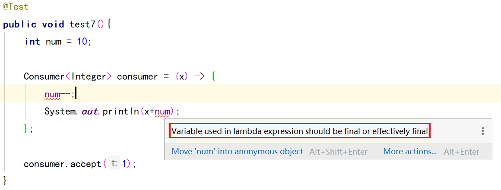
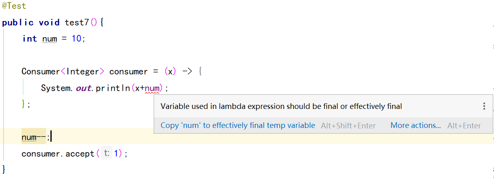

# Java基础— —Lambda表达式

本文主要介绍Lambda表达式。

[toc]

## 一、函数式接口

函数式接口(Functional Interface)就是一个有且仅有一个抽象方法，但是可以有多个非抽象方法的接口。

我们可以使用注解`@FunctionalInterface`一个接口为函数式接口。

函数式接口可以被隐式转换为 lambda 表达式。

Java 8种新增的函数式接口在包`java.util.function`中。


## 二、Lambda表达式是什么

Lambda表达式是一个代码块，以及必须传入代码的变量规范。

就我的理解而言，Lambda表达式是一种语法糖，实现函数式接口的代替。

使用 Lambda 表达式可以使代码变的更加简洁紧凑。


## 三、Lambda表达式的基础使用

Lambda表达式的语法格式如下：

```java
(参数列表) -> {方法体};
```

注意：

- 如果可以推导出一个lambda表达式的参数类型，则参数可以不用注明参数类型；
- 无须指定lambda表达式的返回值类型；lambda表达式的返回类型总是会由上下文推导得出。
- 如果方法只有一个参数，则可以省略小括号；
- 如果方法体只有一行，则可以省略大括号；
- 即使lambda表达式没有参数，也要提供空括号，就像无参数方法一样；
- 如果一个lambda表达式只在某些分支返回一个值，而另外一些分支不返回值，这是不合法的；

**虽然规定在特殊条件下可以省略括号或大括号，但建议不要省略。**


## 四、实例

本节说明具体的lambda表达式如何书写。

### 3.1 没有参数、无返回值

函数式接口`Runnable`只有一个抽象方法`void run()`。

```java
@Test
public void test1(){
    Runnable runnable = () -> {
        System.out.println("我是runnable接口中的方法run()的实现");
    };

    runnable.run();
}
```


### 3.2 一个参数、无返回值

接口`Consumer<T>`只有一个抽象方法`void accept(T t)`。

```java
public void test2(){
    Consumer<Integer> consumer = (x) -> {
        System.out.println(x);
    };

    consumer.accept(1);
}
```


### 3.3 多个参数、无返回值

接口`BiConsumer<T, U>`有一个抽象方法`void accept(T t, U u)`。

```java
@Test
public void test3(){
    BiConsumer<String,String> biConsumer = (x,y) -> {
        System.out.println(x);
        System.out.println(y);
    };

    biConsumer.accept("你好，世界！","Hello world!");
}
```


### 3.4 没有参数、有返回值

接口`Supplier<T>`有一个抽象方法`T get()`。

```java
@Test
public void test4(){
    Supplier<String> stringSupplier = () -> {
        return "你好";
    };

    String s = stringSupplier.get();
    System.out.println(s);
}
```


### 3.5 一个参数、有返回值

接口`Predicate<T>`有一个抽象方法`boolean test(T t)`。

```java
@Test
public void test5(){
    Predicate<String> predicate = (s) -> {
        return s.length() > 0;
    };

    boolean test1 = predicate.test("hello");
    System.out.println(test1);

    boolean test2 = predicate.test("");
    System.out.println(test2);
}
```


### 3.6 多个参数、有返回值

接口`BiPredicate<T, U>`有一个抽象方法`boolean test(T t, U u)`。

```java
@Test
public void test6(){
    BiPredicate<String,String> biPredicate = (x,y) -> {
        return x.length() > y.length();
    };

    boolean test1 = biPredicate.test("hello", "helloo");
    System.out.println(test1);

    boolean test2 = biPredicate.test("world", "word");
    System.out.println(test2);
}
```


## 五、变量作用域

### 5.1 自由变量

lambda表达式有三个部分：

- 一个代码块
- 参数
- 自由变量的值，自由变量是指非参数而且不在代码中定义的变量

换句话说，自由变量就是引用外部的局部变量。引用的局部变量为必须实际上是事实最终变量，即这个变量初始化后就不会再为它赋新值。也就说有以下两种含义：

- 在lambda表达式中，不能改变自由变量的值；
- 在lambda外部不能改变自由变量的值；

总之，lambda表达式引用的外部变量是`final`的，就算没有声明为`final`，但隐式的具有`final`。

```java
@Test
public void test7(){
    int num = 10;

    Consumer<Integer> consumer = (x) -> {
        System.out.println(x+num);
    };

    consumer.accept(1);
}
```

如果在lambda表达式中改变自由变量的值，无法通过编译：



如果在lambda表达式外部改变自由变量的值，同样无法通过编译：




### 5.2 this关键字

在一个lambda表达式中使用`this`关键字时，是指创建这个lambda表达式的方法的`this`参数。

```java
@Test
public void test8(){
    Consumer<Integer> consumer =
        (x) -> {
        System.out.println(this.getClass().getName());
        System.out.println(x);
    };

    consumer.accept(1);
}
```

结果：

```txt
com.lee._lambda
1
```


## 六、参考资料

[1] 菜鸟教程-函数式接口：https://www.runoob.com/java/java8-functional-interfaces.html

[2] 菜鸟教程-lambda表达式：https://www.runoob.com/java/java8-lambda-expressions.html

[3] 《Java核心技术 卷Ⅰ-基础知识（原书第11版）》-第六章