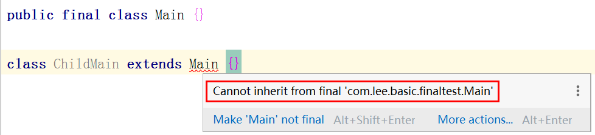

# Java基础— —final关键字的作用

在Java中，`final`关键字可用于修饰变量、方法和类，本文主要介绍`final`关键字的作用。

[toc]

## 一、修饰变量

在Java中，对于一个`final`变量，如果是基本数据类型的变量，则其数值一旦在初始化之后便不能更改；如果是引用类型的变量，则在对其初始化之后便不能再让其指向另一个对象，但是可以修改所指向对象的属性值。

## 二、修饰方法

如果用`final`修饰方法，则表示该方法不能被重写。

## 三、修饰类

如果用`final`修饰类，表示该类不能被继承。

### 

