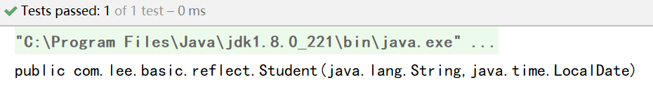
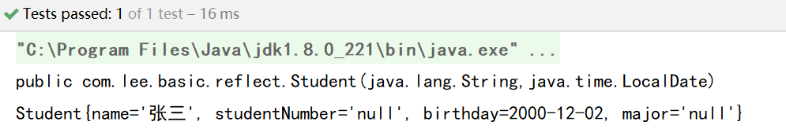

# Java基础— —反射

本文主要介绍Java反射相关知识。

[toc]

## 一、什么是反射

> Java 反射机制在程序**运行时**，对于任意一个类，都能够知道这个类的所有属性和方法；对于任意一个对象，都能够调用它的任意一个方法和属性。这种 **动态的获取信息** 以及 **动态调用对象的方法** 的功能称为 **java 的反射机制**。


## 二、获取Class对象

一般通过下述三种方法获取相应的Class对象：

- Class.forName("全限定类名")

- 类.class

- 对象.getClass()

同一个类的只有一个Class对象。


## 三、使用Class对象

### 3.1 获取类名

我们可以使用Class对象的`getName()`方法获取类名。


### 3.2 获取成员变量

当创建了一个Class对象后，我们可以使用以下方法获取成员变量：

|               方法 声明               |                     解释                     |
| :-----------------------------------: | :------------------------------------------: |
|     `Field getField(String name)`     |   获取指定名称的**公共(public)**成员变量。   |
|         `Field[] getFields()`         |     获取所有的**公共(public)**成员变量。     |
| `Field getDeclaredField(String name)` | 获取指定名称的成员变量，不再限制访问修饰符。 |
|     `Field[] getDeclaredFields()`     |   获取所有的成员变量，不再限制访问修饰符。   |

当获取成员变量对象后

- 可以通过`get(Object obj)`获取相应对象的值
- 也可以通过`set(Object obj,Object value)`设置相应对象的值。注意，如果修改私有成员变量，需要先忽略访问权限修饰符的安全检查，使用`Field`的方法`setAccessible(true)`进行设置。


### 3.3 获取构造方法

当创建了一个Class对象后，我们可以使用以下方法获取构造方法：

|                          方法 说明                           |                         解释                         |
| :----------------------------------------------------------: | :--------------------------------------------------: |
| `Constructor<T> getConstructor(Class<?>... parameterTypes)`  |         获取指定参数类型的**公共构造方法**。         |
|             `Constructor<?>[] getConstructors()`             |             获取所有的**公共构造方法**。             |
| `Constructor<T> getDeclaredConstructor(Class<?>... parameterTypes)` | 获取指定参数类型的任意构造方法，不再限制访问修饰符。 |
|         `Constructor<?>[] getDeclaredConstructors()`         |        获取所有的构造方法，不再限制访问修饰符        |

下面通过例子来解释什么是指定参数类型的构造方法：

首先声明一个`Student`类：

```java
package com.lee.basic.reflect;

import java.time.LocalDate;

public class Student {
    private String name;               //姓名
    private String studentNumber;      //学号
    private LocalDate birthday;     //出生日期
    private String major;           //专业

    //无参构造函数
    public Student() { }
    
    //全参构造函数
    public Student(String name, String studentNumber, LocalDate birthday, String major) {
        this.name = name;
        this.studentNumber = studentNumber;
        this.birthday = birthday;
        this.major = major;
    }
    
    //有姓名和出生日期的构造函数
    public Student(String name, LocalDate birthday) {
        this.name = name;
        this.birthday = birthday;
    }
    
    //有姓名和学号的构造函数
    public Student(String name, String studentNumber) {
        this.name = name;
        this.studentNumber = studentNumber;
    }
    
    @Override
    public String toString() {
        return "Student{" +
                "name='" + name + '\'' +
                ", studentNumber='" + studentNumber + '\'' +
                ", birthday=" + birthday +
                ", major='" + major + '\'' +
                '}';
    }
}

```

在测试方法中测试通过反射获取构造方法：

```java
/**
     * 测试通过反射获取构造方法
     */
@Test
public void testGetConstructor() throws NoSuchMethodException {
    Class<Student> studentClass = Student.class;
    Constructor<Student> constructor = studentClass.getConstructor(String.class, LocalDate.class);
    System.out.println(constructor);
}
```

结果：



由于构造方法名都是与类名相同，为了区分不同的构造方法，需要指定参数类型，就是指定要获取的构造方法的参数类型。

当我们获取了构造方法后，可以通过构造方法对象的`newInstance()`创建相应的类对象，参数即为类对象创建时需要传递的参数值。

```java
T newInstance(Object... initargs)  
```

测试方法：

```java
/**
     * 测试通过反射获取构造方法
     */
@Test
public void testGetConstructor() throws Exception {
    Class<Student> studentClass = Student.class;
    //获取构造方法对象
    Constructor<Student> constructor = studentClass.getConstructor(String.class, LocalDate.class);
    System.out.println(constructor);
    //构造学生对象
    Student student = constructor.newInstance("张三", LocalDate.of(2000, 12, 2));
    System.out.println(student);
}
```

结果：




### 3.4 获取成员方法

当创建了一个Class对象后，我们可以使用以下方法获取成员方法：

|                          方法 声明                           |                          方法 解释                           |
| :----------------------------------------------------------: | :----------------------------------------------------------: |
| `Method  getMethod(String name,  Class<?>... parameterTypes)` |    获取**指定方法名称**和**参数类型**的**公共成员方法**。    |
|                   `Method[]  getMethods()`                   |                 获取**所有的公共成员方法**。                 |
| `Method  getDeclaredMethod(String name,  Class<?>... parameterTypes)` | 获取**指定方法名称**和**参数类型**的**成员方法**，不再限制访问修饰符。 |
|               `Method[]  getDeclaredMethods()`               |       获取**所有的公共成员方法**，不再限制访问修饰符。       |

当获取方法后，可以通过`invoke()`执行该方法。

```java
Object invoke(Object obj, Object... args)  
```

可以通过`getName()`获取方法名称。