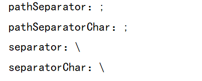
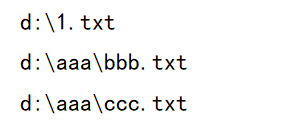
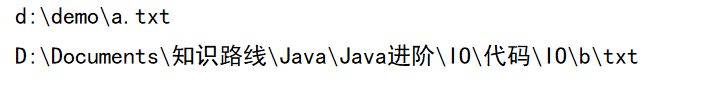
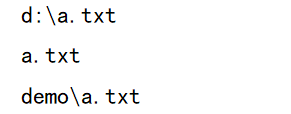
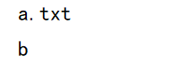
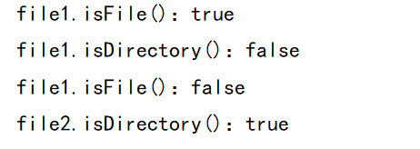
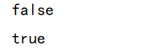
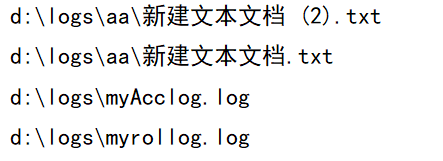
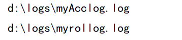

# Java进阶— —IO：File类

本文主要介绍`File`类的使用。

[toc]

## 一、概述

`java.io.File` 类是**文件和目录（文件夹）路径名**的抽象表示，主要用于文件和目录的创建、查找和删除等操作。


## 二、静态常量

在`File`类中，定义了四个类静态常量，分别为：

- `public static final String pathSeparator`：与系统有关的路径分隔符，以字符串表示
- `public static final char pathSeparatorChar`：与系统有关的路径分隔符，以字符表示
- `public static final String separator`：与系统有关的名称分隔符，以字符串表示
- `public static final char separatorChar`：与系统有关的名称分隔符，以字符表示

解释什么是路径分隔符以及名称分隔符：

现有数个文件路径`d:\a.txt;c:\b.png`，则在路径分隔符为分号`;`，名称分隔符为反斜杠`\`，这些都是在Windows系统下的，如果在Linux系统下，路径分隔符为冒号`:`，名称分隔符为正斜杠`/`。

```java
@Test
public void test01(){
    String pathSeparator = File.pathSeparator;
    char pathSeparatorChar = File.pathSeparatorChar;
    System.out.println("pathSeparator："+pathSeparator);
    System.out.println("pathSeparatorChar："+pathSeparatorChar);

    String separator = File.separator;
    char separatorChar = File.separatorChar;
    System.out.println("separator："+separator);
    System.out.println("separatorChar："+separatorChar);
}
```




## 三、构造方法

- `public File(String pathname) `：通过将给定的路径名字符串来创建 File实例，可以是绝对路径，也可以是相对路径。
- `public File(String parent, String child) `：从父路径名字符串和子路径名字符串创建 File实例。
- `public File(File parent, String child) `：从父抽象路径名和子路径名字符串创建 File实例。
- `public File(URI uri)`：从URI创建File实例。

实例演示：

```java
@Test
public void test01(){
    //注意转义字符串  \\
    
    // File(String pathname)
    File file1 = new File("d:\\1.txt");
    // File(String parent, String child)
    File file2 = new File("d:\\aaa","bbb.txt");
    // File(File parent, String child)
    File parent = new File("d:\\aaa");
    File file3 = new File(parent,"ccc.txt");

    System.out.println(file1);
    System.out.println(file2);
    System.out.println(file3);
}
```



**注意：**

1. 一个File对象代表硬盘中实际存在的一个文件或者目录。
2. 无论该路径下是否存在文件或者目录，都不影响File对象的创建。


## 四、常用方法

### 4.1 getAbsolutePath()

`public String getAbsolutePath()`：返回`File`对象的**绝对路径**字符串。

```java
@Test
public void test01(){
    // 利用绝对路径创建File
    File file1 = new File("d:\\demo\\a.txt");
    String absolutePath1 = file1.getAbsolutePath();
    System.out.println(absolutePath1);

    // 利用相对路径创建File
    File file2 = new File("b/txt");
    String absolutePath2 = file2.getAbsolutePath();
    System.out.println(absolutePath2);
}
```




### 4.2 getPath()

`public String getPath()`：返回`File`对象的路径名字符串，即创建该对象的构造方法的参数值

```java
@Test
public void test02(){
    File file1 = new File("d:\\a.txt");
    File file2 = new File("a.txt");
    File file3 = new File("demo","a.txt");
    System.out.println(file1.getPath());
    System.out.println(file2.getPath());
    System.out.println(file3.getPath());
}
```




### 4.3 getName()

`public String getName()`：返回`File`表示的文件或目录的名称

```java
@Test
public void test03(){
    File file1 = new File("d:\\a.txt");
    File file2 = new File("b");
    System.out.println(file1.getName());
    System.out.println(file2.getName());
}
```




### 4.4 length()

`public long length()`：返回`File`对象表示的文件大小，以字节为单位

- 文件夹是没有大小的，所以不能获取文件夹的大小
- 如果该`File`对象所表示的文件不存在磁盘，则返回0

```java
@Test
public void test04(){
    // 文件存在
    File file1 = new File("d:\\logs\\myfile.log");
    // 文件不存在
    File file2 = new File("d:\\a.txt");
    // 文件夹
    File file3 = new File("d:\\logs");

    System.out.println(file1.length());
    System.out.println(file2.length());
    System.out.println(file3.length());
}
```


API中说明：length()，表示文件的长度。但是File对象表示目录，则返回值未指定。


### 4.5 exists()

`public boolean exists()` ：判断`File`对象表示的文件或目录是否实际存在。

```java
@Test
public void test05(){
    // 文件存在
    File file1 = new File("d:\\logs\\myfile.log");
    // 文件不存在
    File file2 = new File("d:\\logs\\myfile1.log");

    System.out.println(file1.exists());
    System.out.println(file2.exists());
}
```


### 4.6 isDirectory()和isFile()

- `public boolean isDirectory()` ：判断`File`表示的是否为目录。
- `public boolean isFile()` ：判断`File`表示的是否为文件。

```java
@Test
public void test06(){
    File file1 = new File("d:\\logs\\myfile.log");   //文件
    File file2 = new File("d:\\logs");                //目录

    System.out.println("file1.isFile()："+file1.isFile());
    System.out.println("file1.isDirectory()："+file1.isDirectory());
    System.out.println("file1.isFile()："+file2.isFile());
    System.out.println("file2.isDirectory()："+file2.isDirectory());
}
```




### 4.7 createNewFile()

`public boolean createNewFile()` ：当且仅当`File`对象表示的文件尚不存在时，创建一个新的空文件，创建成功返回`true`，创建失败返回`false`

```java
@Test
public void test07() throws IOException {
    File file1 = new File("d:\\logs\\myfile1.log");   // 不存在的文件
    boolean newFile1 = file1.createNewFile();
    System.out.println(newFile1);

    File file2 = new File("d:\\logs\\myfile.log");   // 存在的文件
    boolean newFile2 = file2.createNewFile();
    System.out.println(newFile2);
}
```


### 4.8 delete()

`public boolean delete()` ：删除由此File表示的文件或目录，删除成功返回`true`，删除失败返回`false`

```java
@Test
public void test08() throws IOException {
    File file1 = new File("d:\\logs\\myfile1.log");   // 不存在的文件
    boolean newFile1 = file1.delete();
    System.out.println(newFile1);

    File file2 = new File("d:\\logs\\myfile.log");   // 存在的文件
    boolean newFile2 = file2.delete();
    System.out.println(newFile2);
}
```


### 4.9 mkdir()和mkdirs()

- `public boolean mkdir() `：创建由此File表示的目录，如果其父目录不存在，则创建失败。
- `public boolean mkdirs()` ：创建由此File表示的目录，包括任何必需但不存在的父目录。

```java
@Test
public void test09(){
    // d:\demo不存在
    File file1 = new File("d:\\demo\\aaa");
    boolean flag1 = file1.mkdir();
    boolean flag2 = file1.mkdirs();

    System.out.println(flag1);
    System.out.println(flag2);
}
```




### 4.10 list()和listFiles()

- `public String[] list()` ：返回一个String数组，表示该`File`目录中的所有子文件或目录。

- `public File[] listFiles()` ：返回一个File数组，表示该`File`目录中的所有的子文件或目录。

```java
@Test
public void test10(){
    File file = new File("d:\\logs");
    // list()
    String[] listString = file.list();
    for (String s:listString){
        System.out.println(s);
    }
    // listFiles()
    File[] files = file.listFiles();
    for (File f : files) {
        System.out.println(f);
    }
}
```


这两个方法都不会递归地查询子目录。

调用listFiles方法的File对象，表示的必须是实际存在的目录，否则返回null，无法进行遍历。


## 五、递归查询目录结构

案例，给定一个目录，打印其子文件及子目录。

分析，由于`list()`和`listFiles()`不会递归查询子目录，所以需要我们递归查询。

```java
@Test
public void test01(){
    File file = new File("d:\\logs");
    printDir(file);
}

public static void printDir(File file){
    File[] files = file.listFiles();
    for (File f : files) {
        if (f.isFile()){
            System.out.println(f.getAbsolutePath());
        }else {
            printDir(f);
        }
    }
}
```




## 六、FileFilter和FilenameFilter

`FileFilter`和`FilenameFilter`是文件过滤器，用于以下`File`的查询方法：

```java
public File[] listFiles(FileFilter filter)
    
public String[] list(FilenameFilter filter)
public File[] listFiles(FilenameFilter filter)
```

`FileFilter`的源码：

```java
@FunctionalInterface
public interface FileFilter {

    /**
     * Tests whether or not the specified abstract pathname should be
     * included in a pathname list.
     *
     * @param  pathname  The abstract pathname to be tested
     * @return  <code>true</code> if and only if <code>pathname</code>
     *          should be included
     */
    boolean accept(File pathname);
}

```

`public File[] listFiles(FileFilter filter)`的源码：

```java
public File[] listFiles(FileFilter filter) {
    String ss[] = list();
    if (ss == null) return null;
    ArrayList<File> files = new ArrayList<>();
    for (String s : ss) {
        File f = new File(s, this);
        if ((filter == null) || filter.accept(f))
            files.add(f);
    }
    return files.toArray(new File[files.size()]);
}
```

即只有符和过滤器中方法规则的`File`才会被返回。

案例：返回目录中大小为0的文件

```java
public class FileFilterTest {
    public static void main(String[] args) {
        File file = new File("d:\\logs");
        File[] files = file.listFiles(new MyFileFilter());
        for (File f : files) {
            System.out.println(f);
        }
    }
}

class MyFileFilter implements FileFilter{
    @Override
    public boolean accept(File pathname) {
        if (pathname.length() == 0) return true;
        return false;
    }
}
```


目录`d:\logs`在磁盘中的信息如下：


`FilenameFilter`的源码：

```java
@FunctionalInterface
public interface FilenameFilter {
    /**
     * Tests if a specified file should be included in a file list.
     *
     * @param   dir    the directory in which the file was found.
     * @param   name   the name of the file.
     * @return  <code>true</code> if and only if the name should be
     * included in the file list; <code>false</code> otherwise.
     */
    boolean accept(File dir, String name);
}
```

`public File[] listFiles(FilenameFilter filter)`的源码：

```java
public File[] listFiles(FilenameFilter filter) {
    String ss[] = list();
    if (ss == null) return null;
    ArrayList<File> files = new ArrayList<>();
    for (String s : ss)
        if ((filter == null) || filter.accept(this, s))
            files.add(new File(s, this));
    return files.toArray(new File[files.size()]);
}
```

通过分析这两份源码，则可以知道方法`boolean accept(File dir, String name);`中的参数表示什么意思：

- `dir`表示调用方法`listFiles(FilenameFilter filter)`的`File`对象；
- `name`表示`File`目录下的文件名

案例：查询目录`d:\logs`中所有以`.log`结尾的文件。

```java
public class FilenameFilterTest {
    public static void main(String[] args) {
        File file = new File("d:\\logs");
        File[] files = file.listFiles(new MyFilenameFilter());
        for (File f : files) {
            System.out.println(f);
        }
    }
}

class MyFilenameFilter implements FilenameFilter{

    @Override
    public boolean accept(File dir, String name) {
        return name.endsWith(".log") ;
    }
}
```



目录`d:\logs`在磁盘中的信息如下，增加了一些文件：

