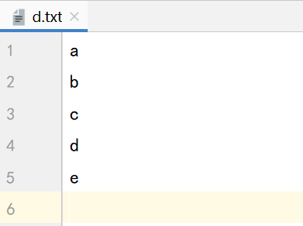

# Java进阶— —IO：字节流

本文主要介绍字节流的相关知识。

[toc]

## 一、顶级父类

输入输出流分为字节流和字符流，其顶级父类分别为：


`OutputStream`为抽象类，继承了该类的的子类有以下几个，表明输出流的目的：

```java
ByteArrayOutputStream
FileOutputStream
FilterOutputStream,
ObjectOutputStream
PipedOutputStream 
```

`InputStream`也为抽象类，继承了该类的的子类有以下几个，表名输入流的来源：

```java
AudioInputStream
ByteArrayInputStream
FileInputStream 
FilterInputStream
ObjectInputStream
PipedInputStream 
SequenceInputStream
StringBufferInputStream 
```


## 二、字节输出流

### 2.1 OutputStream

`java.io.OutputStream` 抽象类是表示字节输出流的所有类的超类，将指定的字节信息输出到目的地。它定义了字节输出流的基本共性功能方法。

- `public void close() `：关闭此输出流并释放与此流相关联的任何系统资源。
- `public void flush() `：刷新此输出流并强制任何缓冲的输出字节被写出。
- `public void write(byte[] b) `：将 b.length个字节从指定的字节数组写入此输出流中。
- `public void write(byte[] b, int off, int len) `：从指定的字节数组b从偏移量 off开始写入len个字节，输出到此输出流。
- `public abstract void write(int b) `：向输出流写入一个字节。要写入的字节是参数 b 的8个低位。b 的 24 个高位将被忽略。

当完成流的操作时，必须调用`close()`方法，释放系统资源


### 2.2 FileOutputStream

`java.io.FileOutputStream` 类是文件输出流，用于将数据写出到文件。

其构造方法如下：

- `public FileOutputStream(File file)` ：由指定的`File`对象创建文件输出流以写入该文件。
- `public FileOutputStream(String name) `：以指定的名称创建文件输出流以写入该名称表示的文件。

当你创建一个流对象时，必须传入一个文件路径。该路径下，如果没有这个文件，会创建该文件。如果有这个文
件，会清空这个文件的数据。

如果想要保留原文件中的数据，并追加写入数据，则可以使用构造方法：

- `public FileOutputStream(File file, boolean append) `： 创建文件输出流以写入由指定的 File对象表示的文件。
- `public FileOutputStream(String name, boolean append)` ： 创建文件输出流以指定的名称写入文件。

这两个构造方法，参数中都需要传入一个boolean类型的值， true 表示追加数据， false 表示清空原有数据。这样创建的输出流对象，就可以指定是否追加数据了。


#### 2.2.1 输出数据

本节演示如何输出数据到指定文件中

首先使用`write(int b)`方法输出一个字节：

```java
@Test
public void test01() throws IOException {
    // 1. 创建FileOutputStream 对象
    FileOutputStream fos = new FileOutputStream("src\\bytestream\\a.txt");
    // 2. 调用write(int b)写入数据
    fos.write(97);
    // 3. 关闭资源
    fos.close();
}
```

结果，a.txt文件中的内容为：


然后可以使用`write(byte[] b)`输出字节数组：

```java
@Test
public void test02() throws IOException {
    // 1. 创建FileOutputStream 对象
    FileOutputStream fos = new FileOutputStream("src\\bytestream\\b.txt");
    // 2. 调用write(byte[] b) 写入数据
    fos.write("大家好（hello everyone）".getBytes());
    // 3. 关闭资源
    fos.close();
}
```


我们也可以使用`write(byte[] b,int offset,int len)`来输出字节：

```java
@Test
public void test03() throws IOException {
    // 1. 创建FileOutputStream 对象
    FileOutputStream fos = new FileOutputStream("src\\bytestream\\c.txt");
    // 2. 调用write(byte[] b,int offset,int len) 写入数据
    byte[] bytes = "大家好（hello everyone）".getBytes();
    fos.write(bytes,5,10);
    // 3. 关闭资源
    fos.close();
}
```


由于文件编码的原因，所以可能出现乱码。


#### 2.2.2 换行

Windows系统里，换行符号是 `\r\n` 。

案例，以追加的形式输出“abcde"，并且每个字母占据一行。

```java
@Test
public void test04() throws IOException {
    // 1. 创建FileOutputStream 对象,追加形式
    FileOutputStream fos = new FileOutputStream("src\\bytestream\\d.txt", true);
    // 2. 调用write() 写入数据
    byte[] bytes = "abcde".getBytes();
    for (int i = 0; i < bytes.length; i++) {
        fos.write(bytes[i]);
        // 换行
        fos.write("\r\n".getBytes());
    }
    // 3. 关闭资源
    fos.close();
}
```



回车符 `\r` 和换行符`\n` ：

- 回车符：回到一行的开头（return）。
- 换行符：下一行（newline）。

系统中的换行：
- Windows系统里，每行结尾是 回车+换行 ，即 `\r\n` ；
- Unix系统里，每行结尾只有 换行 ，即 `\n` ；
- Mac系统里，每行结尾是 回车 ，即 `\r` 。从 Mac OS X开始与Linux统一。


## 三、字节输入流

### 3.1 InputStream

`java.io.InputStream` 抽象类是表示字节输入流的所有类的超类，可以读取字节信息到内存中。它定义了字节输入流的基本共性功能方法。

- `public void close() `：关闭此输入流并释放与此流相关联的任何系统资源。
- `public abstract int read()` ： 从输入流读取下一个字节数据。
- `public int read(byte[] b)` ： 从输入流中读取一些字节数据，并将它们存储到字节数组 b中 。

当完成流的操作时，必须调用`close()`方法，释放系统资源。


### 3.2 FileInputStream

`java.io.FileInputStream `类是文件输入流，从文件中读取字节。

其构造方法如下：

- `publci FileInputStream(File file) `： 通过打开与实际文件的连接来创建一个 `FileInputStream`对象 ，该文件由 `File`对象指定。
- `public FileInputStream(String name) `： 通过打开与实际文件的连接来创建一个 `FileInputStream` ，该文件由路径名` name`命名。

当你创建一个流对象时，必须传入一个文件路径。该路径下，如果没有该文件,会抛出 `FileNotFoundException `异常。

#### 3.2.1 读取数据

读取一个字节的数据：

首先在项目下创建e.txt文件，内容为：


```java
@Test
public void test01() throws IOException {
    // 1.创建FileInputStream对象
    FileInputStream fis = new FileInputStream("src\\bytestream\\e.txt");
    // 2.读取一个字节
    int i = fis.read();
    System.out.println(i);
    // 3. 关闭资源
    fis.close();
}
```

结果：


`read()`方法每次读取一个字节的数据，并将其转换为int类型。如果读取到文件末尾，返回 -1 。

循环读取一个文件的所有内容：

```java
@Test
public void test02() throws IOException {
    // 1.创建FileInputStream对象
    FileInputStream fis = new FileInputStream("src\\bytestream\\e.txt");
    // 2.读取一个字节
    int ch;
    while ((ch = fis.read())!=-1){
        System.out.print((char)ch);
    }
    // 3. 关闭资源
    fis.close();
}
```


使用`read(byte[] b)`,每次读取b的长度个字节到数组b中，返回读取到的有效字节个数，读取到末尾时，返回-1.

```java 
@Test
public void test03() throws IOException {
    // 1.创建FileInputStream对象
    FileInputStream fis = new FileInputStream("src\\bytestream\\e.txt");  //内容为abc
    // 2.每次读取两个字节的数据
    byte[] bytes = new byte[2];
    int len;
    while ((len = fis.read(bytes)) != -1) {
        System.out.println(new String(bytes));
    }
    // 3. 关闭资源
    fis.close();
}
```

结果为：


错误数据 `cb` ，是由于最后一次读取时，只读取一个字节` c` ，数组中，上次读取的数据没有被完全替换，所以要通过 `read(byte[] b)`的返回值`len` ，获取每次读取的字节数，代码使用演示：

```java
@Test
public void test04() throws IOException {
    // 1.创建FileInputStream对象
    FileInputStream fis = new FileInputStream("src\\bytestream\\e.txt");  //abc
    // 2.每次读取两个字节的数据
    byte[] bytes = new byte[2];
    int len;
    while ((len = fis.read(bytes)) != -1) {
        System.out.println(new String(bytes,0,len));
    }
    // 3. 关闭资源
    fis.close();
}
```


## 四、复制图片

利用`FileOutputStream`和`FileInputStream`复制图片。

```java	
public static void main(String[] args) throws IOException {
    // 图片源地址
    FileInputStream fis = new FileInputStream("D:\\Pictures\\照片\\一些图片\\1.jpg");
    // 图片目的地址
    FileOutputStream fos = new FileOutputStream("src\\bytestream\\1.jpg");
    // 每次从输入流读取数据，然后写入输出流
    byte[] bytes = new byte[1024];
    int len;
    while ((len=fis.read(bytes)) != -1){
        fos.write(bytes,0,len);
    }
    // 关闭资源
    fis.close();
    fos.close();
}
```


