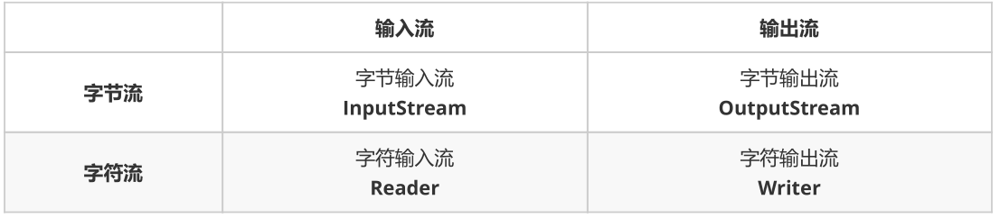
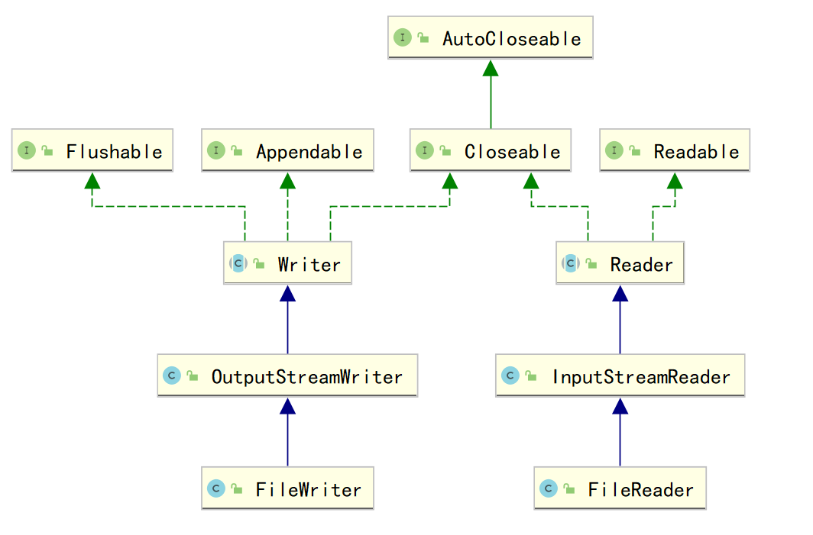
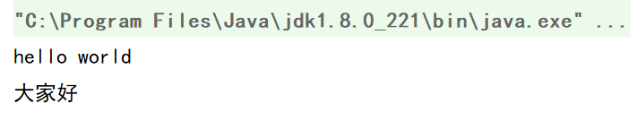

# Java进阶— —IO：字符流

本文主要介绍字符流。字符流，只能操作文本文件，不能操作图片、视频等非文本文件。

[toc]

## 一、字符流的顶级父类

输入输出流分为字节流和字符流，其顶级父类分别为：



`Reader`是一个抽象类，其主要的子类有：

```java
BufferedReader
CharArrayReader 
FilterReader 
InputStreamReader 
PipedReader 
StringReader 
```

`Writer`也是一个抽象类，其主要的子类有：

```java
BufferedWriter
CharArrayWriter
FilterWriter 
OutputStreamWriter 
PipedWriter 
PrintWriter 
StringWriter 
```

本文主要基于`FileReader`和`FileWriter`来介绍字符流的使用。其与`Reader`和`Writer`的关系为：



`FileReader`和`FileWriter`并不是`Reader`和`Writer`的直接子类。


## 二、字符输出流

### 2.1 Writer

`java.io.Writer` 抽象类是表示用于输出字符流的所有类的超类，将指定的字符信息写出到目的地。它定义了字节输出流的基本共性功能方法。

- `void write(int c)` ：输出单个字符。
- `void write(char[] cbuf)` ：输出字符数组。
- `abstract void write(char[] cbuf, int off, int len)` ：输出字符数组的某一部分,off为数组的开始索引,len为输出的字符个数。
- `void write(String str)` ：输出字符串。
- `void write(String str, int off, int len) `：输出字符串的某一部分,off为字符串的开始索引,len为输出的字符个数。
- `void flush()` ：刷新该流的缓冲。
- `void close()` ：关闭此流，但要先刷新它。


### 2.2 FileWriter

`java.io.FileWriter` 类是输出字符到文件的类。构造时使用系统默认的字符编码和默认字节缓冲区。

#### 2.2.1 构造方法

其构造方法如下：

- `FileWriter(File file) `： 创建一个 `FileWriter` 对象，给定要输出的 `File` 对象。
- `FileWriter(String fileName) `： 创建一个 `FileWriter` 对象，给定要输出的文件的名称。
- `FileWriter(File file, boolean append)` ：创建一个`FileWriter` 对象，给定给定要输出的 `File` 对象和是否续写。
- `FileWriter(String fileName, boolean append) `：创建一个`FileWriter` 对象，给定要输出的文件的名称和是否续写。

如果指定的文件不存在，则会自动创建。

#### 2.2.2 输出数据

我们可以使用父类`Writer`的输出方法，将字符数据输出到文件中，其步骤如下：

1. 创建`FileWriter`对象，构造方法中传入数据的目的地
2. 使用方法`write()`，把数据写入到内存缓冲区（字符转换为字节）
3. 使用方法`flush()`，将内存缓冲区中的数据，刷新到文件中
4. 使用方法`close()`释放资源，关闭字符输出流，会先把内存缓冲区中的数据刷新到文件中

```java
@Test
public void test01() throws IOException {
    // 1. 创建FileWriter对象
    FileWriter fw = new FileWriter("src\\charstream\\a.txt");
    // 2. 输出数据
    fw.write(97);    //write(int b)
    fw.write(new char[]{'大','家','好'});    //write(char[] c)
    fw.write(new char[]{'大','家','好'},0,1);   //write(char[] c,int off,int len)
    fw.write("\r\n大家一起来学习字符流");    //fw.write(String str)
    fw.write("\r\n大家一起来学习字符流",0,5);    //fw.write(String str,int off.int len)
    // 3. 刷新
    fw.flush();
    // 4. 关闭资源
    fw.close();
}
```

结果：

```txt
a大家好大
大家一起来学习字符流
大家一
```


#### 2.2.3 flush()和close()

- `flush()` ：刷新缓冲区，流对象可以继续使用。
- `close()` ：先刷新缓冲区，然后通知系统释放资源。流对象不可以再被使用了。

```java
@Test
public void test02() throws IOException {
    // 使用文件名称创建流对象
    FileWriter fw = new FileWriter("src\\charstream\\b.txt");
    // 写出数据，通过flush
    fw.write('刷'); // 写出第1个字符
    fw.flush();
    fw.write('新'); // 继续写出第2个字符，写出成功
    fw.flush();
    // 写出数据，通过close
    fw.write('关'); // 写出第1个字符
    fw.close();
    fw.write('闭'); // 继续写出第2个字符,【报错】java.io.IOException: Stream closed
    fw.close();
}
```

b.txt的结果：

```txt
刷新关
```


## 三、字符输入流

### 3.1 Reader

`java.io.Reader` 抽象类是表示用于读取字符流的所有类的超类，可以读取字符信息到内存中。它定义了字符输入流的基本共性功能方法：

- `public void close()` ：关闭此流并释放与此流相关联的任何系统资源。
- `public int read()` ： 从输入流读取一个字符，返回读取的字符数，如果没有读取到字符，返回-1。
- `public int read(char[] cbuf)` ： 从输入流中读取一些字符，并将它们存储到字符数组 cbuf中 ，返回读取的字符数，如果没有读取到字符，返回-1。


### 3.2 FileReader

`java.io.FileReader` 类是读取字符文件的类。构造时使用系统默认的字符编码和默认字节缓冲区。

#### 3.2.1 构造方法

其构造方法如下：

- `FileReader(File file)` ： 创建一个新的 FileReader ，给定要读取的File对象。
- `FileReader(String fileName)` ： 创建一个新的 FileReader ，给定要读取的文件的名称。

如果文件不存在，则会抛出异常`java.io.FileNotFoundException`。


#### 3.2.2 读取数据

c.txt的内容如下：

```txt
hello world
大家好
```


```java
@Test
public void test01() throws IOException {
    // 1. 创建FileReader 对象
    FileReader fr = new FileReader("src\\charstream\\c.txt");
    // 2. 读取数据
    char[] chars = new char[1024];
    int len;
    while ((len = fr.read(chars)) != -1) {
        // String的构造方法String(char[] c,int off,int len)
        System.out.println(new String(chars, 0, len));
    }
    // 3. 关闭资源
    fr.close();
}
```

结果：

