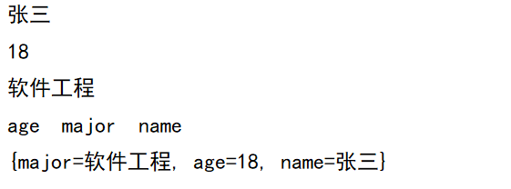
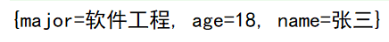

# Java进阶— —IO：属性集

本文主要介绍属性集`java.util.Properties `的相关知识。

[toc]

## 一、Properties类

`java.util.Properties` 继承于 `Hashtable` ，来表示一个持久的属性集。它使用键值结构存储数据，每个键及其对应值都是一个字符串。该类也被许多Java类使用，比如获取系统属性时， `System.getProperties` 方法就是返回一个 `Properties` 对象。

### 1.1 构造方法

`public Properties()` : 创建一个空的属性列表。


### 1.2 基本的存储方法

- `public Object setProperty(String key, String value)` ： 保存一组键值对。
- `public String getProperty(String key)` ：使用指定的键搜索属性值。
- `public Set<String> stringPropertyNames()` ：所有键的名称的集合。

```java
@Test
public void test01(){
    // 1. 创建Properties对象
    Properties properties = new Properties();
    // 2. 设置键值对
    properties.setProperty("name","张三");
    properties.setProperty("age","18");
    properties.setProperty("major","软件工程");
    // 3. 通过键获取值
    System.out.println(properties.getProperty("name"));
    System.out.println(properties.getProperty("age"));
    System.out.println(properties.getProperty("major"));
    // 4. 获取所有的键值
    Set<String> propertyNames = properties.stringPropertyNames();
    for (String str : propertyNames) {
        System.out.print(str+"  ");
    }
    // 5. 直接打印properties对象
    System.out.println("\n"+properties);
}
```

结果：




### 1.3 与流相关的方法

一个`Properties`对象可以对应一个`xxx.properties`文件，我们可以通过字节输入流将属性文件转换为对象。

- `public void load(InputStream inStream)` ： 从字节输入流中读取键值对。
- `public vodi load(Reader reader)`：从字符输入流读取键值对。

现有属性文件`test.properties`:

```properties
name=张三
age=18
major=软件工程
```

```java
@Test
public void test02() throws IOException {
    // 1. 创建Properties对象
    Properties properties = new Properties();
    // 2. 加载文件
    properties.load(new FileReader("src\\properties\\test.properties"));
    // 3. 获取键值对
    System.out.println(properties);
}
```



`xxx.properties`文件的编码采用`UTF-8`，如果使用字节流读取`xxx.properties`文件，则有中文乱码的情况。

>  文件的数据，必须是键值对形式，可以使用空格、等号、冒号等符号分隔。