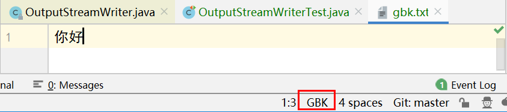

# Java进阶— —IO：转换流

本文主要介绍转换流的相关知识。

[toc]

## 一、转换流概述

转换流是指可以指定编码、解码的输入输出流。包括`InputStreamReader`和`OutputStreamWriter`。

我们之前学习的`FileReader`和`FileWriter`，其直接父类就是转换流，并且字符流是指使用默认编码解码的转换流，今天我们学习的转换流，可以自己指定编码解码。


## 二、转换流使用

### 2.1 OutputStreamWriter

`OutputStreamWriter`是字符通向字节的桥梁，可使用指定的编码`charset`将字符编码成字节。

其声明为：

```java
public class OutputStreamWriter extends Writer {
    ...
}
```

父类为`Writer`，可以使用父类的方法。

其构造方法有：

- `public OutputStreamWriter(OutputStream out)`：创建使用默认字符集（UTF-8）的字符输出流；
- `public OutputStreamWriter(OutputStream out, String charsetName)`：创建使用指定字符集的字符输出流，指定的字符集名称不区分大小写，可以是`utf-8/UTF-8`，`GBK/gbk`...

使用步骤：

1. 创建`OutputStreamWriter`对象，构造方法中传递字节输出流和指定的编码集名称；
2. 使用`OutputStreamWriter`对象中的方法`write()`，把字符写入字节存储缓冲区中(编码)；
3. 使用`OutputStreamWriter`对象中的方法`flush()`，把内存缓冲区中的字节刷新到文件中；
4. 释放资源；

案例：使用转换流写出数据`你好`，编码格式为`GBK`;

```java
@Test
public void test01() throws IOException {
	// 1.创建OutputStreamWriter对象
    OutputStreamWriter osw = new OutputStreamWriter(new FileOutputStream("src\\reversestream\\gbk.txt"),"gbk");
	// 2.write()写出数据
    osw.write("你好");
	// 3. flush()刷新
    osw.flush();
	// 4.关闭资源
    osw.close();
}
```




### 2.2 InputStreamReader

转换流 `java.io.InputStreamReader` ，是`Reader`的子类，是从字节流到字符流的桥梁。它读取字节，并使用指定的字符集将其解码为字符。它的字符集可以由名称指定，也可以接受平台的默认字符集。

```java
public class InputStreamReader extends Reader {
    ...
}
```

其构造方法有：

- `InputStreamReader(InputStream in)`： 创建一个使用默认字符集的字符输入流。
- `InputStreamReader(InputStream in, String charsetName)`： 创建使用指定字符集的字符输入流。

注意：构造方法中指定的编码表名称要和文件的编码相同,否则会发生乱码

使用步骤如下：

1. 创建`InputStreamReader`对象，构造方法中传递字节输入流和指定的编码表名称；

2. 使用`InputStreamReader`对象中的方法`read()`读取文件；
3. 释放资源；

案例：

```java
@Test
public void test01() throws IOException {
    // 1. 创建InputStreamReader对象，注意字符集一致
    InputStreamReader isr = new InputStreamReader(new FileInputStream("src\\reversestream\\gbk.txt"),"gbk");
    // 2. 读取数据
    int len;
    while ((len=isr.read())!=-1){
        System.out.println((char)len);
    }
    // 3. 关闭资源
    isr.close();
}
```


