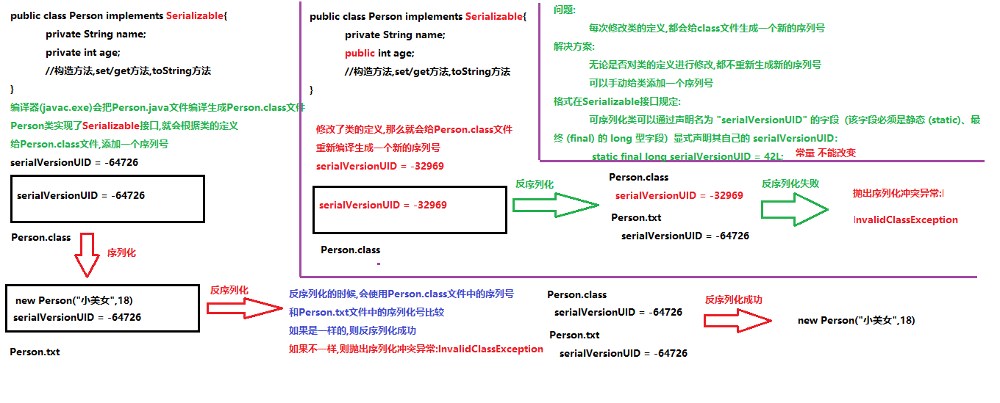

# Java进阶— —IO：序列化流

本文主要介绍序列化流的相关知识。

[toc]

## 一、序列化和反序列化

序列化：将对象以字节的形式保存到文件中，该字节序列包含该对象的数据 、 对象的类型等信息。字节序列化写出到文件之后，相当于文件中持久保存了一个对象的信息；

反序列化：从文件中读取字节序列，重构为对象；


**==注意：==**如果一个类的对象需要序列化，需要满足以下要求：

- 该类必须实现接口`java.io.Serializable`，如果没有实现该接口，则序列化时会出现异常`NotSerializableException`。
- 该类的所有属性必须是可序列化的。如果有一个属性不需要序列化的，则该属性必须注明是瞬态的，使用
  `transient` 关键字修饰。


## 二、序列化流和反序列化流

可序列化的类声明：

```java
package serializablepackage;

import java.io.Serializable;

public class Student implements Serializable {
    private String name;
    private int age;

    public Student() {
    }

    public Student(String name, int age) {
        this.name = name;
        this.age = age;
    }

    public String getName() {
        return name;
    }

    public void setName(String name) {
        this.name = name;
    }

    public int getAge() {
        return age;
    }

    public void setAge(int age) {
        this.age = age;
    }

    @Override
    public String toString() {
        return "Student{" +
                "name='" + name + '\'' +
                ", age=" + age +
                '}';
    }
}

```


### 2.1 ObjectOutputStream

`java.io.ObjectOutputStream` 类，将Java对象写出到文件，实现对象的持久存储。

其构造方法为：

- `public ObjectOutputStream(OutputStream out)` ： 创建一个指定`OutputStream`的序列化流。

序列化的步骤如下：

1. 创建一个可序列化的对象；
2. 创建序列化流，指定字节输出流；
3. 使用方法`writeObject(Object o)`进行序列化；
4. 关闭资源；

案例：

```java
@Test
public void test01() throws IOException {
    // 1. 创建可序列化对象
    Student student = new Student("张三",18);
    // 2. 创建序列化流
    ObjectOutputStream oos = new ObjectOutputStream(new FileOutputStream("src\\serializablepackage\\student.txt"));
    // 3. 序列化
    oos.writeObject(student);
    // 4. 关闭资源
    oos.close();
}
```


### 2.2 ObjectInputStream

`ObjectInputStream`反序列化流，将之前使用`ObjectOutputStream`序列化的字节数据恢复为对象。

其构造方法为：

- `public ObjectInputStream(InputStream in)` ： 创建一个指定`InputStream`的反序列化流。

反序列的步骤如下：

1. 创建一个反序列化流，指定输入字节流；
2. 使用方法`readObject()`将字节数据恢复为对象；
3. 关闭资源；
4. 使用对象；

案例：

```java
@Test
public void test02() throws IOException, ClassNotFoundException {
    // 1. 创建反序列化流
    ObjectInputStream ois = new ObjectInputStream(new FileInputStream("src\\serializablepackage\\student.txt"));
    // 2. 读取字节数据，恢复为对象
    Object object = ois.readObject();
    // 3. 关闭资源
    ois.close();
    // 4. 使用对象
    System.out.println(object);
}
```


## 三、static和transient

静态成员变量是不会序列化的，由于序列化的是对象，而静态成员变量不属于对象，所以静态成员变量不会序列化

如果不想序列化某一个成员变量，则可以使用瞬态关键词`transient`进行修饰。


## 四、序列版本号

对于JVM可以反序列化的对象，它必须是能够找到class文件的类。如果找不到该类的class文件，则抛出一个`ClassNotFoundException` 异常。

另外，当JVM反序列化对象时，能找到class文件，但是class文件在序列化对象之后发生了修改，那么反序列化操
作也会失败，抛出一个 `InvalidClassException` 异常。发生这个异常的原因如下：

- 该类的序列版本号与从流中读取的类描述符的版本号不匹配
- 该类包含未知数据类型
- 该类没有可访问的无参数构造方法

`Serializable` 接口给需要序列化的类，提供了一个序列版本号。 `serialVersionUID` 该版本号的目的在于验证序列化的对象和对应类是否版本匹配。

解决方案：

如果不想每次修改类文件后，序列号都会发生改变，可以在类中声明一个名为`serialVersionUID`的字段，而且该字段必须是静态的(`static`)、不可变的(`final`)，类型为`long`的，显式声明自己的序列版本号，这样每次修改类文件后，序列版本号不会发生改变。



```java
public class Student implements Serializable {
    private static final long serialVersionUID = 999L;
    public String name;
    private int age;
    ...
}
```

