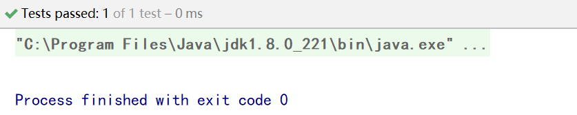
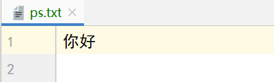

# Java进阶— —IO：打印流

本文主要介绍打印流的相关知识。

[toc]

## 一、PrintStream类

平时我们在控制台打印输出，是调用 `print()` 方法和 `println()` 方法完成的，这两个方法都来自于`java.io.PrintStream` 类，该类能够方便地打印各种数据类型的值，是一种便捷的输出方式。

该类的构造方法为：

- `public PrintStream(String fileName)` ： 使用指定的文件名创建一个新的打印流。


## 二、改变系统打印流

`System.out` 就是 `PrintStream` 类型的，只不过它的流向是系统规定的，打印在控制台上。不过，既然是流对象，我们就可以玩一个"小把戏"，改变它的流向。

```java
@Test
public void test01() throws FileNotFoundException {
    // 1. 创建打印流，指定打印的位置
    PrintStream ps = new PrintStream("src\\printstreamTest\\ps.txt");
    // 2. 改变系统打印流
    System.setOut(ps);
    // 3. 打印
    System.out.println("你好");
}
```

控制台中并没有内容：



文件ps.txt中有内容：

