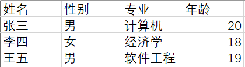
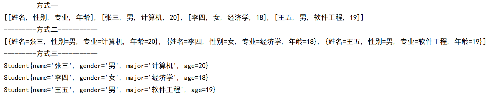
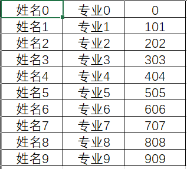

# Java进阶— —hutool操作Excel

本文介绍如何使用Java开发工具包hutool操作Excel.

[toc]

## 一、概述

Hutool-poi是针对Apache POI的封装，因此需要用户自行引入POI库,Hutool默认不引入。到目前为止，Hutool-poi支持：

- Excel文件（xls, xlsx）的读取（ExcelReader）
- Excel文件（xls，xlsx）的写出（ExcelWriter）

Hutool提供的类有：

- ExcelUtil：Excel工具类，读取的快捷方法都被封装于此
- ExcelReader：Excel读取器，Excel读取的封装，可以直接构造后使用。
- ExcelWriter：Excel生成并写出器，Excel写出的封装（写出到流或者文件），可以直接构造后使用。


## 二、ExcelUtil类介绍

`ExcelUtil`类主要用于获取`ExcelReader`和`ExcelWriter`，主要的方法如下：

- `public static ExcelReader getReader(File bookFile)`：获取指定的Excel的读取器，默认读取的sheet表单索引为0。
- `public static ExcelReader getReader(String bookFilePath)`：获取指定的Excel的读取器，默认读取的sheet表单索引为0。

我们也可以指定具体的表单索引或表单名：

- `public static ExcelReader getReader(String bookFilePath, int sheetIndex)`
- `public static ExcelReader getReader(File bookFile, String sheetName)`


## 三、简单使用

### 3.1 引入依赖

```xml
<dependencies>
    <dependency>
        <groupId>org.apache.poi</groupId>
        <artifactId>poi-ooxml</artifactId>
        <version>4.1.2</version>
    </dependency>

    <dependency>
        <groupId>cn.hutool</groupId>
        <artifactId>hutool-poi</artifactId>
        <version>5.4.7</version>
    </dependency>
</dependencies>
```

hutool-4.x的`poi-ooxml` 版本需高于 `3.17`； hutool-5.x的`poi-ooxml` 版本需高于 `4.1.2`

关于依赖引入的说明，请查看：https://www.hutool.cn/docs/#/poi/%E6%A6%82%E8%BF%B0?id=%e4%bd%bf%e7%94%a8


### 3.2 读取Excel

首先准备测试Excel，内容如下：



我们有三种方式读取Eecel的内容：

```java
public static void main(String[] args) {
    // 通过ExcelUtil获取ExcelReader对象
    ExcelReader excelReader = ExcelUtil.getReader("test.xlsx");
    // 方式一：读取所有的行列
    List<List<Object>> lists = excelReader.read();
    System.out.println("---------方式一-----------");
    System.out.println(lists);
    // 方式二：读取为Map列表，默认第一行为标题行，Map中的key为标题，value为标题对应的单元格值
    List<Map<String, Object>> mapList = excelReader.readAll();
    System.out.println("---------方式二-----------");
    System.out.println(mapList);
    // 方式三：读取为Bean列表，Bean中的字段名为标题，字段值为标题对应的单元格值。
    List<Student> students = excelReader.readAll(Student.class);
    System.out.println("---------方式三-----------");
    for (Student s :students ) {
        System.out.println(s);
    }
```

结果：



==注意：==

在方式三的读取中，如果Bean中的字段名与标题不一致，可以使用hutool中的注解`@Alias("标题")`，标注在Bean中的字段上，否则不能成功注入字段值。

```java
public class Student {
    @Alias("姓名")
    private String name;
    @Alias("性别")
    private String gender;
    @Alias("专业")
    private String major;
    @Alias("年龄")
    private int age;
    ...
}
```


### 3.3 写出Excel

Hutool将Excel写出封装为`ExcelWriter`，原理为包装了Workbook对象，每次调用`merge`（合并单元格）或者`write`（写出数据）方法后只是将数据写入到Workbook，并不写出文件，只有调用`flush`或者`close`方法后才会真正写出文件。

由于机制原因，在写出结束后需要关闭`ExcelWriter`对象，调用`close`方法即可关闭，此时才会释放Workbook对象资源，否则带有数据的Workbook一直会常驻内存。

写出嵌套列表：

```java
public static void main(String[] args) {
    // 获取ExcelWriter对象
    ExcelWriter excelWriter = ExcelUtil.getWriter("src/main/resources/writer01.xlsx");
    // 准备要写出的数据
    List<List<Object>> data = new ArrayList<List<Object>>();
    for (int i = 0; i <10; i++) {
        List<Object> row = new ArrayList<Object>();
        row.add("姓名"+i);
        row.add("专业"+i);
        row.add(i*100+i);
        data.add(row);
    }
    // 写出数据到缓冲区
    excelWriter.write(data);
    // 写出数据
    excelWriter.flush();
    // 关闭资源
    excelWriter.close();
}
```

结果：



除了写出嵌套的列表，我们也可以写出Map列表、写出Bean列表：

```java
ArrayList<Map<String, Object>> rows = CollUtil.newArrayList(row1, row2...);
// 一次性写出内容，使用默认样式，强制输出标题
writer.write(rows, true);
// public ExcelWriter write(Iterable<?> data, boolean isWriteKeyAsHead)
// 将键值作为标题写出
```

```java
List<TestBean> rows = CollUtil.newArrayList(bean1, bean2...);
// 一次性写出内容，使用默认样式，强制输出标题
writer.write(rows, true);
```

在写出Bean的时候，我们可以调用`ExcelWriter`对象的`addHeaderAlias`方法自定义Bean中key的别名，这样就可以写出自定义标题了（例如中文）。

默认情况下Excel中写出Bean字段不能保证顺序，此时可以使用`addHeaderAlias`方法设置标题别名，Bean的写出顺序就会按照标题别名的加入顺序排序。 如果不需要设置标题但是想要排序字段，请调用`writer.addHeaderAlias("age", "age")`设置一个相同的别名就可以不更换标题。 未设置标题别名的字段不参与排序，**会默认排在前面**。

```java
//自定义标题别名
writer.addHeaderAlias("name", "姓名");
writer.addHeaderAlias("age", "年龄");
```


设置单元格背景色：

```java
ExcelWriter writer = ...;

// 定义单元格背景色
StyleSet style = writer.getStyleSet();
// 第二个参数表示是否也设置头部单元格背景
style.setBackgroundColor(IndexedColors.RED, false);
```

自定义字体：

```java
ExcelWriter writer = ...;
//设置内容字体
Font font = writer.createFont();
font.setBold(true);
font.setColor(Font.COLOR_RED); 
font.setItalic(true); 
//第二个参数表示是否忽略头部样式
writer.getStyleSet().setFont(font, true);
```

写出多个表单：

```java
//初始化时定义表名
ExcelWriter writer = new ExcelWriter("d:/aaa.xls", "表1");
//切换sheet，此时从第0行开始写
writer.setSheet("表2");
...
writer.setSheet("表3");
...
```

对于大量数据输出，采用`ExcelWriter`容易引起内存溢出，因此有了`BigExcelWriter`，使用方法与`ExcelWriter`完全一致。


## 四、参考资料

[1]https://www.hutool.cn/docs/index.html#/

