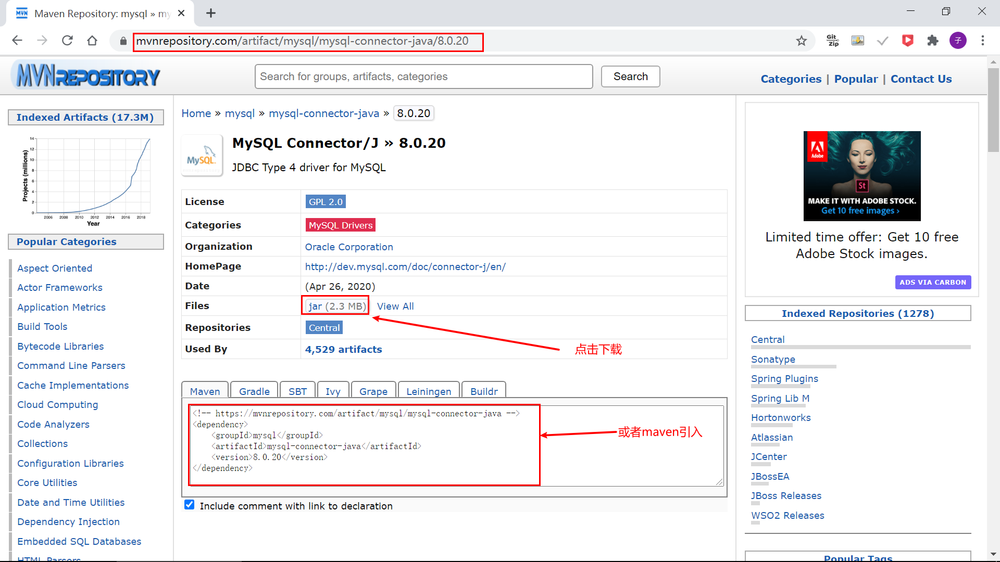
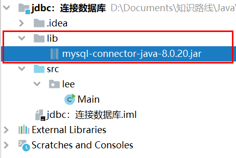
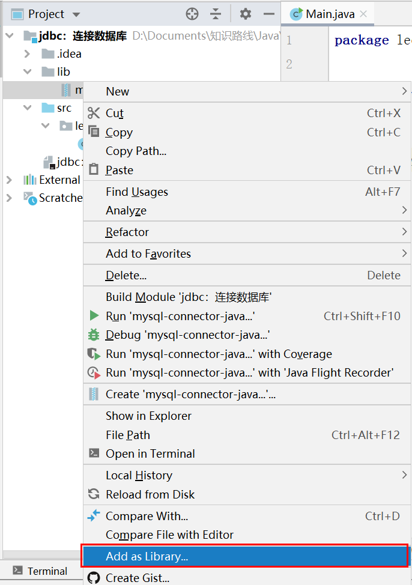
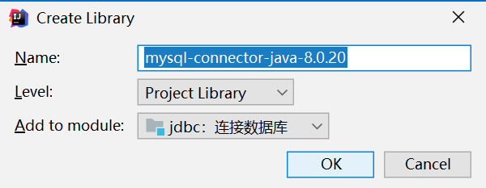

# Java进阶— —JDBC：入门案例

本篇文章主要介绍如何连接数据库以及查询数据，可作为入门案例。

[toc]

## 一、下载MySQL驱动包

进入maven仓库，选择相应版本的驱动包进行下载：



## 二、项目引入驱动

新建项目，并在项目下创建文件夹**lib**，将下载的驱动复制进**lib**文件夹中：



然后右击，选择`Add As Library`，将该jar包导入项目库文件中：



点击OK即可：



## 三、编程连接数据库

### 3.1 完整代码

```java
import java.sql.*;

public class Main {

  public static void main(String[] args) {
    Connection connection = null;
    PreparedStatement preparedStatement = null;
    ResultSet resultSet = null;

    String driverName = "com.mysql.cj.jdbc.Driver";
    String url = "jdbc:mysql://localhost:3306/test?serverTimezone=Asia/Shanghai";
    String username = "root";
    String password = "你的密码";
    try {
      Class.forName(driverName);
      connection = DriverManager.getConnection(url, username, password);  //获得连接
      String sql = "select * from tab_student;";
      preparedStatement = connection.prepareStatement(sql); //获得Statement对象
      resultSet = preparedStatement.executeQuery();        //获得结果集
      while (resultSet.next()) {                           //遍历结果集
        System.out.print(resultSet.getString(1)+" ");
        System.out.print(resultSet.getString(2)+" ");
        System.out.print(resultSet.getString(3)+"\n");
      }
    } catch (ClassNotFoundException | SQLException e) {
      e.printStackTrace();
    } finally {
      if (resultSet != null) {         //关闭结果集
        try {
          resultSet.close();
        } catch (SQLException e) {
          e.printStackTrace();
        }
      }
      if (preparedStatement != null) {       //关闭statement对象
        try {
          preparedStatement.close();
        } catch (SQLException e) {
          e.printStackTrace();
        }
      }
      if (connection != null) {            //关闭数据库连接
        try {
          connection.close();
        } catch (SQLException e) {
          e.printStackTrace();
        }
      }
    }
  }
}

```

结果：


### 3.2 加载驱动

首先设置`driverName`，然后通过`java.lang.Class`类的静态方法`forName(String driverName)`加载驱动：

```java
String driverName = "com.mysql.jdbc.Driver";

Class.forName(driverName);
```

注意：在MySQL 8.0版本中，驱动名改为`com.mysql.cj.jdbc.Driver`，而不是`com.mysql.jdbc.Driver`。否则会出现以下信息：

```error
Loading class `com.mysql.jdbc.Driver'. This is deprecated. The new driver class is `com.mysql.cj.jdbc.Driver'. The driver is automatically registered via the SPI and manual loading of the driver class is generally unnecessary.
```


### 3.3 获得数据库连接

在加载驱动后，我们就可以根据`url`、`username`和`password`获得数据库连接：

```java
String url = "jdbc:mysql://localhost:3306/test?serverTimezone=Asia/Shanghai";
String username = "root";
String password = "你的密码";

connection = DriverManager.getConnection(url, username, password);
```

注意：如果没有`serverTimezone=Asia/Shanghai`，则连接可能会报错。


### 3.4 获得statement对象

在获得数据库连接后，就可以根据SQL语句创建`statement`对象。

```java
String sql = "select * from tab_student;";

preparedStatement = connection.prepareStatement(sql);
```


### 3.5 获得结果集

在获得statement对象后，就可以执行SQL语句获得结果并进行处理：

```java
resultSet = preparedStatement.executeQuery();
while (resultSet.next()) {
    System.out.print(resultSet.getString(1)+" ");
    System.out.print(resultSet.getString(2)+" ");
    System.out.print(resultSet.getString(3)+"\n");
}
```


### 3.6 关闭资源

当操作完数据库后，必须关闭相关资源，关闭的顺序与创建的顺序相反，即先关闭结果集，然后关闭statement对象，最后一定要关闭数据库连接。

```java
if (resultSet != null) {
    try {
        resultSet.close();
    } catch (SQLException e) {
        e.printStackTrace();
    }
}
if (preparedStatement != null) {
    try {
        preparedStatement.close();
    } catch (SQLException e) {
        e.printStackTrace();
    }
}
if (connection != null) {
    try {
        connection.close();
    } catch (SQLException e) {
        e.printStackTrace();
    }
}
```


