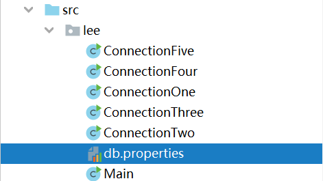

# Java进阶— —JDBC：获取数据库连接

本文主要介绍几种不同的获取数据库连接的方式。

[toc]

## 一、连接方式一

1. 获取`Driver`驱动实例。

2. 设置`url`：`jdbc:mysql://localhost:3306/test?serverTimezone=Asia/Shanghai`，注意加上时区、编码格式等。

3. `properties`配置用户名和密码。
4. 利用驱动实例的`connect(String url,Properties properties)`的方法获取数据库连接。

```java
import java.sql.Connection;
import java.sql.Driver;
import java.sql.SQLException;
import java.util.Properties;

public class ConnectionOne {
    public static void main(String[] args) {
        Connection connection = null;
        try {
            // 1.driver驱动实现
            Driver driver = new com.mysql.cj.jdbc.Driver();
            // 2.设置url
            String url = "jdbc:mysql://localhost:3306/test?serverTimezone=Asia/Shanghai";
            // 3.提供Properties的对象，指明用户名和密码
            Properties properties = new Properties();
            properties.setProperty("user", "root");
            properties.setProperty("password", "你的密码");
            // 4.获取连接
            connection = driver.connect(url, properties);
            System.out.println(connection);
        } catch (SQLException e) {
            e.printStackTrace();
        } finally {
            // 5.关闭连接
            if (connection != null) {
                try {
                    connection.close();
                } catch (SQLException e) {
                    e.printStackTrace();
                }
            }
        }
    }
}

```


## 二、连接方式二

该连接方式与连接方式一唯一不同的地方在于获取`Driver`实例的方式不同，是利用反射实例化的。

```java
package lee;

import com.mysql.cj.util.DnsSrv;

import java.sql.Connection;
import java.sql.Driver;
import java.sql.SQLException;
import java.util.Properties;

public class ConnectionTwo {
    public static void main(String[] args) {
        Connection connection = null;
        try {
            // 1.实例化driver
            String driverName = "com.mysql.cj.jdbc.Driver";
            Class clazz = Class.forName(driverName);
            Driver driver = (Driver) clazz.newInstance();
            // 2.设置url
            String url = "jdbc:mysql://localhost:3306/test?serverTimezone=Asia/Shanghai";
            // 3.提供Properties的对象，指明用户名和密码
            Properties properties = new Properties();
            properties.setProperty("user", "root");
            properties.setProperty("password", "你的密码");
            // 4.获取连接
            connection = driver.connect(url, properties);
            System.out.println(connection);
        } catch (ClassNotFoundException
                | IllegalAccessException
                | InstantiationException
                | SQLException e) {
            e.printStackTrace();
        } finally {
            if (connection != null) {
                try {
                    connection.close();
                } catch (SQLException e) {
                    e.printStackTrace();
                }
            }
        }
    }
}

```


## 三、连接方式三

1. 设置数据库连接的四要素：驱动、url、用户名和密码。
2. 获取`Driver`实例。
3. 注册驱动：`DriverManager.registerDriver(driver);`。
4. 获取连接：`connection = DriverManager.getConnection(url, username, password);`。

```java
package lee;

import java.sql.Connection;
import java.sql.Driver;
import java.sql.DriverManager;
import java.sql.SQLException;

public class ConnectionThree {
    public static void main(String[] args) {
        Connection connection = null;
        // 1.获取数据库连接的四要素
        String driverName = "com.mysql.cj.jdbc.Driver";
        String url = "jdbc:mysql://localhost:3306/test?serverTimezone=Asia/Shanghai";
        String username = "root";
        String password = "你的密码";
        try {
            // 2. 获取driver实例
            Class clazz = Class.forName(driverName);
            Driver driver = (Driver) clazz.newInstance();
            // 3.注册驱动
            DriverManager.registerDriver(driver);
            // 4.获取连接
            connection = DriverManager.getConnection(url, username, password);
            System.out.println(connection);
        } catch (ClassNotFoundException
                | IllegalAccessException
                | InstantiationException
                | SQLException e) {
            e.printStackTrace();
        } finally {
            if (connection != null) {
                try {
                    connection.close();
                } catch (SQLException e) {
                    e.printStackTrace();
                }
            }
        }
    }
}

```


## 四、连接方式四

```java
import java.sql.Connection;
import java.sql.Driver;
import java.sql.DriverManager;
import java.sql.SQLException;

public class ConnectionFour {
    public static void main(String[] args) {
        Connection connection = null;
        // 1.获取数据库连接的四要素
        String driverName = "com.mysql.cj.jdbc.Driver";
        String url = "jdbc:mysql://localhost:3306/test?serverTimezone=Asia/Shanghai";
        String username = "root";
        String password = "你的密码";

        try {
            // 2. 获取driver实例
            Class clazz = Class.forName(driverName);
            Driver driver = (Driver) clazz.newInstance();
            // 3.获取数据库连接
            connection = DriverManager.getConnection(url, username, password);
            System.out.println(connection);
        } catch (ClassNotFoundException
                | InstantiationException
                | IllegalAccessException
                | SQLException e) {
            e.printStackTrace();
        } finally {
            if (connection != null) {
                try {
                    connection.close();
                } catch (SQLException e) {
                    e.printStackTrace();
                }
            }
        }
    }
}

```

该连接方式与上述相比，省略了注册驱动的步骤，实际上是`Driver`类中有静态代码块帮我们注册驱动。

```java
//
// Source code recreated from a .class file by IntelliJ IDEA
// (powered by Fernflower decompiler)
//

package com.mysql.cj.jdbc;

import java.sql.DriverManager;
import java.sql.SQLException;

public class Driver extends NonRegisteringDriver implements java.sql.Driver {
    public Driver() throws SQLException {
    }

    static {
        try {
            DriverManager.registerDriver(new Driver());
        } catch (SQLException var1) {
            throw new RuntimeException("Can't register driver!");
        }
    }
}

```


## 五、连接方式五

该连接方式将连接数据库的四要素保存在配置文件中，`Java`程序通过读取配置文件连接数据库。

使用配置文件的好处：

①实现了代码和数据的分离，如果需要修改配置信息，直接在配置文件中修改，不需要修改代码 

②如果修改了配置信息，省去了重新编译的过程。

```java
package lee;

import java.sql.Connection;
import java.sql.DriverManager;
import java.sql.SQLException;
import java.util.ResourceBundle;

public class ConnectionFive {
    public static void main(String[] args) {
        Connection connection = null;
        //1. 加载配置文件
        ResourceBundle resourceBundle = ResourceBundle.getBundle("lee.db");
        //2.读取配置文件
        String driverName = resourceBundle.getString("jdbc.driver");
        String url = resourceBundle.getString("jdbc.url");
        String username = resourceBundle.getString("jdbc.username");
        String password = resourceBundle.getString("jdbc.password");
        try {
            // 3.加载驱动
            Class.forName(driverName);
            //4.获取数据库连接
            connection = DriverManager.getConnection(url,username,password);
            System.out.println(connection);
        } catch (ClassNotFoundException | SQLException e) {
            e.printStackTrace();
        }finally {
            if (connection != null) {
                try {
                    connection.close();
                } catch (SQLException e) {
                    e.printStackTrace();
                }
            }
        }


    }
}

```

其中db.properties文件的内容如下：

```properties
jdbc.driver=com.mysql.cj.jdbc.Driver
jdbc.url=jdbc:mysql://localhost:3306/test?useSSL=true&useUnicode=true&characterEncoding=utf-8&serverTimezone=GMT%2B8
jdbc.username=root
jdbc.password=你的密码
```

使用该连接方式注意db.properties的位置：



