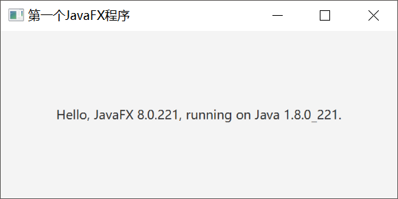
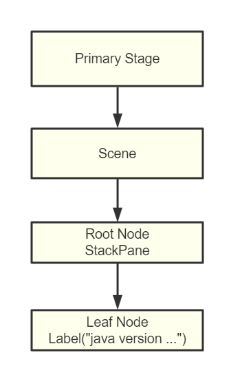

# JavaFX— —介绍与入门

本文主要介绍JavaFX是什么以及入门程序。

[toc]

## 1. JavaFX是什么

> JavaFX is a set of graphics and media packages that enables developers to design, create, test, debug, and deploy rich client applications that operate consistently across diverse platforms.

JavaFX是一组图形和媒体包，它使开发人员能够设计、创建、测试、调试和部署跨平台一致运行的富客户端应用程序。

说人话，JavaFX就是开发人员用来创建客户端应用程序的工具。

根据Oracle的官方说明，从JDK11开始，将不会包含JavaFX。JavaFX将作为一个独立的模块，可供开发者和使用者下载和安装。所以我们的教程是基于JDK 8的。


## 2. 入门程序

入门程序很简单，如下：

```java
import javafx.application.Application;
import javafx.scene.Scene;
import javafx.scene.control.Label;
import javafx.scene.layout.StackPane;
import javafx.stage.Stage;

public class Demo extends Application {
    @Override
    public void start(Stage primaryStage) throws Exception {
        // 获取java版本和javafx版本
        String javaVersion = System.getProperty("java.version");
        String javafxVersion = System.getProperty("javafx.version");
        // 创建label
        Label l = new Label("Hello, JavaFX " + javafxVersion + ", running on Java " + javaVersion + ".");
        // 创建StackPane()
        StackPane stackPane = new StackPane(l);
        // 创建scene，参数为root node
        Scene scene = new Scene(stackPane);
        // 设置stage的参数
        primaryStage.setScene(scene);
        primaryStage.setTitle("第一个JavaFX程序");
        primaryStage.setWidth(400);
        primaryStage.setHeight(200);
        // 显示
        primaryStage.show();
    }

    public static void main(String[] args) {
        // 启动项目
        launch(args);
    }
}

```

- 我们的主类需要继承`Application`类，并实现方法`start(Stage primaryStage)`；
- 在`main()`方法中通过`launch(args)`启动程序；

结果如下：




## 3. 场景图（Scene Graph）

场景图是树形结构，它规定了JavaFX程序的组织结构。如下图所示：


在这棵树中，各元素表示的意思如下：

- Stage：Stage是操作系统原生窗口在JavaFX中的表示；
- Scene：Scene是JavaFX场景图的容器，在任何情况下，一个Stage只有一个Scene；
- Node：JavaFX中的元素称为Node，Node节点有三种情况：Root、Leaf和Branch。Root Node的父结点是Scene；Leaf Node没有子节点，Branch Node可以有多个孩子节点；

在我们的入门程序中，可以用如下的场景图表示：




## 参考资料

[1] openjfx：https://openjfx.io/

[2] oracle：https://www.oracle.com/cn/java/technologies/javase/javafx-overview.html

