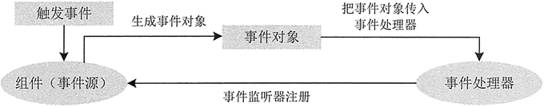
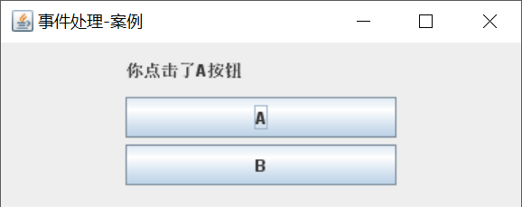
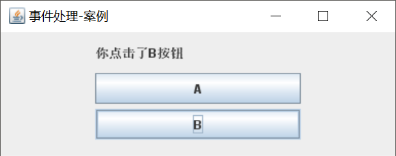

# Swing— —事件处理

本文介绍Swing中的事件处理。

[toc]

## 一、概述

事件表示用户和程序之间的交互，例如在文本框中输入文本、在列表框或组合框中选择、选中复选框和单选框、单击按钮等。

事件处理表示程序对事件的响应，对事件的处理是事件处理程序完成的。

当事件发生时，系统会自动捕捉这一事件，创建表示动作的事件对象并把它们分派给程序内的事件处理程序代码。


## 二、事件处理模型

在事件处理的过程中，主要涉及三类对象。

- Event（事件）：用户对组件的一次操作称为一个事件，以类的形式出现。例如，键盘操作对应的事件类是 KeyEvent。
- Event Source（事件源）：事件发生的场所，通常就是各个组件，例如按钮 Button。
- Event Handler（事件处理者）：接收事件对象并对其进行处理的对象事件处理器，通常就是某个 [Java](http://c.biancheng.net/java/) 类中负责处理事件的成员方法。



由于同一个事件源上可能发生多种事件，因此，Java 采取了授权模型（Delegation Model），事件源可以把在其自身上所有可能发生的事件分别授权给不同的事件处理器来处理。例如，在 Panel 对象上既可能发生鼠标点击事件，也可能发生键盘事件，该 Panel 对象可以授权给事件处理器 a 来处理鼠标点击事件，同时授权给事件处理器 b 来处理键盘事件。

有时也将事件处理器称为监听器，主要原因在于事件处理器时刻监听事件源上所有发生的事件类型，一旦该事件类型与自己所负责处理的事件类型一致，就马上进行处理。授权模型把事件的处理委托给外部的处理实体进行处理，实现了将事件源和监听器分开的机制。

事件处理者（监听器）通常是一个类，该类如果能够处理某种类型的事件，就必须实现与该事件类型相对应的接口。例如，一个 ButtonHandler 类之所以能够处理 ActionEvent 事件，原因在于它实现了与 ActionEvent 事件对应的接口 ActionListener。每个事件类都有一个与之相对应的接口。


## 三、事件与事件监听器

在`java.awt.event`包下有定义好的事件`xxxEvent`以及事件监听器`xxxListener`，我们只需要实现相应的事件监听器`xxxListener`，就定义了事件处理器。常见的事件如下：

- `ComponentEvent`：组件事件；当组件尺寸发生变化、位置发生移动、显示/隐藏状态发生改变时触发该事件；
- `WindowEvent`：窗口事件；当窗口状态发生改变（如打开，关闭，最大化，最小化）时触发该事件；
- `FocusEvent`：焦点事件，当组件得到焦点或失去焦点时触发该事件；
- `MouseEvent`：鼠标事件，当进行单击，按下，松开，移动鼠标等动作时触发该事件；
- `ActionEvent`：动作事件，当按钮，菜单项被单击，在TextField中按Enter键时触发该事件;
- `TextEvent`：文本事件，当文本框，文本域里的文本发生改变时触发该事件；


## 四、案例

实现两个按钮A和B，当点击A时在显示“你点击了A按钮”，当点击B时显示“你点击了B按钮”。

界面代码：

```java
public static void main(String[] args) {
    JFrame frame = new JFrame("事件处理-案例");
    frame.setSize(400,160);
    frame.setDefaultCloseOperation(WindowConstants.EXIT_ON_CLOSE);
    frame.setLocationRelativeTo(null);

    JPanel panel = new JPanel();

    JLabel label = new JLabel();
    label.setText("");
    label.setPreferredSize(new Dimension(200,30));
    JButton button1 = new JButton("A");
    JButton button2 = new JButton("B");
    // 设置大小
    button1.setPreferredSize(new Dimension(200,30));
    button2.setPreferredSize(new Dimension(200,30));

    // 添加时间处理器
    button1.addActionListener(new ButtonAListener(label));
    button2.addActionListener(new ButtonBListener(label));

    panel.add(label, BorderLayout.NORTH);
    panel.add(button1,BorderLayout.WEST);
    panel.add(button2,BorderLayout.EAST);

    frame.add(panel);

    frame.setVisible(true);
}
```

监听器代码：

```java
public class ButtonAListener implements ActionListener {

    private JLabel label;

    public ButtonAListener(JLabel label){
        this.label = label;
    }

    @Override
    public void actionPerformed(ActionEvent e) {
        this.label.setText("你点击了A按钮");
    }
}

public class ButtonBListener implements ActionListener {

    private JLabel label;

    public ButtonAListener(JLabel label){
        this.label = label;
    }

    @Override
    public void actionPerformed(ActionEvent e) {
        this.label.setText("你点击了B按钮");
    }
}

```

结果：





