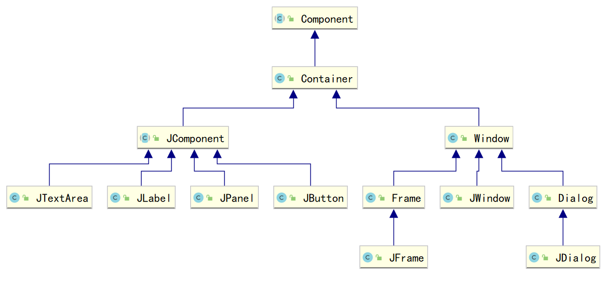
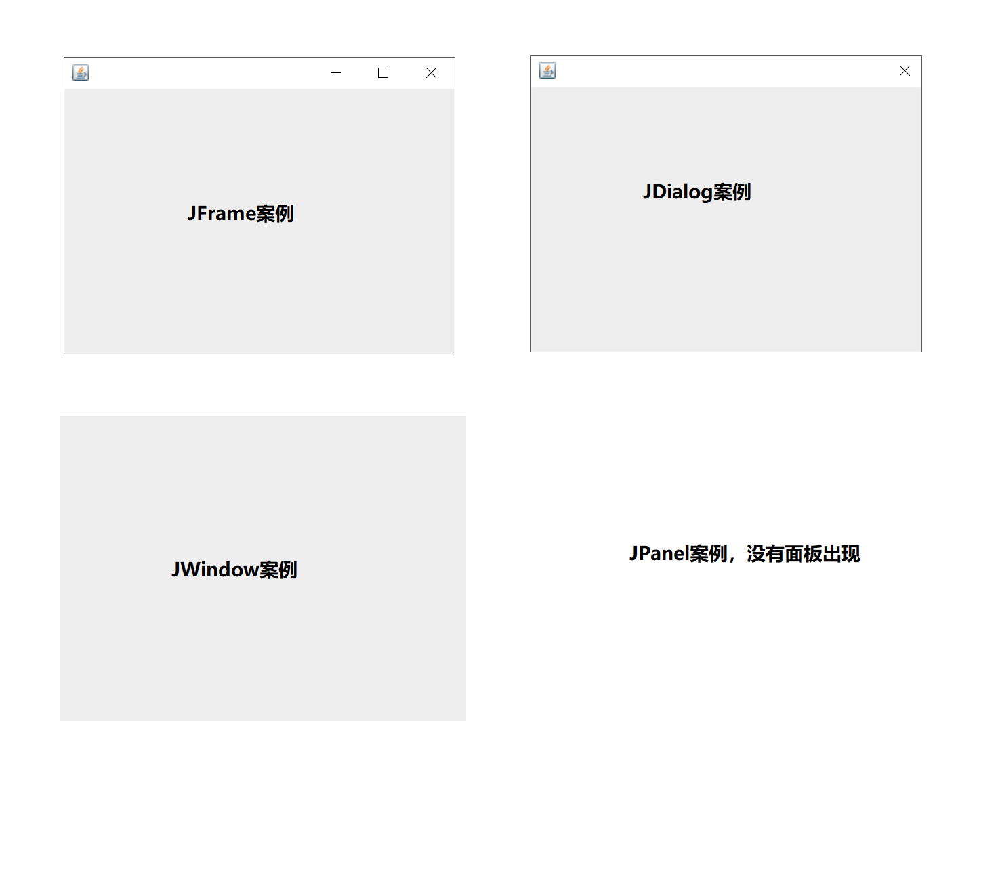

# Swing— —组件和容器

本文主要介绍Swing中组件和容器。

[toc]

## 一、组件和容器

在Swing中，所有元素统称为组件，例如按钮、文本框等。

容器也是组件，但是容器是特殊的组件，它可以包含其他组件，例如`JFrame`、`JDialog`；非容器组件不能包含其他组件，例如按钮`JButton`、文本框`JTextArea`。

关系图（不完整）如下：



在Swing中，`Window`的子类都是容器，除此之外，`JPanel`也是容器；`JComponent`的子类基本上是非容器组件。


## 二、容器

常用容器如下：

| 类      | 说明                                                         |
| ------- | ------------------------------------------------------------ |
| JFrame  | JFrame是一个带标题和边框的**顶级窗口**                       |
| JDialog | JDialog是一个带标题和边框的**顶级窗口**，与JFrame类似但可以设置模态 |
| JWindow | JWindow是一个没有边框且没有菜单栏的**顶级窗口**              |
| JPanel  | JPanel是一个普通的容器，不是顶级窗口，需要添加到其他容器中使用 |

测试代码：

```java
public static void main(String[] args) {
//        JFrame jFrame = new JFrame();
//        jFrame.setSize(400,300);
//        jFrame.setVisible(true);

//        JDialog jDialog = new JDialog();
//        jDialog.setSize(400,300);
//        jDialog.setVisible(true);

//        JWindow jWindow = new JWindow();
//        jWindow.setSize(400,300);
//        jWindow.setVisible(true);

//        JPanel jPanel = new JPanel();
//        jPanel.setSize(400,300);
//        jPanel.setVisible(true);
    }
```

分别运行如下代码，结果如下：



## 三、组件

常用组件如下：

Ⅰ.文本框（JTextField）

Ⅱ.密码框（JPasswordField）

Ⅲ.标签（JLable）

Ⅳ.复选框（JCheckBox）

Ⅴ.单选框（JRadioButton）

Ⅵ.组合单选框（ButtonGroup）

Ⅶ.下拉框（JComboBox）

Ⅷ.列表（JList）

Ⅸ.滚动窗格组件（JScrollPane）

Ⅹ.多行文本框（JTextArea）

ⅩⅠ.选项卡（JTabbedPane）

此处不详细演示，需要时可以自行查阅相关资料。

参考资料：https://zhuanlan.zhihu.com/p/67909644


