# Java进阶— —日志技术

本文主要介绍日志技术。

本文主要由黑马教程的课堂笔记整理而成。视频地址：https://www.bilibili.com/video/BV1iJ411H74S

[toc]

## 一、什么是日志？

日志文件，主要用于记录程序运行的情况，以便于程序在部署之后的排错调试等，也有利于将这些信息进行持久化（如果不将日志信息保存到文件或数据库，则信息便会丢失）。

日志的作用：

- 查看程序当前运行状态：我们可以实时查看应用日志的输出，就能分析程序的运行状态；
- 查看程序历史运行轨迹：我们可以通过查看应用历史日志的输出，就能分析程序的历史运行轨迹；
- 排查系统问题：当问题发生的时候，通过核查问题发生时候的日志，就能快速的找出问题产生的原因，迅速排查问题；
- 优化系统性能：通过记录程序运行的时间，就能判断程序从执行开始到执行结束消耗的时间，从而判断系统性能是否达标，为系统性能优化提供判断依据；
- 安全审计的基石：通过系统日志分析，可以判断一些非法攻击，非法调用，以及系统处理过程中的安全隐患；


## 二、日志框架

日志门面：JCL（Jakarta Commons Logging）、slf4j（ Simple Logging Facade for Java）

日志实现：JUL（java util logging）、logback、log4j、log4j2

日志门面和日志实现的关系：

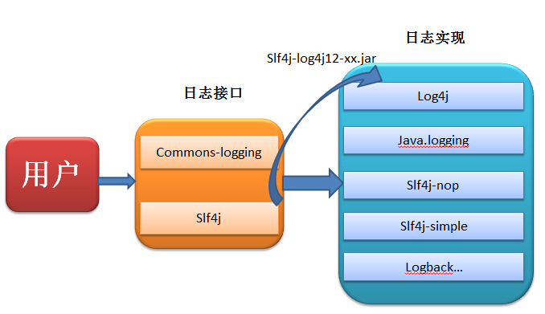


## 三、日志框架的使用

### 3.1 JUL的使用

JUL全称`Java util Logging`，是java原生的日志框架，使用时不需要另外引用第三方类库，相对其他日志框
架使用方便，学习简单，能够在小型应用中灵活使用。

#### 3.1.1 JUL架构


- Loggers：被称为记录器，应用程序通过获取`Logger`对象，调用其API来来发布日志信息。Logger
  通常是应用程序访问日志系统的入口。
- Appenders：也被称为Handlers，每个Logger都会关联一组Handlers，Logger会将日志交给关联
  Handlers处理，由Handlers负责将日志做记录。Handlers在此是一个抽象，其具体的实现决定了
  日志记录的位置可以是控制台、文件、网络上的其他日志服务或操作系统日志等。
- Layouts：也被称为Formatters，它负责对日志事件中的数据进行转换和格式化。Layouts决定了
  数据在一条日志记录中的最终形式。
- Level：每条日志消息都有一个关联的日志级别。该级别粗略指导了日志消息的重要性和紧迫，我
  可以将Level和Loggers，Appenders做关联以便于我们过滤消息。
- Filters：过滤器，根据需要定制哪些信息会被记录，哪些信息会被放过

**总结**：用户使用Logger来进行日志记录时，Logger持有若干个Handler，日志的输出操作是由Handler完成的。在Handler在输出日志前，会经过Filter的过滤，判断哪些日志级别被放行哪些被拦截，Handler会将日志内容输出到指定位置（日志文件、控制台等）。Handler在输出日志时会使用Layout，将输出内容进行排版。


#### 3.1.2 JUL入门程序

```java
@Test
public void testJUL(){
    // 1.获取日志记录器，MyFirstLogger为日志记录器名字
    Logger logger = Logger.getLogger("MyFirstLogger");
    // 2.输出日志记录
    logger.info("hello jul");

    // 日志记录，通过指定日志级别输出，与logger.info(msg)相同
    logger.log(Level.INFO,"jul level.info");
    //通过占位符方式输出变量值
    String name = "张三";
    int age = 18;
    logger.log(Level.INFO,"姓名：{0},年龄：{1}",new Object[]{name,age});
}
```

执行结果：

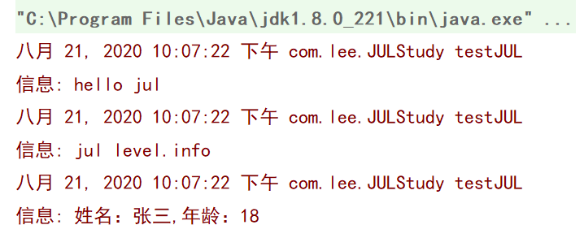


#### 3.1.3 日志的级别

我们可以查看`java.util.logging.Level`中定义的日志级别：

```markdown
* java.util.logging.Level中定义了日志的级别：
        SEVERE         value=1000（最高值）
        WARNING        value=900 
        INFO           value=800（默认级别）
        CONFIG         value=700
        FINE           value=500
        FINER          value=400
        FINEST         value=300（最低值）
* 还有两个特殊的级别：
        OFF            value=Integer.MAX_VALUE，可用来关闭日志记录。
        ALL            value=Integer.MIN_VALUE，启用所有消息的日志记录。
```

测试不同级别的日志记录：

```java
@Test
public void testLoggerLevel(){
    // 1.获取日志记录对象
    Logger logger = Logger.getLogger("MySecondLogger");
    // 2.日志记录输出
    logger.severe("severe");
    logger.warning("warning");
    logger.info("info");
    logger.config("cofnig");
    logger.fine("fine");
    logger.finer("finer");
    logger.finest("finest");
}
```

结果：


JUL默认的日志级别为`Level.INFO`，如果输出的日志级别比`Level.INFO`的级别高（即`value`比较大），则进行日志输出，反之则不输出。


#### 3.1.4 自定义Handler和Formatter

我们可以自定义`Handler`和`Formatter`来改变日志输出的级别、输出的位置以及输出的格式等。

我们知道，一个日志记录器对象logger可以关联多个handler对象，而一个handler可以设置日志过滤的级别、输出的位置以及输出的格式等。

```java
@Test
public void testDIYlog() throws IOException {
    // 获取日志记录对象
    Logger logger = Logger.getLogger("MySecondLogger");
    // 如果要自定义handler和formatter，需要首先关闭默认的JUL设置
    logger.setUseParentHandlers(false);

    // 一、设置日志输出级别，将日志输出到控制台
    // 1.1 创建handler对象
    ConsoleHandler consoleHandler = new ConsoleHandler();
    // 1.2 创建formatter对象
    SimpleFormatter simpleFormatter = new SimpleFormatter();
    // 1.3 logger、handler、formatter相互关联
    logger.addHandler(consoleHandler);
    consoleHandler.setFormatter(simpleFormatter);
    // 1.4 设置日志级别
    logger.setLevel(Level.ALL);
    consoleHandler.setLevel(Level.ALL);

    // 二、将日志输出到文件中
    // 2.1 通过指定输出的文件位置创建fileHandler对象
    FileHandler fileHandler = new FileHandler("d:/jul.log");
    // 2.2  logger、handler、formatter相互关联
    logger.addHandler(fileHandler);
    fileHandler.setFormatter(simpleFormatter);
    // 2.3 设置日志级别
    fileHandler.setLevel(Level.INFO);

    // 日志记录输出
    logger.severe("severe");
    logger.warning("warning");
    logger.info("info");
    logger.config("cofnig");
    logger.fine("fine");
    logger.finer("finer");
    logger.finest("finest");
}
```

结果：

控制台输出结果：


日志文件`d:/jul.log`输出结果:


注意：

- Logger默认的日志级别为`Level.INFO`；
- ConsoleHandle默认的日志级别为`Level.INFO`;
- FileHandler默认的日志级别为`Level.ALL`;


#### 3.1.5 Logger父子关系

JUL中`Logger`之间存在父子关系，这种父子关系通过树状结构存储，JUL在初始化时会创建一个顶层
`RootLogger`作为所有`Logger`父`Logger`，存储上作为树状结构的根节点。

**自定义`Logger`的父子关系由`.`区分，例如，名为`com.lee`的`Logger`的父`Logger`为`com`(如果有的话，否则默认为`RootLogger`）。**

```java
@Test
public void testParentChild(){
    Logger logger1 = Logger.getLogger("com.lee");
    Logger logger2 = Logger.getLogger("com");
    // logger1 的父logger 为logger2
    System.out.println(logger1.getParent() == logger2);
    // logger2 的父logger 为rootLogger
    System.out.println("logger2 parent：" + logger2.getParent() + "---name：" + logger2.getParent().getName());
}
```

结果：


**RootLogger的名称为空字符串。**

**子`Logger`会继承父`Logger`的设置。**

```java
@Test
public void testParentChild(){
    Logger logger1 = Logger.getLogger("com.lee");
    Logger logger2 = Logger.getLogger("com");

    // 为logger2 设置各种属性
    logger2.setUseParentHandlers(false);
    ConsoleHandler consoleHandler = new ConsoleHandler();
    SimpleFormatter simpleFormatter = new SimpleFormatter();
    logger2.addHandler(consoleHandler);
    consoleHandler.setFormatter(simpleFormatter);
    logger2.setLevel(Level.ALL);
    consoleHandler.setLevel(Level.ALL);

    // logger1 继承父logger的属性设置
    // 日志记录输出
    logger1.severe("severe");
    logger1.warning("warning");
    logger1.info("info");
    logger1.config("cofnig");
    logger1.fine("fine");
    logger1.finer("finer");
    logger1.finest("finest");

}
```

结果：

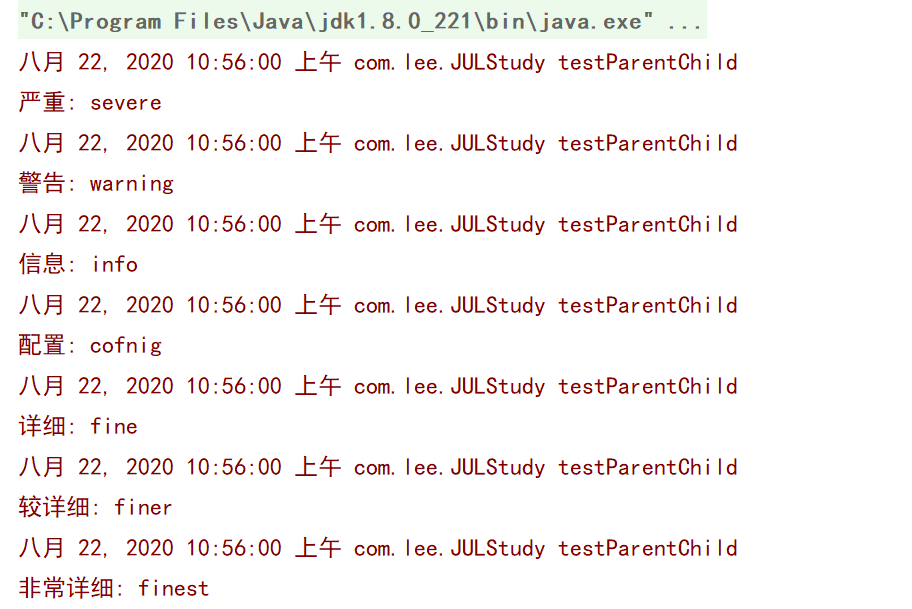


#### 3.1.6 日志配置文件

`RootLogger`的各种属性设置是通过加载配置文件进行获得的，而配置文件由`LogManager`进行加载，默认的配置文件路径为：`$JAVAHOME$\jre\lib\logging.properties`;

其内容为(已删除英文注释)：

```properties
# rootLogger 默认的handler
handlers= java.util.logging.ConsoleHandler

# rootLogger 默认的日志级别
.level= INFO

# fileHandler 的默认配置
java.util.logging.FileHandler.pattern = %h/java%u.log
java.util.logging.FileHandler.limit = 50000
java.util.logging.FileHandler.count = 1
java.util.logging.FileHandler.formatter = java.util.logging.XMLFormatter

# consoleHandler 的默认配置
java.util.logging.ConsoleHandler.level = INFO
java.util.logging.ConsoleHandler.formatter = java.util.logging.SimpleFormatter

# 举例自定义（名为com.xyz.foo)的日志记录器的级别设置
com.xyz.foo.level = SEVERE

```

我们可以加载自己的配置文件，修改`rootLogger`的默认配置：

```properties
# 日志记录器，如果有多个，用逗号分隔
handlers= java.util.logging.ConsoleHandler,java.util.logging.FileHandler

# 日志记录器的记录级别
.level= ALL

# fileHandler 的配置
# fileHandler 日志的输出文件，%u表示数字，其值为0 ---- count-1
java.util.logging.FileHandler.pattern = d:/java%u.log
# 单个日志文件记录的条数
java.util.logging.FileHandler.limit = 50000
# 一共有多少个日志文件
java.util.logging.FileHandler.count = 1
# 日志记录格式
java.util.logging.FileHandler.formatter = java.util.logging.XMLFormatter
# 以追加的格式输出日志记录
java.util.logging.FileHandler.append = true

# consoleHandler 的配置
# consoleHandler 输出的日志级别
java.util.logging.ConsoleHandler.level = ALL
# 日志记录格式
java.util.logging.ConsoleHandler.formatter = java.util.logging.SimpleFormatter

```

```java
@Test
public void testProperties() throws IOException {
    // 通过类加载器加载自定义的配置文件
    InputStream inputStream = JULStudy.class.getClassLoader().getResourceAsStream("logging.properties");
    // 获取日志管理器对象
    LogManager logManager = LogManager.getLogManager();
    // 日志管理器对象读取配置文件
    logManager.readConfiguration(inputStream);

    Logger logger = Logger.getLogger("com.lee");
    logger.severe("severe");
    logger.warning("warning");
    logger.info("info");
    logger.config("config");
    logger.fine("fine");
    logger.finer("finer");
    logger.finest("finest");

}
```

结果：

控制台打印：

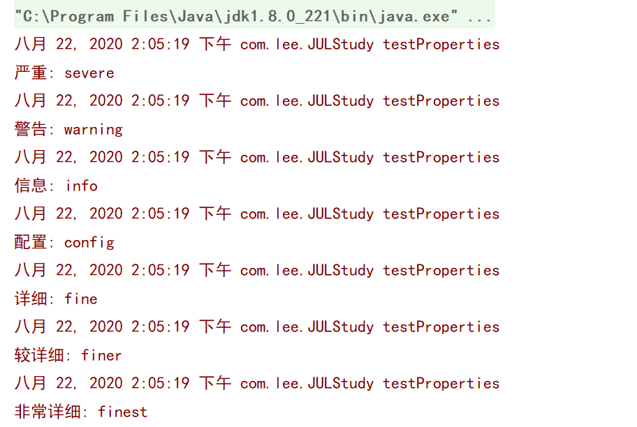

`d:/java0.log`日志文件内容：

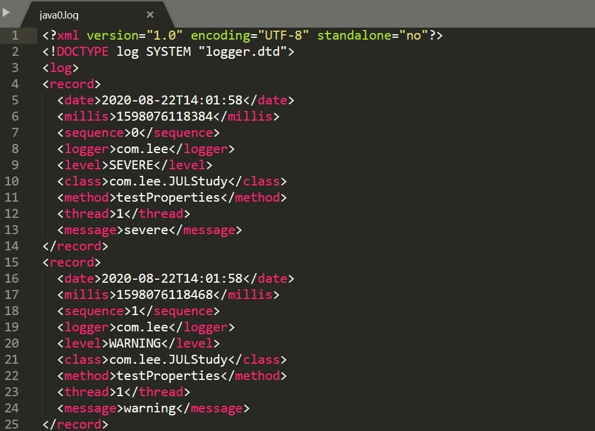


我们也可以设置具体的日志记录器，只需要通过日志记录器的名字进行指定:

```properties
......
# 设置名为com.lee.JULStudy的日志记录器属性
# 首先忽略默认的配置文件设置
com.lee.JULStudy.useParentHandlers = false
# 自定义的日志记录器级别设置
com.lee.JULStudy.level = CONFIG
# 自定义的日志记录器 handlers设置
com.lee.JULStudy.handlers= java.util.logging.ConsoleHandler
```

```java
@Test
public void testProperties() throws IOException {
    // 通过类加载器加载自定义的配置文件
    InputStream inputStream = JULStudy.class.getClassLoader().getResourceAsStream("logging.properties");
    // 获取日志管理器对象
    LogManager logManager = LogManager.getLogManager();
    // 日志管理器对象读取配置文件
    logManager.readConfiguration(inputStream);

    Logger logger = Logger.getLogger("com.lee.JULStudy");
    logger.severe("severe");
    logger.warning("warning");
    logger.info("info");
    logger.config("config");
    logger.fine("fine");
    logger.finer("finer");
    logger.finest("finest");

}
```

结果：


#### 3.1.7 JUL日志原理解析


1. 初始化LogManager
1. LogManager加载logging.properties配置
2. 添加Logger到LogManager
2. 从单例LogManager获取Logger
3. 设置级别Level，并指定日志记录LogRecord
4. Filter提供了日志级别之外更细粒度的控制
5. Handler是用来处理日志输出位置
6. Formatter是用来格式化LogRecord的


### 3.2 LOG4J的使用

Log4j是Apache下的一款开源的日志框架，通过在项目中使用 Log4J，我们可以控制日志信息输出到控
制台、文件、甚至是数据库中。我们可以控制每一条日志的输出格式，通过定义日志的输出级别，可以
更灵活的控制日志的输出过程。方便项目的调试。

#### 3.2.1 LOG4J入门程序

首先导入相关依赖:

```xml
<dependency>
    <groupId>log4j</groupId>
    <artifactId>log4j</artifactId>
    <version>1.2.17</version>
</dependency>
```

然后就可以使用LOG4J了，示例程序如下：

```java
@Test
public void testLog4j(){
    // 初始化系统配置，不需要配置文件
    BasicConfigurator.configure();
    // 创建日志记录器对象
    Logger logger = Logger.getLogger(LOG4JStudy.class);
    // 日志记录输出
    logger.info("hello log4j");
}
```

结果：


注意：如果用类对象创建日志记录器，则日志记录器的名字为`包名.类名`。


#### 3.2.2 日志的级别

```markdown
* 每个Logger都被了一个日志级别（log level），用来控制日志信息的输出。日志级别从高到低分为：
        fatal   指出每个严重的错误事件将会导致应用程序的退出。
        error   指出虽然发生错误事件，但仍然不影响系统的继续运行。
        warn    表明会出现潜在的错误情形。
        info    一般和在粗粒度级别上，强调应用程序的运行全程。
        debug   一般用于细粒度级别上，对调试应用程序非常有帮助。
        trace   是程序追踪，可以用于输出程序运行中的变量，显示执行的流程。
* 还有两个特殊的级别：
        OFF     可用来关闭日志记录。
        ALL     启用所有消息的日志记录。
```

注：一般只使用4个级别，优先级从高到低为 ERROR > WARN > INFO > DEBUG


#### 3.2.3 LOG4J组件

LOG4J主要由 Loggers (日志记录器)、Appenders（输出端）和 Layout（日志格式化器）组成。

- Loggers 控制日志的输出级别与日志是否输出；
- Appenders 指定日志的输出方式（输出到控制台、文件等）；
- Layout 控制日志信息的输出格式。

**==Loggers==**

日志记录器，负责收集处理日志记录，实例的命名就是类“XX”的full quailied name（类的全限定名），
Logger的名字大小写敏感，其命名有继承机制：例如：name为org.apache.commons的logger会继承
name为org.apache的logger。

Log4J中有一个特殊的logger叫做“root”，他是所有logger的根，也就意味着其他所有的logger都会直接
或者间接地继承自root。root logger可以用Logger.getRootLogger()方法获取。

**==Appenders==**

Appender 用来指定日志输出到哪个地方，可以同时指定日志的输出目的地。Log4j 常用的输出目的地有以下几种：

|        输出端类型        |                             作用                             |
| :----------------------: | :----------------------------------------------------------: |
|     ConsoleAppender      |                      将日志输出到控制台                      |
|       FileAppender       |                      将日志输出到文件中                      |
| DailyRollingFileAppender |     将日志输出到一个日志文件，并且每天输出到一个新的文件     |
|   RollingFileAppender    | 将日志信息输出到一个日志文件，并且指定文件的尺寸，当文件大小达到指定尺寸时，会自动把文件改名，同时产生一个新的文件 |
|       JDBCAppender       |                   把日志信息保存到数据库中                   |

**==Layouts==**

布局器 Layouts用于控制日志输出内容的格式，让我们可以使用各种需要的格式输出日志。Log4j常用的Layouts:


| 格式化器类型  |                             作用                             |
| :-----------: | :----------------------------------------------------------: |
|  HTMLLayout   |                 格式化日志输出为HTML表格形式                 |
| SimpleLayout  |   简单的日志输出格式化，打印的日志格式为（info - message）   |
| PatternLayout | 最强大的格式化期，可以根据自定义格式输出日志，如果没有指定转换格式，就是用默认的转换格式 |

如果选用`PatternLayout`，则日志格式可按照如下进行设置：

```markdown
* log4j 采用类似 C 语言的 printf 函数的打印格式格式化日志信息，具体的占位符及其含义如下：
        %m 输出代码中指定的日志信息
        %p 输出优先级，及 DEBUG、INFO 等
        %n 换行符（Windows平台的换行符为 "\n"，Unix 平台为 "\n"）
        %r 输出自应用启动到输出该 log 信息耗费的毫秒数
        %c 输出打印语句所属的类的全名
        %t 输出产生该日志的线程全名
        %d 输出服务器当前时间，默认为 ISO8601，也可以指定格式，如：%d{yyyy年MM月dd日 HH:mm:ss}
        %l 输出日志时间发生的位置，包括类名、线程、及在代码中的行数。如：Test.main(Test.java:10)
        %F 输出日志消息产生时所在的文件名称
        %L 输出代码中的行号
        %% 输出一个 "%" 字符
* 可以在 % 与字符之间加上修饰符来控制最小宽度、最大宽度和文本的对其方式。如：
        %5c 输出category名称，最小宽度是5，category<5，默认的情况下右对齐
        %-5c 输出category名称，最小宽度是5，category<5，"-"号指定左对齐,会有空格
        %.5c 输出category名称，最大宽度是5，category>5，就会将左边多出的字符截掉，<5不会有空格
        %20.30c category名称<20补空格，并且右对齐，>30字符，就从左边交远销出的字符截掉
```


#### 3.2.4 LOG4J配置文件

在之前的入门程序中，我们是通过代码`BasicConfigurator.configure();`对日志进行配置，我们也可以通过配置文件进行日志配置。

查看`LogManager`的源码:

```java
public class LogManager {
    public static final String DEFAULT_CONFIGURATION_FILE = "log4j.properties";
    static final String DEFAULT_XML_CONFIGURATION_FILE = "log4j.xml";
    //...
    static {
        //...
        if (configurationOptionStr == null) {
            url = Loader.getResource("log4j.xml");
            if (url == null) {
                url = Loader.getResource("log4j.properties");
            }
        } else {
            try {
                url = new URL(configurationOptionStr);
            } catch (MalformedURLException var7) {
                url = Loader.getResource(configurationOptionStr);
            }
        }

    }
}
```

配置文件名可以为`log4j.properties`或`log4j.xml`，并且其位置在类路径资源文件下。

下面详细介绍如何编写配置文件：

```properties
#指定日志的输出级别与输出端,首先表名输出级别，后跟输出端，可以有多个输出端,用逗号分隔
log4j.rootLogger=INFO,Console,File

# 控制台输出配置
log4j.appender.Console=org.apache.log4j.ConsoleAppender
# 设置日志输出格式为自定义格式PatternLayout
log4j.appender.Console.layout=org.apache.log4j.PatternLayout
# 自定义日志输出格式
log4j.appender.Console.layout.ConversionPattern=%d [%t] %-5p [%c] - %m%n

# 文件输出配置
log4j.appender.File = org.apache.log4j.FileAppender
# 指定日志的输出路径
log4j.appender.File.File = D:/log4j.txt
# 指定日志输出模式为添加
log4j.appender.File.Append = true
# 使用自定义日志格式化器
log4j.appender.File.layout = org.apache.log4j.PatternLayout
# 指定日志的输出格式
log4j.appender.File.layout.ConversionPattern = %-d{yyyy-MM-dd HH:mm:ss} [%t:%r] -
[%p] %m%n
# 指定日志的文件编码
log4j.appender.File.encoding=UTF-8
```

注意，如果使用配置文件，则**不需要**使用代码`BasicConfigurator.configure();`进行日志配置。


#### 3.2.5 FileAppender的配置使用

本节主要介绍如何在配置文件中配置使用`DailyRollingFileAppender`和`RollingFileAppender`。如果只是简单地将日志输出到文件中，那么长时间后，日志记录也会变得晦涩难懂，文件也会变得很大，不利于我们使用，所以要按照需求将日志文件进行拆分，我们可以使用`DailyRollingFileAppender`将日志文件按照时间进行拆分，可以使用`RollingFileAppender`将日志文件按照大小进行拆分。

**`RollingFileAppender`==的使用：==**

```properties
log4j.rootLogger=ALL,rollingFile

# 文件输出配置
log4j.appender.rollingFile = org.apache.log4j.RollingFileAppender
# 指定日志的输出路径
log4j.appender.rollingFile.File = D:/log4j.txt
# 指定日志输出模式为添加
log4j.appender.rollingFile.Append = true
# 使用自定义日志格式化器
log4j.appender.rollingFile.layout = org.apache.log4j.PatternLayout
# 指定日志的输出格式
log4j.appender.rollingFile.layout.ConversionPattern = %-d{yyyy-MM-dd HH:mm:ss} [%t:%r] - [%p] %m%n
# 指定日志的文件编码
log4j.appender.rollingFile.encoding=UTF-8
# 指定日志文件的大小
log4j.appender.rollingFile.maxFileSize = 1MB
# 指定日志文件的数量
log4j.appender.rollingFile.maxBackupIndex = 10

```

测试代码：

```java
@Test
public void testLog4j(){
    // 创建日志记录器对象
    Logger logger = Logger.getLogger(LOG4JStudy.class);
    // 日志记录输出
    for (int i = 0; i < 10000; i++) {
        logger.fatal("fatal log4j");
        logger.error("error log4j");
        logger.warn("warn log4j");
        logger.info("hello log4j");
        logger.debug("debug log4j");
        logger.trace("trace log4j");
    }
}
```

结果：


日志文件按照大小进行了拆分。

**`DailyRollingFileAppender`==的使用：==**

```properties
log4j.rootLogger=ALL,dailyRollingFile

# DailyRollingFileAppender输出配置
log4j.appender.dailyRollingFile = org.apache.log4j.DailyRollingFileAppender
# 指定日志的输出路径
log4j.appender.dailyRollingFile.File = D:/log.txt
# 指定日志输出模式为添加
log4j.appender.dailyRollingFile.Append = true
# 使用自定义日志格式化器
log4j.appender.dailyRollingFile.layout = org.apache.log4j.PatternLayout
# 指定日志的输出格式
log4j.appender.dailyRollingFile.layout.ConversionPattern = %-d{yyyy-MM-dd HH:mm:ss} [%t:%r] - [%p] %m%n
# 指定日志的文件编码
log4j.appender.dailyRollingFile.encoding=UTF-8
# 指定日志文件以秒为单位进行拆分
log4j.appender.dailyRollingFile.datePattern = '.'yyyy-MM-dd-hh-mm-ss
```

测试代码与上例相同，执行多次测试代码，结果为：


可以看到日志记录已按照时间进行了拆分。


#### 3.2.6 LOG4J日志输出到数据库

我们可以在配置文件中配置`Appender`将日志输出到数据库。

首先准备好数据库日志表：

```sql
CREATE TABLE `log` (
    `log_id` int(11) NOT NULL AUTO_INCREMENT,
    `project_name` varchar(255) DEFAULT NULL COMMENT '目项名',
    `create_date` varchar(255) DEFAULT NULL COMMENT '创建时间',
    `level` varchar(255) DEFAULT NULL COMMENT '优先级',
    `category` varchar(255) DEFAULT NULL COMMENT '所在类的全名',
    `file_name` varchar(255) DEFAULT NULL COMMENT '输出日志消息产生时所在的文件名称 ',
    `thread_name` varchar(255) DEFAULT NULL COMMENT '日志事件的线程名',
    `line` varchar(255) DEFAULT NULL COMMENT '号行',
    `all_category` varchar(255) DEFAULT NULL COMMENT '日志事件的发生位置',
    `message` varchar(4000) DEFAULT NULL COMMENT '输出代码中指定的消息',
    PRIMARY KEY (`log_id`)
);
```

然后引入数据库连接驱动：

```xml
<!-- https://mvnrepository.com/artifact/mysql/mysql-connector-java -->
<dependency>
    <groupId>mysql</groupId>
    <artifactId>mysql-connector-java</artifactId>
    <version>8.0.20</version>
</dependency>
```

然后在配置文件中进行配置：

```properties
#指定日志的输出级别与输出端
log4j.rootLogger=ALL,logDB

#mysql
log4j.appender.logDB=org.apache.log4j.jdbc.JDBCAppender
log4j.appender.logDB.layout=org.apache.log4j.PatternLayout
log4j.appender.logDB.Driver=com.mysql.cj.jdbc.Driver
log4j.appender.logDB.URL=jdbc:mysql://localhost:3306/test?serverTimezone=Asia/Shanghai
log4j.appender.logDB.User=root
log4j.appender.logDB.Password=root
log4j.appender.logDB.Sql=INSERT INTO log(project_name,create_date,level,category,file_name,thread_name,line,all_category,message) values('itcast','%d{yyyy-MM-dd HH:mm:ss}','%p','%c','%F','%t','%L','%l','%m')
```

测试代码与上例相同，结果为：

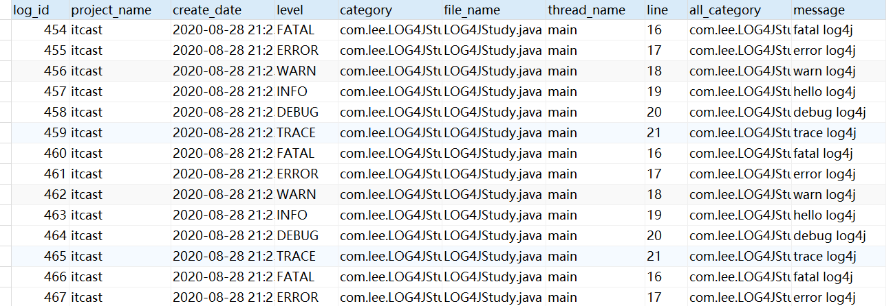


#### 3.2.7 自定义logger

我们可以自定义logger，个性实现日志：

```properties
# RootLogger配置
log4j.rootLogger = ALL,file

# 自定义Logger
log4j.logger.com.lee = info,Console
...
```

测试代码：

```java
@Test
public void testLog4j() throws InterruptedException {
    // 创建日志记录器对象
    Logger logger = Logger.getLogger("com.lee");
    // 日志记录输出
    logger.fatal("fatal log4j");
    logger.error("error log4j");
    logger.warn("warn log4j");
    logger.info("hello log4j");
    logger.debug("debug log4j");
    logger.trace("trace log4j");
}
```

结果：


### 3.3 JCL的使用

全称为Jakarta Commons Logging，是Apache提供的一个通用日志API。

它是为 "所有的Java日志实现"提供一个统一的接口，它自身也提供一个日志的实现，但是功能非常弱
（SimpleLog）。所以一般不会单独使用它。他允许开发人员使用不同的具体日志实现工具: Log4j, Jdk
自带的日志（JUL)。

JCL 有两个基本的抽象类：Log(基本记录器)和LogFactory(负责创建Log实例)。

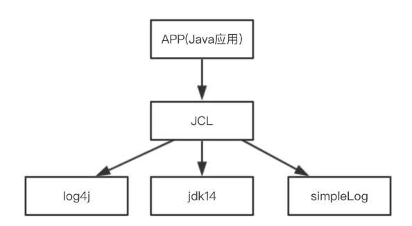

#### 3.3.1 JCL入门程序

首先引入依赖：

```xml
<dependency>
    <groupId>commons-logging</groupId>
    <artifactId>commons-logging</artifactId>
    <version>1.2</version>
</dependency>
```

测试代码：

```java
@Test
public void testJCL(){
    // 创建日志对象
    Log log = LogFactory.getLog(JCLStudy.class);

    // 日志记录输出
    log.fatal("fatal");
    log.error("error");
    log.warn("warn");
    log.info("info");
    log.debug("debug");
    log.trace("trace");
}
```

测试结果：

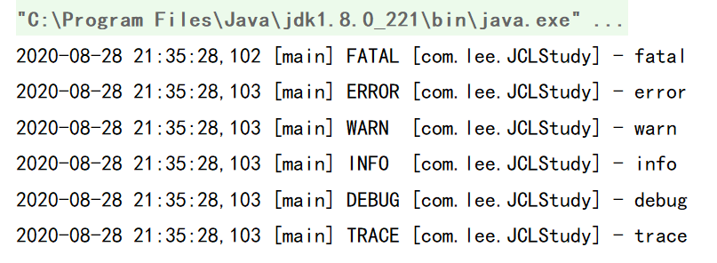

由于我们的项目中使用了LOG4J，所以JCL使用LOG4J作为其日志实现，即实际上是使用了LOG4J。

如果我们把LOG4J依赖去除，则JCL会使用JUL来作为其日志实现，结果为：

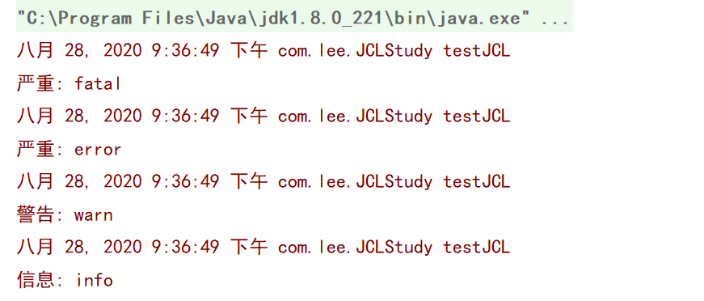


#### 3.3.2 原理

1. 通过LogFactory动态加载Log实现类

   

2. 日志门面支持的日志实现数组

   ```java
   private static final String[] classesToDiscover =
       new String[]{"org.apache.commons.logging.impl.Log4JLogger",
                    "org.apache.commons.logging.impl.Jdk14Logger",
                    "org.apache.commons.logging.impl.Jdk13LumberjackLogger",
                    "org.apache.commons.logging.impl.SimpleLog"};
   ```

3. 获取具体的日志实现

   ```java
   for(int i = 0; i < classesToDiscover.length && result == null; ++i) {
       result = this.createLogFromClass(classesToDiscover[i], logCategory,true);
   }
   ```


### 3.4 slf4j的使用

简单日志门面(Simple Logging Facade For Java) SLF4J主要是为了给Java日志访问提供一套标准、规范的API框架，其主要意义在于提供接口，具体的实现可以交由其他日志框架，例如log4j和logback等。当然slf4j自己也提供了功能较为简单的实现，但是一般很少用到。对于一般的Java项目而言，日志框架会选择`slf4j-api`作为门面，配上具体的实现框架（log4j、logback等），中间使用桥接器完成桥接。

SLF4J日志门面主要提供两大功能：

- 日志框架的绑定
- 日志框架的桥接

#### 3.4.1 slf4j的入门程序

首先导入依赖：

```xml
<!--slf4j core 使用slf4j必須添加-->
<dependency>
    <groupId>org.slf4j</groupId>
    <artifactId>slf4j-api</artifactId>
    <version>1.7.27</version>
</dependency>
<!--slf4j 自带的简单日志实现 -->
<dependency>
    <groupId>org.slf4j</groupId>
    <artifactId>slf4j-simple</artifactId>
    <version>1.7.27</version>
</dependency>
```

然后编写代码：

```java
import org.junit.Test;
import org.slf4j.Logger;
import org.slf4j.LoggerFactory;

public class SLF4JStudy {

    // 静态日志记录器
    private static final Logger LOGGER = LoggerFactory.getLogger(SLF4JStudy.class);

    @Test
    public void test01(){
        // 输出日志
        LOGGER.error("erroe");
        LOGGER.warn("warn");
        LOGGER.info("info");
        LOGGER.debug("debug");
        LOGGER.trace("trace");

        // 使用占位符输出变量
        String name = "张三";
        Integer age = 18;
        LOGGER.info("用户姓名：{}，年龄：{}",name,age);
    }
}
```

结果：


#### 3.4.2 slf4j日志框架的绑定

如前所述，SLF4J支持各种日志框架。SLF4J发行版附带了几个称为“SLF4J绑定”的jar文件，每个绑定对应一个受支持的框架。

使用slf4j的日志绑定流程:
- 添加slf4j-api的依赖

- 使用slf4j的API在项目中进行统一的日志记录

- 绑定具体的日志实现框架
  - 绑定已经实现了slf4j的日志框架,直接添加对应依赖
  - 绑定没有实现slf4j的日志框架,先添加日志的适配器,再添加实现类的依赖

- slf4j有且仅有一个日志实现框架的绑定（如果出现多个默认使用第一个依赖日志实现）


通过maven引入常见的日志实现框架：

```xml
<!--slf4j core 使用slf4j必須添加-->
<dependency>
    <groupId>org.slf4j</groupId>
    <artifactId>slf4j-api</artifactId>
    <version>1.7.27</version>
</dependency>

<!-- slf4j 自带的简单日志实现 -->
<dependency>
    <groupId>org.slf4j</groupId>
    <artifactId>slf4j-simple</artifactId>
    <version>1.7.27</version>
</dependency>

<!-- logback 只需要导入logback-classic依赖，不需要导入logback-core-->
<dependency>
    <groupId>ch.qos.logback</groupId>
    <artifactId>logback-classic</artifactId>
    <version>1.2.3</version>
</dependency>

<!-- log4j-->
<!-- 首先需要导入适配器 -->
<dependency>
    <groupId>org.slf4j</groupId>
    <artifactId>slf4j-log4j12</artifactId>
    <version>1.7.27</version>
</dependency>
<!-- 然后导入log4j的实现 -->
<dependency>
    <groupId>log4j</groupId>
    <artifactId>log4j</artifactId>
    <version>1.2.17</version>
</dependency>

<!-- jul 直接导入适配器，实现为JDK内置-->
<dependency>
    <groupId>org.slf4j</groupId>
    <artifactId>slf4j-jdk14</artifactId>
    <version>1.7.27</version>
</dependency>

<!--jcl -->
<dependency>
    <groupId>org.slf4j</groupId>
    <artifactId>slf4j-jcl</artifactId>
    <version>1.7.27</version>
</dependency>

<!-- nop 日志开关，表示不使用日志框架-->
<dependency>
    <groupId>org.slf4j</groupId>
    <artifactId>slf4j-nop</artifactId>
    <version>1.7.27</version>
</dependency>
```

要切换日志框架，只需替换类路径上的slf4j绑定。例如，要从`java.util.logging`切换到log4j，只需将`slf4j-jdk14-1.7.27.jar`替换为`slf4j-log4j12-1.7.27.jar`即可。

SLF4J不依赖于任何特殊的类装载。实际上，每个SLF4J绑定在编译时都是硬连线的， 以使用一个且只有一个特定的日志记录框架。例如，`slf4j-log4j12-1.7.27.jar`在编译时绑定以使用log4j。在您的代码中，除了`slf4j-api-1.7.27.jar`之外，您只需将您选择的**一个且只有一个**绑定放到相应的类路径位置。不要在类路径上放置多个绑定。


#### 3.4.3 slf4j桥接旧的日志框架

通常，您依赖的某些组件依赖于SLF4J以外的日志记录API。您也可以假设这些组件在不久的将来会切换到SLF4J。为了解决这种情况，SLF4J附带了几个桥接模块，这些模块将对log4j，JCL和java.util.logging API的调用重定向，就好像它们是对SLF4J API调用一样。

桥接解决的是项目中日志的遗留问题，当系统中存在之前的日志API，可以通过桥接转换到slf4j的实现
1. 先去除之前老的日志框架的依赖
2. 添加SLF4J提供的桥接组件
3. 为项目添加SLF4J的具体实现，如logback等

桥接组件有：

```xml
<!-- log4j-->
<dependency>
    <groupId>org.slf4j</groupId>
    <artifactId>log4j-over-slf4j</artifactId>
    <version>1.7.27</version>
</dependency>
<!-- jul -->
<dependency>
    <groupId>org.slf4j</groupId>
    <artifactId>jul-to-slf4j</artifactId>
    <version>1.7.27</version>
</dependency>
<!--jcl -->
<dependency>
    <groupId>org.slf4j</groupId>
    <artifactId>jcl-over-slf4j</artifactId>
    <version>1.7.27</version>
</dependency>
```

注意问题：

- 桥接器和适配器不能同时出现，否则会出现无限循环
  - `jcl-over-slf4j.jar`和 `slf4j-jcl.jar`不能同时出现。前一个jar文件将导致JCL将日志系统的选择委托给SLF4J，后一个jar文件将导致SLF4J将日志系统的选择委托给JCL，从而导致无限循环。
  - `log4j-over-slf4j.jar`和`slf4j-log4j12.jar`不能同时出现。
  - `jul-to-slf4j.jar`和`slf4j-jdk14.jar`不能同时出现。
- 所有的桥接都只对Logger日志记录器对象有效，如果程序中调用了内部的配置类或者是Appender,Filter等对象，将无法产生效果。

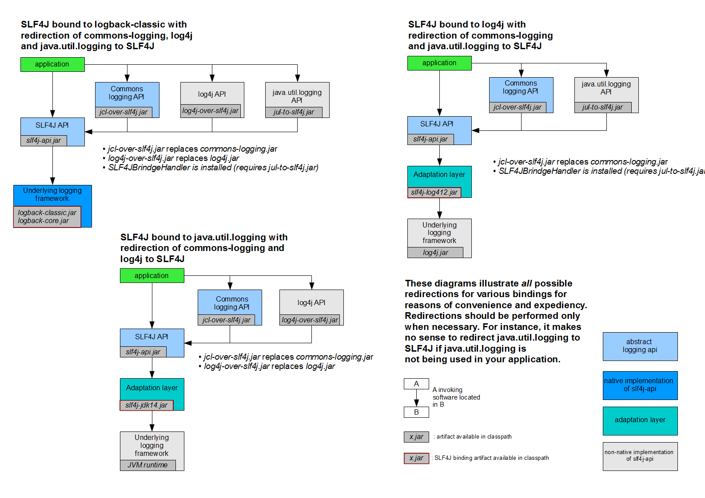


### 3.5 logback的使用


#### 3.5.1 logback入门程序

首先添加slf4j日志门面以及logback日志实现依赖：

```xml
<dependency>
    <groupId>org.slf4j</groupId>
    <artifactId>slf4j-api</artifactId>
    <version>1.7.25</version>
</dependency>
<dependency>
    <groupId>ch.qos.logback</groupId>
    <artifactId>logback-classic</artifactId>
    <version>1.2.3</version>
</dependency>
```

然后编写测试代码：

```java
// 定义日志对象
public static final Logger LOGGER = LoggerFactory.getLogger(LogbackStudy.class);

@Test
public void testSlf4j() {
    // 打印日志信息
    LOGGER.error("error");
    LOGGER.warn("warn");
    LOGGER.info("info");
    LOGGER.debug("debug");
    LOGGER.trace("trace");
}
```

结果：


#### 3.5.2 logback配置文件

logback会依次读取以下类型配置文件：

- logback.groovy
- logback-test.xml
- logback.xml 
- 如果均不存在会采用默认配置

控制台ConsoleAppender配置：

```xml
<?xml version="1.0" encoding="UTF-8"?>
<configuration>
    <!--
    日志输出格式：
        %-5level
        %d{yyyy-MM-dd HH:mm:ss.SSS}日期
        %c类的完整名称
        %M为method
        %L为行号
        %thread线程名称
        %m或者%msg为信息
        %n换行
    -->
    <!--集中配置属性，后续可以通过${name}进行引用-->
    <property name="pattern" value="%d{yyyy-MM-dd HH:mm:ss.SSS} %c [%thread] %-5level %msg%n"/>

    <!-- 配置appender
         常用的有以下几个
           ch.qos.logback.core.ConsoleAppender (控制台)
           ch.qos.logback.core.rolling.RollingFileAppender (文件大小到达指定尺寸的时候产生一个新文件)
           ch.qos.logback.core.FileAppender (文件)
    -->
    <appender name="console" class="ch.qos.logback.core.ConsoleAppender">
        <!-- 配置输出流，默认为System.out(黑色字体)，修改为System.err(红色字体) -->
        <target>System.err</target>
        <!-- 配置日志输出格式 -->
        <encoder class="ch.qos.logback.classic.encoder.PatternLayoutEncoder">
            <pattern>${pattern}</pattern>
        </encoder>
    </appender>

    <!-- 配置rootLogger -->
    <root level="ALL">
        <!-- <root>可以包含零个或多个<appender-ref>元素，标识这个appender将会添加到rootLogger。-->
        <appender-ref ref="console"></appender-ref>
    </root>
</configuration>
```

结果：


文件FileAppender配置：

```xml
<!--日志文件输出appender对象-->
<appender name="file" class="ch.qos.logback.core.FileAppender">
    <!--日志格式配置-->
    <encoder class="ch.qos.logback.classic.encoder.PatternLayoutEncoder">
        <pattern>${pattern}</pattern>
    </encoder>
    <!--日志输出路径-->
    <file>d:/logback.log</file>
</appender>

<!-- 配置rootLogger -->
<root level="ALL">
    <!--<root>可以包含零个或多个<appender-ref>元素，表示这个appender将会添加到rootLogger-->
    <appender-ref ref="file"/>
</root>
```

如果想将日志输出为HTML文件，可以如下配置：

```xml
<!--日志文件输出appender对象,输出格式为html-->
<appender name="htmlfile" class="ch.qos.logback.core.FileAppender">
    <!--日志格式配置,为html-->
    <encoder class="ch.qos.logback.core.encoder.LayoutWrappingEncoder">
        <layout class="ch.qos.logback.classic.html.HTMLLayout">
            <!-- 日志格式，不需要有空格，其他字符也可以不加 -->
            <pattern>%d{yyyy-MM-dd HH:mm:ss.SSS}%c%thread%-5level%msg</pattern>
        </layout>
    </encoder>
    <!--日志输出路径-->
    <file>d:/logback.html</file>
</appender>

<!-- 配置rootLogger -->
<root level="ALL">
    <!--<root>可以包含零个或多个<appender-ref>元素，表示这个appender将会添加到rootLogger-->
    <appender-ref ref="htmlfile"/>
</root>
```

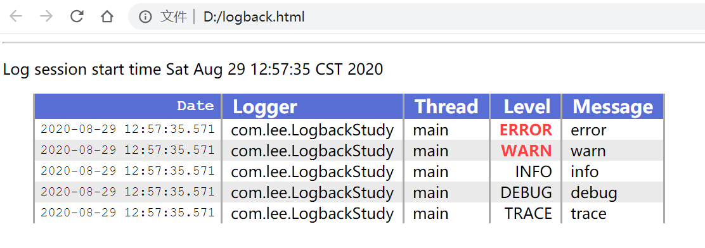

RollingFileAppender配置：

```xml
<!-- 日志文件拆分和归档的appender对象-->
<appender name="rollFile"
          class="ch.qos.logback.core.rolling.RollingFileAppender">
    <!--日志格式配置-->
    <encoder class="ch.qos.logback.classic.encoder.PatternLayoutEncoder">
        <pattern>${pattern}</pattern>
    </encoder>
    <!--日志输出路径-->
    <file>d:/roll_logback.log</file>
    <!--指定日志文件拆分和压缩规则-->
    <rollingPolicy class="ch.qos.logback.core.rolling.SizeAndTimeBasedRollingPolicy">
        <!--通过指定压缩文件名称，来按照时间分割文件-->
        <!-- %i表示文件大小超出时，分隔文件的编号
 		     gz表示压缩文件	
		-->
        <fileNamePattern>d:/rolling%i.%d{yyyy-MM-dd-hh-mm-ss}.log.gz</fileNamePattern>
        <!--文件拆分大小-->
        <maxFileSize>1MB</maxFileSize>
    </rollingPolicy>
</appender>
```


异步日志的配置：

```xml
<!--异步日志-->
<appender name="async" class="ch.qos.logback.classic.AsyncAppender">
    <!-- 指定具体的日志输出对象 -->
    <appender-ref ref="console"/>
</appender>

<!-- 配置rootLogger -->
<root level="ALL">
    <appender-ref ref="async"/>
</root>
```


### 3.6 log4j2的使用

Apache Log4j 2是对Log4j的升级版，参考了logback的一些优秀的设计，并且修复了一些问题，因此带来了一些重大的提升，主要有：

- 异常处理，在logback中，Appender中的异常不会被应用感知到，但是在log4j2中，提供了一些异
  常处理机制。
- 性能提升， log4j2相较于log4j 和logback都具有很明显的性能提升，后面会有官方测试的数据。
- 自动重载配置，参考了logback的设计，当然会提供自动刷新参数配置，最实用的就是我们在生产
  上可以动态的修改日志的级别而不需要重启应用。
- 无垃圾机制，log4j2在大部分情况下，都可以使用其设计的一套无垃圾机制，避免频繁的日志收集
  导致的jvm gc。

#### 3.6.1 log4j2 入门程序

目前市面上最主流的日志门面就是SLF4J，虽然Log4j2也是日志门面，但是因为它的日志实现功能非常强大，性能优越。所以大家一般还是将Log4j2看作是日志的实现，Slf4j + Log4j2应该是未来的大势所趋。

本次入门程序将log4j2作为日志门面和实现。

首先加入依赖：

```xml
<!-- Log4j2 门面API-->
<dependency>
    <groupId>org.apache.logging.log4j</groupId>
    <artifactId>log4j-api</artifactId>
    <version>2.11.1</version>
</dependency>
<!-- Log4j2 日志实现 -->
<dependency>
    <groupId>org.apache.logging.log4j</groupId>
    <artifactId>log4j-core</artifactId>
    <version>2.11.1</version>
</dependency>
```

然后编写程序：

```java
private static final Logger LOGGER = LogManager.getLogger(Log4j2Study.class);

@Test
public void test01(){
    LOGGER.fatal("fatal");
    LOGGER.error("error");
    LOGGER.warn("warn");
    LOGGER.info("info");
    LOGGER.debug("debug");
    LOGGER.trace("trace");
}
```

结果：


我们也可以使用slf4j作为日志门面，Log4j2作为日志实现：

```xml
<!--使用slf4j作为日志的门面,使用log4j2来记录日志 -->
<dependency>
    <groupId>org.slf4j</groupId>
    <artifactId>slf4j-api</artifactId>
    <version>1.7.25</version>
</dependency>
<!--为slf4j绑定日志实现 log4j2的适配器 -->
<dependency>
    <groupId>org.apache.logging.log4j</groupId>
    <artifactId>log4j-slf4j-impl</artifactId>
    <version>2.10.0</version>
</dependency>
<!-- Log4j2 门面API-->
<dependency>
<groupId>org.apache.logging.log4j</groupId>
<artifactId>log4j-api</artifactId>
<version>2.11.1</version>
</dependency>
<!-- Log4j2 日志实现 -->
<dependency>
    <groupId>org.apache.logging.log4j</groupId>
    <artifactId>log4j-core</artifactId>
    <version>2.11.1</version>
</dependency>
```


#### 3.6.2 log4j2 配置文件

log4j2默认加载classpath下的 log4j2.xml 文件中的配置。

```xml
<?xml version="1.0" encoding="UTF-8"?>
<!-- 
	 status="warn"  日志框架本身的输出日志级别
	 monitorInterval="5"  自动加载配置文件的间隔时间，不低于5秒
-->
<Configuration status="warn" monitorInterval="5">
    <!-- 集中配置属性进行管理，通过${name}进行使用 -->
    <properties>
        <property name="LOG_HOME">D:/logs</property>
    </properties>
    
    <!-- 配置appender -->
    <Appenders>
        <!-- 配置consoleAppender -->
        <Console name="Console" target="SYSTEM_ERR">
            <PatternLayout pattern="%d{HH:mm:ss.SSS} [%t] [%-5level] %c{36}:%L - -- %m%n" />
        </Console>
        
        <!-- 配置fileAppender -->
        <File name="file" fileName="${LOG_HOME}/myfile.log">
            <PatternLayout pattern="[%d{yyyy-MM-dd HH:mm:ss.SSS}] [%-5level] %l %c{36} - %m%n" />
        </File>
        
        <!-- 配置随机读写流的日志文件输出，性能提高 -->
        <RandomAccessFile name="accessFile" fileName="${LOG_HOME}/myAcclog.log">
            <PatternLayout pattern="[%d{yyyy-MM-dd HH:mm:ss.SSS}] [%-5level] %l
                                    %c{36} - %m%n" />
        </RandomAccessFile>
        
        <!-- 按照一定规则拆分日志文件的appender -->
        <RollingFile name="rollingFile" fileName="${LOG_HOME}/myrollog.log"
                     filePattern="D:/logs/$${date:yyyy-MM-dd}/myrollog-%d{yyyy-MM-dd-HH-mm}-%i.log">
            <!-- 过滤器 --> 
            <ThresholdFilter level="debug" onMatch="ACCEPT" onMismatch="DENY" />
            <PatternLayout pattern="[%d{yyyy-MM-dd HH:mm:ss.SSS}] [%-5level] %l %c{36} - %msg%n" />
            <Policies>
                <OnStartupTriggeringPolicy />
                <!-- 按照文件大小进行拆分 -->
                <SizeBasedTriggeringPolicy size="10 MB" />
                <!-- 按照时间节点进行拆分，规则根据filePattern定义 -->
                <TimeBasedTriggeringPolicy />
            </Policies>
            <!-- 在同一个目录下，最多存在30个日志文件 -->
            <DefaultRolloverStrategy max="30" />
        </RollingFile>
        
    </Appenders>
    
    <!-- 配置logger -->
    <Loggers>
        <!-- 配置rootLogger -->
        <Root level="trace">
            <AppenderRef ref="Console" />
        </Root>
    </Loggers>
</Configuration>
```


#### 3.6.3 log4j2 异步日志

Log4j2提供了两种实现日志的方式，一个是通过AsyncAppender，一个是通过AsyncLogger，分别对应前面说的Appender组件和Logger组件。
注意：配置异步日志需要添加依赖：

```xml
<!--异步日志依赖-->
<dependency>
    <groupId>com.lmax</groupId>
    <artifactId>disruptor</artifactId>
    <version>3.3.4</version>
</dependency>
```

==**AsyncAppender方式**==

```xml
<?xml version="1.0" encoding="UTF-8"?>
<Configuration status="warn">
    <properties>
        <property name="LOG_HOME">D:/logs</property>
    </properties>
    <Appenders>
        <File name="file" fileName="${LOG_HOME}/myfile.log">
            <PatternLayout>
                <Pattern>%d %p %c{1.} [%t] %m%n</Pattern>
            </PatternLayout>
        </File>
        <Async name="Async">
            <AppenderRef ref="file"/>
        </Async>
    </Appenders>
    <Loggers>
        <Root level="error">
            <AppenderRef ref="Async"/>
        </Root>
    </Loggers>
</Configuration>
```


**==AsyncLogger方式==**

- 全局异步

  所有的日志都异步的记录，在配置文件上不用做任何改动，只需要添加一个log4j2.component.properties 配置文件，其内容如下：

  ```properties
  Log4jContextSelector=org.apache.logging.log4j.core.async.AsyncLoggerCon
  textSelector
  ```

- 混合异步

  你可以在应用中同时使用同步日志和异步日志，这使得日志的配置方式更加灵活。

  ```xml
  <?xml version="1.0" encoding="UTF-8"?>
  <Configuration status="WARN">
      <properties>
          <property name="LOG_HOME">D:/logs</property>
      </properties>
      <Appenders>
          <File name="file" fileName="${LOG_HOME}/myfile.log">
              <PatternLayout>
                  <Pattern>%d %p %c{1.} [%t] %m%n</Pattern>
              </PatternLayout>
          </File>
          <Async name="Async">
              <AppenderRef ref="file"/>
          </Async>
      </Appenders>
      <Loggers>
          <AsyncLogger name="com.itheima" level="trace"
                       includeLocation="false" additivity="false">
              <AppenderRef ref="file"/>
          </AsyncLogger>
          <Root level="info" includeLocation="true">
              <AppenderRef ref="file"/>
          </Root>
      </Loggers>
  </Configuration>
  ```

  如上配置： com.itheima 日志是异步的，root日志是同步的。

  使用异步日志需要注意的问题：
  1. 如果使用异步日志，AsyncAppender、AsyncLogger和全局日志，不要同时出现。性能会和
  AsyncAppender一致，降至最低。
  2. 设置`includeLocation=false` ，否则打印位置信息会急剧降低异步日志的性能，比同步日志还要
  慢。


