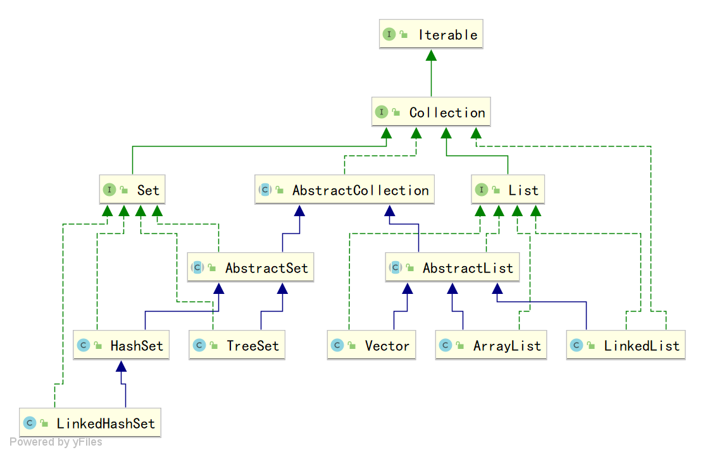

# Java进阶— —集合：Collection框架介绍

本文主要介绍`Collection`集合框架。

[toc]

## 一、Collection框架UML概述

`Collection`框架UML图如下，包括接口，抽象类以及实现类。

抽象类存在的意义是为了实现共性方法，以免每个实现类都实现一遍共性方法，造成类繁琐。

## 二、Collection中的方法

本节主要介绍`Collection`中的一些常用方法：

- `boolean add(E e)  `：向集合中添加一个元素；
- `void clear()  `：清除集合中的所有元素；
- `boolean contains(Object o)  `：确认集合中是否包含元素o；
- `boolean isEmpty()  `：返回集合是否为空，如果为空返回`true`，否则返回`false`；
- `boolean remove(Object o)  `：清除集合中的某个元素；
- `int size()  `：返回集合中的元素个数；
- `Object[] toArray()  `：将集合转换为数组；