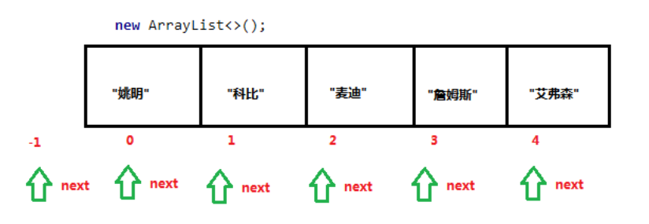

# Java进阶— —集合：迭代器Iterator

本文主要介绍迭代器。

[toc]

## 一、什么是迭代器

在程序开发中，经常需要遍历集合中的所有元素。针对这种需求，JDK专门提供了一个接口`java.util.Iterator`。`Iterator`接口也是Java集合中的一员，但它与`Collection`、`Map`接口有所不同，`Collection`接口与`Map`接口主要用于存储元素，而`Iterator`主要用于迭代访问（即遍历）`Collection`中的元素，因此`Iterator`对象也被称为迭代器。


## 二、迭代器的使用

要想使用迭代器，首先需要获取迭代器，我们可以通过`Collection`接口中的方法获取迭代器：

- `public Iterator iterator()`: 获取集合对应的迭代器，用来遍历集合中的元素的。

`Iterator`接口的常用方法如下：

* `public E next()`：返回迭代的下一个元素，并将指针向后移动一位；如果没有元素可以迭代，则抛出异常`NoSuchElementException`。
* `public boolean hasNext()`：如果仍有元素可以迭代，则返回 `true`，否则返回`false`。

案例：

```java
public static void main(String[] args) {
    Collection<String> collection = new ArrayList<>();
    collection.add("张三");
    collection.add("李四");
    collection.add("王五");
    collection.add("赵六");

    // 获取迭代器对象
    Iterator<String> iterator = collection.iterator();
    // 使用迭代器对象进行遍历集合
    while (iterator.hasNext()){
        String next = iterator.next();
        System.out.println(next);
    }
}
```

结果：


## 三、迭代器的原理

在调用`Iterator`的`next()`方法之前，迭代器的索引位于第一个元素之前，不指向任何元素，当调用迭代器的`next()`方法后，迭代器的索引会向后移动一位，指向下一个元素并将该元素返回，依此类推，直到`hasNext()`方法返回`false`，表示到达了集合的末尾，终止对元素的遍历。




## 四、增强for循环

增强for循环(也称for each循环)是**JDK1.5**以后出来的一个高级for循环，它的内部原理其实是个`Iterator`迭代器。它用于遍历`Collection`集合和数组，通常只进行遍历元素，不要在遍历的过程中对集合元素进行增删操作。

只要实现了`Iterable<T>`这个接口，便可以使用增强for循环遍历。

```java
package java.lang;

import java.util.Iterator;
import java.util.Objects;
import java.util.Spliterator;
import java.util.Spliterators;
import java.util.function.Consumer;

public interface Iterable<T> {
 
    Iterator<T> iterator();

    default void forEach(Consumer<? super T> action) {
        Objects.requireNonNull(action);
        for (T t : this) {
            action.accept(t);
        }
    }

    default Spliterator<T> spliterator() {
        return Spliterators.spliteratorUnknownSize(iterator(), 0);
    }
}

```

其使用方法为：

```java
for(数组/集合元素的数据类型  变量 : 数组/Collection集合){ 
  	...
}
```

