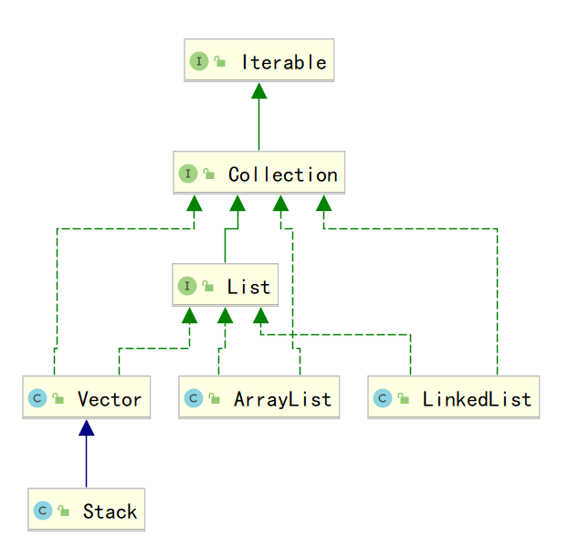

# Java进阶— —集合：List

本文主要结束`List`及其实现类的相关知识。

[toc]

## 一、List

`java.util.List`接口继承自`Collection`接口，是单列集合的一个重要分支，习惯性地会将实现了`List`接口的对象称为`List`集合。在List集合中允许出现重复的元素，所有的元素是以一种线性方式进行存储的，在程序中可以通过索引来访问集合中的指定元素。另外，List集合还有一个特点就是元素有序，即元素的存入顺序和取出顺序一致。

`List`及其实现类的框架如下：




`List`继承了接口`Collection`，所以除了`Collection`中的方法，有关索引方法如下：

- `public void add(int index, E element)`:  将指定的元素，添加到该集合中的指定位置上。
- `public E get(int index)`: 返回集合中指定位置的元素。
- `public E remove(int index)`:  移除列表中指定位置的元素, 返回的是被移除的元素。
- `public E set(int index, E element)`: 用指定元素替换集合中指定位置的元素，返回值的更新前的元素


## 二、ArrayList

`java.util.ArrayList`集合数据存储的结构是**数组结构**。**元素增删慢，查找快**，由于日常开发中使用最多的功能为查询数据、遍历数据，所以`ArrayList`是最常用的集合。

`ArrayList`里面有两个概念，一个是`capacity`，它表示的就是“容量”，其实质是数组`elementData`的长度。而`size`则表示的“存放的元素的个数”。

当集合增加一个元素时，有可能触发`ArrayList`的扩容机制，有关扩容的方法如下：

```java
// 扩容一个
private Object[] grow() {
	return grow(size + 1);
}

// 保证扩容到期望容量minCapacity及以上
private Object[] grow(int minCapacity) {
    return elementData = Arrays.copyOf(elementData,
                                       newCapacity(minCapacity));
}

// 根据期望容量minCapacity计算实际需要扩容的容量
private int newCapacity(int minCapacity) {
    // overflow-conscious code
    int oldCapacity = elementData.length; // 得到旧容量
    int newCapacity = oldCapacity + (oldCapacity >> 1); // 设置新容量为旧容量的1.5倍
    if (newCapacity - minCapacity <= 0) { // 如果新容量仍然小于期望容量
        if (elementData == DEFAULTCAPACITY_EMPTY_ELEMENTDATA) // 如果是使用的默认容量
            return Math.max(DEFAULT_CAPACITY, minCapacity); // 取默认容量和期望容量较大值返回
        if (minCapacity < 0) // overflow // 检查期望容量是否越界（int 的范围）
            throw new OutOfMemoryError();
        return minCapacity; // 返回期望容量
    }
    // 如果新容量大于期望容量，判断一下新容量是否越界
    return (newCapacity - MAX_ARRAY_SIZE <= 0)
        ? newCapacity
        : hugeCapacity(minCapacity);
}

```

在方法`newCapacity(int minCapacity)`中，**默认情况下，新的容量会是原容量的1.5倍，这里用了位运算提高效率**。一般情况下，如果扩容1.5倍后就大于期望容量，那就返回这个1.5倍旧容量的值。而如果小于期望容量，那就返回期望容量。这里对默认容量10做了特殊处理。

**使用1.5倍这个数值而不是直接使用期望容量，是为了防止频繁扩容影响性能**。试想如果每次`add()`操作都要扩容一次，那性能将会非常低下。


## 三、LinkedList

`java.util.LinkedList`集合数据存储的结构是**双向链表结构。**双向链表**增加删除元素快，查找慢。**

`LinkedList`提供了大量首尾操作的方法。这些方法我们作为了解即可：

* `public void addFirst(E e)`:将指定元素插入此列表的开头。

* `public void addLast(E e)`:将指定元素添加到此列表的结尾。

* `public E getFirst()`:返回此列表的第一个元素。

* `public E getLast()`:返回此列表的最后一个元素。

* `public E removeFirst()`:移除并返回此列表的第一个元素。

* `public E removeLast()`:移除并返回此列表的最后一个元素。

* `public E pop()`:从此列表所表示的堆栈处弹出一个元素，相当于`removeFirst()`。

* `public void push(E e)`:将元素推入此列表所表示的堆栈，相当于`addFirst()`。

* `public boolean isEmpty()`：如果列表不包含元素，则返回true。

  

## 四、Vector

``java.util.Vector<E>`类似于`ArrayList`，表示大小可变的列表。不过，其有一些不同之处：

- `Vector `始于JDK 1.0，而`List`始于JDK 1.2，所以`Vector`比`List`早，因此其包含很多`List`种没有的方法；
- `Vector`是线程安全的，而`ArrayList`和`LinkedList`不是线程安全的；

`Vector`中特有的方法：

- `Enumeration<E> elements()  `：类似于迭代器，用于遍历列表；
- `void addElement(E obj)  `：添加元素，类似于`add(E e)`；


## 五、Stack

栈`Stack<E>`是`Vector`的一个子类，它实现了一个标准的后进先出的栈。

其方法如下：

- `public Stack()`：创建一个空栈；
- `boolean empty() `：测试栈是否为空；
- `E peek()  `：查看栈顶的元素，但不移除；
- `E pop()  `：移除并返回栈顶元素；
-  `E push(E item)  `：将元素压入栈顶；