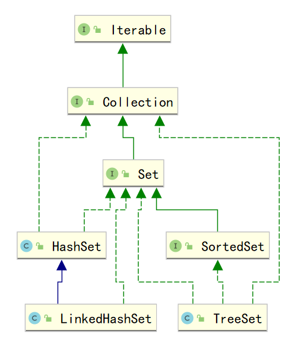
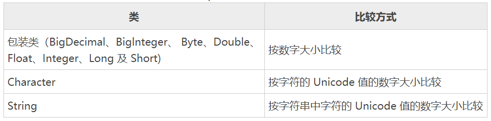
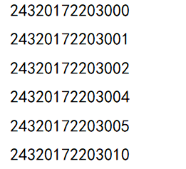
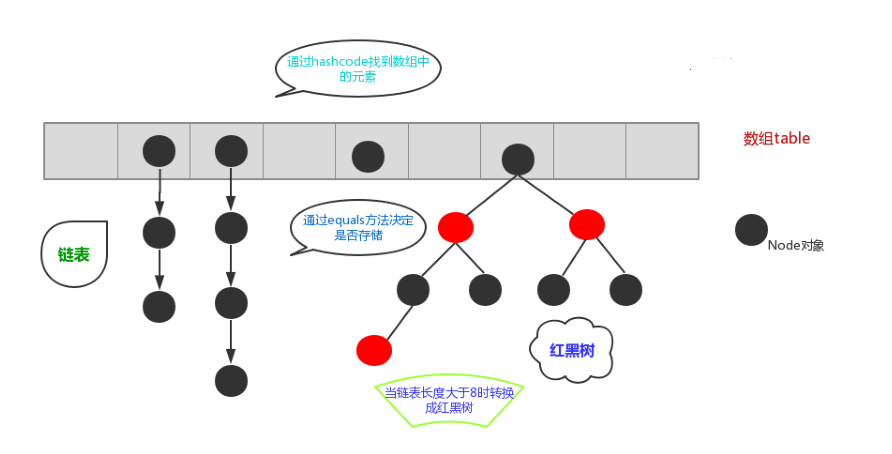
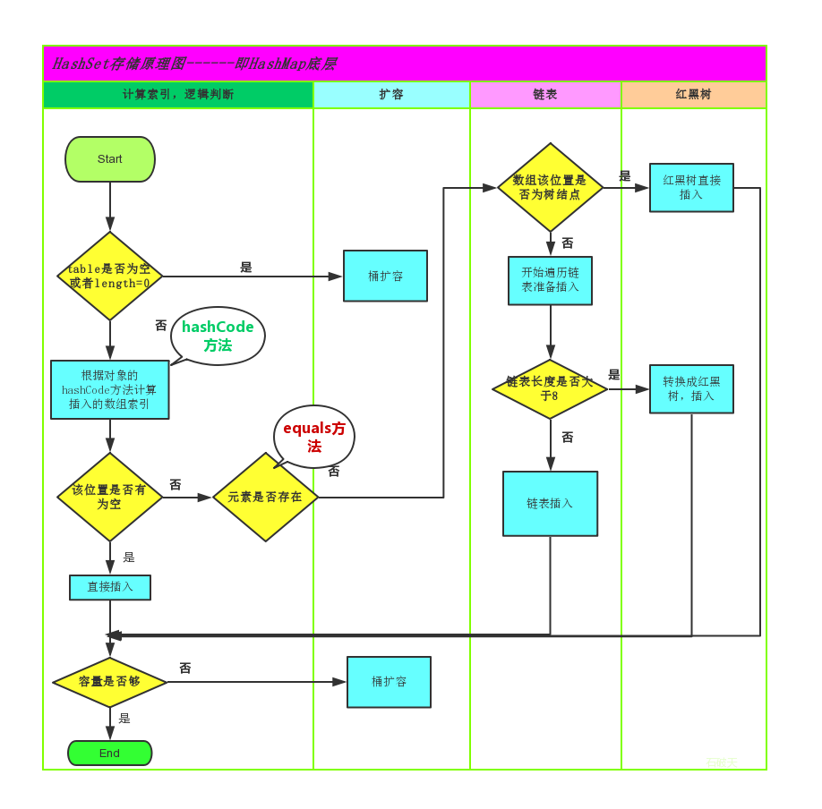

# Java进阶— —集合：Set

本文主要介绍`Set`及其实现类得相关知识。

[toc]

## 一、Set

`java.util.Set` 接口继承自 `Collection` 接口，它与 `Collection` 接口中的方法基本一致，并没有对 `Collection` 接口进行功能上的扩充。与 `List` 接口不同的是，**` Set `接口中元素无序，并且都会以某种规则保证存入的元素不出现重复。**

我们可以使用迭代器和增强for循环来遍历`Set`集合，由于`Set`集合没有索引，所以不能使用普通的for循环遍历集合。

`Set` 集合有多个子类，其UML图如下：




## 二、TreeSet

`TreeSet` 类同时实现了 `Set` 接口和 `SortedSet` 接口。`SortedSet` 接口是 Set 接口的子接口，可以实现对集合进行自然排序，因此使用 `TreeSet` 类默认情况下是自然排序的，这里的自然排序指的是**升序排序**。

`TreeSet` 只能对实现了 `Comparable` 接口的类对象进行排序，因为 `Comparable` 接口中有一个`compareTo(Object o) `方法用于比较两个对象的大小。例如 `a.compareTo(b)`，如果 a 和 b 相等，则该方法返回 0；如果 a 大于 b，则该方法返回大于 0 的值；如果 a 小于 b，则该方法返回小于 0 的值。

下图表示 JDK 类库中实现了 `Comparable` 接口的类，以及这些类对象的比较方式:



`TreeSet` 类除了实现 `Collection` 接口的所有方法之外，还提供了如下表 所示的方法：

|                     方法名称                     | 说明                                                         |
| :----------------------------------------------: | :----------------------------------------------------------- |
|                   `E first()`                    | 返回此集合中的第一个元素。其中，E 表示集合中元素的数据类型   |
|                    `E last()`                    | 返回此集合中的最后一个元素                                   |
|                 `E poolFirst()`                  | 获取并移除此集合中的第一个元素                               |
|                  `E poolLast()`                  | 获取并移除此集合中的最后一个元素                             |
| `SortedSet<E> subSet(E fromElement,E toElement)` | 返回一个新的集合，新集合包含原集合中 fromElement 对象与 toElement 对象之间的所有对象。**包含 fromElement 对象，不包含 toElement 对象。** |
|       `SortedSet<E> headSet(E toElement)`        | 返回一个新的集合，新集合包含原集合中 toElement 对象之前的所有对象。 **不包含 toElement 对象。** |
|      `SortedSet<E> tailSet(E fromElement)`       | 返回一个新的集合，新集合包含原集合中 fromElement 对象之后的所有对 象。**包含 fromElement 对象。** |

案例：现有许多学号，希望能将这些学号有序输出，并且不重复输出。

我们可以考虑将这些学号存入`TreeSet`中，既有序又不重复。

```java
public static void main(String[] args) {
    TreeSet<String> studentNumbers = new TreeSet<>();
    // 无序输入学号
    studentNumbers.add("24320172203000");
    studentNumbers.add("24320172203001");
    studentNumbers.add("24320172203004");
    studentNumbers.add("24320172203005");
    studentNumbers.add("24320172203002");
    studentNumbers.add("24320172203010");
    studentNumbers.add("24320172203005");      // 重复输入

    for (String studentNumber : studentNumbers){
        System.out.println(studentNumber);
    }
}
```

结果：




## 三、HashSet

`java.util.HashSet` 是 `Set` 接口的一个实现类，它所存储的元素是不可重复的，并且元素都是无序的(即存取顺序不一致)。

`HashSet` 是根据对象的哈希值来确定元素在集合中的存储位置，因此具有良好的存取和查找性能。保证元素唯一性的方式依赖于： `hashCode()` 与 `equals()` 方法。

在JDK1.8之前，哈希表底层采用数组+链表实现，即使用链表处理哈希冲突，同一hash值的元素都存储在一个链表里。但是当位于一个桶中的元素较多，即hash值相等的元素较多时，通过`key`值依次查找的效率较低。因此JDK1.8中，哈希表存储采用数组+链表+红黑树实现，当链表长度超过阈值（8）时，将链表转换为红黑树，这样大大减少了查找时间。

简单的来说，哈希表是由数组+链表+红黑树（JDK1.8增加了红黑树部分）实现的，如下图所示。



元素存储过程如下：



总而言之，JDK1.8引入红黑树大程度优化了`HashMap`的性能，那么对于我们来讲保证`HashSet`集合元素的唯一，
其实就是根据对象的`hashCode()`和`equals()`方法来决定的。如果我们往集合中存放自定义的对象，那么保证其唯一，就必须重写`hashCode()`和`equals()`方法建立属于当前对象的比较方式。


## 四、LinkedHashSet

`LinkedHashSet`继承自`HashSet`，在其基础上，其保证了元素有序。

`LinkedHashSet` 是链表和哈希表组合的一个数据存储结构。