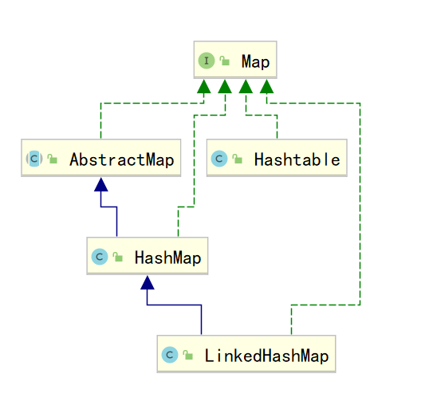

# Java进阶— —集合：Map

本文主要介绍接口`Map`及其实现类的相关知识。

[toc]

## 一、Map

`Map<K,V>`用来存储键值对，即`key-value`，并且`key`不能重复，而`value`可以重复。

`Map`中常用方法如下：

- `int size()`：返回`map`中键值对数量；
- `boolean isEmpty()`：返回`map`中是否有键值对，没有返回`true`，有返回`false`；
- `boolean containsKey(Object key)`：返回`map`中是否包含`key`；
- `V get(Object key)`：根据`key`返回`value`；
- `V put(K key, V value)`：将键值对存储到`map`中，如果`map`中已存在相同的`key`，则用新的`value`覆盖旧的`value`，并返回旧`value`，如果`map`中没有存在相同的`key`，则返回null；
- `V remove(Object key)`：从`map`中删除指定`key`的键值对，并返回删除的`value`，如果不存在`key`，则返回Null；
- `void clear()`：清除所有的键值对；

`Map`及其实现类如下：




## 二、遍历Map

我们有两种方法遍历`map`:

### 2.1 keySet()

方法一是通过`keySet()`返回`key`的集合，然后通过`key`获取`value`；

步骤：

- 获取`Map`中所有的键，由于键是唯一的，所以返回一个`Set`集合存储所有的键。方法提示: `keyset()`;
2. 遍历键的`Set`集合，得到每一个键；
3. 根据键获取键所对应的值。方法提示:`get(K key)`；

```java
public static void main(String[] args) {
    Map<String,String> map = new HashMap<>();
    map.put("张三","北京");
    map.put("李四","上海");
    map.put("王五","重庆");
    map.put("赵六","天津");
    Set<String> keys = map.keySet();
    for (String key : keys) {
        String value = map.get(key);
        System.out.println(key+"="+value);
    }
}
```

```txt
李四=上海
张三=北京
王五=重庆
赵六=天津
```

### 2.2 entrySet()

我们已经知道， Map 中存放的是两种对象，一种称为`key`(键)，一种称为`value`(值)，它们在在 Map 中是一一对应关系，键值对又称做 `Map` 中的一个`Entry`(项) 。 `Entry` 将键值对的对应关系封装成了对象。即键值对对象，这样我们在遍历 `Map` 集合时，就可以从每一个键值对（ `Entry` ）对象中获取对应的键与对应的值。
既然`Entry`表示了一对键和值，那么也同样提供了获取对应键和对应值得方法：

- `public K getKey() `：获取`Entry`对象中的键。

- `public V getValue()` ：获取`Entry`对象中的值。

  

在Map集合中也提供了获取所有`Entry`对象的方法：

- `public Set<Map.Entry<K,V>> entrySet()` : 获取到`Map`集合中所有的键值对对象的集合(`Set`集合)。

通过`Entry`遍历`map`的操作步骤：
1.  获取`Map`集合中，所有的键值对(`Entry`)对象，以`Set`集合形式返回。方法提示: `entrySet()` 。
2.  遍历包含键值对(`Entry`)对象的`Se`t集合，得到每一个键值对(`Entry`)对象。
3.  通过键值对(`Entry`)对象，获取`Entry`对象中的键与值。 方法提示: `getkey()`和 `getValue()`。

```java
public static void main(String[] args) {
    Map<String,String> map = new HashMap<>();
    map.put("张三","北京");
    map.put("李四","上海");
    map.put("王五","重庆");
    map.put("赵六","天津");

    Set<Map.Entry<String, String>> entries = map.entrySet();
    for (Map.Entry<String,String> entry : entries) {
        System.out.println(entry.getKey()+"="+entry.getValue());
    }
}
```

```txt
李四=上海
张三=北京
王五=重庆
赵六=天津
```


## 三、HashMap

`HashMap`是`Map`接口的实现类，常用方法如上所述。

当在`HashMap`中存放自定义对象时，如果自定义对象作为`key`存在，这时要保证对象唯一，必须复写对象的
`hashCode()`和`equals()`方法。

`key`和`value`可以为`null`。


## 四、LinkedHashMap

在`HashMap`下面有一个子类`LinkedHashMap`，其不仅保证`key`唯一，还保证取出顺序与存入顺序相同。


## 五、HashTable

`HashTable`是最早用于存储键值对的类，其与`HashMap`不同之处在于：

- `HashTable`不可以存储`null`值，即`HashTable`的键值都不允许为`null`，但`HashMap`可以存储`null`值，即`HashMap`的键值都可以为`null`；

  ```java
  public static void main(String[] args) {
      Hashtable<String, String> hashtable = new Hashtable<>();
      hashtable.put(null,null);
      System.out.println(hashtable);
  
      HashMap<String,String> hashMap = new HashMap<>();
      hashMap.put(null,null);
      System.out.println(hashMap);
  }
  ```

  ```txt
  Exception in thread "main" java.lang.NullPointerException
  	at java.util.Hashtable.put(Hashtable.java:460)
  	at com.lee.HashTableDemo01.main(HashTableDemo01.java:10)
  ```

- `HashTable`是线程安全的，而`HashMap`不是线程安全的；

如果你不需要线程安全，那么使用`HashMap`，如果需要线程安全，那么使用`ConcurrentHashMap`。`HashTable`已经被淘汰了，不要在新的代码中再使用它。