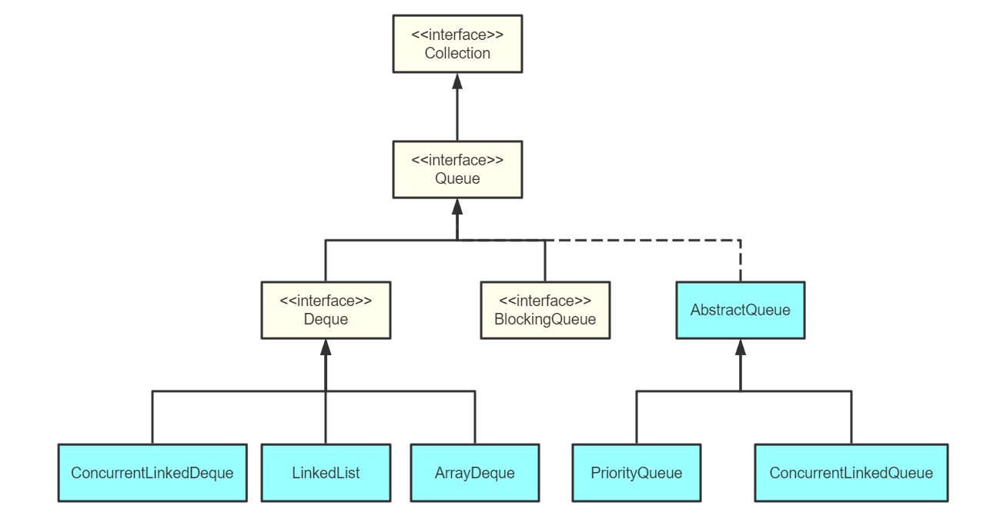
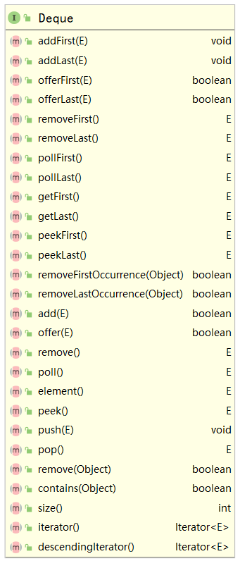
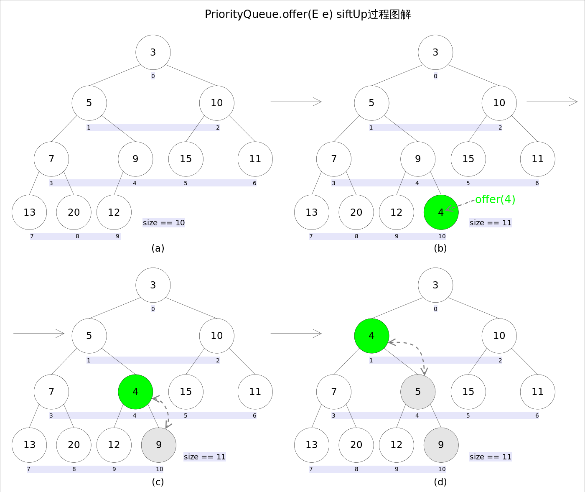
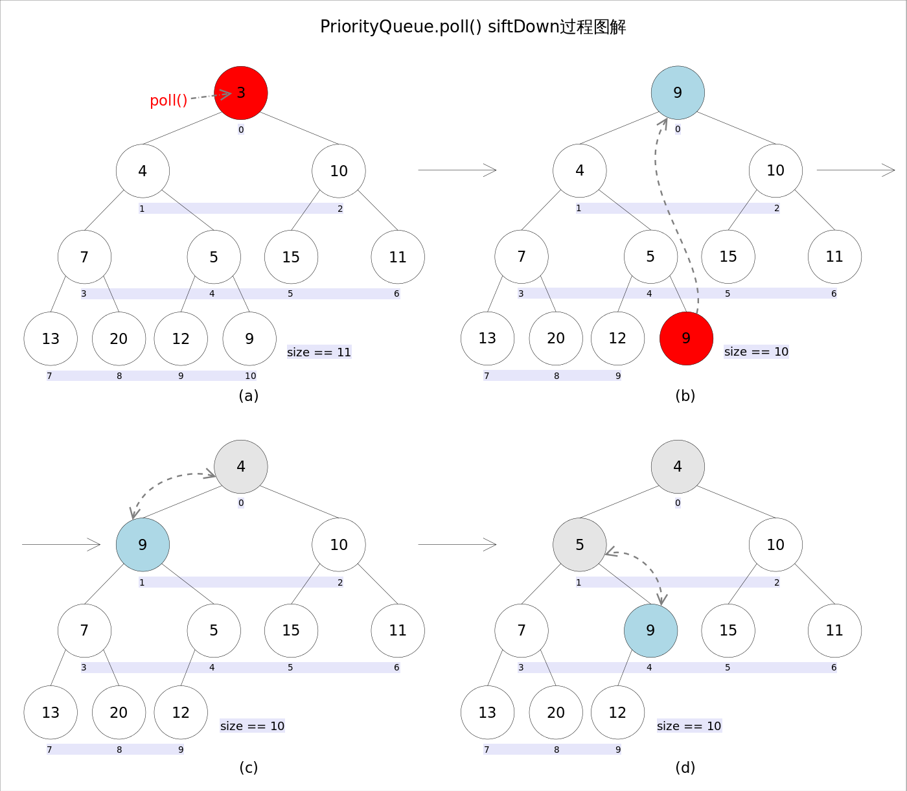
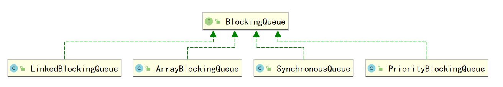

# Java进阶— —集合：Queue

本文主要介绍Java中的队列Queue。

[toc]

## 一、队列介绍

普通的队列`Queue`是一个**先进先出**的数据结构，数据只能在队尾进，队头出。

双端队列`Deque`是指数据可以在队头队尾进行进出操作的数据结构。

优先队列`PriorityQueue`是指优先级高的数据可以优先出队列的数据结构，通常采用堆结构进行实现。

阻塞队列 `BlockingQueue`是`Java util.concurrent`包下重要的数据结构，`BlockingQueue`提供了线程安全的队列访问方式：当阻塞队列进行插入数据时，如果队列已满，线程将会阻塞等待直到队列非满；从阻塞队列取数据时，如果队列已空，线程将会阻塞等待直到队列非空。并发包下很多高级同步类的实现都是基于`BlockingQueue`实现的。

队列体系的UML图如下：




## 二、队列接口Queue

在Java中，队列实现为接口`Queue`：

```java
package java.util;

public interface Queue<E> extends Collection<E> {
    /**
     * 插入元素，如果成功则返回true；如果失败则抛出异常，可能抛出的异常如下：
     *
     * @throws IllegalStateException 队列容量限制导致添加元素失败
     * @throws ClassCastException 类型转换异常
     * @throws NullPointerException 如果队列不允许null，则将null加入到队列中会抛出该异常
     * @throws IllegalArgumentException if some property of this element
     *         prevents it from being added to this queue
     */
    boolean add(E e);
    
     /**
     * 取出并返回队首元素
     *
     * @throws NoSuchElementException 如果队列为空，则抛出此异常
     */
    E remove();
    
    /**
     * 返回但不取出队首元素
     *
     * @throws NoSuchElementException if this queue is empty
     */
    E element();

    /**
     * 如果成功插入元素，则返回true；否则返回false
     */
    boolean offer(E e);


    /**
     * 取出队首元素，如果队列为空，则返回null
     */
    E poll();


    /**
     * 返回队首元素，如果队列为空，则返回null
     */
    E peek();
}

```

接口`Queue`提供了两组相同的操作（插入元素、取出元素、查看队首元素），但是两组操作如果失败时，结果不一样：

|              | 抛出异常  | 返回特殊值 |
| :----------: | :-------: | :--------: |
|   插入元素   |   add()   |  offer()   |
|   取出元素   | remove()  |   poll()   |
| 查看队首元素 | element() |   peek()   |

第二种的插入设计操作通常是给有界限队列实现的，因为在大多数实现中插入操作不能失败。

队列的实现通常不允许插入null值，尽管一些队列实现了，如`LinkedList`就没有禁止，即使`LinkedList`可以插入null值，但我们在实际使用的时候也不应该向队列插入null值，因为null值通常用于`poll()`方法表示当前队列没有元素了，但如果允许插入null值，这个方法就有歧义，所以我们在使用时候应该避免在队列中插入null值。


## 三、普通队列的使用

本章主要介绍普通队列（即先进先出结构）的实现。由于接口`Queeu`是最基本的队列接口，所以所有的实现类都是`Queue`的子类。本例以`LinkedList`作为实现类。

```java
Queue<String> queue = new LinkedList<>();
// 元素入队
queue.add("张三");
queue.add("李四");
queue.add("王五");
// 元素出队并输出
System.out.println(queue.remove());
System.out.println(queue.remove());
System.out.println(queue.remove());
System.out.println(queue.remove());
```

结果：

```txt
张三
李四
王五

java.util.NoSuchElementException
```

由于队列中只有三个元素，但取出了四次元素，最后一次取出时，队列已为空，此时因为是`remove()`方法，抛出异常。

```java
Queue<String> queue = new LinkedList<>();
// 元素入队
queue.offer("张三");
queue.offer("李四");
// 元素出队并输出
System.out.println(queue.poll());
System.out.println(queue.poll());
System.out.println(queue.poll());
```

结果：

```txt
张三
李四
null
```

当队列为空时，使用`poll()`方法出队，则返回null。


## 四、双端队列

双端队列接口`Deque`的方法列表如下，除了队列`Queue`接口中的方法，还增加了许多在队首和队尾操作元素的方法：




## 五、优先队列

### 5.1 基本使用

`PriorityQueue`和`Queue`的区别在于，它的出队顺序与元素的优先级有关，对`PriorityQueue`调用`remove()`或`poll()`方法，返回的总是优先级最高的元素。

例子一：

```java
PriorityQueue<String> priorityQueue = new PriorityQueue<>();
// 元素入队
priorityQueue.add("korean");
priorityQueue.add("china");
priorityQueue.add("japanese");
// 元素出队并输出
System.out.println(priorityQueue.remove());
System.out.println(priorityQueue.remove());
System.out.println(priorityQueue.remove());
```

结果：

```txt
china
japanese
korean
```

可以看到，队列的出队顺序并不是按照入队的顺序。出队顺序是按照字符串进行排序的，字典序小的字符串优先级更高，更先出队。

因此，放入`PriorityQueue`的元素，必须实现`Comparable`接口，`PriorityQueue`会根据元素的排序顺序决定出队的优先级。

如果放入的元素没有实现`Comparable`接口，则可以为优先队列提供一个比较器`Comparator`，然后使用`Comparator`进行元素大小比较。

例子：按照字符串的字符数量进行比较，字符数少的优先级高。

```java
// 自定义比较器 comparator
PriorityQueue<String> priorityQueue = new PriorityQueue<>(
    (o1, o2) -> {
        return o1.length() - o2.length();
    });
// 元素入队
priorityQueue.add("korean");
priorityQueue.add("china");
priorityQueue.add("japanese");
// 元素出队并输出
System.out.println(priorityQueue.remove());
System.out.println(priorityQueue.remove());
System.out.println(priorityQueue.remove());
```

结果：korean排在了japanese前面

```txt
china
korean
japanese
```

总结：

`PriorityQueue`实现了一个优先队列：从队首获取元素时，总是获取优先级最高的元素。

`PriorityQueue`默认按元素比较的顺序排序（必须实现`Comparable`接口），也可以通过`Comparator`自定义排序算法（元素就不必实现`Comparable`接口）。


### 5.2 实现原理

 Java中`PriorityQueue`通过**二叉小顶堆**实现，可以用一棵**完全二叉树**表示。


$$
leftNo = parentNo*2 + 1 \qquad左孩子的位置\\
rightNo = parent*2 + 2  \qquad\quad右孩子的位置\\
parentNo = (nodeNo-1) / 2   \qquad最后一个父结点的位置
$$
上述三个公式表明了父结点和子节点的关系、最后一个父结点的位置。

**插入方法——add()和offer()**

两组方法原理相同，只不过当操作失败时，返回值不同。首先看原理图：



```java
//offer(E e)
public boolean offer(E e) {
    if (e == null)//不允许放入null元素
        throw new NullPointerException();
    modCount++;
    int i = size;
    if (i >= queue.length)
        grow(i + 1);//自动扩容
    size = i + 1;
    if (i == 0)//队列原来为空，这是插入的第一个元素
        queue[0] = e;
    else
        siftUp(i, e);//调整
    return true;
}
```

最主要的插入方法时`siftUp(i,e)`，它保持了小顶堆的特性：

```java
//siftUp()
private void siftUp(int k, E x) {
    while (k > 0) {
        int parent = (k - 1) >>> 1;    //parentNo = (nodeNo-1)/2
        Object e = queue[parent];
        if (comparator.compare(x, (E) e) >= 0)  //调用比较器的比较方法
            break;
        queue[k] = e;
        k = parent;
    }
    queue[k] = x;
}
```

新加入的元素`x`可能会破坏小顶堆的性质，因此需要进行调整。调整的过程为：从`k`指定的位置开始，将`x`逐层与当前点的`parent`进行比较并交换，直到满足`x >= queue[parent]`为止。注意这里的比较可以是元素的自然顺序，也可以依靠比较器的顺序。

**查看方法——element()和peek()**

`element()`和`peek()`的语义完全相同，都是获取但不删除队首元素，也就是队列中权值最小的那个元素，二者唯一的区别是当方法失败时前者抛出异常，后者返回`null`。根据小顶堆的性质，堆顶那个元素就是全局最小的那个；由于堆用数组表示，根据下标关系，`0`下标处的那个元素既是堆顶元素。所以**直接返回数组`0`下标处的那个元素即可**。

```java
//peek()
public E peek() {
    if (size == 0)
        return null;
    return (E) queue[0];//0下标处的那个元素就是最小的那个
}
```

**取出方法——remove()和poll()**

`remove()`和`poll()`方法的语义也完全相同，都是获取并删除队首元素，区别是当方法失败时前者抛出异常，后者返回`null`。由于删除操作会改变队列的结构，为维护小顶堆的性质，需要进行必要的调整。

原理图：



```java
public E poll() {
    if (size == 0)
        return null;
    int s = --size;
    modCount++;
    E result = (E) queue[0]; //0下标处的那个元素就是最小的那个
    E x = (E) queue[s];
    queue[s] = null;
    if (s != 0)
        siftDown(0, x);   //调整,保持小顶堆的性质
    return result;
}
```

上述代码首先记录`0`下标处的元素，并用最后一个元素替换`0`下标位置的元素，之后调用`siftDown()`方法对堆进行调整，最后返回原来`0`下标处的那个元素（也就是最小的那个元素）。重点是`siftDown(int k, E x)`方法，该方法的作用是**从`k`指定的位置开始，将`x`逐层向下与当前点的左右孩子中较小的那个交换，直到`x`小于或等于左右孩子中的任何一个为止**。

```java
//siftDown()
private void siftDown(int k, E x) {
    int half = size >>> 1;
    while (k < half) {
        //首先找到左右孩子中较小的那个，记录到c里，并用child记录其下标
        int child = (k << 1) + 1;   //leftNo = parentNo*2+1
        Object c = queue[child];
        int right = child + 1;
        if (right < size && comparator.compare((E) c, (E) queue[right]) > 0)
            c = queue[child = right];
        if (comparator.compare(x, (E) c) <= 0)
            break;
        queue[k] = c;    //然后用c取代原来的值
        k = child;
    }
    queue[k] = x;
}
```


## 六、阻塞队列

阻塞队列 (`BlockingQueue`)是`Java util.concurrent`包下重要的数据结构，`BlockingQueue`提供了线程安全的队列访问方式：当阻塞队列进行插入数据时，如果队列已满，线程将会阻塞等待直到队列非满；从阻塞队列取数据时，如果队列已空，线程将会阻塞等待直到队列非空。

`BlockingQueue` 具有 4 组不同的方法用于插入、移除以及对队列中的元素进行检查。如果请求的操作不能得到立即执行的话，每个方法的表现也不同。这些方法如下：

|      | 抛出异常  | 返回特殊值 |  阻塞  |       超时等待        |
| :--: | :-------: | :--------: | :----: | :-------------------: |
| 插入 |  add(E)   |  offer(E)  | put(E) | offer(E,timeout,unit) |
| 移除 | remove()  |   poll()   | take() |  take(timeout,unit)   |
| 检查 | element() |   peek()   |        |                       |

四组不同的行为方式解释：

- 抛出异常：如果试图的操作无法立即执行，抛一个异常。
- 返回特殊值：如果试图的操作无法立即执行，返回一个特定的值(常常是 false / null)。
- 阻塞：如果试图的操作无法立即执行，该方法调用者将会发生阻塞，直到能够执行。
- 超时等待：如果试图的操作无法立即执行，该方法调用者将会发生阻塞，直到能够执行，但等待时间不会超过给定值。返回一个特定值以告知该操作是否成功(典型的是 false / null)。

无法向一个 `BlockingQueue` 中插入 null。如果你试图插入 null，`BlockingQueue`将会抛出一个`NullPointerException`。

**BlockingQueue 的实现类**



- **`ArrayBlockingQueue`**：`ArrayBlockingQueue` 是一个**有界**的阻塞队列，其内部实现是将对象放到一个数组里。有界也就意味着，它不能够存储无限多数量的元素，它有一个能够存储元素数量的上限。你可以在对其初始化的时候设定这个上限，但之后就无法对这个上限进行修改了。
- **`LinkedBlockingQueue`**：`LinkedBlockingQueue` 内部以一个链式结构(链接节点)对元素进行存储。如果需要的话，这一链式结构可以选择一个上限。如果没有定义上限，将使用 Integer.MAX_VALUE 作为上限。
- **`PriorityBlockingQueue`**：`PriorityBlockingQueue` 是一个**无界**的并发队列。它使用了和类`java.util.PriorityQueue` 一样的排序规则。你无法向这个队列中插入 null 值。所有插入到 `PriorityBlockingQueue` 的元素必须实现 `java.lang.Comparable` 接口，或者自己提供比较器`Comparator`。
- **`SynchronousQueue`**：`SynchronousQueue` 是一个特殊的队列，它的内部**同时只能够容纳一个元素**。如果该队列已有一元素的话，试图向队列中插入一个新元素的线程将会阻塞，直到另一个线程将该元素从队列中取出元素。同样，如果该队列为空，试图向队列中取出一个元素的线程将会阻塞，直到另一个线程向队列中插入了一个新的元素。

本例主要演示使用阻塞队列实现生产者-消费者。

```java
class ProducerConsumer{
    private BlockingQueue<String> blankets ;
    private String[] fruits;

    public ProducerConsumer(){
        this.blankets = new LinkedBlockingQueue<>();
        this.fruits = new String[]{"apple","banana","strawberry","pear"};
    }

    // 生产，往阻塞队列中添加元素
    public void produce(){
        try {
            while (true) {
                TimeUnit.SECONDS.sleep(3);
                String fruit = fruits[new Random().nextInt(10) % fruits.length];
                blankets.put(fruit);
                System.out.println(LocalDateTime.now()+": "+Thread.currentThread().getName() + "放入了" + fruit);
            }
        } catch (InterruptedException e) {
            e.printStackTrace();
        }
    }

    // 消费，从阻塞队列中拿元素
    public void consume(){
        try {
            while (true) {
                String out = blankets.take();
                TimeUnit.SECONDS.sleep(3);
                System.out.println(LocalDateTime.now()+": "+Thread.currentThread().getName() + "拿取了" + out);
            }
        } catch (InterruptedException e) {
            e.printStackTrace();
        }
    }
}
```

主程序：

```java
public static void main(String[] args) {
    ProducerConsumer producerConsumer = new ProducerConsumer();

    new Thread(()->{
        producerConsumer.produce();
    },"producer1").start();
    new Thread(()->{
        producerConsumer.produce();
    },"producer2").start();

    new Thread(()->{
        producerConsumer.consume();
    },"consumer1").start();
    new Thread(()->{
        producerConsumer.consume();
    },"consumer2").start();
}
```

结果：

```txt
2021-03-08T15:21:30.774: producer1放入了pear
2021-03-08T15:21:30.774: producer2放入了apple
2021-03-08T15:21:33.742: consumer2拿取了pear
2021-03-08T15:21:33.742: consumer1拿取了apple
2021-03-08T15:21:33.774: producer2放入了pear
2021-03-08T15:21:33.774: producer1放入了apple
2021-03-08T15:21:36.777: consumer2拿取了pear
2021-03-08T15:21:36.777: consumer1拿取了apple
```


## 七、参考资料

[1] 廖雪峰Java教程：https://www.liaoxuefeng.com/wiki/1252599548343744/1265120632401152

[2] 优先队列详解：https://blog.csdn.net/zc19921215/article/details/106392800

[3] 阻塞队列：https://blog.csdn.net/chenchaofuck1/article/details/51660119


