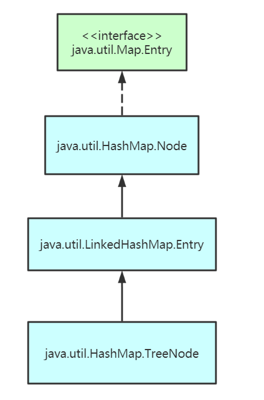

# Java进阶— —源码：Map

本文主要讲解HashMap、ConcurrentHashMap的底层源码。

[toc]

由于Java 1.8对于HashMap的底层源码有了重大改变，所以本文首先讲解Java 1.7版本的HashMap源码，然后讲解Java 1.8版本的源码，最后讲解ConcurrentHashMap的源码知识。


## 1. Java 1.7的HashMap

Java 1.7及其之前的`HashMap`底层的数据结构是数组和链表。

### 2.1 Entry结构

首先我们来看存储数据`<K,V>`的内部类`Entry`的结构：

```java
static class Entry<K,V> implements Map.Entry<K,V> {
    final K key;           // key
    V value;               // value
    Entry<K,V> next;       // 指向下一个Entry的指针
    int hash;              // key的哈希值

    // 构造方法，创建一个新的Entry对象
    Entry(int h, K k, V v, Entry<K,V> n) {
        value = v;
        next = n;            // 采用头插法将创建的新对象插入到链表中
        key = k;
        hash = h;
    }
    
    // 其余方法......
}
```


### 2.2 HashMap的属性及其构造方法

我们来看`HashMap`的属性及其构造方法，探究在创建`HashMap`对象时做了什么事。

```java
public class HashMap<K,V> extends AbstractMap<K,V> 
    implements Map<K,V>, Cloneable, Serializable
{
    // 静态属性
    // 默认的数组大小，16
    static final int DEFAULT_INITIAL_CAPACITY = 1 << 4; 
    // 最大的数组大小，2^30=1073741824
    static final int MAXIMUM_CAPACITY = 1 << 30;
    // 默认加载因子，0.75
    static final float DEFAULT_LOAD_FACTOR = 0.75f;
    // 默认的数组为空
    static final Entry<?,?>[] EMPTY_TABLE = {};
    static final int ALTERNATIVE_HASHING_THRESHOLD_DEFAULT = Integer.MAX_VALUE;
    
    // 对象属性
    // 实际的数组
    transient Entry<K,V>[] table = (Entry<K,V>[]) EMPTY_TABLE;
    // 实际存储的Entry数量
    transient int size;
    // 阈值
    int threshold;
    // 加载因子
    final float loadFactor;
    // 修改次数
    transient int modCount;
    // 哈希种子
    transient int hashSeed = 0;
    
    // 构造方法
    public HashMap() {
        this(DEFAULT_INITIAL_CAPACITY, DEFAULT_LOAD_FACTOR);
    }
    public HashMap(int initialCapacity) {
        this(initialCapacity, DEFAULT_LOAD_FACTOR);
    }
    public HashMap(int initialCapacity, float loadFactor) {
        if (initialCapacity < 0)
            throw new IllegalArgumentException("Illegal initial capacity: " +
                                               initialCapacity);
        if (initialCapacity > MAXIMUM_CAPACITY)
            initialCapacity = MAXIMUM_CAPACITY;
        if (loadFactor <= 0 || Float.isNaN(loadFactor))
            throw new IllegalArgumentException("Illegal load factor: " +
                                               loadFactor);

        this.loadFactor = loadFactor;
        threshold = initialCapacity;
        init();
    }
    
    void init() {
    }
}
```


### 2.3 resize()方法

我们来看扩容方法`resize()`，当键的数量`size`到达阈值`threshold`时，该方法会自动被调用：

```java
// newCapacity必须是2的幂
void resize(int newCapacity) {
    Entry[] oldTable = table;
    int oldCapacity = oldTable.length;
    // 如果旧数组的大小已经是最大了，则修改阈值为最大，并返回
    if (oldCapacity == MAXIMUM_CAPACITY) {
        threshold = Integer.MAX_VALUE;
        return;
    }

    Entry[] newTable = new Entry[newCapacity];
    // 将旧数组中的数据移动到新数组中去
    transfer(newTable, initHashSeedAsNeeded(newCapacity));
    // 新数组取代旧数组
    table = newTable;
    // 更新阈值
    threshold = (int)Math.min(newCapacity * loadFactor, MAXIMUM_CAPACITY + 1);
}

void transfer(Entry[] newTable, boolean rehash) {
    int newCapacity = newTable.length;
    for (Entry<K,V> e : table) {
        while(null != e) {
            Entry<K,V> next = e.next;
            if (rehash) {
                e.hash = null == e.key ? 0 : hash(e.key);
            }
            int i = indexFor(e.hash, newCapacity);
            e.next = newTable[i];
            newTable[i] = e;
            e = next;
        }
    }
}
```


### 2.4 put()方法

我来看重点的`put()`方法：

```java
public V put(K key, V value) {
    // 如果数组为空，则创建数组，数组的大小为2的幂
    if (table == EMPTY_TABLE) {
        inflateTable(threshold);
    }
    // 键为null，则放在table[0]处
    // 如果已存在键为null的值，则覆盖，返回旧值
    if (key == null)
        return putForNullKey(value);
    // 计算key的哈希值
    int hash = hash(key);
    // 计算索引
    int i = indexFor(hash, table.length);
    // 如果存在键为key的值，则覆盖并返回旧值
    for (Entry<K,V> e = table[i]; e != null; e = e.next) {
        Object k;
        if (e.hash == hash && ((k = e.key) == key || key.equals(k))) {
            V oldValue = e.value;
            e.value = value;
            e.recordAccess(this);
            return oldValue;
        }
    }

    // 哈希表结构改变次数+1
    modCount++;
    // 头插法增加节点
    addEntry(hash, key, value, i);
    return null;
}
```


### 2.5 get()方法

```java
public V get(Object key) {
    // 如果键值为null，则直接去table[0]找
    if (key == null)
        return getForNullKey();
    // 找到节点
    Entry<K,V> entry = getEntry(key);
    // 返回value
    return null == entry ? null : entry.getValue();
}

// 获取节点
final Entry<K,V> getEntry(Object key) {
    // 数组为空
    if (size == 0) {
        return null;
    }
    // 计算哈希值
    int hash = (key == null) ? 0 : hash(key);
    // 遍历链表，如果找到则返回
    for (Entry<K,V> e = table[indexFor(hash, table.length)]; e != null; e = e.next) {
        Object k;
        if (e.hash == hash &&
            ((k = e.key) == key || (key != null && key.equals(k))))
            return e;
    }
    // 链表遍历完后找不到或者链表为null，返回Null
    return null;
}
```


### 2.6 其它问题

#### 2.6.1 为什么数组的大小必须为2的幂呢？

数组大小默认为16，是2的4次方，即使我们设置的大小不为2的幂，HashMap也会调用`roundUpToPowerOf2(num)`找到一个2的幂的数，使得该数大于等于num。

```java
private void inflateTable(int toSize) {
    // Find a power of 2 >= toSize
    int capacity = roundUpToPowerOf2(toSize);

    threshold = (int) Math.min(capacity * loadFactor, MAXIMUM_CAPACITY + 1);
    table = new Entry[capacity];
    initHashSeedAsNeeded(capacity);
}

private static int roundUpToPowerOf2(int number) {
    // assert number >= 0 : "number must be non-negative";
    int rounded = number >= MAXIMUM_CAPACITY
        ? MAXIMUM_CAPACITY
        : (rounded = Integer.highestOneBit(number)) != 0
            ? (Integer.bitCount(number) > 1) ? rounded << 1 : rounded
            : 1;

    return rounded;
}
```

其实，这和计算索引有关，我们来看计算索引的方法：

```java
static int indexFor(int h, int length) {
    return h & (length-1);
}
```

如果数组的大小为2的幂，则二进制形式为：

```txt
length:   00...001000...000
length-1: 00...000111...111
```

那么任何一个数`h`与`length-1`进行按位与操作，得到的结果总是在`[0,length-1]`之间。

如果length的大小不是2的幂，假如length=5，则其二进制形式为：

```txt
length:   00101
length-1: 00100
```

则任何数`h`与`length-1`进行按位与操作，那么得到的结果要么为0，要么为4，不可能得到1，2，3，这样就导致哈希冲突的概率提高，索引为1，2，3的数组得不到利用，数组的利用率下降。


#### 2.6.2 HashMap中的线程不安全体现

**在Java 1.7中，线程不安全体现在扩容时，会造成环形链表和数据丢失。**主要的代码是`transfer()`中的以下几行代码：

```java
void transfer(Entry[] newTable, boolean rehash) {
    for (Entry<K,V> e : table) {
        while(e != null) {
            Entry<K,V> next = e.next;
            e.next = newTable[i];
            newTable[i] = e;
            e = next;
        }
    }
}
```

具体的说明请查看链接 ：https://www.cnblogs.com/aspirant/p/11450839.html


#### 2.6.3 loadFactor负载因子

本小节主要介绍负载因子的作用。在默认情况下，负载因子等于0.75。


## 2. Java 1.8的HashMap

在Java 1.7中，如果存储的节点很多，那么哈希冲突的情况就很严重，导致查询的时间复杂度最坏为O(n)，在Java 1.8中，为了提高查询效果，引入了红黑树数据结构，时间复杂度改进为O(logn)，当某个位桶的链表的长度达到某个阀值的时候，这个链表就将转换成红黑树，所以Java 1.8中涉及到将链表和红黑树的转化。

### 2.1 Node结构

在Java 1.8中，Entry替换成了Node：

```java
static class Node<K,V> implements Map.Entry<K,V> {
    final int hash;
    final K key;
    V value;
    Node<K,V> next;

    Node(int hash, K key, V value, Node<K,V> next) {
        this.hash = hash;
        this.key = key;
        this.value = value;
        this.next = next;
    }
    // 其它方法......
}
```


### 2.2 属性和构造方法

首先来看HashMap中涉及到的属性：

```java
// 静态属性
// 默认初始化数组大小，16
static final int DEFAULT_INITIAL_CAPACITY = 1 << 4; 
// 数组最大容量，2^30
static final int MAXIMUM_CAPACITY = 1 << 30;
// 默认加载因子，0.75
static final float DEFAULT_LOAD_FACTOR = 0.75f;
// 将链表转换为红黑树的阈值，8
static final int TREEIFY_THRESHOLD = 8;
// 将红黑树转换为链表的阈值，6
static final int UNTREEIFY_THRESHOLD = 6;
// 只有数组大小超过64，才会将链表转换为红黑树
// 如果数组大小没有超过64，就算链表长度大于8，也不会转换为红黑树
static final int MIN_TREEIFY_CAPACITY = 64;

// 对象属性
// 数组
transient Node<K,V>[] table;
// 实际存储的键值对数量
transient int size;
// 哈希表结构变化次数
transient int modCount;
// 阈值，当size>threshold时，扩容
int threshold;
// 加载因子
final float loadFactor;
// 键值对集合
transient Set<Map.Entry<K,V>> entrySet;
```

构造方法：

```java
// 无参构造方法，属性都取默认值
public HashMap() {
    this.loadFactor = DEFAULT_LOAD_FACTOR; // all other fields defaulted
}
// 指定数组的大小
public HashMap(int initialCapacity) {
    this(initialCapacity, DEFAULT_LOAD_FACTOR);
}
// 指定数组的大小和加载因子
public HashMap(int initialCapacity, float loadFactor) {
    if (initialCapacity < 0)
        throw new IllegalArgumentException("Illegal initial capacity: " +
                                           initialCapacity);
    if (initialCapacity > MAXIMUM_CAPACITY)
        initialCapacity = MAXIMUM_CAPACITY;
    if (loadFactor <= 0 || Float.isNaN(loadFactor))
        throw new IllegalArgumentException("Illegal load factor: " +
                                           loadFactor);
    this.loadFactor = loadFactor;
    this.threshold = tableSizeFor(initialCapacity);
}
```

关于`tableSizeFor(initialCapacity)`方法：

```java
static final int tableSizeFor(int cap) {
    int n = -1 >>> Integer.numberOfLeadingZeros(cap - 1);
    return (n < 0) ? 1 : (n >= MAXIMUM_CAPACITY) ? MAXIMUM_CAPACITY : n + 1;
}
```

作用是找到一个数num，使得该数是2的幂，并且`num>=cap`。就是保证数组的大小是2的幂。


### 2.3 查找方法get(key)

我们可以通过`get(key)`根据键找到值：

```java
public V get(Object key) {
    Node<K,V> e = getNode(hash(key), key);
    return e == null ? null : e.value;
}
```

主要的查找逻辑在方法`getNode(int hash,Object key)`中：

```java
final Node<K,V> getNode(int hash, Object key) {
    Node<K,V>[] tab = table; 
    int n = tab.length; 
    // 找到索引值以及链表头
    Node<K,V> first = tab[(n - 1) & hash]; 
    Node<K,V> e;
    K k;
    if ( tab != null && n > 0 && first != null) {
        // 链表头就是要找的键值对，直接返回值
        if (first.hash == hash && 
            ((k = first.key) == key || (key != null && key.equals(k))))
            return first;
        // 链表长度大于1
        if ((e = first.next) != null) {
            // 如果是红黑树，就去查找红黑树
            if (first instanceof TreeNode)
                return ((TreeNode<K,V>)first).getTreeNode(hash, key);
            // 是链表，遍历链表
            do {
                if (e.hash == hash &&
                    ((k = e.key) == key || (key != null && key.equals(k))))
                    return e;
            } while ((e = e.next) != null);
        }
    }
    return null;
}
```

关于红黑树的查找，后续介绍。


### 2.4 插入方法put(key,value)

本节分析插入方法：

```java
public V put(K key, V value) {
    return putVal(hash(key), key, value, false, true);
}
```

主要的逻辑在`putVal()`方法中（有更改、有删减）：

```java
// onlyIfAbsent: false
final V putVal(int hash, K key, V value, boolean onlyIfAbsent, boolean evict) {
    Node<K,V>[] tab = table;
    int n = tab.length;          // 数组长度
    // 如果数组为null或数组大小为0，则扩容，并更新数组的长度
    if ( tab == null || n == 0)
        n = (tab = resize()).length;
    // 计算索引
    int i = (n - 1) & hash;
    Node<K,V> p = tab[i]; 
    // 如果索引为i的数组为null，则直接插入
    if ( p == null){
        tab[i] = newNode(hash, key, value, null);
    }else {
        // 遍历链表或红黑树，进行插入或替换操作
        Node<K,V> e; 
        K k;
        // 第一个与要插入的键值对重合了，则覆盖
        if (p.hash == hash &&
            ((k = p.key) == key || (key != null && key.equals(k))))
            e = p;
        // 红黑树插入
        else if (p instanceof TreeNode)
            e = ((TreeNode<K,V>)p).putTreeVal(this, tab, hash, key, value);
        else {
            // 链表插入
            for (int binCount = 0; ; ++binCount) {
                // 找到了链表最后一个节点，尾插入
                if ((e = p.next) == null) {
                    p.next = newNode(hash, key, value, null);
                    // 如果链表长度大于等于8，则有可能进行树化
                    if (binCount >= TREEIFY_THRESHOLD - 1)
                        treeifyBin(tab, hash);
                    break;
                }
                // 如果找到了具有相同键值的键值对，则替换
                if (e.hash == hash &&
                    ((k = e.key) == key || (key != null && key.equals(k))))
                    break;
                p = e;
            }
        }
        // e不为null，表示找到了一个键值对e，使得该键值对与要插入的键值对的键相同，则替换旧值
        if (e != null) { 
            V oldValue = e.value;
            if (!onlyIfAbsent || oldValue == null)
                e.value = value;
            return oldValue;
        }
    }
    // 哈希表结构变化次数+1
    ++modCount;
    // 如果键值对数量大于阈值，则扩容
    if (++size > threshold)
        resize();
    
    return null;
}
```

插入的步骤如下：

- 首先判断数组是否为null或数组大小是否为0，如果是，则进行扩容处理；
- 计算数组索引，即计算桶序号，找到要插入的数组位置；
- 判断桶是否为空，如果桶为空，则直接插入；否则查看桶中第一个元素的键是否等于要插入的键，如果是，则覆盖；否则根据是链表或红黑树，进行尾插入；
- 如果插入后的数组长度大于阈值，则进行扩容处理；


### 2.5 扩容方法resize()

本小节介绍扩容方法，源码如下（内容很多）：

```java
final Node<K,V>[] resize() {
    Node<K,V>[] oldTab = table;
    int oldCap = (oldTab == null) ? 0 : oldTab.length;  // 旧数组的长度
    int oldThr = threshold;        // 旧阈值
    int newCap, newThr = 0;        // 新的数组长度与阈值
    
    // 计算新的数组长度与阈值
    if (oldCap > 0) {         // 旧数组长度大于0
        // 数组长度已最大，无法扩容
        if (oldCap >= MAXIMUM_CAPACITY) {
            threshold = Integer.MAX_VALUE;
            return oldTab;
        }else if ((newCap = oldCap << 1) < MAXIMUM_CAPACITY &&
                 oldCap >= DEFAULT_INITIAL_CAPACITY)
            newThr = oldThr << 1; // 新阈值是旧阈值的两倍
    }else if (oldThr > 0){ // 旧数组长度 == 0 并且 旧阈值 > 0
        newCap = oldThr;
    }else {               // 旧数组长度 == 0 并且 旧阈值 <= 0
        newCap = DEFAULT_INITIAL_CAPACITY;
        newThr = (int)(DEFAULT_LOAD_FACTOR * DEFAULT_INITIAL_CAPACITY);
    }
    if (newThr == 0) {
        float ft = (float)newCap * loadFactor;
        newThr = (newCap < MAXIMUM_CAPACITY && ft < (float)MAXIMUM_CAPACITY ?
                  (int)ft : Integer.MAX_VALUE);
    }
    threshold = newThr;
    
    Node<K,V>[] newTab = (Node<K,V>[])new Node[newCap];     // 创建新数组
    table = newTab; 
    if (oldTab != null) {
        // 对旧数组每一个桶中的元素进行处理
        for (int j = 0; j < oldCap; ++j) {
            Node<K,V> e = oldTab[j];   // e指向桶中第一个元素
            if (e != null) {         // 桶中有元素
                oldTab[j] = null;
                if (e.next == null)    // 桶中只有一个元素
                    newTab[e.hash & (newCap - 1)] = e;
                else if (e instanceof TreeNode)   // 桶中放的是红黑树，拆分
                    ((TreeNode<K,V>)e).split(this, newTab, j, oldCap);
                else {             // 桶中放的是链表
                    // 对链表进行分组，然后将分组后的链表放入新的数组中
                    Node<K,V> loHead = null, loTail = null;
                    Node<K,V> hiHead = null, hiTail = null;
                    Node<K,V> next;
                    do {
                        next = e.next;
                        if ((e.hash & oldCap) == 0) {
                            if (loTail == null)
                                loHead = e;
                            else
                                loTail.next = e;
                            loTail = e;
                        }else {
                            if (hiTail == null)
                                hiHead = e;
                            else
                                hiTail.next = e;
                            hiTail = e;
                        }
                    } while ((e = next) != null);
                    
                    if (loTail != null) {
                        loTail.next = null;
                        newTab[j] = loHead;
                    }
                    if (hiTail != null) {
                        hiTail.next = null;
                        newTab[j + oldCap] = hiHead;
                    }
                }
            }
        }
    }
    return newTab;
}
```

关于红黑树的拆分，此处暂时不讲解。本节主要讲解链表如何分组放入新数组中。

现在假设索引为4的桶中存放有以下四个元素（四个元素的哈希值分别为：4，20，36，52）：


那么扩容后数组的长度为32，再次重新计算这四个元素的桶索引(hash%32)，结果如下：

```txt
32: 0010 0000
4 : 0000 0100 = 4
20: 0001 0100 = 20
36: 0010 0100 = 4
52: 0011 0100 = 20
```

可以发现原桶中的元素分成了两组，一组的桶索引为4（原位置），另一组的桶索引为20（=旧数组长度16 + 原位置4）。

那么如何确定哪个元素在原位置，哪个元素在新位置呢？就是根据下面这个判断来确定的：

```java
if ((e.hash & oldCap) == 0) {
    // 元素在旧位置
}else{
    // 元素在新位置
}
```

还是以上面的例子，这次以（hash & oldCapacity）为结果：

```txt
16: 0001 0000
4 : 0000 0100 = 0
20: 0001 0100 = 1
36: 0010 0100 = 0
52: 0011 0100 = 1
```

发现结果为1的是在新位置，结果为0的是在旧位置。

最后原始链表分为了两组，一组以loHead为头，loTail为尾；一组以hiHead为头，hiTail为尾。


最后将loHead和hiHead指向的链表分别放入新数组的桶中即可，这样保证了元素的顺序，也不用重新计算哈希值，对应的代码和结果如下：

```java
if (loTail != null) {
    loTail.next = null;
    newTab[j] = loHead;
}
if (hiTail != null) {
    hiTail.next = null;
    newTab[j + oldCap] = hiHead;
}
```


### 2.6 链表和红黑树转换

#### 2.6.1 树节点

在讲解链表和红黑树转换之前，首先明确红黑树的节点`TreeNode`：

```java
static final class TreeNode<K,V> extends LinkedHashMap.Entry<K,V> {
    TreeNode<K,V> parent;  
    TreeNode<K,V> left;
    TreeNode<K,V> right;
    TreeNode<K,V> prev;    
    boolean red;
    
    TreeNode(int hash, K key, V val, Node<K,V> next) {
        super(hash, key, val, next);
    }
}
```

继承关系如下，**java.util.HashMap.Node是TreeNode的父类**：




#### 2.6.2 链表转换为红黑树

首先贴出相关代码：

```java
// 对于数组tab，将索引为hash & tab.length-1的桶中的链表进行树化操作
final void treeifyBin(Node<K,V>[] tab, int hash) {
    int n, index; 
    Node<K,V> e;
    // 数组为空或数组长度小于64，不进行树化，直接扩容
    if (tab == null || (n = tab.length) < MIN_TREEIFY_CAPACITY){
        resize();
    }else if ((e = tab[index = (n - 1) & hash]) != null) {
        TreeNode<K,V> hd = null, tl = null;     // hd=head,tl=tail
        // 将Node节点的链表转换为TreeNode节点的双向链表，prev指向前一个节点，next指向后一个节点
        do {
            TreeNode<K,V> p = replacementTreeNode(e, null);
            if (tl == null)
                hd = p;
            else {
                p.prev = tl;
                tl.next = p;
            }
            tl = p;
        } while ((e = e.next) != null);
        
        // 调用TreeNode中的树化方法
        if ((tab[index] = hd) != null)
            hd.treeify(tab);
    }
}

// 将Node节点p转换为树节点TreeNode
TreeNode<K,V> replacementTreeNode(Node<K,V> p, Node<K,V> next) {
    return new TreeNode<>(p.hash, p.key, p.value, next);
}
```

链表转化为红黑树需要满足两个条件：

- 链表长度大于等于TREEIFY_THRESHOLD（8）；
- 数组长度需要大于等于MIN_TREEIFY_CAPACITY（64），否则扩容；

当数组长度比较小时，哈希碰撞的概率的比较高，进而导致链表长度较长。这个时候应该优先扩容，而不是立马树化。毕竟高碰撞率是因为数组长度较小引起的，这个是主因。容量小时，优先扩容可以避免一些不必要的树化过程。同时，桶容量较小时，扩容会比较频繁，扩容时需要拆分红黑树并重新映射。所以在桶容量比较小的情况下，将长链表转成红黑树是一件吃力不讨好的事。

`treeifyBin()`方法分为两部：

- 将Node节点的链表转化为TreeNode节点的双向链表，hd指向新链表头；
- 调用TreeNode类中方法`treeify()`进行树化；

```java
final void treeify(Node<K,V>[] tab) {
    TreeNode<K,V> root = null;
    for (TreeNode<K,V> x = this, next; x != null; x = next) {
        next = (TreeNode<K,V>)x.next;
        x.left = x.right = null;
        if (root == null) {
            x.parent = null;
            x.red = false;
            root = x;
        }
        else {
            K k = x.key;
            int h = x.hash;
            Class<?> kc = null;
            for (TreeNode<K,V> p = root;;) {
                int dir, ph;
                K pk = p.key;
                if ((ph = p.hash) > h)
                    dir = -1;
                else if (ph < h)
                    dir = 1;
                else if ((kc == null &&
                          (kc = comparableClassFor(k)) == null) ||
                         (dir = compareComparables(kc, k, pk)) == 0)
                    dir = tieBreakOrder(k, pk);

                TreeNode<K,V> xp = p;
                if ((p = (dir <= 0) ? p.left : p.right) == null) {
                    x.parent = xp;
                    if (dir <= 0)
                        xp.left = x;
                    else
                        xp.right = x;
                    root = balanceInsertion(root, x);
                    break;
                }
            }
        }
    }
    moveRootToFront(tab, root);
}
```


#### 2.6.3 红黑树拆分为链表

当进行扩容时，红黑树有可能拆分为链表：

```java
// resize()中的方法
if (e instanceof TreeNode)
    ((TreeNode<K,V>)e).split(this, newTab, j, oldCap);
```

`split()`方法：

```java
final void split(HashMap<K,V> map, Node<K,V>[] tab, int index, int bit) {
    TreeNode<K,V> b = this;
    // Relink into lo and hi lists, preserving order
    TreeNode<K,V> loHead = null, loTail = null;
    TreeNode<K,V> hiHead = null, hiTail = null;
    int lc = 0, hc = 0;
    for (TreeNode<K,V> e = b, next; e != null; e = next) {
        next = (TreeNode<K,V>)e.next;
        e.next = null;
        if ((e.hash & bit) == 0) {
            if ((e.prev = loTail) == null)
                loHead = e;
            else
                loTail.next = e;
            loTail = e;
            ++lc;
        }
        else {
            if ((e.prev = hiTail) == null)
                hiHead = e;
            else
                hiTail.next = e;
            hiTail = e;
            ++hc;
        }
    }

    if (loHead != null) {
        if (lc <= UNTREEIFY_THRESHOLD)
            tab[index] = loHead.untreeify(map);
        else {
            tab[index] = loHead;
            if (hiHead != null) 
                loHead.treeify(tab);
        }
    }
    
    if (hiHead != null) {
        if (hc <= UNTREEIFY_THRESHOLD)
            tab[index + bit] = hiHead.untreeify(map);
        else {
            tab[index + bit] = hiHead;
            if (loHead != null)
                hiHead.treeify(tab);
        }
    }
}
```

如果长度小于等于UNTREEIFY_THRESHOLD（6），则会调用红黑树节点的`untreeify()`方法：

```java
final Node<K,V> untreeify(HashMap<K,V> map) {
    Node<K,V> hd = null, tl = null;
    for (Node<K,V> q = this; q != null; q = q.next) {
        Node<K,V> p = map.replacementNode(q, null);
        if (tl == null)
            hd = p;
        else
            tl.next = p;
        tl = p;
    }
    return hd;
}

Node<K,V> replacementNode(Node<K,V> p, Node<K,V> next) {
    return new Node<>(p.hash, p.key, p.value, next);
}
```


## 3. java 1.7和java 1.8的HashMap区别

本章主要讲解java 1.7和java 1.8两个版本中HashMap的区别。

- **底层数据结构不同**。在Java 1.7中，底层使用数组+链表；在Java 1.8，底层使用数组+链表+红黑树。
- **插入数据的方式不同。**在Java 1.7中，向链表中插入元素时采用头插法，而在Java 1.8中，向链表插入元素使用尾插法。
- **扩容后元素的存储位置的计算方式不同。**在Java 1.7中，直接使用hash与新数组的大小-1进行逻辑与操作，得到新的存储位置；而在Java 1.8中，新的存储位置只有两种情况，原位置或原位置+原数组大小，因此新位置的计算只需要判断hash值与原数组大小的逻辑与结果，如果结果为1，则新的存储位置为原位置+原数组大小，如果结果为0，则新的存储位置为原位置。


## 4. 参考资料

[1] HashMap线程不安全的体现：https://www.cnblogs.com/aspirant/p/11450839.html

[2] HashMap 源码详细分析(JDK1.8)：https://segmentfault.com/a/1190000012926722

[3] Java源码分析：关于 HashMap 1.8 的重大更新：https://blog.csdn.net/carson_ho/article/details/79373134