# maven— —maven介绍、安装与入门

本文主要介绍maven、安装方法及第一个maven程序。

[toc]

## 1. maven介绍

> Apache Maven is a software project management and comprehension tool. Based on the concept of a project object model (POM), Maven can manage a project's build, reporting and documentation from a central piece of information.

简而言之，maven是一个项目管理工具，帮助我们更好地构建项目。


## 2. maven安装

首先下载maven，下载页面：http://maven.apache.org/download.cgi，根据不同平台选择下载版本：

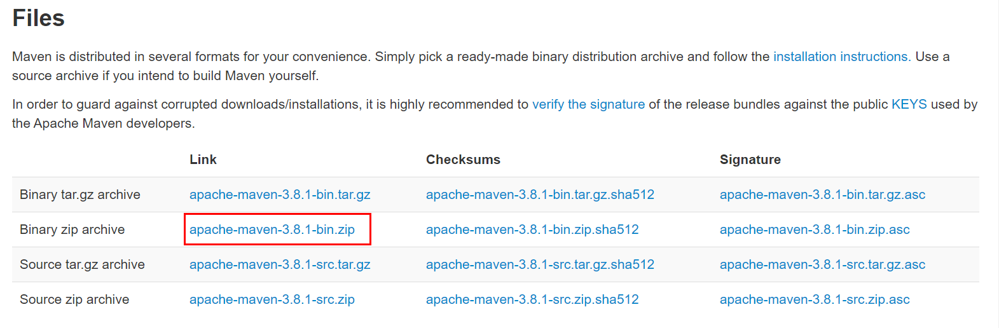

下载完成后解压，目录结构如下：

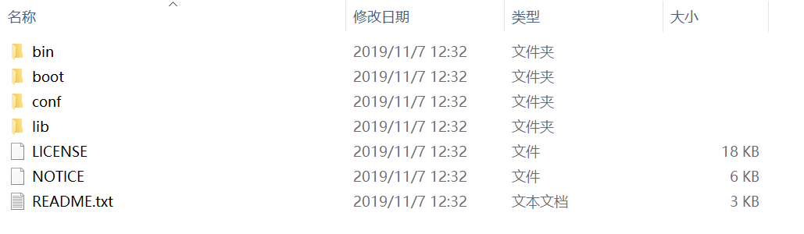

在cmd环境下进入bin目录，输入`mvn-v`查看版本：

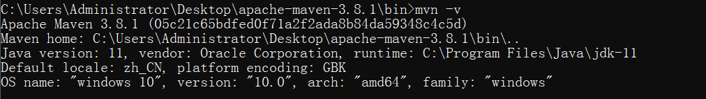

当然，如果每次使用maven都需要进入安装目录中，这会很麻烦，所以我们将其配置到系统变量中。

在path变量中添加maven的bin目录地址：（此处是我之前安装的maven，所以版本是3.6.3）


这样cmd在任意的路径下都可以执行maven命令：

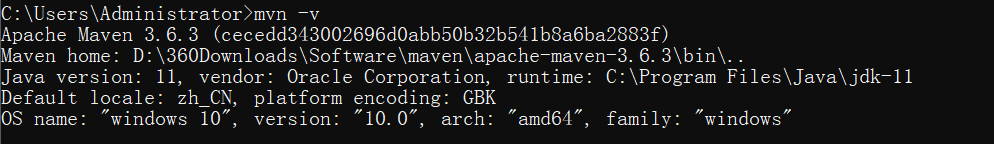


## 3. 创建第一个项目

在cmd下运行如下命令，创建第一个项目：

```shell
mvn archetype:generate -DgroupId=com.lee -DartifactId=my-app -DarchetypeArtifactId=maven-archetype-quickstart -DarchetypeVersion=1.4 -DinteractiveMode=false -DarchetypeCatalog=internal
```

**注意：**选项`-DarchetypeCatalog=internal`可以删去。

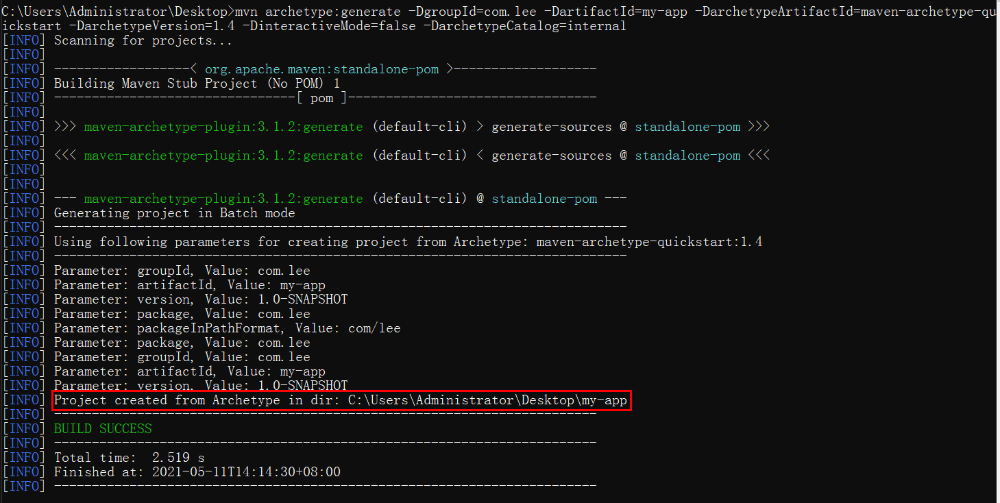

提示已在桌面上创建了一个项目。我们查看这个新项目的目录结构：

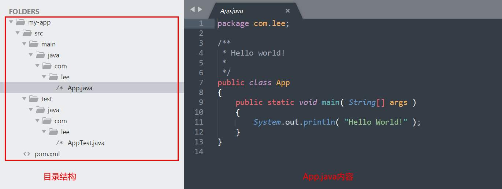

可以发现，maven帮助我们创建了基础的java项目包、类等文件，并且，最重要的是还有一个pom.xml文件，该文件内容如下：

```xml
<?xml version="1.0" encoding="UTF-8"?>

<project xmlns="http://maven.apache.org/POM/4.0.0" xmlns:xsi="http://www.w3.org/2001/XMLSchema-instance"
  xsi:schemaLocation="http://maven.apache.org/POM/4.0.0 http://maven.apache.org/xsd/maven-4.0.0.xsd">
  <modelVersion>4.0.0</modelVersion>

  <groupId>com.lee</groupId>
  <artifactId>my-app</artifactId>
  <version>1.0-SNAPSHOT</version>

  <name>my-app</name>
  <!-- FIXME change it to the project's website -->
  <url>http://www.example.com</url>

  <properties>
    <project.build.sourceEncoding>UTF-8</project.build.sourceEncoding>
    <maven.compiler.source>1.7</maven.compiler.source>
    <maven.compiler.target>1.7</maven.compiler.target>
  </properties>

  <dependencies>
    <dependency>
      <groupId>junit</groupId>
      <artifactId>junit</artifactId>
      <version>4.11</version>
      <scope>test</scope>
    </dependency>
  </dependencies>

  <build>
    <pluginManagement><!-- lock down plugins versions to avoid using Maven defaults (may be moved to parent pom) -->
      <plugins>
        <!-- clean lifecycle, see https://maven.apache.org/ref/current/maven-core/lifecycles.html#clean_Lifecycle -->
        <plugin>
          <artifactId>maven-clean-plugin</artifactId>
          <version>3.1.0</version>
        </plugin>
        <!-- default lifecycle, jar packaging: see https://maven.apache.org/ref/current/maven-core/default-bindings.html#Plugin_bindings_for_jar_packaging -->
        <plugin>
          <artifactId>maven-resources-plugin</artifactId>
          <version>3.0.2</version>
        </plugin>
        <plugin>
          <artifactId>maven-compiler-plugin</artifactId>
          <version>3.8.0</version>
        </plugin>
        <plugin>
          <artifactId>maven-surefire-plugin</artifactId>
          <version>2.22.1</version>
        </plugin>
        <plugin>
          <artifactId>maven-jar-plugin</artifactId>
          <version>3.0.2</version>
        </plugin>
        <plugin>
          <artifactId>maven-install-plugin</artifactId>
          <version>2.5.2</version>
        </plugin>
        <plugin>
          <artifactId>maven-deploy-plugin</artifactId>
          <version>2.8.2</version>
        </plugin>
        <!-- site lifecycle, see https://maven.apache.org/ref/current/maven-core/lifecycles.html#site_Lifecycle -->
        <plugin>
          <artifactId>maven-site-plugin</artifactId>
          <version>3.7.1</version>
        </plugin>
        <plugin>
          <artifactId>maven-project-info-reports-plugin</artifactId>
          <version>3.0.0</version>
        </plugin>
      </plugins>
    </pluginManagement>
  </build>
</project>

```

**==pom.xml是maven管理我们项目的核心！！！==**

当创建新项目后，需要对我们的项目进行编译。只需要进入my-app目录，在cmd中运行以下命令：

```shell
mvn compile
```

结果会在my-app目录下新建target目录，项目整体的目录结构如下：

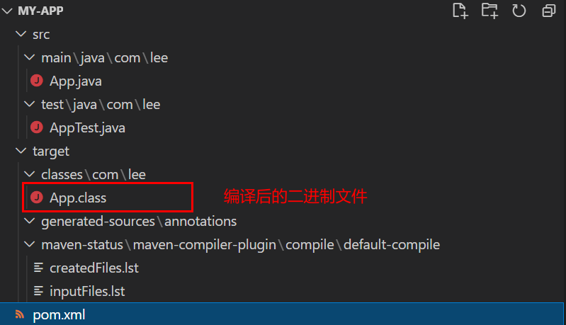

我们可以进入 `my-app\target\classes`下，利用Java 命令执行App.class文件：

```shell
java com.lee.App
```

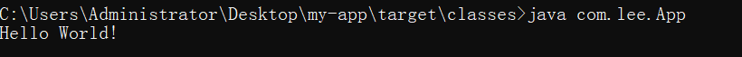

成功输出`Hello World!`。

如果我们想把项目达成一个包，只需要在my-app目录下运行如下命令：

```shell
mvn package
```

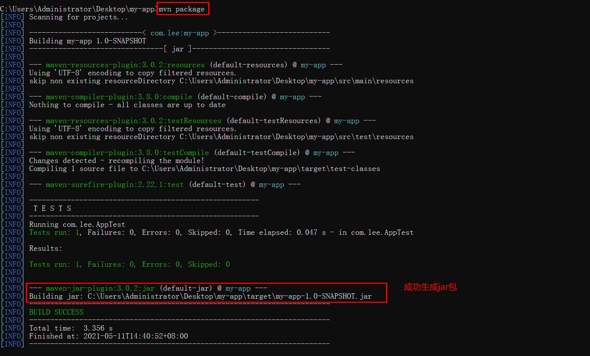

在target目录下成功生成了jar 包，我们进入target 目录，运行以下命令：

```shell
java -jar my-app-1.0-SNAPSHOT.jar
```

但是并没有成功运行：

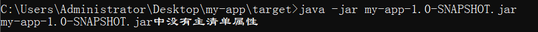

原因何在？

首先我们进入jar包，找到MANIFEST.MF文件，其内容如下：

```txt
Manifest-Version: 1.0
Created-By: Apache Maven 3.6.3
Built-By: Administrator
Build-Jdk: 11
```

其中缺少了一项主类的配置：

```txt
Main-Class: xx.xx.xx
```

因此，我们可以自己手动加上主类配置，但我们还是用maven的方式解决吧。修改pom.xml文件，如下在maven-jar-plugin插件中添加配置项：

```xml
<build>
    <plugins>
        <plugin>
            <artifactId>maven-jar-plugin</artifactId>
            <version>3.0.2</version>
            <configuration>
                <archive>
                    <manifest>
                        <mainClass>com.lee.App</mainClass>
                    </manifest>
                </archive>						
            </configuration>
        </plugin>
    </plugins>
</build>
```

然后重新打包，运行，结果如下：

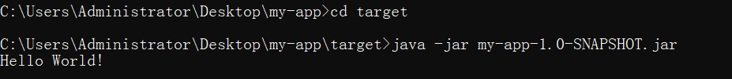

此时MANIFEST.MF文件内容如下：

```txt
Manifest-Version: 1.0
Created-By: Apache Maven 3.6.3
Built-By: Administrator
Build-Jdk: 11
Main-Class: com.lee.App
```

我们可以使用如下命令删除target文件夹：

```shell
mvn clean
```

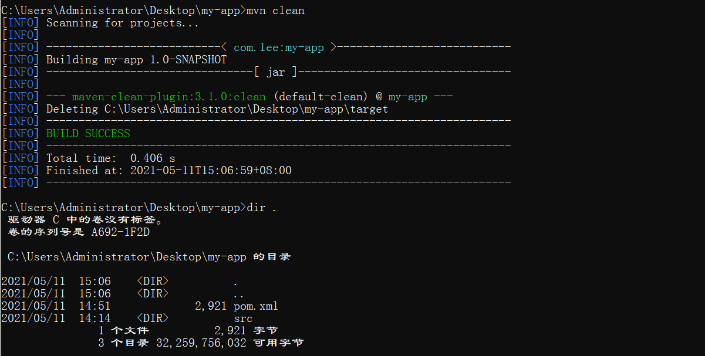


## 参考资料

[1] maven官网：http://maven.apache.org/

[2] maven打包缺少主类配置项：

问题明确：https://blog.csdn.net/xqnode/article/details/86628794

问题解决：https://blog.csdn.net/zwc2xm/article/details/91492284

