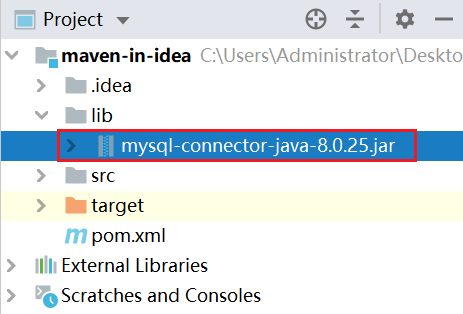
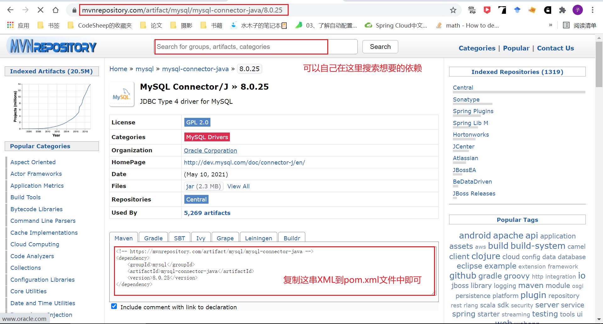
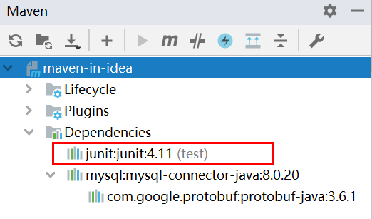

# maven— —依赖机制

本文主要介绍maven中的依赖机制。

[toc]

## 1. 引入依赖体会

### 1.1 引入依赖的原始做法

现在要求我们的项目连接MySQL数据库，需要怎么做呢？

首先连接MySQL数据库需要引入以下jar包(版本号省略)：

```txt
mysql-connector-java-xxx.jar
```

首先，存在一个问题：去哪下载jar包？

然后将jar放入项目下的lib目录，并且`Add as Library`：



之后才能使用。这个过程稍显麻烦。


### 1.2 引入依赖的maven做法

如果我们使用maven管理我们的项目，那么当我们的项目想要连接数据库，引入依赖时，只需要在pom.xml文件中添加下面的内容：

```xml
<dependencies>
    <dependency>
        <groupId>mysql</groupId>
        <artifactId>mysql-connector-java</artifactId>
        <version>8.0.20</version>
    </dependency>
</dependencies>
```

之后，我们就可以在项目中使用jdbc连接MySQL数据库了。

此时，我们可以解答上一小节的问题，去哪下载jar包？引入maven后，问题变为去哪找到这一串XML代码？

答案很简单，去maven仓库就可以找到相关的依赖项：https://mvnrepository.com/

例如：



引入依赖后，在IDEA中显示如下：


## 2. 依赖的传递性

所谓依赖的传递性，是指如果一个项目A依赖项目B，而项目B又依赖项目C，那么项目A也会引入依赖C。

例如：


在我们的项目中，只引入了两个依赖：`junit`和`mysql-connector-java`，但实际引入了四个依赖，还包括`junit`依赖的`hamcrest-core`，`mysql-connector-java`依赖的`protobuf-java`。

**依赖仲裁**

依赖仲裁是指如果出现某个依赖，存在不同版本，选择哪个依赖的问题。

如下，项目A的两条依赖路径为A--》B--》C--》D 2.0和A--》E--》D 1.0，同时依赖了D，但是版本不同，此时A应该引入哪个版本的依赖呢？是D 1.0还是D 2.0呢？

```txt
  A
  ├── B
  │   └── C
  │       └── D 2.0
  └── E
      └── D 1.0
```

maven采用就近原则进行选择，是指在依赖树中，哪个版本的依赖离根项目最近，就选择哪个版本。在上述例子中，D 1.0比D 2.0到A的路径短，则选择依赖D 1.0。

注意，如果两个依赖版本在依赖树中具有相同的深度，那么第一个声明的依赖将获胜。

当然，我们也可以在项目中明确指定版本，这样A就依赖D 2.0了：

```txt
  A
  ├── B
  │   └── C
  │       └── D 2.0
  ├── E
  │   └── D 1.0
  │
  └── D 2.0   
```

**移除依赖**

我们也可以移除某一个依赖的依赖，来使得只依赖某一个版本的依赖。移除依赖可以通过`<exclusion>`实现。例如：

```xml
<dependencies>
    <dependency>
        <groupId>junit</groupId>
        <artifactId>junit</artifactId>
        <version>4.11</version>
        <scope>test</scope>
        <exclusions>
            <exclusion>
                <groupId>org.hamcrest</groupId>
                <artifactId>hamcrest-core</artifactId>
            </exclusion>
        </exclusions>
    </dependency>
</dependencies>
```




## 3. 依赖的作用域

依赖作用域用于限制依赖项的传递性，并确定什么时候将依赖包含在类路径中（项目）。在pom.xml文件中，通过元素`<scope>`指定。

首先明确maven项目的生命周期，大致可以分为这么几个阶段 **编译--》测试--》打包--》运行** 。

存在以下六种依赖作用域：

- **compile**：默认的依赖作用域。依赖项在项目的所有类路径中都可用。此外，这些依赖可以被传播到依赖项目中。
- **provided**：这与compile非常相似，但表明您希望JDK或容器在运行时提供依赖项。例如，当为JavaEE构建一个web应用程序时，你应该将Servlet API和相关Java EE API的依赖设置为provided作用域，因为web容器提供了这些类。具有此作用域的依赖被添加到用于编译和测试的类路径中，但不添加到运行时类路径中。它不是可传递的。
- **test**：此作用域表明该依赖对于正常使用该应用程序不是必需的（即在 src/main/java 下不可用），并且仅在测试编译和执行阶段可用。 此范围不是可传递的。 通常，此范围用于测试库，例如JUnit和Mockito。 如果非测试库用于单元测试（src / test / java），而不用于模型代码（src / main / java），则也可用于非测试库，例如Apache Commons IO。
- **runtime**：此作用域表明编译时不需要该依赖项，但执行时需要该依赖项。Maven在运行时和测试类路径中包含了此作用域的依赖，但在编译类路径中没有。
- **system**：与 provided 的作用范围类似，唯一的区别就是不会从 maven 仓库抓取Jar包，而是从本地文件系统获取，需要配合 `<systemPath>` 属性使用。日常工作很少用到。
- **import**

最常用的作用域是compile、provided和test。


## 4. 依赖管理


## 5. 仓库

仓库是指存放依赖的地方，分为本地仓库和远程仓库。

- 本地仓库：本地仓库是maven可运行的计算机上的一个目录，它缓存远程下载，并包含您尚未发布的临时构件（通俗来说，自己构建的jar包）。
- 远程仓库：远程仓库是指任何其他类型（即除了本地仓库外，其它仓库都属于远程仓库）的仓库，可以通过各种协议（例如 `file://`和`https://`）进行访问。 这些仓库可能是由第三方建立的，提供构件供下载（例如`repo.maven.apache.org`）。 其他远程仓库可能是在公司内的文件或HTTP服务器上设置的内部仓库，用于在开发团队之间共享私有的构件以及用于发布，这也称为私有仓库。

**本地仓库**

默认情况下（Windows环境中），本地仓库的地址是`C:\Users\Administrator\.m2\repository`，如果我们不做任何配置，当然可以使用，但是在我们项目开发中，会不断压缩C盘的空间，所以我们可以修改maven的配置文件，更改本地仓库的位置。

首先找到maven安装目录下的`conf\settings.xml`文件，然后修改`<localRepository>`元素的值：


**远程仓库**


**私有仓库**


## 参考资料

[1] 