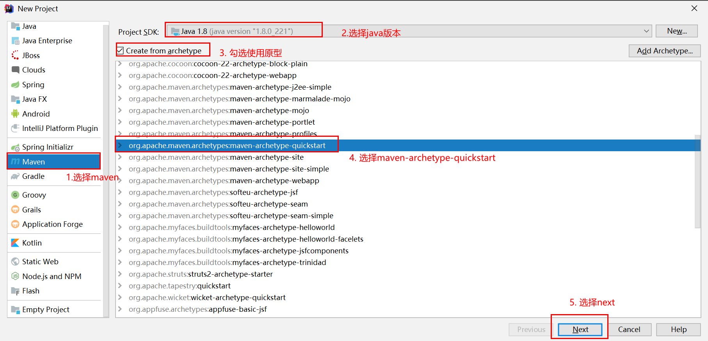
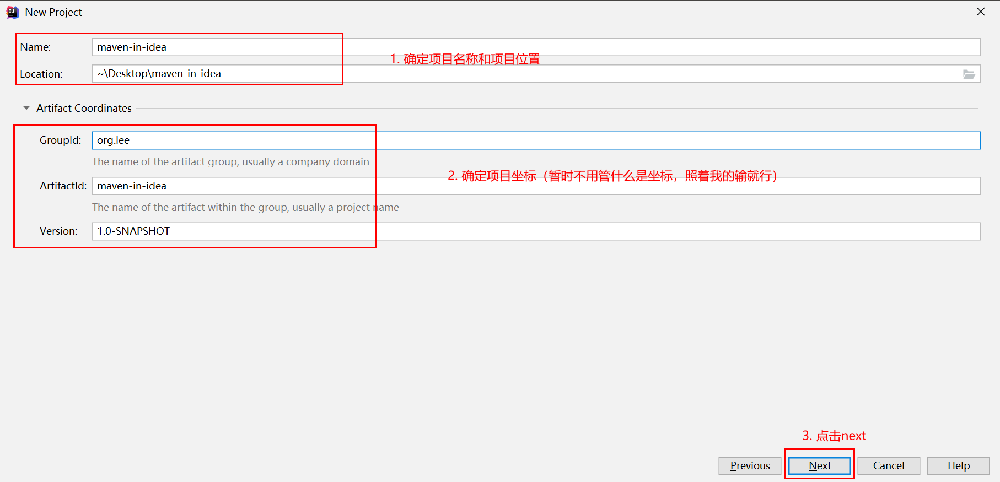
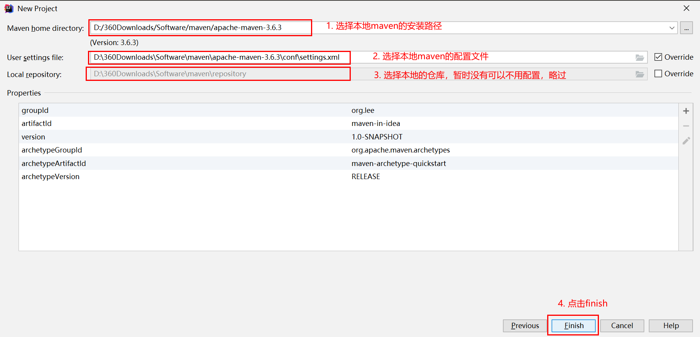
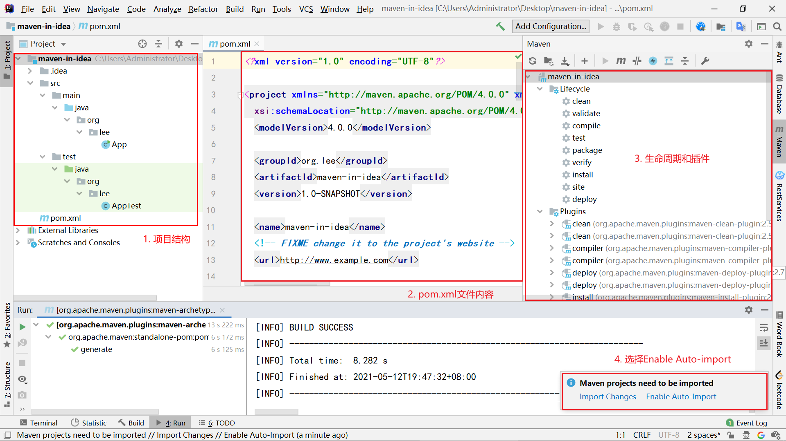
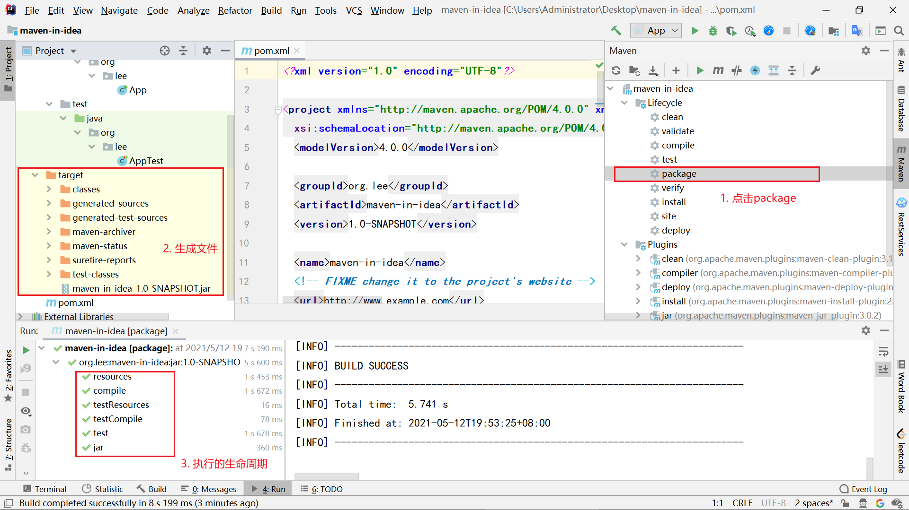
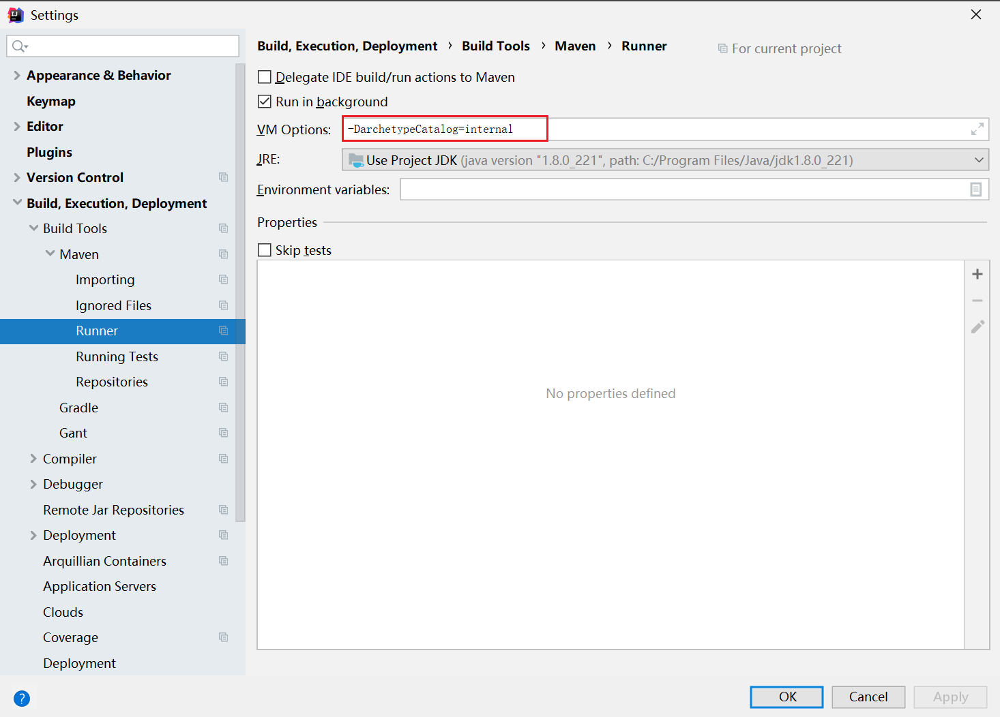

# maven— —在IDEA中使用maven

本文主要介绍如何在idea中使用maven。

[toc]

## 1. 使用IDEA创建maven项目

我们之前都是使用命令行创建、操作项目，这是一种非常低效率的项目开发方式，我们本节主要介绍如何在IDEA中创建maven项目。

首先新建项目，选择maven，选择Java版本，选择使用原型maven-archetype-quickstart：



然后确定项目名称、位置、坐标：



配置maven，点击finish完成项目创建：



项目创建完成后，IDEA页面如下：



几点说明 ：

- 在idea创建的maven项目，项目结构与使用命令行创建的项目结构相同，只不过多了.idea目录，这是idea项目的标识；
- 在右侧点击`Maven`选项，即可弹出生命周期和插件栏，之前我们要用命令行运行生命周期，现在只需要点击生命周期就可以了；
- 在右下角有提示信息，选择`Enable Auto-Import`，原因下文再说；


## 2. 生命周期测试

我们可以点击package，效果如下：



- 在项目目录下生成了`target`目录，其中包含编译文件、jar包等内容；
- 左下角显示了执行的生命周期；


## 3. 问题

在创建项目时，可能会出现以下问题：

```txt
No archetype found in remote catalog. Defaulting to internal catalog
```

这是因为maven在远程目录中找不到模板。

解决方法：

[1] 参考链接：https://blog.csdn.net/AdminGuan/article/details/103216314（没试过，自己试一下）

[2] 既然maven在远程目录中找不到模板，默认使用本地的模板，那么就在设置中直接让maven使用本地模板。



