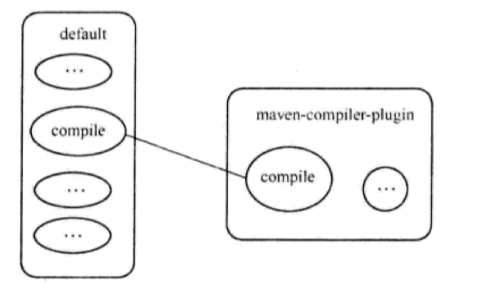
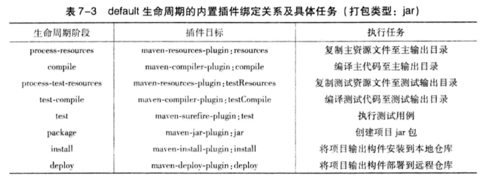

# maven— —生命周期与插件

本文主要介绍maven的生命周期与插件知识。

[toc]

## 1. 什么是生命周期

maven的生命周期就是对所有的构建过程进行抽象和统一。maven从大量项目和构建工具中总结了一套高度完善的、易扩展的生命周期。这个生命周期包含项目的**清理、初始化、编译、测试、打包、集成测试、验证、部署和站点生成**等几乎所有的构建步骤。**Maven的生命周期是抽象的，其实际行为都由插件来完成**。Maven的生命周期是为了对所有的构建过程进行抽象和统一。


## 2. 三套生命周期

在maven定义了三套相互独立的生命周期：

- default Lifecycle
- clean Lifecycle
- site Lifecycle

clean生命周期的目的是清理项目，default生命周期的目的是构建项目，site目的是建立项目站点。

每个生命周期包含一些阶段（phase），这些阶段是有顺序的，并且后面的阶段依赖于前面的阶段。


### 2.1 clean Lifecycle

clean Lifecycle包含以下阶段：

```xml
<phases>
  <phase>pre-clean</phase>
  <phase>clean</phase>
  <phase>post-clean</phase>
</phases>
<default-phases>
  <clean>
    org.apache.maven.plugins:maven-clean-plugin:2.5:clean
  </clean>
</default-phases>
```

- pre-clean 执行一些清理前需要完成的工作。
- clean 清理上一次构建生成的文件。
- post-clean 执行一些清理后需要完成的工作。

通过命令行调用pre-clean的时候，只有pre-clean阶段得以执行，当调用post-clean的时候，三个阶段会按顺序执行。


### 2.2 default Lifecycle

default Lifecycle包含以下阶段，下一章会详细讲解该生命周期：

```xml
<phases>
  <phase>validate</phase>
  <phase>initialize</phase>
  <phase>generate-sources</phase>
  <phase>process-sources</phase>
  <phase>generate-resources</phase>
  <phase>process-resources</phase>
  <phase>compile</phase>
  <phase>process-classes</phase>
  <phase>generate-test-sources</phase>
  <phase>process-test-sources</phase>
  <phase>generate-test-resources</phase>
  <phase>process-test-resources</phase>
  <phase>test-compile</phase>
  <phase>process-test-classes</phase>
  <phase>test</phase>
  <phase>prepare-package</phase>
  <phase>package</phase>
  <phase>pre-integration-test</phase>
  <phase>integration-test</phase>
  <phase>post-integration-test</phase>
  <phase>verify</phase>
  <phase>install</phase>
  <phase>deploy</phase>
</phases>
```


### 2.3 site Lifecycle

site Lifecycle包含以下阶段：

```xml
<phases>
  <phase>pre-site</phase>
  <phase>site</phase>
  <phase>post-site</phase>
  <phase>site-deploy</phase>
</phases>
<default-phases>
  <site>
    org.apache.maven.plugins:maven-site-plugin:3.3:site
  </site>
  <site-deploy>
    org.apache.maven.plugins:maven-site-plugin:3.3:deploy
  </site-deploy>
</default-phases>
```

- pre-site 做一些生成项目站点之前的工作。
- site 生成项目站点文档。
- post-site 做一些生成站点之后的工作。
- site-deploy 将生成的项目站点发布到服务器上。


### 2.4 调用生命周期

通过命令行调用maven的生命周期阶段。各个生命周期相互独立，而一个生命周期的阶段是有前后依赖关系的。例如：

`mvn clean` 该命令执行的阶段为clean生命周期的pre-clean和clean阶段。

`mvn test` 执行default生命周期的validate、initialize等，直到test的所有阶段。

`mvn clean install` 执行clean生命周期的pre-clean、clean，然后执行default生命周期的从validate到install的所有阶段。


## 3. 默认生命周期

default生命周期包含的全阶段在上述的文件中已详细列出，此处只讲解主要的阶段：

- `validate` - **验证**项目是否正确以及所有必要的信息是否可用。
- `compile` - **编译**项目源代码。
- `test` - 使用合适的单元测试框架**测试**编译后的源代码。这些测试不应该要求对代码进行打包或部署。
- `package` - 将编译后的代码**打包**成可分发格式，比如JAR。
- `verify` - 对**集成测试**的结果运行任何检查，以确保满足质量标准。
- `install` - 将包**安装到本地存储库**中，以便在本地其他项目中作为依赖项使用。
- `deploy` - 在构建环境中完成，将**最终包复制到远程存储库**，以便与其他开发人员和项目共享。

这些阶段都是顺序完成的。当我们执行命令`mvn package`时，该命令会从`validate`阶段顺序执行到`package`阶段。


## 4. 插件与插件绑定

### 4.1 内置插件与插件绑定

Maven的生命周期与插件相互绑定，用以完成实际的构建任务。例如项目编译这一任务，它对应了default生命周期的compile阶段，而maven-compile-plugin这一插件的compile目标能完成该任务。因此，将它们绑定，就能实现编译的目的。



一个插件往往能够完成多个任务。例如maven-dependency-plugin，它能够基于项目依赖做很多事情，例如分析项目依赖，帮助找出所有已解析的依赖等等，每个功能就是一个插件目标。用法是 \<插件前缀:目标\>。

Maven为一些主要的生命周期阶段绑定了很多插件的目标，当用户通过命令行调用生命周期阶段的时候，对应的插件目标就会执行相应的任务。例如clean绑定maven-clean-plugin:clean。

而default生命周期，由于项目的打包类型会影响构建的具体过程，因此，default生命周期的阶段与插件的目标绑定关系由项目打包类型所决定，打包类型通过POM中的packaging元素定义，最常用的打包类型是jar。以下是基于jar打包类型，default生命周期的内置插件绑定关系：

```xml
<phases>
  <process-resources>
    org.apache.maven.plugins:maven-resources-plugin:2.6:resources
  </process-resources>
  <compile>
    org.apache.maven.plugins:maven-compiler-plugin:3.1:compile
  </compile>
  <process-test-resources>
    org.apache.maven.plugins:maven-resources-plugin:2.6:testResources
  </process-test-resources>
  <test-compile>
    org.apache.maven.plugins:maven-compiler-plugin:3.1:testCompile
  </test-compile>
  <test>
    org.apache.maven.plugins:maven-surefire-plugin:2.12.4:test
  </test>
  <package>
    org.apache.maven.plugins:maven-jar-plugin:2.4:jar
  </package>
  <install>
    org.apache.maven.plugins:maven-install-plugin:2.4:install
  </install>
  <deploy>
    org.apache.maven.plugins:maven-deploy-plugin:2.7:deploy
  </deploy>
</phases>
```



default生命周期还有很多其他阶段，默认它们没有绑定任何插件，因此也没有实际行为。


### 4.2 插件配置

存在两种插件配置方式：命令行和pom.xml文件配置。

**命令行插件配置**

插件目标支持命令行配置，可以通过-D参数，并伴随一个参数=参数值的形式，来配置插件目标的参数。例如命令 mvn install -Dmaven.test.skip=true ，就会跳过执行测试。

**pom.xml文件配置**

```xml
<build>
    <plugins>
        <plugin>
            <groupId>org.apache.maven.plugins</groupId>
            <artifactId>maven-compiler-plugin</artifactId>
            <version>3.8.0</version>
            <configuration>
                <source>8</source>
                <target>8</target>
            </configuration>
        </plugin>
    <plugins>
<build>
```

这样，不管绑定到compile阶段的maven-compiler-plugin:compile任务，还是绑定到test-compiler阶段的maven-compiler-plugin:testCompiler任务，就都能够使用该配置，基于1.8版本进行编译。


## 参考资料

[1] maven生命周期和插件详解：https://www.cnblogs.com/yuanrw/p/9979875.html

[2] maven的三种生命周期：http://maven.apache.org/ref/3.8.1/maven-core/lifecycles.html

[3] maven的default生命周期：http://maven.apache.org/guides/introduction/introduction-to-the-lifecycle.html

[4] default生命周期的插件绑定：http://maven.apache.org/ref/3.8.1/maven-core/default-bindings.html