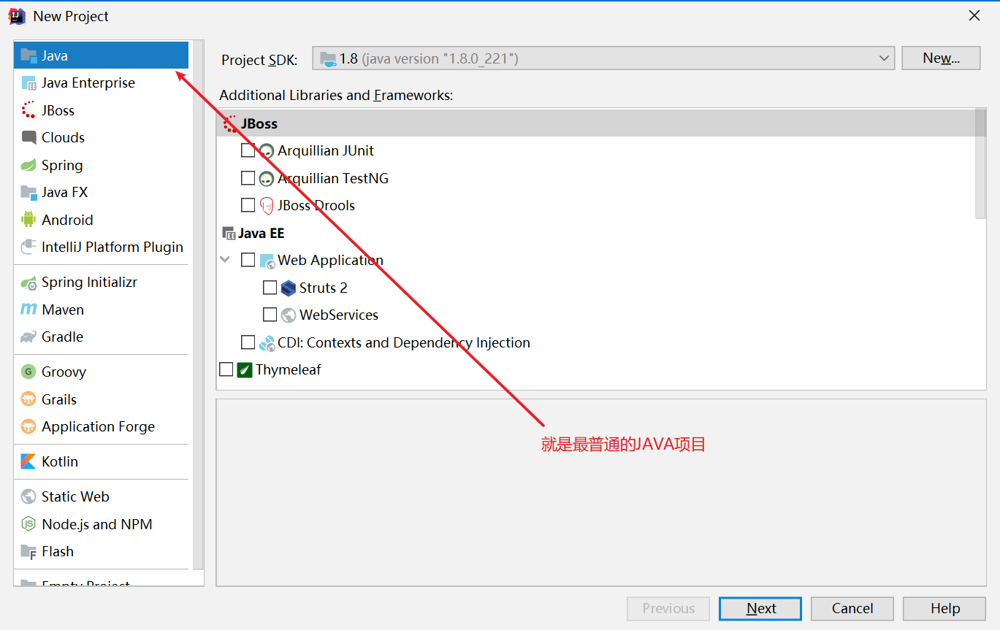
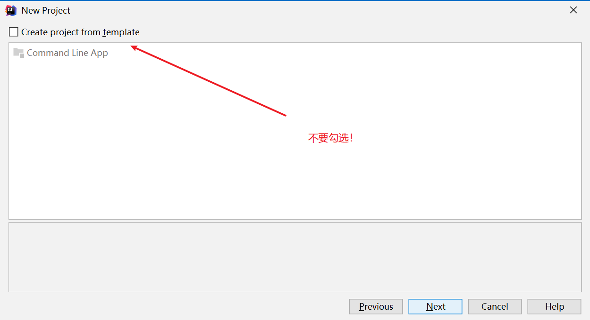
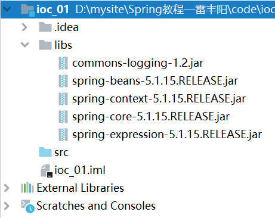
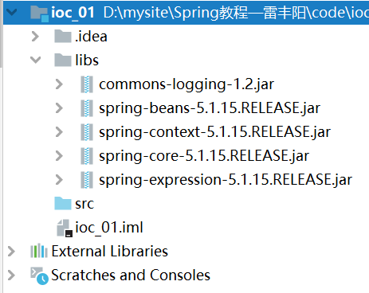
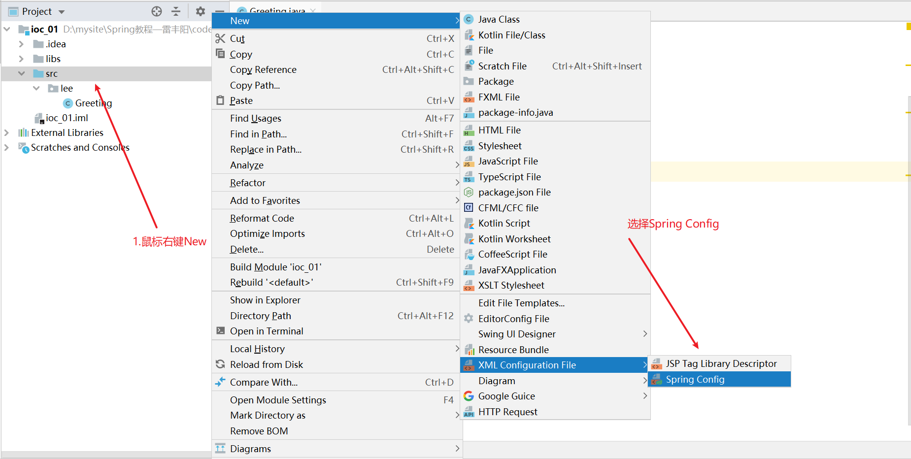
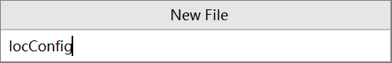
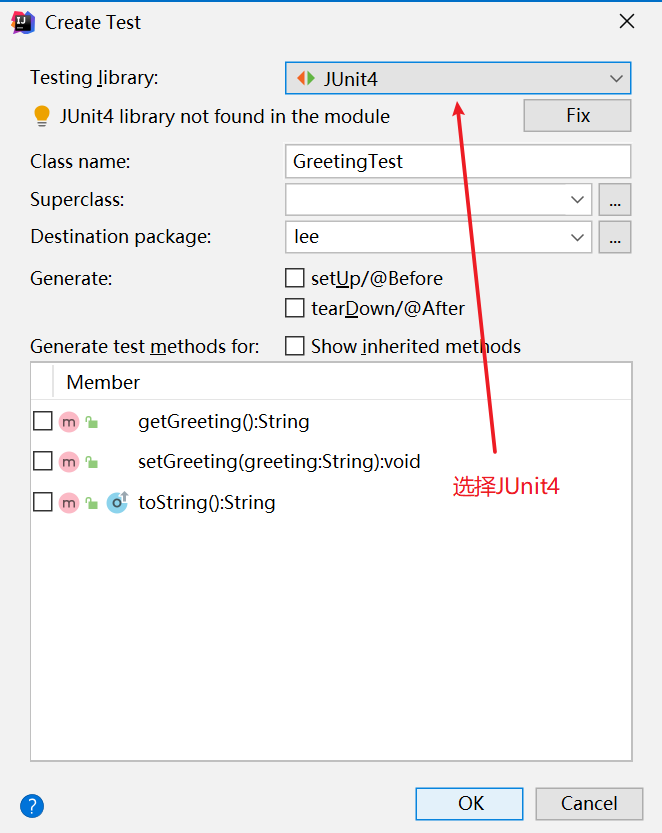
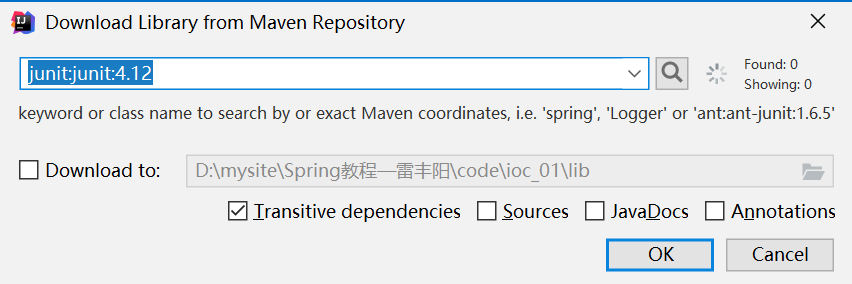
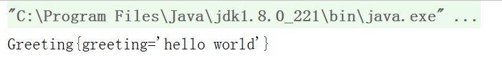

# Spring— —IOC入门案例

[toc]

## 一、下载相关jar包

详细的下载过程此处不再赘述，可以参考以下文章进行下载：

 https://www.cnblogs.com/chy18883701161/p/11108542.html 

下载spring地址： https://repo.spring.io/webapp/#/artifacts/browse/tree/General/ 

下载commons-logging地址： http://commons.apache.org/proper/commons-logging/download_logging.cgi 


## 二、创建项目

打开IDEA，创建一个JAVA项目，就是一个简简单单的JAVA项目。





后面选择项目位置省略。


## 三、导入相关包

创建完成后，在该项目下创建一个文件夹libs，用于存放相关的jar包。然后打开下载好的spring压缩包，解压后在libs文件夹找到以下四个jar包：

```markdown
spring-context-5.1.15.RELEASE.jar
spring-core-5.1.15.RELEASE.jar
spring-expression-5.1.15.RELEASE.jar
spring-beans-5.1.15.RELEASE.jar
```

然后在commons-logging文件夹下找到以下jar包：

```markdown
commons-logging-1.2.jar
```

将上述的五个jar包复制到我们项目下的libs文件夹下：



然后选择全部jar包，单击鼠标右键选择"Add as Library":

在弹出的提示消息框中直接点击确定，之后项目目录如下:




## 四、创建相关类

在项目src文件夹下创建一个包lee，然后在该包下创建一个实体类`Greeting`，类代码如下：

```java
package lee;

public class Greeting {
    private String greeting;

    public String getGreeting() {
        return greeting;
    }

    public void setGreeting(String greeting) {
        this.greeting = greeting;
    }

    @Override
    public String toString() {
        return "Greeting{" +
                "greeting='" + greeting + '\'' +
                '}';
    }
}

```


## 五、创建IOC配置文件

在项目src文件夹下创建IOC配置文件，鼠标右键选择"Spring Config"：



然后在弹出的提示框中输入文件名IocConfig:



此时配置文件内容如下：

```xml
<?xml version="1.0" encoding="UTF-8"?>
<beans xmlns="http://www.springframework.org/schema/beans"
       xmlns:xsi="http://www.w3.org/2001/XMLSchema-instance"
       xsi:schemaLocation="http://www.springframework.org/schema/beans http://www.springframework.org/schema/beans/spring-beans.xsd">

</beans>
```

如果找不到”Spring Config“这一项，也可以直接创建XML文件，然后将上面的内容复制进去即可。


## 六、注册相关类

在IocConfig.xml文件中注册Greeting类，详细内容如下：

```xml
<?xml version="1.0" encoding="UTF-8"?>
<beans xmlns="http://www.springframework.org/schema/beans"
       xmlns:xsi="http://www.w3.org/2001/XMLSchema-instance"
       xsi:schemaLocation="http://www.springframework.org/schema/beans http://www.springframework.org/schema/beans/spring-beans.xsd">

    <!-- 一个bean标签表示注册一个组件（类）
         id属性唯一标识该bean
         class属性标识注册的组件（类），需要是该类的全限定名
    -->
    <bean id="greeting" class="lee.Greeting">
        <!-- 一个property标签表示为一个类属性赋值
              name表示类属性名
              value表示该类属性的值    
        -->
        <property name="greeting" value="hello world"></property>
    </bean>
    
</beans>
```


## 七、创建测试类

选择Greeting类页面，鼠标移到该类中，按下快捷键”Ctrl+shift+T“，打开创建测试类的向导：

选择JUnit4，单击OK进入下一步：



然后导入相关依赖：



之后就可以编写测试方法进行IOC测试了，具体的测试类代码如下:

```java
package lee;

import org.junit.Test;
import org.springframework.context.ApplicationContext;
import org.springframework.context.support.ClassPathXmlApplicationContext;

public class GreetingTest {

    @Test
    public void testIoc(){
        //1.根据配置文件获取IOC容器对象
        ApplicationContext ioc = new ClassPathXmlApplicationContext("IocConfig.xml");
        //2.根据id获取注册的组件（类）
        Greeting greeting = (Greeting)ioc.getBean("greeting");
        //3.使用该组件（类）
        System.out.println(greeting);
    }

}
```

执行该测试方法，结果如下:




## 八、参考资料

【1】尚硅谷雷丰阳Spring视频课程： https://www.bilibili.com/video/BV1d4411g7tv

【2】下载jar包： https://www.cnblogs.com/chy18883701161/p/11108542.html 

【2】IDEA导入jar包： https://blog.csdn.net/qq_26525215/article/details/53239123 