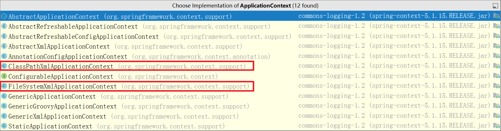
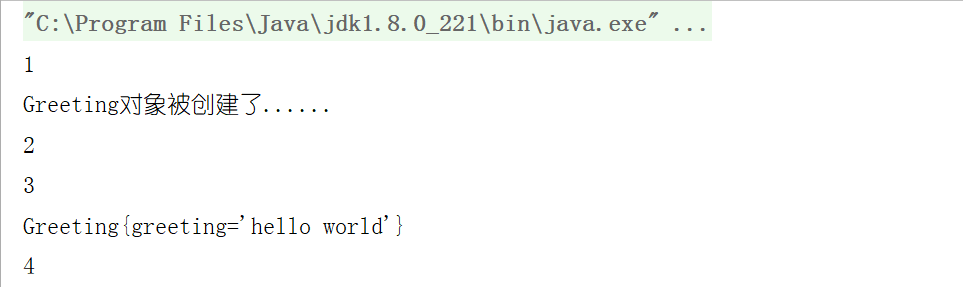
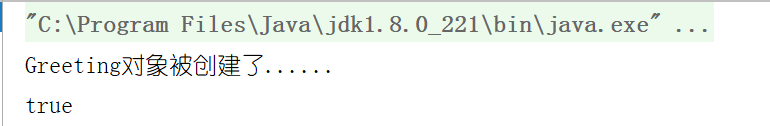
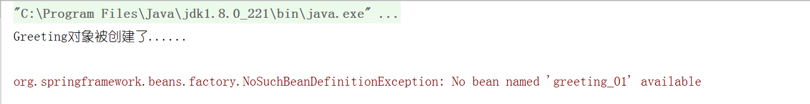

# Spring— —IOC入门案例剖析

本篇文章是对IOC入门案例的剖析，进一步探究IOC入门案例的细节。


## 一、容器接口的实现类

我们使用如下代码获取一个IOC容器：

```java
ApplicationContext ioc = new ClassPathXmlApplicationContext("IocConfig.xml");
```

除了在类路径下获取配置文件，也可以在文件系统中的路径下获取配置文件，我们查看`ApplicationContext`的实现类：




## 二、组件何时被创建？

首先在`Greeting`类中添加无参构造函数：

```java
public Greeting() {
    System.out.println("Greeting对象被创建了......");
}
```

然后转到测试方法，修改如下：

```java
@Test
public void testIoc(){
    System.out.println(1);
    ApplicationContext ioc = new ClassPathXmlApplicationContext("IocConfig.xml");
    System.out.println(2);
    Greeting greeting = (Greeting)ioc.getBean("greeting");
    System.out.println(3);
    System.out.println(greeting);
    System.out.println(4);
}
```

执行该测试方法，结果如下：



发现组件对象是在容器创建完成时就被创建了，而不是在需要获取组件对象时才被创建的。


## 三、单实例

同一组件对象在容器中只有一个还是会存在多个呢？

修改测试代码如下：

```java
@Test
public void testIoc(){
    ApplicationContext ioc = new ClassPathXmlApplicationContext("IocConfig.xml");
    Greeting greeting = (Greeting)ioc.getBean("greeting");
    Greeting greeting1 = (Greeting)ioc.getBean("greeting");
    System.out.println(greeting == greeting1);
}
```

结果如下：



如果我们多次获取容器中的同一个组件对象，那么获取到的是同一个对象。


## 四、获取组件异常

如果我们尝试获取一个容器中不存在的组件对象时，会发生什么呢？

修改测试代码如下：

```java
@Test
public void testIoc(){
    ApplicationContext ioc = new ClassPathXmlApplicationContext("IocConfig.xml");
    Greeting greeting = (Greeting)ioc.getBean("greeting_01");
    System.out.println(greeting );
}
```

上述代码表示我们尝试从容器中获取id为greeting_01的组建对象，但我们知道，这是不存在的，所以结果如下：



即获取容器中不存在的组件对象时，抛出异常`NoSuchBeanDefinitionException`。

主要有两种方式获取组件：1.通过`id`；2.通过类型

### 4.1、通过id获取组件

如果在容器中有多个同类的组件对象，我们可以通过`id`获取到不同的组件对象。

在IOC配置文件中添加一个`<bean>`：

```xml
<bean id="greeting-chinese" class="lee.Greeting">
    <property name="greeting" value="你好"></property>
</bean>
```

然后在测试方法中通过`id`获取不同的组件对象：

```java
@Test
public void testIoc(){
    ApplicationContext ioc = new ClassPathXmlApplicationContext("IocConfig.xml");
    Greeting greeting = (Greeting)ioc.getBean("greeting");
    Greeting greeting1 = (Greeting)ioc.getBean("greeting-chinese");
    System.out.println(greeting );
    System.out.println(greeting1 );
}
```

结果如下，没有问题：


### 4.2、通过类型获取组件

除了通过`id`获取组件对象，我们也可以通过类型（即`<bean>`标签的`<class>`属性）来获取组件对象，直接修改测试方法：

```java
@Test
public void testIoc(){
    ApplicationContext ioc = new ClassPathXmlApplicationContext("IocConfig.xml");
    Greeting greeting = (Greeting)ioc.getBean(Greeting.class);
    System.out.println(greeting);
}
```

结果如下：

> <font color="red">org.springframework.beans.factory.NoUniqueBeanDefinitionException: No qualifying bean of type 'lee.Greeting' available: expected single matching bean but found 2: greeting,greeting-chinese</font>

我们可以清楚地知道，在IOC配置文件中，我们注册了两个`Greeting`类对象，所以我们通过类型获取组件对象，Spring并不知道要获取哪一个。**所以在通过类型获取组件对象时，容器中应该只有唯一一个该类型的组件对象。**


## 五、属性赋值

在IOC配置文件中，我们是通过`<property>`标签为属性赋值：

```xml
<property name="greeting" value="hello world"></property>
```

该行语句实际上是通过类中的`setter`方法对相应的属性进行赋值的。

建议所有的`getter/setter`方法都自动生成。


## 六、参考资料

【1】尚硅谷雷丰阳Spring视频教程： https://www.bilibili.com/video/BV1d4411g7tv/?p=16 

