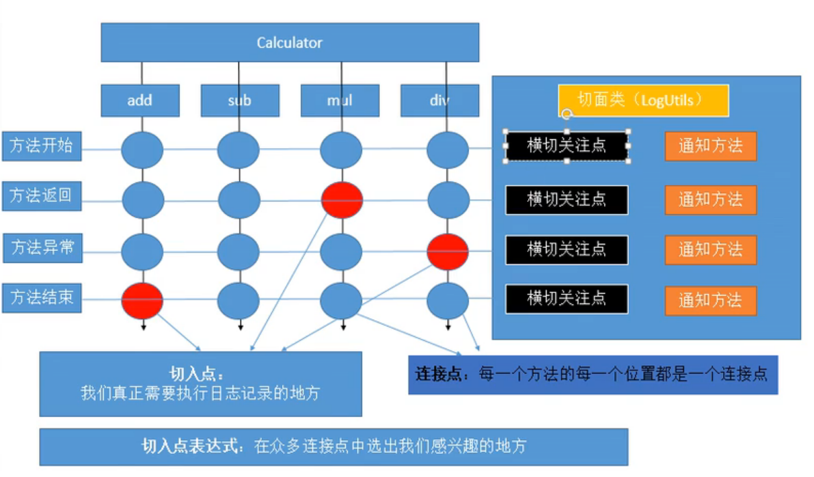
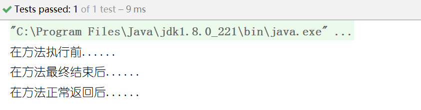
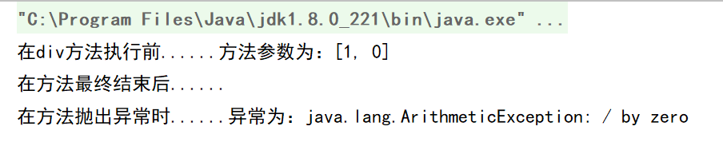

# Spring— —AOP

本篇文章主要介绍了如何基于注解使用AOP的入门案例。

[toc]

## 一、什么是AOP？

### 1.1、AOP概念 

AOP（Aspect Oriented Programming），即面向切面编程，可以说是OOP（Object Oriented Programming，面向对象编程）的补充和完善。与OOP对比，AOP面向切面，传统的OOP开发中，代码逻辑是自上而下的，在这些自上而下的过程中，会产生一些横切性的问题，这些横切性的问题和我们的主业务逻辑关系不大，会散落在代码的各个地方，造成难以维护，AOP的编程思想就是把业务逻辑和横切的问题进行分离，从而达到解耦的目的，提到代码的可重用性与开发效率。

### 1.2、AOP术语

|                概念                |                             描述                             |
| :--------------------------------: | :----------------------------------------------------------: |
|        Join point（连接点）        |          目标对象中的方法，类似数据库表中的一条记录          |
|          PointCut（切点）          |              表示连接点的集合，类似数据库中的表              |
|           Advice（通知）           | 通知指的就是指拦截到连接点之后要执行的代码，通知分为前置、后置、异常、最终、环绕通知五类 |
|           Aspect（切面）           |      切点、连接点、通知等的载体，它们加起来就是一个切面      |
|     Target object（目标对象）      |         包含连接点的对象，也被称作被通知或被代理对象         |
|     AOP proxy（AOP 代理对象）      |                   AOP创建的对象，包含通知                    |
|          Weaving（织入）           |           把代理逻辑加入到目标对象的过程，叫做织入           |
|     Before advice（前置通知）      |                           前置通知                           |
| After returning advice（后置通知） |                           后置通知                           |
|     Around advice（环绕通知）      |                  前后都有，最常用的一种通知                  |



<p align="center" style="font:8;color:gray">图源：尚硅谷雷丰阳</p>


## 二、基于注解的AOP实现

### 2.1、新建项目

打开IDEA，创建一个普通的Java项目，过程略。


### 2.2、导入相关JAR包

在项目下新建文件夹`lib`，导入以下JAR包。

```markdown
commons-logging-1.2.jar
spring-beans-5.1.15.RELEASE.jar
spring-context-5.1.15.RELEASE.jar
spring-core-5.1.15.RELEASE.jar
spring-expression-5.1.15.RELEASE.jar

spring-aop-5.1.15.RELEASE.jar
spring-aspects-5.1.15.RELEASE.jar

com.springsource.net.sf.cglib-2.2.0.jar
com.springsource.org.aopalliance-1.0.0.jar
com.springsource.org.aspectj.weaver-1.6.8.RELEASE.jar
```

全选右键，选择`Add as Library`，添加到项目库文件中。

`spring-aspects-5.1.15.RELEASE.jar`：该JAR包是Spring提供的支持基础版的面向切面编程。

`com.springsource.net.sf.cglib-2.2.0.jar、com.springsource.org.aopalliance-1.0.0.jar、com.springsource.org.aspectj.weaver-1.6.8.RELEASE.jar`：这三个JAR包是加强版的面向切面编程，即目标对象没有实现接口也能创建动态代理。


### 2.3、创建业务接口及其实现类

在`src/main/java/com/lee/service`下创建我们的业务接口`Calculator`：

```java
package com.lee.service;

public interface Calculator {
    public int add(int i,int j);
    public int sub(int i,int j);
    public int mul(int i,int j);
    public int div(int i,int j);
}

```

在`src/main/java/com/lee/service/impl`下实现我们的业务接口`Calculator`：

```java
package com.lee.service.impl;

import com.lee.service.Calculator;

public class CalculatorImpl implements Calculator {
    @Override
    public int add(int i, int j) {
        return i + j;
    }

    @Override
    public int sub(int i, int j) {
        return i - j;
    }

    @Override
    public int mul(int i, int j) {
        return i * j;
    }

    @Override
    public int div(int i, int j) {
        return i / j;
    }
}

```


### 2.4、创建切面类

在`src/main/java/com/lee/utils`下创建我们的切面类`LogUtil`：

```java
package com.lee.utils;

public class LogUtil {
    public static void start(){
        System.out.println("在方法执行前......");
    }
    
    public static void end(){
        System.out.println("在方法正常返回后......");
    }
    
    public static void throwExecption(){
        System.out.println("在方法抛出异常时......");
    }
    
    public static void finallyEnd(){
        System.out.println("在方法最终结束后......");
    }
}

```


### 2.5、创建配置文件及实现配置

该阶段主要由以下步骤组成：

- 将业务实现类对象和切面类对象加入到容器中
- 给IOC容器指明哪一个组件是切面类对象
- 指明切面类中的通知方法在何时何地切入
- 开启基于注解的AOP

首先在`src/main/resources`创建Spring的配置文件`applicationContext.xml`：

```xml
<?xml version="1.0" encoding="UTF-8"?>
<beans xmlns="http://www.springframework.org/schema/beans"
       xmlns:xsi="http://www.w3.org/2001/XMLSchema-instance"
       xmlns:p="http://www.springframework.org/schema/p"
       xmlns:context="http://www.springframework.org/schema/context"
       xsi:schemaLocation="http://www.springframework.org/schema/beans http://www.springframework.org/schema/beans/spring-beans-4.1.xsd
		http://www.springframework.org/schema/context http://www.springframework.org/schema/context/spring-context-4.1.xsd">

</beans>
```

然后基于注解将业务实现类对象和切面类对象加入到容器中，即在`CalculatorImpl`和`LogUtil`类上分别添加注解`@Service`和`@Componnent`，然后在配置文件中开启注解扫描：

```java
@Service
public class CalculatorImpl implements Calculator {......}

@Component
public class LogUtil {......}
```

```xml
<!-- 开启注解配置 -->
<context:annotation-config></context:annotation-config>
<!-- 注解扫描包配置 -->
<context:component-scan base-package="com.lee"></context:component-scan>
```

然后指明哪个类是切面类，即在该类上添加注解`@Aspect`:

```java
import org.aspectj.lang.annotation.Aspect;
import org.springframework.stereotype.Component;

@Aspect
@Component
public class LogUtil {......}
```

然后在切面类中基于注解配置通知方法在何时何地切入目标方法，主要涉及五个注解：

```markdown
@Before：在目标方法之前运行，前置通知
@AfterReturning：在目标方法正常返回之后运行，返回通知
@After：在目标方法结束之后，后置通知
@AfterThrowing：在目标方法抛出异常之后运行，异常通知
@Around：环绕通知

上述注解与动态代理中实现AOP的过程对应关系为：
try{
	@Before
	method.invoke(obj,args);
	@AfterReturning
}catch(Execption e){
	@AfterThrowing
}finally{
	@After
}
```

上述五个注解只是说明了通知方法何时切入目标方法，并没有指出切入到哪个目标方法，即没有解决何地的问题。所以我们需要切入点表达式，格式为`execution(访问权限符 返回值 全限定目标方法签名)`，将切入点表达式写入到注解中，即可解决何地的问题。

修改后的切面类如下：

```java
package com.lee.utils;

import org.aspectj.lang.annotation.*;
import org.springframework.stereotype.Component;

@Aspect
@Component
public class LogUtil {

    @Before("execution(public int com.lee.service.impl.CalculatorImpl.*(int,int))")
    public static void start(){
        System.out.println("在方法执行前......");
    }

    @AfterReturning("execution(public int com.lee.service.impl.CalculatorImpl.*(int,int))")
    public static void end(){
        System.out.println("在方法正常返回后......");
    }

    @AfterThrowing("execution(public int com.lee.service.impl.CalculatorImpl.*(int,int))")
    public static void throwExecption(){
        System.out.println("在方法抛出异常时......");
    }

    @After("execution(public int com.lee.service.impl.CalculatorImpl.*(int,int))")
    public static void finallyEnd(){
        System.out.println("在方法最终结束后......");
    }
}

```

最后需要开启基于注解的AOP功能：

```xml
<!-- 开启基于注解的AOP功能：AOP名称空间-->
<aop:aspectj-autoproxy ></aop:aspectj-autoproxy>
```

注意，需要导入AOP名称空间

```xml
xmlns:aop="http://www.springframework.org/schema/aop"

并且在xsi:schemaLocation中加入：
http://www.springframework.org/schema/aop
http://www.springframework.org/schema/aop/spring-aop.xsd
```


### 2.6、测试

在`src/test`下创建`AOPTest`测试类：

```java
import com.lee.service.Calculator;
import org.junit.Test;
import org.springframework.context.ApplicationContext;
import org.springframework.context.support.ClassPathXmlApplicationContext;

public class AOPTest {
    private ApplicationContext ioc = new ClassPathXmlApplicationContext("applicationContext.xml");

    @Test
    public void test(){
        Calculator calculator = (Calculator) ioc.getBean("calculatorImpl");
        calculator.add(1, 2);
    }

}

```

执行结果：




## 三、基于配置的AOP实现

### 3.1、创建切面类和目标类

切面类`LogUtil2`:

```java
package com.lee.utils;

public class LogUtil2 {

    public static void start(){
        System.out.println("在方法执行前......");
    }

    public static void end(){
        System.out.println("在方法正常返回后......");
    }

    public static void throwExecption(){
        System.out.println("在方法抛出异常时......");
    }

    public static void finallyEnd(){
        System.out.println("在方法最终结束后......");
    }
}
```

目标类`CalculatorImpl2`:

```java
package com.lee.service.impl;

import com.lee.service.Calculator;

public class CalculatorImpl2 implements Calculator {
    @Override
    public int add(int i, int j) {
        return i + j;
    }

    @Override
    public int sub(int i, int j) {
        return i - j;
    }

    @Override
    public int mul(int i, int j) {
        return i * j;
    }

    @Override
    public int div(int i, int j) {
        return i / j;
    }
}

```


### 3.2、配置

通常按照以下步骤实现基于配置的AOP：

- 将切面类和目标类加入到容器中，相当于加注解`@Component`

  ```xml
  <!-- 将目标类与切面类加入到容器中 -->
  <bean id="calculatorImpl2" class="com.lee.service.impl.CalculatorImpl2"></bean>
  <bean id="logUtil2" class="com.lee.utils.LogUtil2"></bean>
  ```

  

- 需要AOP名称空间，指定切面类，相当于加注解`@Aspect`

  ```xml
  <!-- 指定切面类 -->
  <aop:config>
      <aop:aspect ref="logUtil2"></aop:aspect>
  </aop:config>
  ```

  

- 配置通知方法，并且通过属性`pointcut`配置切入点表达式

  ```xml
  <!-- 指定切面类 -->
  <aop:config>
      <aop:aspect ref="logUtil2">
          <!-- 指定通知方法 -->
          <aop:before method="start" pointcut="execution(public int com.lee.service.impl.CalculatorImpl2.*(int,int))"></aop:before>
          <aop:after-returning method="end" pointcut="execution(public int com.lee.service.impl.CalculatorImpl2.*(int,int))"></aop:after-returning>
          <aop:after-throwing method="throwExecption" pointcut="execution(public int com.lee.service.impl.CalculatorImpl2.*(int,int))"></aop:after-throwing>
          <aop:after method="finallyEnd" pointcut="execution(public int com.lee.service.impl.CalculatorImpl2.*(int,int))"></aop:after>
      </aop:aspect>
  </aop:config>
  ```

  

## 四、环绕通知的使用

本节主要讲解环绕通知的使用。

环绕通知就是动态代理，通过参数`ProceedingJoinPoint point`来调用目标方法，并可以在其前后加上前置通知内容、返回通知内容、异常通知内容、后置通知内容等。

```java
@Component
@Aspect
public class LogUtil3 {

    @Around("execution(public int com.lee.service.impl.CalculatorImpl3.*(int,int))")
    public Object aop(ProceedingJoinPoint point) {
        Object returning = null;
        //获取目标方法参数
        Object[] args = point.getArgs();
        try {
            //前置通知
            System.out.println("环绕通知--前置通知（@Before）");
            //执行目标方法，并获取返回值
            returning = point.proceed(args);
            // 返回通知
            System.out.println("环绕通知--返回通知（@AfterReturning）");
        } catch (Throwable throwable) {
            //异常通知
            System.out.println("环绕通知--异常通知（@AfterThrowing）");
        } finally{
            // 后置通知
            System.out.println("环绕通知--后置通知（@After）");
        }
        //返回方法的返回值
        return returning;
    }

}

```

测试方法及结果：

```java
@Test
public void test03(){
    ApplicationContext ioc = new ClassPathXmlApplicationContext("applicationContext.xml");
    Calculator calculator = (Calculator) ioc.getBean("calculatorImpl3");
    calculator.div(1, 1);
}
```


## 五、其他细节

### 5.1、获取目标方法的详细信息

我们可以在通知方法中获取目标方法的详细信息，只需要在通知方法中增加一个参数，参数类型为：`org.aspectj.lang.JoinPoint`。

获取方法参数：

```java
//获取方法参数
Object[] args = joinPoint.getArgs();
```

```java
//获取方法签名
Signature signature = joinPoint.getSignature();
String name = signature.getName();     //获取方法名
```


### 5.2、获取目标方法返回值

如果要获取目标方法返回值，则需要在通知方法中加入参数`Object returning`，然后在注解上加入参数`returning="returning"`指明通知方法哪个参数接受目标方法返回值。

```java
@AfterReturning(value = "execution(public int com.lee.service.impl.CalculatorImpl.*(int,int))",returning = "returning")
public static void end(Object returning){
    System.out.println("在方法正常返回后......方法返回值为"+(Integer)returning);
}
```

如果是基于配置的AOP实现，则同样是在通知方法上增加参数，然后在配置文件中指明该参数接收返回值：

```java
public static void end(Object returning){
    System.out.println("在方法正常返回后......");
}
```

```xml
<aop:after-returning method="end" pointcut="execution(......)" returning="returning"></aop:after-returning>
```


### 5.3、获取异常

可以在通知方法中获取目标方法抛出的异常值，只需要在通知方法中加入参数`Exception exception`，然后在注解中通过属性`throwing`指明哪个参数接收异常。

```java
@AfterThrowing(value = "execution(public int com.lee.service.impl.CalculatorImpl.*(int,int))",throwing = "exception")
public static void throwExecption(Exception exception){
    System.out.println("在方法抛出异常时......异常为："+exception.toString());
}
```

测试方法及结果：

```java
@Test
public void test02(){
    ApplicationContext ioc = new 		ClassPathXmlApplicationContext("applicationContext.xml");
    Calculator calculator = (Calculator) ioc.getBean("calculatorImpl");
    calculator.div(1, 0);
}
```



如果是基于配置的AOP实现，则同样是在通知方法中增加参数，然后在配置中增加属性`throwing`：

```xml
<aop:after-throwing method="throwExecption" pointcut="execution(...)" throwing="exception"></aop:after-throwing>
```


### 5.4、通知方法的执行顺序

各通知方法的执行顺序理论上为：

```java
try{
	@Before
	method.invoke(obj,args);
	@AfterReturning
}catch(Execption e){
	@AfterThrowing
}finally{
	@After
}
```

但实际上，`@After`后置通知方法是一定会执行的，所以实际的执行顺序为：

```markdown
正常执行：@Before ----> @After ----> @AfterReturning
异常执行：@Before ----> @After ----> @AfterThrowing
```


### 5.5、切入点表达式的写法

切入点表达式的固定格式为：`execution(访问修饰符 返回值 方法全限定名(参数))`；

通配符有两个`*`和`..`：

- `*`
  - 匹配一个或多个字符
  - 匹配任意一个参数
  - 匹配一层路径
  - 访问修饰符不能用`*`来代替匹配任意修饰符，不写即为匹配任意访问修饰符
- `..`
  - 匹配任意多个、任意类型的参数
  - 匹配任意多层路径


### 5.6、抽取可重用的切入点表达式

如果在每个通知方法上都写上切入点表达式，那么需要修改时，则需要修改多个地方，容易造成错误。所以我们可以将重用的切入点表达式抽取出来，然后通知方法引入该切入点表达式。

在基于注解的AOP实现中，抽取可重用的切入点表达式有如下三个步骤：

- 在切面类中声明一个返回`void`的没有实现的方法；
- 在该方法上加注解`@Pointcut`，然后在注解中加上切入点表达式；
- 在通知方法中引入重用的切入点表达式，即通过`value=方法名()`重用；

```java
@Aspect
@Component
public class LogUtil {

    @Pointcut("execution(public int com.lee.service.impl.CalculatorImpl.*(int,int))")
    public void pointcut(){};

    @Before("pointcut()")
    public static void start(){
        System.out.println("在"+name+"方法执行前......"
    }

    @AfterReturning(value = "pointcut()",returning = "returning")
    public static void end(Object returning){
        System.out.println("在方法正常返回后......方法返回值为"+(Integer)returning);
    }

    @AfterThrowing(value = "pointcut()",throwing = "exception")
    public static void throwExecption(Exception exception){
        System.out.println("在方法抛出异常时......异常为："+exception.toString());
    }

    @After("pointcut()")
    public static void finallyEnd(){
        System.out.println("在方法最终结束后......");
    }
}

```


如果是基于配置的AOP实现，则可以通过标签`<aop:pointcut>`声明切入点表达式：

```xml
<aop:pointcut id="xxx" expression="切入点表达式"/>
```

该标签可以位于`<aop:config>`和`<aop:aspect>`两个标签中：

如果位于`<aop:config>`标签下，则所有的切面类都可以重用：

```xml
<aop:config>
    <aop:pointcut id="xxx" expression="切入点表达式"/>
    <aop:aspect ref="xxx">...</aop:aspect>
    <aop:aspect ref="xxx">...</aop:aspect>
    <aop:aspect ref="xxx">...</aop:aspect>
</aop:config>
```

如果位于`<aop:aspect>`标签下，则只有该切面类可以重用：

```xml
<aop:config>
    <aop:aspect ref="xxx">
    	<aop:pointcut id="xxx" expression="切入点表达式"/>
    </aop:aspect>
    <aop:aspect ref="xxx">...</aop:aspect>
</aop:config>
```

当声明了可重用的切入点表达式后，可以在通知方法中通过属性`pointcut-ref`进行引用，其值为`<aop:aspect>`的`id`：

```xml
<!-- 指定切面类 -->
<aop:config>
    <!-- 抽取可重用的切入点表达式 -->
    <aop:pointcut id="globalPointcut" expression="execution(public int com.lee.service.impl.CalculatorImpl2.*(int,int))"/>
    <aop:aspect ref="logUtil2">
        <!-- 抽取可重用的切入点表达式 -->
        <aop:pointcut id="pointcut" expression="execution(public int com.lee.service.impl.CalculatorImpl2.*(int,int))"/>
        <!-- 指定通知方法 -->
        <aop:before method="start" pointcut-ref="pointcut"></aop:before>
        <aop:after-returning method="end" pointcut-ref="pointcut" returning="returning"></aop:after-returning>
        <aop:after-throwing method="throwExecption" pointcut-ref="pointcut" throwing="exception"></aop:after-throwing>
        <aop:after method="finallyEnd" pointcut-ref="pointcut"></aop:after>
    </aop:aspect>
</aop:config>
```

