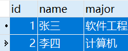
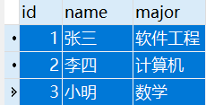
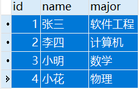
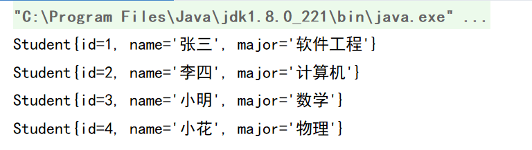

# Spring— —JdbcTemplate的使用

本文主要介绍Spring 中JdbcTemplate的用法。

[toc]

## 一、什么是JdbcTemplate

`JdbcTemplate`是 spring 框架中提供的一个类，是对原始 Jdbc API 的简单封装，用于与数据库进行交互。


## 二、使用JdbcTemplate

使用JdbcTemplate，需要引入以下依赖：

```markdown
commons-logging-1.2.jar

spring-expression-5.1.15.RELEASE.jar
spring-context-5.1.15.RELEASE.jar
spring-beans-5.1.15.RELEASE.jar
spring-core-5.1.15.RELEASE.jar

spring-jdbc-5.1.15.RELEASE.jar
spring-tx-5.1.15.RELEASE.jar
```

当然，还需要数据库驱动：

```markdown
mysql-connector-java-8.0.20.jar
```

然后，还需要准备数据库表student：

```sql
create table student(
id int not null auto_increment primary key,
name varchar(20),
major varchar(50)
);
insert into student(name,major) values('张三','软件工程');
insert into student(name,major) values('李四','计算机');
```

数据库student表内容：



### 2.1 基本用法

使用`JdbcTemplate`，首先需要配置数据源，使用Spring内置的数据源：

```java
package com.lee;

import org.springframework.jdbc.core.JdbcTemplate;
import org.springframework.jdbc.datasource.DriverManagerDataSource;

public class JdbcTemplateDemo01 {
    public static void main(String[] args){
        //1.设置数据源
        DriverManagerDataSource dataSource = new DriverManagerDataSource();
        dataSource.setDriverClassName("com.mysql.cj.jdbc.Driver");
        dataSource.setUrl("jdbc:mysql://localhost:3306/jdbcTemplate?serverTimezone=Asia/Shanghai");
        dataSource.setUsername("root");
        dataSource.setPassword("1234");
        //2.创建jdbcTemplate对象
        JdbcTemplate jdbcTemplate = new JdbcTemplate(dataSource);
        //也可以使用set方法设置数据源：jdbcTemplate.setDataSource(dataSource);

        //3.调用jdbcTemplate的方法操作数据库
        String sql = "insert into student(name,major) values ('小明','数学')";
        jdbcTemplate.execute(sql);
    }
}

```

执行后数据库内容为：




### 2.2 JdbcTemplate与IOC

我们可以在Spring配置文件中配置数据源`dataSource`以及`jdbcTemplate`，然后从容器中获取`jdbcTemplate`进行使用。

首先在`spring-config.xml`中进行配置：

```xml
<!-- 配置内置数据源 -->
<bean id="dataSource" class="org.springframework.jdbc.datasource.DriverManagerDataSource">
    <property name="driverClassName" value="com.mysql.cj.jdbc.Driver"></property>
    <property name="url" value="jdbc:mysql://localhost:3306/jdbcTemplate?serverTimezone=Asia/Shanghai"></property>
    <property name="username" value="root"></property>
    <property name="password" value="1234"></property>
</bean>

<!-- 配置jdbcTemplate -->
<bean id="jdbcTemplate" class="org.springframework.jdbc.core.JdbcTemplate">
    <property name="dataSource" ref="dataSource"></property>
</bean>
```

然后在方法中获取`jdbcTemplate`进行测试：

```java
package com.lee;

import org.springframework.context.ApplicationContext;
import org.springframework.context.support.ClassPathXmlApplicationContext;
import org.springframework.jdbc.core.JdbcTemplate;

public class JdbcTemplateDemo02 {
    public static void main(String[] args){
        //获取容器
        ApplicationContext context = new ClassPathXmlApplicationContext("spring-config.xml");
        //获取kdbcTemplate对象
        JdbcTemplate jdbcTemplate = (JdbcTemplate) context.getBean("jdbcTemplate");
        //执行方法
        String sql = "insert into student(name,major) values ('小花','物理')";
        jdbcTemplate.execute(sql);
    }
}

```

执行结果为：




### 2.3 JdbcTemplate的CRUD

#### 2.3.1 增加、删除、修改

`JdbcTemplate`的增加、删除、修改都使用方法`update(String sql,Object... args)`，sql语句中的参数用问好(`?`)代替，然后参数args依次序替代sql语句中的问好。


#### 2.3.2 查询

`JdbcTemplate`的查询使用`query()`方法。

首先需要自己实现实体类，与表结构相对应：

```java
package com.lee;

public class Student{
    private Integer id;
    private String name;
    private String major;

    public Integer getId() {
        return id;
    }

    public void setId(Integer id) {
        this.id = id;
    }

    public String getName() {
        return name;
    }

    public void setName(String name) {
        this.name = name;
    }

    public String getMajor() {
        return major;
    }

    public void setMajor(String major) {
        this.major = major;
    }

    @Override
    public String toString() {
        return "Student{" +
                "id=" + id +
                ", name='" + name + '\'' +
                ", major='" + major + '\'' +
                '}';
    }
}

```

需要将查询结果与实体类对应，有两种方式：

- 自己实现`RowMapper`接口

首先需要实现`RowMapper`接口：

```java
/**
 * RowMapper<>的泛型为查询结果对应的类名
 */
class StudentRowMapper implements RowMapper<Student> {

    /**
     * 表的列名与类属性名对应
     * @param resultSet
     * @param i
     * @return
     * @throws SQLException
     */
    @Override
    public Student mapRow(ResultSet resultSet, int i) throws SQLException {
        Student student = new Student();
        student.setId(resultSet.getInt("id"));
        student.setName(resultSet.getString("name"));
        student.setMajor(resultSet.getString("major"));
        return student;
    }
}
```

然后执行方法：

```java
String sql = "select * from student";
List<Student> students = jdbcTemplate.query(sql, new StudentRowMapper());
for (Student student : students) {
    System.out.println(student);
}
```

执行结果为：




- 使用`BeanPropertyRowMapper`泛型类

也可以使用`BeanPropertyRowMapper`泛型类自动进行查询结果与实体类对应：

```java
String sql = "select * from student";
List<Student> students = jdbcTemplate.query(sql, new BeanPropertyRowMapper<>(Student.class));
for (Student student : students) {
    System.out.println(student);
}
```

