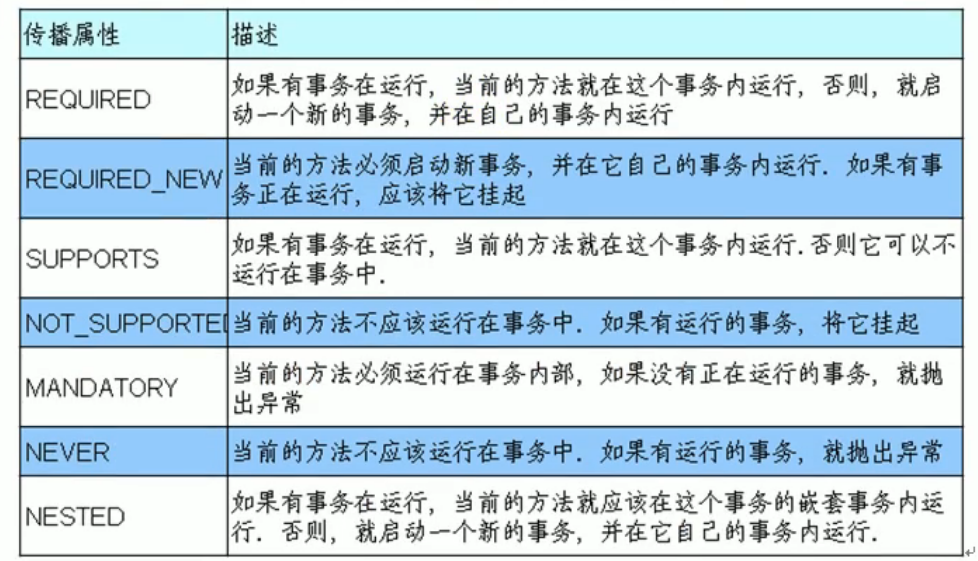
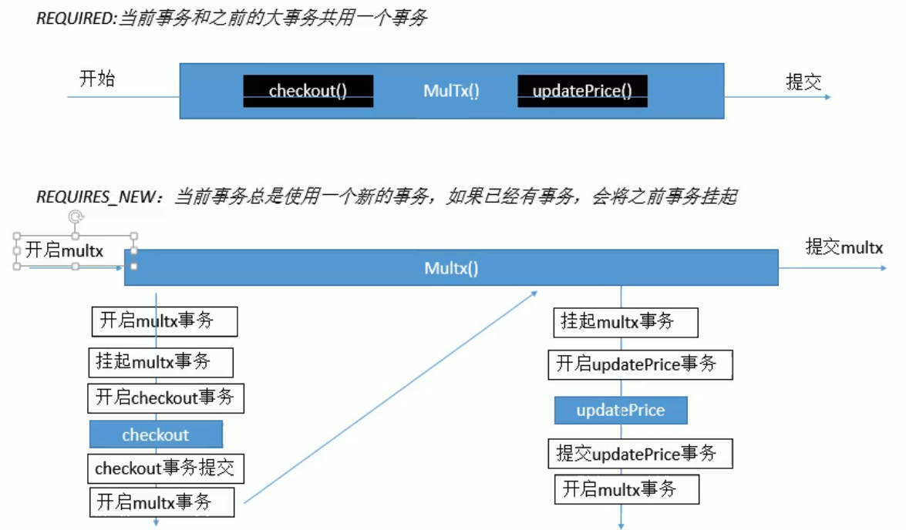

# Spring— —事务

本文主要介绍Spring中如何控制事务。

[toc]

## 一、环境搭建

### 1.1 数据库搭建

首先在数据库中新建表`book`，`book_stock`和`account`，并插入测试数据：

```sql
create database if not exists test;
use tx;

create table book(
	`isbn` varchar(20) primary key not null,
    `price` int not null
);

create table book_stock(
    `isbn` varchar(20) primary key not null,
    `stock` int not null
);

create table account(
	`username` varchar(20) not null,
    `balance` int
);

insert into book values('ISBN-001',100);
insert into book values('ISBN-002',200);
insert into book values('ISBN-003',300);
insert into book values('ISBN-004',400);

insert into book_stock values('ISBN-001',1000);
insert into book_stock values('ISBN-002',1000);
insert into book_stock values('ISBN-003',1000);
insert into book_stock values('ISBN-004',1000);

insert into account values('lucy',10000);
insert into account values('tom',10000);
insert into account values('cat',10000);
insert into account values('sid',10000);
```


### 1.2 项目搭建

**导入依赖**

创建一个普通的Java项目，然后导入Spring基础包：

```txt
commons-logging-1.2.jar
spring-beans-5.1.15.RELEASE.jar
spring-context-5.1.15.RELEASE.jar
spring-core-5.1.15.RELEASE.jar
spring-expression-5.1.15.RELEASE.jar
```

由于事务控制是基于AOP的，所以需要导入AOP的依赖包：

```txt
spring-aop-5.1.15.RELEASE.jar
spring-aspects-5.1.15.RELEASE.jar

com.springsource.net.sf.cglib-2.2.0.jar
com.springsource.org.aopalliance-1.0.0.jar
com.springsource.org.aspectj.weaver-1.6.8.RELEASE.jar
```

由于测试需要使用JdbcTemplate，所以我们导入jdbc的Jar包以及数据库驱动Jar包:

```txt
spring-jdbc-5.1.15.RELEASE.jar
mysql-connector-java-8.0.20.jar
```

最后导入事务控制的Jar包：

```txt
spring-tx-5.1.15.RELEASE.jar
```

将这些Jar包全部导入到依赖库中，即`Add as Library`。


**创建数据库连接四要素配置文件**

在`resources`下创建`database.properties`文件，内容如下：

```properties
driverClassName=com.mysql.cj.jdbc.Driver;
url=jdbc:mysql://localhost:3306/test?serverTimeZone=Asia/Shanghai;
username=root;
password=root;
```


**创建Spring配置文件**

在`resources`文件夹下创建`spring.xml`配置文件，内容如下：

```xml
<?xml version="1.0" encoding="UTF-8"?>
<beans xmlns="http://www.springframework.org/schema/beans"
       xmlns:xsi="http://www.w3.org/2001/XMLSchema-instance"
       xmlns:context="http://www.springframework.org/schema/context"
       xmlns:aop="http://www.springframework.org/schema/aop"
       xmlns:tx="http://www.springframework.org/schema/tx"
       xsi:schemaLocation="http://www.springframework.org/schema/beans  http://www.springframework.org/schema/beans/spring-beans-3.0.xsd
           http://www.springframework.org/schema/context http://www.springframework.org/schema/context/spring-context-3.0.xsd
           http://www.springframework.org/schema/aop http://www.springframework.org/schema/aop/spring-aop-3.0.xsd
           http://www.springframework.org/schema/tx http://www.springframework.org/schema/tx/spring-tx-3.0.xsd">

    <!-- 注解扫描 -->
    <context:component-scan base-package="xmu.lee"></context:component-scan>

    <!-- 加载数据库连接四要素 -->
    <context:property-placeholder location="classpath:database.properties"/>
    <!-- 配置datasource -->
    <bean id="dataSource" class="org.springframework.jdbc.datasource.DriverManagerDataSource">
        <property name="driverClassName" value="${driverClassName}"></property>
        <property name="url" value="${url}"></property>
        <property name="username" value="${username}"></property>
        <property name="password" value="${password}"></property>
    </bean>

    <!-- 配置JdbcTemplate -->
    <bean id="jdbcTemplate" class="org.springframework.jdbc.core.JdbcTemplate">
        <property name="dataSource" ref="dataSource"></property>
    </bean>

</beans>
```


**创建业务层和持久化层**

在`src/main/java/xmu/lee/dao`下创建持久化类：

```java
package xmu.lee.dao;

import org.springframework.beans.factory.annotation.Autowired;
import org.springframework.jdbc.core.JdbcTemplate;
import org.springframework.stereotype.Repository;

@Repository
public class BookDao {

    @Autowired
    private JdbcTemplate jdbcTemplate;

    // 查询书价
    public int getBookPrice(String isbn){
        String sql = "select price from book where isbn = ?";
        return jdbcTemplate.queryForObject(sql,Integer.class,isbn);
    }

    // 某用户的余额减去指定金额
    public void checkout(String username,int money){
        String sql = "update account set balance = balance - ? where username = ?";
        jdbcTemplate.update(sql,money,username);
    }

    //书的库存减1
    public void subStock(String isbn){
        String sql = "update book_stock set stock = stock - 1 where isbn = ?";
        jdbcTemplate.update(sql,isbn);
    }
}
```

在`src/main/java/xmu/lee/service`下创建业务类：

```java
package xmu.lee.service;

import org.springframework.beans.factory.annotation.Autowired;
import org.springframework.stereotype.Service;
import xmu.lee.dao.BookDao;

@Service
public class BookService {

    @Autowired
    private BookDao bookDao;

    // 用户买书
    public void checkout(String username,String isbn){
        // 查询书价
        int price = bookDao.getBookPrice(isbn);
        // account中指定的用户余额减去书价
        bookDao.checkout(username,price);
        // 书的库存减1
        bookDao.subStock(isbn);
    }
}
```


## 二、基于注解的事务控制

### 2.1 配置事务管理器

在`spring.xml`中配置事务管理器：

```xml
<!-- 配置事务管理器 -->
<bean id="transactionManager" class="org.springframework.jdbc.datasource.DataSourceTransactionManager">
    <property name="dataSource" ref="dataSource"></property>
</bean>
```


### 2.2 标注注解@Transactional

在方法上添加注解`@Transactional`，表示该方法为事务方法：

```java
@Service
public class BookService {
    @Transactional
    public void checkout(String username,String isbn){}
}
```


### 2.3 开启事务

然后在`spring.xml`开启事务：

```xml
<!-- 开启事务 -->
<tx:annotation-driven transaction-manager="transactionManager"/>
```


## 三、基于XML的事务控制

### 3.1 配置事务管理器

```xml
<!-- 配置事务管理器 -->
<bean id="transactionManager" class="org.springframework.jdbc.datasource.DataSourceTransactionManager">
    <property name="dataSource" ref="dataSource"></property>
</bean>
```


### 3.2 配置AOP切入点表达式

```xml
<!-- 配置AOP切入点表达式 -->
<aop:config>
    <aop:pointcut id="pointcut" expression="execution(* xmu.lee.*.*(..))"/>
</aop:config>
```


### 3.3 配置事务通知

```xml
<!-- 配置事务的通知 -->
<tx:advice id="txAdvice" transaction-manager="transactionManager"/>
```


### 3.4 配置切入点表达式和事务通知的对应关系

在==\<aop:config\>==内部配置事务的通知和切入点表达式的关系：

```xml
<aop:config>
    <aop:pointcut id="pointcut" expression="execution(* xmu.lee.*.*(..))"/>
    <!-- 切入点表达式与事务通知的对应关系 -->
    <aop:advisor advice-ref="txAdvice" pointcut-ref="pointcut"></aop:advisor>
</aop:config>
```


### 3.5 指定事务方法及属性

在==\<tx:advice\>==中通过`<tx:attributes>`指定事务方法及属性：

```xml
<tx:advice id="txAdvice" transaction-manager="transactionManager">
    <!-- 配置事务方法及属性 -->
    <tx:attributes>
        <tx:method name="checkout"/>
    </tx:attributes>
</tx:advice>
```

注意，方法名不要加括号。


## 四、事务属性介绍

### 4.1 timeout

所谓事务超时，就是指一个事务所允许执行的最长时间，如果超过该时间限制但事务还没有完成，则自动回滚事务。默认值是-1，没有超时限制。如果有，以秒为单位进行设置。


### 4.2 readOnly

如果确定事务所涉及的资源进行只读操作，那么我们可以将事务标志为只读的，以提高事务处理的性能。以`true`或者`false`设置。


### 4.3 rollbackFor和rollbackForClassName

如果在事务中发生了异常，可分为以下情况：

- 运行时异常：如果在事务中发生了运行时异常，则默认回滚；
- 编译时异常：如果在事务中发生了编译时异常，则默认不会滚；

对于发生了编译时异常，如果我们想让事务回滚，则可以设置`rollbackFor`和`rollbackForClassName`；


### 4.4 noRollbackFor和noRollbackForClassName

同理，如果发生了运行时异常，如果我们不想让事务回滚，则可以设置`noRollbackFor`和`noRollbackForClassName`。


### 4.5 isolation

事务的隔离级别可以解决脏读、不可重复读等问题。


### 4.6 propagation

如果一个事务方法A被另一个方法（无论是不是事务方法）调用，则根据事务方法A中的属性`propagation`设置其传播行为：



`REQUIRED`和`REQUIRES_NEW`对比解读：



==对于传播行为为`REQUIRED`的事务方法，其事务属性由其外层的事务方法控制。==


本类的事务方法调用相当于一个事务方法。