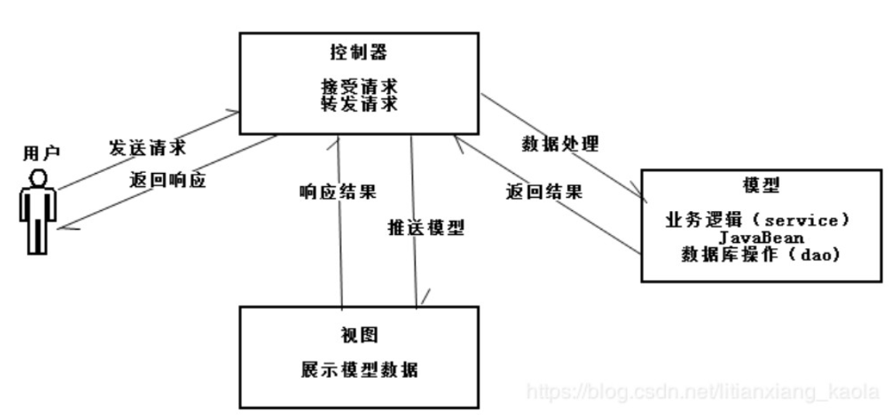

# SpringMVC— —简介

本文主要介绍什么是MVC以及Spring MVC的特性。

[toc]

## 一、什么是MVC

MVC全名是Model（模型）、View（视图）、Controller（控制器），是一种用于设计创建Web应用程序表现层的模式。MVC中每个部分各司其职。

​	**Model（模型）**：通常指的是数据模型，例如 `JavaBean`。一般情况下用于封装数据。

​	**View（视图）**：通常指的是JSP或HTML，作用是展示数据，通常视图是依据模型数据创建的。

​	**Controller（控制器）**：例如`Servlet`，是应用程序中处理用户交互的部分，作用是接受用户请求。

## 二、什么是Spring MVC

#### 2.1 SpringMVC是什么

SpringMVC是一种基于 Java 的实现了 MVC 设计模式的请求驱动类型的轻量级 Web 框架。

#### 2.2 SpringMVC的优势

- 拥有强大的灵活性，非侵入性和可配置性。
- 提供了一个前端控制器DispatcherServlet，开发者无需额外开发控制器对象。
- 分工明确，包括控制器、验证器、命令对象、模型对象、处理程序映射视图解析器，每一个功能实现由一个专门的对象负责完成。
- 可以自动绑定用户输入，并正确的转换数据类型，比如，Spring MVC能自动解析字符串，并将其设置为模型的int或者float类型的属性。
- 使用一个名称/值的Map对象，实现更加灵活的模型数据传输。
- 内置了常见的校验器，可以校验用户输入，如果校验不通过，则重定向会输入表单，输入校验是可选的，并且支持编程方式及声明方式。
- 支持国际化，支持根据用户区域显示多国语言，并且国际化的配置非常简单。
- 支持多种视图技术，常见的有JSP及其其他技术，包括Velocity和FreeMarker。
- 提供了一个简单而强大的JSP标签库，支持数据绑定功能，使得编写JSP页面更加容易。