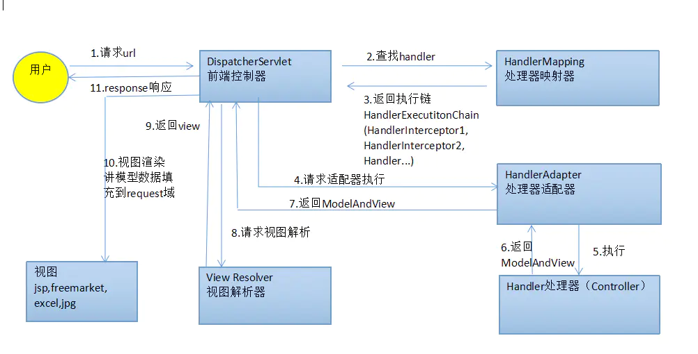

# SpringMVC— —Spring MVC程序的执行流程

本文主要介绍Spring MVC程序的执行流程。

[toc]

Spring MVC程序的执行流程图如下:

下面根据处理流程图进行逐步讲解：

- 用户向服务器发送请求，该请求会被前端控制器`DispatcherServlet`所拦截；
- `DispatcherServlet`拦截到请求后，调用`HandlerMapping`处理器映射器；
- 处理器映射器根据请求URL找到具体的处理器，生成处理器对象及处理器拦截器（如果有），一并返回给给`DispatcherServlet`；
- `DispatcherServlet`通过返回信息，选择合适的处理器适配器`HandlerAdapter`；
- 处理器适配器`HandlerAdapter`调用并执行`Handler`处理器，这里的处理器就是我们编写的`Controller`，也被称为后端控制器；
- `Controller`处理完成后，会返回一个`ModelAndView`对象，该对象中包含视图名或包含模型与视图名；
- 处理器适配器`HandlerAdapter`将`ModelAndView`对象返回给`DispatcherServlet`；
- `DispatcherServlet`根据`ModelAndView`对象选择合适的视图解析器`ViewResolver`;
- `ViewResolver`解析后，会向`DispatcherServlet`返回具体的`View`;
- `DispatcherServlet`对`View`进行渲染，即将模型数据填充到视图中；
- 视图渲染结果返回给客户端浏览器进行显示。