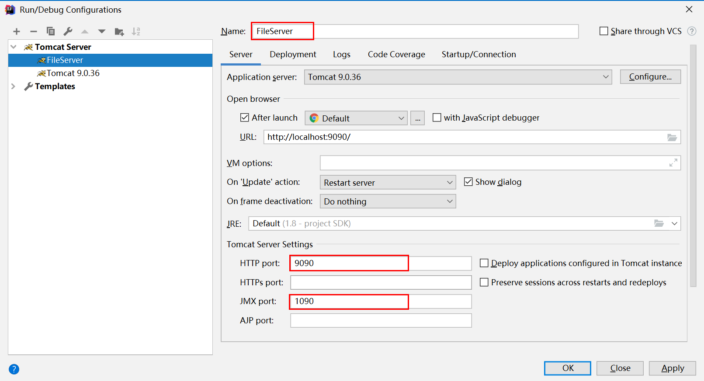
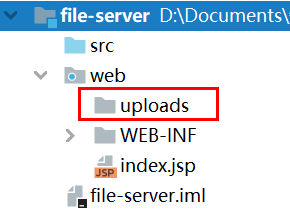

# SpringMVC— —文件上传与下载

本篇文章主要介绍Spring MVC如何处理文件上传与下载。

[toc]

## 一、文件上传

在文件上传中，需要引入以下两个依赖JAR包：

```markdown
commons-fileupload-1.4.jar
commons-io-2.7.jar
```


### 1.1 WEB 文件上传传统方式

该节主要介绍Java Web传统的文件上传方式。

首先前端页面表单的写法注意点如下：

- `<form>`的属性`method`为`post`;
- `<form>`的属性`enctype`为`multipart/form-data`；
- `<form>`包含选择文件的按钮

JSP中表单的写法为：

```jsp
<h1>Java web传统方式文件上传</h1>
<form action="/file/upload1" method="post" enctype="multipart/form-data">
    选择文件：<input type="file" name="upload1"><br>
    <input type="submit" value="上传">
</form>
```

展示页面如下：


Controller方法如下:

```java
@RequestMapping("/file/upload1")
public String upload1(HttpServletRequest request) throws Exception {
    //获取文件的上传位置
    String path = request.getSession().getServletContext().getRealPath("/upload/");
    System.out.println(path);   //查看具体的上传位置，在out里
    //查看文件夹是否存在，如果不存在，则创建
    File file = new File(path);
    if (!file.exists()){
        file.mkdirs();
    }
    //创建磁盘文件项工厂
    DiskFileItemFactory factory = new DiskFileItemFactory();
    ServletFileUpload upload = new ServletFileUpload(factory);
    //解析request对象
    List<FileItem> fileItems = upload.parseRequest(request);
    //遍历文件项
    for (FileItem fileItem: fileItems){
        //如果不是表单元素，就是文件项
        if (!fileItem.isFormField()){
            //获取到上传的文件名称
            String itemName = fileItem.getName();
            //上传文件
            fileItem.write(new File(file,itemName));
            //删除临时文件
            fileItem.delete();
        }
    }
    //跳转页面
    return "success";
}
```


### 1.2 Spring MVC 文件上传

该节主要介绍Spring MVC如何处理文件上传。主要思路是前端控制器拦截请求，然后将请求提交给文件解析器，然后再提交给`controller`进行处理。

JSP表单内容：

```jsp
<h1>Spring MVC方式文件上传</h1>
<form action="/file/upload2" method="post" enctype="multipart/form-data">
    选择文件：<input type="file" name="fileupload"><br>
    <input type="submit" value="上传">
</form>
```

页面展示：


`springmvc-servlet.xml`中配置文件解析器：

```xml
<!-- 配置文件解析器，id必须为multipartResolver -->
<bean id="multipartResolver" class="org.springframework.web.multipart.commons.CommonsMultipartResolver">
    <!-- 限制上传的文件大小 -->
    <property name="maxInMemorySize" value="10485760"></property>
</bean>
```

注意：`id`必须为`multipartResolver`。

Controller方法:

```java
@RequestMapping("/file/upload2")
public String upload2(HttpServletRequest request, MultipartFile fileupload) throws Exception {
    //获取文件的上传位置
    String path = request.getSession().getServletContext().getRealPath("/upload/");
    System.out.println(path);   //查看具体的上传位置，在out里
    //查看文件夹是否存在，如果不存在，则创建
    File file = new File(path);
    if (!file.exists()){
        file.mkdirs();
    }
    //获取上传的文件名
    String filename = fileupload.getOriginalFilename();
    //文件名称唯一化
    String uuid = UUID.randomUUID().toString().replaceAll("-", "");
    filename = uuid+"-"+filename;
    //文件上传
    fileupload.transferTo(new File(file,filename));
    //跳转页面
    return "success";
}
```


### 1.3 Spring MVC 批量上传文件

Spring MVC多文件上传，在页面前端就提供多个上传文件的位置，然后后端用`MultipartFile`数组接受上传的多文件。

JSP内容：

```jsp
<h1>Spring MVC方式多文件上传</h1>
<form action="/file/upload3" method="post" enctype="multipart/form-data">
    选择文件：<input type="file" name="fileuploads"><br>
    选择文件：<input type="file" name="fileuploads"><br>
    选择文件：<input type="file" name="fileuploads"><br>
    <input type="submit" value="上传">
</form>
```

展示结果：


Controller方法编写：

```java
@RequestMapping("/file/upload3")
public String upload3(HttpServletRequest request, MultipartFile[] fileuploads) throws Exception {
    //获取文件的上传位置
    String path = request.getSession().getServletContext().getRealPath("/upload/");
    System.out.println(path);   //查看具体的上传位置，在out里
    //查看文件夹是否存在，如果不存在，则创建
    File file = new File(path);
    if (!file.exists()){
        file.mkdirs();
    }
    for (MultipartFile f : fileuploads) {
        // 获取上传的文件名
        String filename = f.getOriginalFilename();
        // 文件名称唯一化
        String uuid = UUID.randomUUID().toString().replaceAll("-", "");
        filename = uuid + "-" + filename;
        // 文件上传
        f.transferTo(new File(file, filename));
    }
    //跳转页面
    return "success";
}
```


### 1.4 跨服务器文件上传

跨服务器上传，是指把文件保存在另一个服务器中，而不是保存在应用服务器中。所以这就要求应用服务器将文件传输到文件服务器中。

首先配置另一个tomcat，来模拟文件服务器：



注意：修改`HTTP port`和`JMX port`。

然后新建一个web项目，在web目录下新建文件夹uploads：



然后在我们的应用服务器项目中编写代码：

首先引用两个依赖：

```markdown
jersey-client-1.18.1.jar
jersey-core-1.18.1.jar
```

JSP内容：

```jsp
<h1>跨服务器文件上传</h1>
<form action="/file/upload4" method="post" enctype="multipart/form-data">
    选择文件：<input type="file" name="fileupload"><br>
    <input type="submit" value="上传">
</form>
```

展示页面：


Controller代码：

```java
@RequestMapping("/upload4")
public String upload4(MultipartFile fileupload) throws Exception {

    //文件上传的位置，是另一个服务器的位置
    String path = "http://localhost:9090/uploads/";

    // 获取上传的文件名
    String filename = fileupload.getOriginalFilename();
    // 文件名称唯一化
    String uuid = UUID.randomUUID().toString().replaceAll("-", "");
    filename = uuid + "-" + filename;
    // 文件上传
    //创建客户端
    Client client = Client.create();
    //连接文件服务器
    WebResource webResource = client.resource(path + filename);
    //传输文件
    webResource.put(fileupload.getBytes());
    // 跳转页面
    return "success";
}
```

遇到的问题：

- 400：传输的文件名中不要包含中文

- 403/405：修改tomcat配置文件`web.xml`，在`DefaulyServlet`中添加如下代码：

  ```xml
  <init-param>
      <param-name>readonly</param-name>
      <param-value>false</param-value>
  </init-param>
  ```

  参考链接：https://blog.csdn.net/jerry11112/article/details/100118042

- 409：缺失目录，在文件服务器的`...\out\artifacts\file_server_war_exploded\`目录中手动新建`uploads`文件夹。


## 二、文件下载

本节介绍两种如何解决下载文件的办法。

### 2.1 方式一：设置response

JSP页面就是通过一个超链接：

```jsp
<a href="/file/download1">文件下载——方式一</a>
```

下载文件主要包含以下步骤：

- 获取要下载的文件及其输入文件流
- 设置response
- 获取文件输出流，并将输入流的内容写入输出流
- 关闭资源

Controller方法代码：

```java
@RequestMapping("/file/download1")
public void download1(HttpServletResponse response) throws Exception {
    //获取要下载的文件
    String path = "D:/1.jpg";
    File file = new File(path);
    //设置response
    response.reset();
    response.setCharacterEncoding("utf-8");
    response.setContentType("multipart/form-data");
    response.setHeader("Content-Disposition",
                       "attachment;fileName="+ URLEncoder.encode(file.getName(), "UTF-8"));
    //获取文件输入流
    InputStream input = new FileInputStream(file);
    //获取文件输出流
    ServletOutputStream output = response.getOutputStream();
    //进行输出
    byte[] buff =new byte[1024];
    int index=0;
    while((index= input.read(buff))!= -1){
        output.write(buff, 0, index);
        output.flush();
    }
    //关闭输入输出流
    input.close();
    output.close();
}
```


### 2.2 方式二：通过ResponseEntity

JSP内容如下：

```jsp
<a href="/file/download2">文件下载——方式二</a>
```

通过ResponseEntity下载文件有如下步骤：

- 获取要下载的文件及其字节数组
- 设置响应头及响应状态
- 构建`ResponseEntity`对象并返回

```java
@RequestMapping("/download2")
public ResponseEntity<byte[]> download2() throws Exception {
    //获取要下载的文件
    String path = "D:/1.jpg";
    File file = new File(path);
    //获取文件输入流并将其转换为字节数组
    InputStream input = new FileInputStream(file);
    byte[] bytes = new byte[input.available()];  //获取文件大小
    input.read(bytes);
    //设置响应头及响应状态
    HttpHeaders httpHeaders = new HttpHeaders();
    httpHeaders.add("Content-Disposition", "attachment;filename="+file.getName());
    HttpStatus httpStatus = HttpStatus.OK;
    //构建ResponseEntity
    ResponseEntity<byte[]> responseEntity = new ResponseEntity<>(bytes,httpHeaders,httpStatus);
    //返回响应体
    return responseEntity;
}
```


